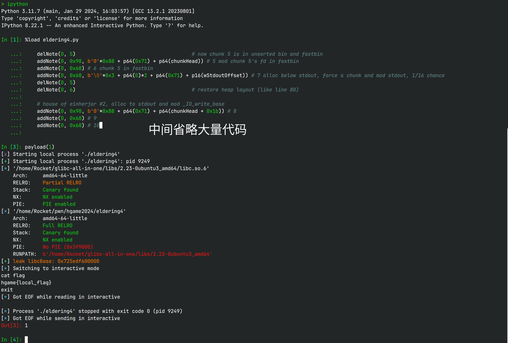

# Pwn新手的成长之路

这里是 *RocketDev* 的CTF Writeup仓库，你可以在这里找到我打过的比赛的wp，
所有blog上的wp都来源于此，如果你想看的wp在blog上还没有的话，不妨先来这里找找

`wp`中包含无处归档的wp  
个人做pwn题的writeup分专题放在各文件夹中

## short shellcode

项目下有32位和64位比pwntools短的shellcode，建议搭配`:r shellcode??b`使用

32位汇编后长20B  
64位汇编后长22B

## 关于exp

除了最开始的几个新手赛的exp以外，其他的exp全都是按以下方式运行：

1. 运行`ipython`
2. 使用`%load xxx.py`加载exp
3. 运行`payload(lo)`来运行exp

关于`lo`有这样一些约定俗成的规律：

1. `lo == 0`: 打远程
2. `lo != 0`: 打本地的样本
3. `lo & 0b10`: 启动gdb附加调试器
4. `lo & 0b100`: 输入需要爆破的地址（一般是直接从gdb中拿，避免打本地时还需要反复爆破）

例子： `payload(1)`是不开gdb，直接打本地；`payload(2)`是启动gdb打本地；`payload(6)`是启动gdb打本地并输入本地偏移
（如果有相关代码）；使用`while payload(0): pass`可以一直打远程直到爆破成功

实操如下：

这种方法的优点是适合命令行熟练并且使用tmux + vim套件的人高效运行代码，而且遇到什么错误时，往往tube还没关闭，
可以很方便地使用`sh.recv()`来知晓剩下的错误信息（如果有），还可以跑一些python运算，如`hex(0x37 ^ 0x69)`等

缺点就是调试过程中出错需要自己close对象，如果忘记，那么退出ipython的时候就会有一堆的进程结束，此外，
门槛相较双击运行也稍高一番

## Copyright

Distributed under CC BY-NC 4.0  
Copyright RocketDev 2023-2024
