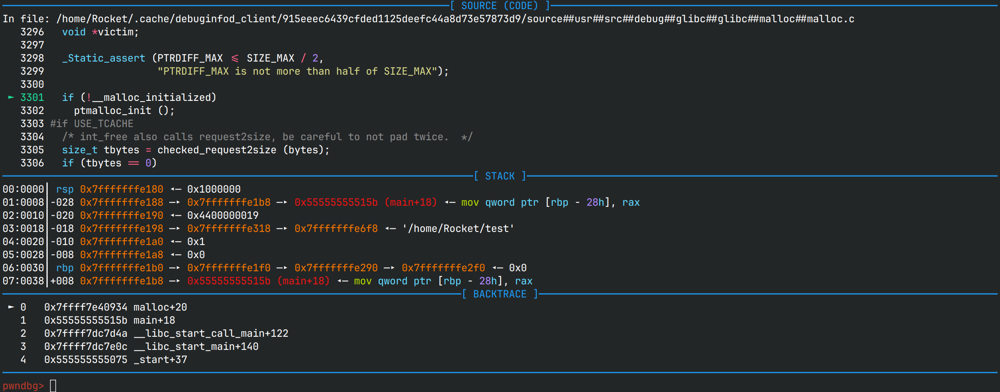
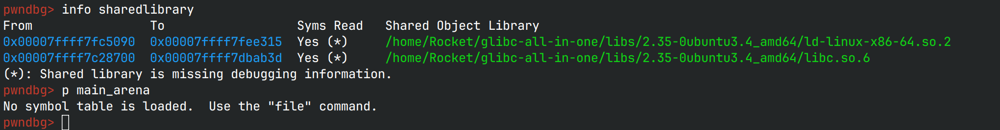
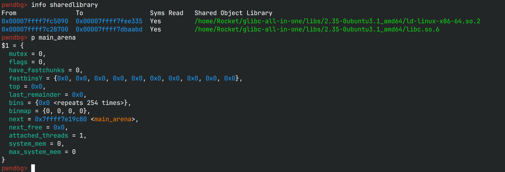

# 摆脱调试符号的困扰：使用debuginfod拉取libc的调试符号

自从做pwn题以来，一直有一个奇怪的现象，当我调试程序时，遇到libc中的函数就会显示源代码，
但是一旦patchelf了以后Pwndbg就无法显示源代码了



> 注：笔者使用Arch Linux

## 背景

今年打宁波赛的时候，libc使用了难以下到的`2.35-0ubuntu3.1_amd64`，glibc-all-in-one下不到，
问学长，学长也没有，只能使用[Roderick的容器](https://github.com/RoderickChan/docker_pwn_env)

因为没仔细看，导致容器内的pwndbg更新了，而更新又需要容器里没有的sudo，导致容器里也无法调试，
那我只能把libc和调试符号拷贝到外部来。由于这次做堆题时遇到了[莫名其妙的arena+224](https://bbs.kanxue.com/thread-279588.htm)，
我迫切需要调试符号来辅助调试，却一直无法获得，只好退回到本地的libc，终于知道了`arena+224`的含义，
也引发我解决这个问题的想法（题目在我的wp里有）

> 实际上作者给出了不自动更新的方法，往下翻一点就有

## 旧方案

原先看到文章要把.debug文件夹复制到调试目录下，于是我就把它软链接到目录下

```sh
# 为了以下表述简洁，这里给路径声明了变量，实际使用时请展开
LIBC="~/glibc-all-in-one/libs/2.35-0ubuntu3.4_amd64"
ln -s "$LIBC/.debug" .
```

但是貌似对于高版本并不起效，最直观的现象是`p main_arena`显示符号表未加载，
同时`info share`显示libc.so.6的调试符号是缺失的，哪怕是执行了`set debug-file-directory $LIBC/.debug`，
亦或是`set debug-file-directory $LIBC/.debug/.build-id`之后



> 事实上`set debug-file-directory $LIBC/.debug`是可以加载调试符号的，
> 但***必须***在程序启动前或附加上去前设置

## 新方案探索

用旧方案加载的时候有时候会显示源码路径，但是无法自动下载，那么通过研究Pwndbg的源码，
能否为libc下载源码呢？获取源码文件的一行是`gdb.selected_frame().find_sal().symtab.fullname()`，
那么其实下载源码是gdb下的，而不是Pwndbg这一上层实现

观察下载下来的源码路径，结合搜索的信息，推测真正提供这个功能的是**debuginfod**，查看gdb的配置，
发现下载dwarf的url只有arch的

又知debuginfod是通过libc的build-id来索引的，那么必然的，arch与ubuntu的libc的调试符号不可能会冲突

## 解决方案

**使用较新的Ubuntu 22.04及以上的用户不需要配置，这个功能已经在gdb中默认启用了**

给gdb永久加上搜索的url：`vim /etc/debuginfod/ubuntu.urls`，写入内容： `https://debuginfod.ubuntu.com`，保存退出

Pwndbg已经自动在~/.gdbinit中写入`set debuginfod enabled on`，此时调试题目，gdb就会自动根据patch的libc下载debuginfo了



有读者可能会问：源码呢？源码还是没下成功啊？很遗憾，ubuntu的debuginfo并不提供源码，
以下话转自[官网](https://ubuntu.com/server/docs/about-debuginfod)

> Currently, the service only provides DWARF information.
> There are plans for it to also index and serve source-code in the future.

