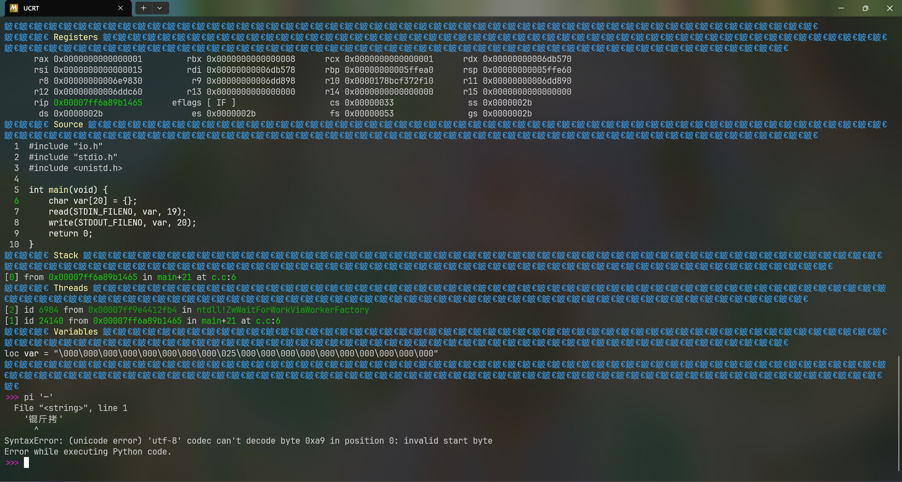
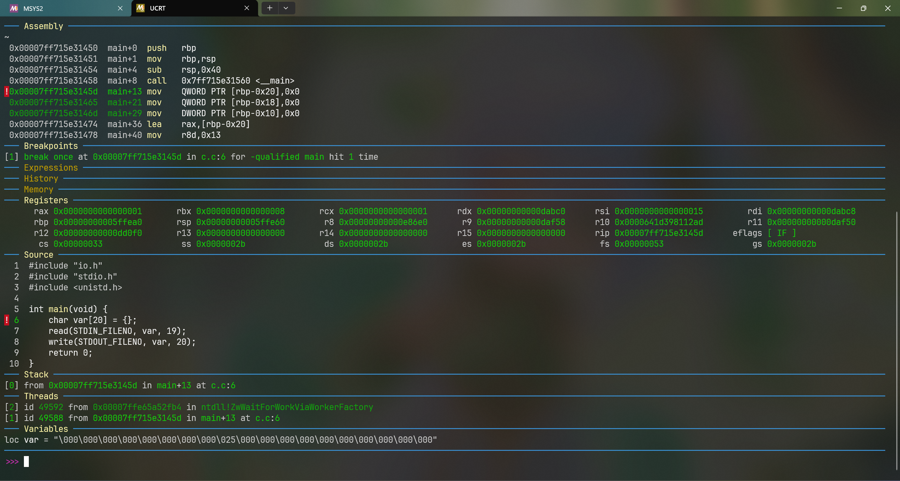

# Debug exe like Gdb with Pwndbg

Pwndbg很好用，可以检查地址，可以看代码等，那么如果能够在MSYS里装上的话，调试exe的体验不是飞起？
首先我就试了试MSYS上的gdb，但是不能用，一直在编译什么guile，不过其他衍生可以用，比如ucrt64

于是我就把Pwndbg的源码拉下来，尝试运行`setup.sh`，又出错了：它给`python.exe`加上了`3.11`，
那自然运行不了，于是我就把版本号去掉，就开始安装了。然后因为无法编译cffi模块又卡住了，
可是它用的是venv，外部依赖对它不起效，怎么办呢？我尝试下载模块源码，根据MSYS的patch编译，
还是不行。最后我把venv去掉了，让它找全局环境，仍然不行，考虑到估计下成功，`pie`之类的命令估计也用不了，
我就放弃了

类似Pwndbg，[gdb-dashboard](https://github.com/cyrus-and/gdb-dashboard)也是个显示很多信息的项目，于是我就按项目所说，
下载了gdbinit文件：

```sh
wget -P ~ https://github.com/cyrus-and/gdb-dashboard/raw/master/.gdbinit
pacman -S mingw-w64-ucrt-x86_64-python-pygments
```

然后又出bug了：



怎么锟斤拷都出来了？？于是我就设置了gdb的选项`host-charset`, `target-charset`, `target-wide-charset`,
`charset`都为`UTF-8`，还是不行，看到有人说，gdb应该读取外部的LANG环境变量来决定编码，但在Windows平台，
还是要过一遍Windows-console，编码又变回了GBK，必须在运行gdb的时候手动把代码页设置为65001，于是我也跟着做了，
gdb显示no context，没办法，我只能将Windows全局设为了UTF-8，终于解决了问题



