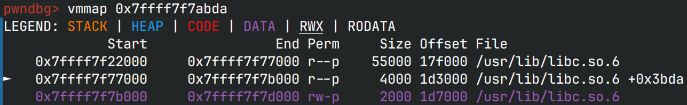

# ifunc2 in puts

去千岛湖团建的时候和*男孩*聊起上次强网杯中`_exit`的题中用到了`puts@got@libc`，
当时不是很理解，于是就提起了这件事，然后发现，这个类似于got表一样的东西与`puts`没啥关系，
倒是与`strlen`有关系

先是在*nameless*师傅的博客里找到的灵感：  
[cyberprinter](https://nameless.top/index.php/2022/09/20/das9%e6%9c%88%e6%9c%88%e8%b5%9bpwn%e9%a2%98%e5%87%ba%e9%a2%98%e5%bf%83%e8%b7%af/)

于是我就在本地调了一下，也是类似有个跳表存在，不过Arch的libc不能改这一项
（应该是因为开了Full RELRO）




可以看到出现跳表的位置对应源码是在`strlen`的位置，在[elixir](https://elixir.bootlin.com/glibc/glibc-2.38/source/libio/ioputs.c#L48)中，
原始的`puts`函数是这样的：

```c
int
_IO_puts (const char *str)
{
  int result = EOF;
  size_t len = strlen (str);
  _IO_acquire_lock (stdout);

  if ((_IO_vtable_offset (stdout) != 0
       || _IO_fwide (stdout, -1) == -1)
      && _IO_sputn (stdout, str, len) == len
      && _IO_putc_unlocked ('\n', stdout) != EOF)
    result = MIN (INT_MAX, len + 1);

  _IO_release_lock (stdout);
  return result;
}
```
检查`strlen`的交叉引用，在`string.h`里只有一个声明

```c
/* Return the length of S.  */
extern size_t strlen (const char *__s)
     __THROW __attribute_pure__ __nonnull ((1));
```

那么真正调用的是什么函数呢？在文件`sysdeps/x86_64/multiarch/strlen.c`中，有一些提示：

```c
/* Define multiple versions only for the definition in libc.  */
#if IS_IN (libc)
# define strlen __redirect_strlen
# include <string.h>
# undef strlen

# define SYMBOL_NAME strlen
# include "ifunc-avx2.h"

libc_ifunc_redirected (__redirect_strlen, strlen, IFUNC_SELECTOR ());
# ifdef SHARED
__hidden_ver1 (strlen, __GI_strlen, __redirect_strlen)
  __attribute__((visibility ("hidden"))) __attribute_copy__ (strlen);
# endif
#endif
```

接着跟进到`ifunc2-avx2.h`，其针对经常调用的函数做了cpu针对性的优化。回到gdb，
跟进`strlen`，实际调用的函数是`__strlen_avx2`，对应的文件是`sysdeps/x86_64/multiarch/strlen-avx2.S`，
这下答案已经呼之欲出了：glibc通过ifunc2来避免直接调用`strlen`函数，而是使用跳表，
方便后期绑定优化版本，而这个跳表就是在libc的got中，在一些Ubuntu的libc中，只启用了Partial
RELRO，就可以通过这个方式来修改这一项，达到执行libc中的`puts`时，从跳表中运行任意代码

> 这也让我想起了前不久刚过去的xz风波，xz同样是借助了glibc的ifunc机制来修改了`liblzma`中的函数，
> 达到嵌入代码的目的

在源码中，除了`strlen`以外，`strcpy`等函数都有其对应的优化版本，调用到这些函数的库函数同样应该会被插入跳表，
存在利用的可能性。但要注意的是，直接调用`strcpy`是不会有跳表的，经过`dl_runtime_resolve`会直接解析成
`__strcpy_avx2`
