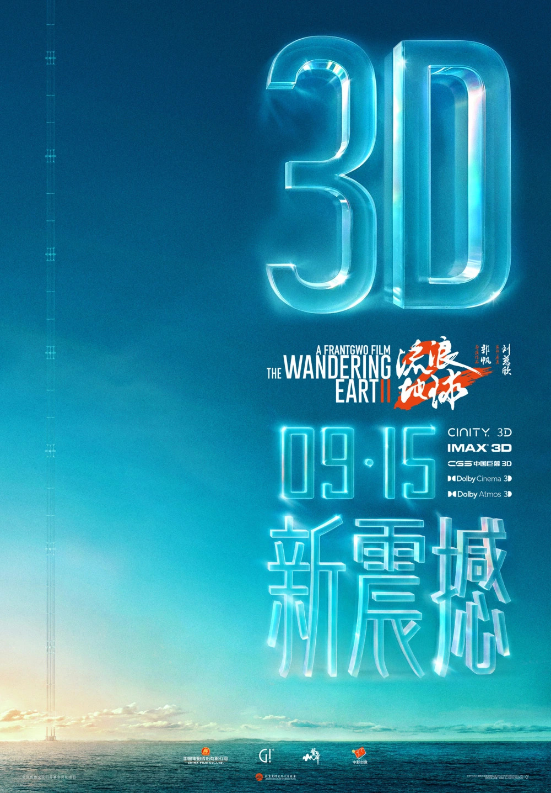

# 看电影的学问——IMAX & Dolby Cinema

暑假前看了流浪地球2，就算在我家的小电视上都能看出冲击感。之后在B站看深度解读的时候，
看到评论区里都在讨论相比起球1的进步以及自己已经去电影院看了多少次了。
这不禁让我也有了去电影院二刷的想法，当时我就随便就近挑了一家IMAX，准备寒假排片的时候去看。

随后，流浪地球2 3D版预告上线了。看得早不如看得巧，计划计划我就打算和好友一起去看。
在官方海报中，写了有IMAX、杜比影院、CINITY和CGS中国巨幕。所有的IMAX影院都一样...吗？

## 影院等级

偶然看到了有视频推荐IMAX一代。一代？还有二代吗？继续查下去，具体来说，IMAX出过好几代，
先是胶卷介质（国内没有），后来又出现了数字介质，分为GT, COLA, Laser XT, 氙灯等四个版本，
这四个版本沿顺序搭建成本逐渐降低，效果也逐渐变差，氙灯在全国最多，但是其亮度看3D版本的电影完全不够；
GT在全国只有寥寥几家，效果也最好。在杭州，最好的IMAX只有COLA (Commercial Laser)，有两家，
一家在 **西湖文化广场** ，还配有12.1声道。还有一家 **万象城店** 就只有5.1声道了。

杜比影院也是具有极佳视听效果的影院。区分于杜比全景声厅，杜比影院会有官方把控质量，
保证放映时应用杜比视界和杜比全景声的效果（理论上），如果没有IMAX COLA影院，
杜比影院也是个不错的选择。据查，杭州的杜比影院共有2家，相比起上文提到的IMAX COLA影院，
离地铁站更远，算是一个小劣势。不过，根据网上的数据， **余杭万达广场店**
的银幕大小和西湖文化广场差不多大，相信观影体验应当是不错的。 **奥体印象城店**
暂无银幕数据。

## 选择影院

IMAX在淘票票等官方途径中搜影城时，不会自己写明是什么版本，只会笼统的写 *IMAX厅*，
有混淆视听的嫌疑，而杜比影院和杜比全景声厅则是分开的，比较好看出来。
网上有一张[表格](https://docs.qq.com/sheet/DQ3FEUUZJdklNSWJP?tab=lxy0hx)，
统计了全国各地的IMAX和杜比影院影城可以做参考。

一般来说，选择的优先级是`IMAX GT >> IMAX COLA == Dolby Cinema > IMAX Laser XT >> IMAX 氙灯`

除了在线表格，也可以选择小程序来查电影院，分别是"IMAX PLUS会员中心"和"杜比Dolby
One"，要注意的是IMAX小程序中没有写明放映技术，只会标明是"激光IMAX"（区别于氙灯），
不会写第几代。

## 参考

1. [应用图片来源](https://new.qq.com/rain/a/20240812A06VZL00)
2. [全球IMAX及其他影厅分布](https://docs.qq.com/sheet/DQ3FEUUZJdklNSWJP?tab=lxy0hx)
