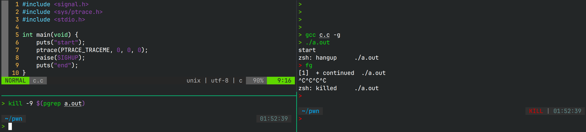

# Ptrace syscall 初学者常见困惑解答

在羊城杯的 **Hard Sandbox** 中，有`RET_TRACE`的沙箱，因此如何构造rce并绕过限制的问题，
就来到了如何使用ptrace上。ptrace作为Linux的syscall，已经存在很久了，相关的文档也很完善，
具体细则可以通过`man ptrace`查看，这篇博客主要讲讲一些值得注意的点。

## PTRACE_ATTACH or PTRACE_TRACEME ?

attach是tracer主动发送请求到tracee，通知tracee停下来（SIGSTOP），
使其进入能被调试的状态，而traceme则是tracee通知tracer，使tracer能够调试tracee。
不同于attach，tracee在做traceme并不会停止，因此tracer无法进行调试，
需要tracee做点什么，停下来，例如`raise(SIGTRAP)`。

```c
int child = fork();
int status;
#ifdef USE_ATTACH
if (child) {
    ptrace(PTRACE_ATTACH, child, 0, 0);
    wait(&status);
    ...
} else {
    while (1)
        dosomething(); // stops immediately
}
#else
if (child) {
    wait(&status);
    ...
} else {
    ptrace(PTRACE_TRACEME, 0, 0, 0);
    raise(SIGTRAP); // without this, tracee won't stop!
    while (1)
        dosomething();
}
#endif
```

## PTRACE_ATTACH or PTRACE_SEIZE ?

相比起attach，seize虽然也是主动使tracee进入被调试的状态，但是tracee不会停止，
也就是说，tracee同样需要自行停止，tracer才能介入。seize一般用于动态监测进程操作，
如strace，不用于调试程序，在ctf中应用相对较少。

## gpt给我的答复在使用traceme时没有raise信号啊？

询问gpt traceme的使用案例后，往往在tracee执行traceme后，立刻执行`exec*`系列函数，
这是因为当发生`execve`系统调用时，在进程空间刚刚开始替换时，tracee会收到SIGTRAP，
然后tracer就可以进行调试，在程序加载完毕前做点什么。

## 如果父进程不希望调试tracee，但是tracee发出了traceme的请求并停止了会如何？

例如有如下代码，运行后终端会如何响应呢

```c
#include <signal.h>
#include <sys/ptrace.h>
#include <stdio.h>

int main(void) {
    puts("start");
    ptrace(PTRACE_TRACEME, 0, 0, 0);
    raise(SIGHUP);
    puts("end");
}
```

随便使用一个信号使tracee停止，随后可见tracer能继续操作了，但是若使用`fg`继续运行程序，
则程序无法继续运行，且按`Ctrl-C`无效，只能`kill -9`，
且从`ps -aux`中可以看到tracee的状态是`t`(stopped by debugger during the tracing)

相比起在终端中按`Ctrl-Z`显示"suspended"不同，suspend操作是由shell发送的，
并且ps结果中进程状态是`T`(stopped by job control signal)，而shell并不会恢复tracee的状态。



> [!NOTE]
> 没有ptraceme的话，由于没有注册SIGHUP信号的处理函数，因此程序会被直接退出

## `<defunct>`是什么？

当子进程结束后，父进程没有`wait`，则子进程会陷入僵尸进程的状态，会持续占用资源，
且无法被kill，只有父进程`wait`或退出，子进程的资源才能被释放。

## PTRACE的唯一性

当程序已经成为tracee，且tracer还在调试时，其他进程不得附加到tracee上，
亦即tracee和tracer是一一对应的，这也会导致子进程难以调试。具体来说，
如果使用gdb调试，默认会自动附加到子进程上，此时trace的关系已经建立，
子进程的traceme就会失败(EPERM)；或者gdb仍然附加在父进程上，然后tracee执行traceme后，
gdb再attach到子进程上，那gdb就会attach失败(EPERM)。

## gdb无法使用attach调试到特定的pid？

这是由于权限设置问题，默认情况下，如果tracer没有CAP_SYS_PTRACE且和tracee没有任何pid上的继承关系，
则无法attach，这时候需要通过`echo 0 | sudo tee /proc/sys/kernel/yama/ptrace_scope`的方式解除限制，
当然，这么做并不安全！可能会导致恶意程序attach到系统关键进程上并读取数据等。

## 题目的总体思路

以下大致是参考文章中题解汇编的C代码实现

```c
#include <signal.h>
#include <sys/ptrace.h>
#include <sys/wait.h>
#include <unistd.h>

int main(void) {
    int child = fork();
    if (child) {
        // parent
        int status;
        wait(&status);
        ptrace(PTRACE_SETOPTIONS, child, 0, PTRACE_O_TRACESECCOMP);
        do {
            ptrace(PTRACE_CONT, child, 0, 0);
            wait(&status);
        } while (!WIFEXITED(status));
        return 0;
    } else {
        // child
        ptrace(PTRACE_TRACEME, 0, 0, 0);
        raise(SIGSTOP);
        execve("/bin/sh", NULL, NULL);
        return 0;
    }
}
```

> [!IMPORTANT]
> `raise(SIGSTOP)`不可省略！虽然上文提到`execve`会使tracee收到SIGTRAP，但是在这之前，
> 由于沙箱的限制，子进程会在父进程能够设置ptrace选项前退出，因此父进程不再能调试子进程。
> 因此通过显式发出信号，可以让父进程有接管子进程的时间
>
> 一开始我以为`fork`会使子进程从`main`函数重新开始，实际上不是的，`fork`后，
> 父子进程的rip都在`fork`后的下一句话

## 参考

1. [羊城杯 2024 pwn writeup#sandbox(after competition)](https://qanux.github.io/2024/08/28/%E7%BE%8A%E5%9F%8E%E6%9D%AF%202024%20pwn%20writeup/index.html#sandbox-after-competition)
2. [Linux沙箱之ptrace](https://blog-archive.betamao.me/2019/02/02/Linux%E6%B2%99%E7%AE%B1%E4%B9%8Bptrace/)
3. [linux下僵尸进程(Defunct进程)的产生与避免](https://zhuanlan.zhihu.com/p/356414911)
