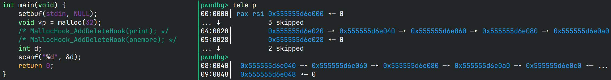
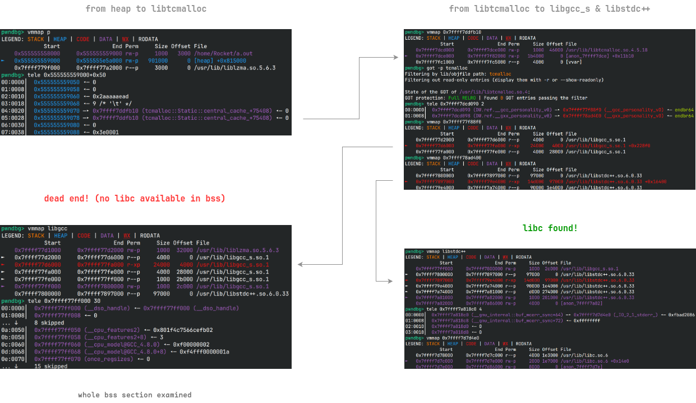
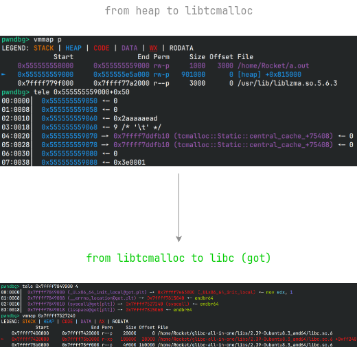
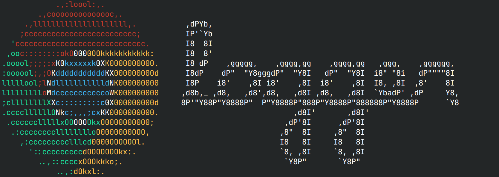
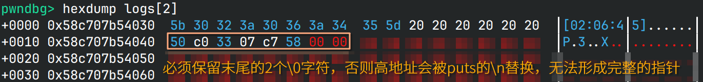
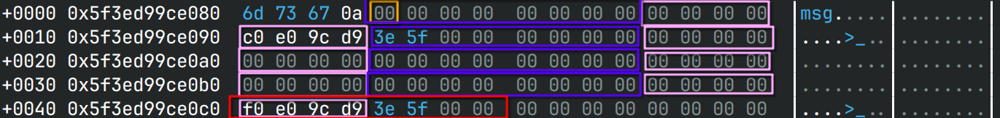

# ChromeLogger 出题博客

当你看到这篇博客的时候，安恒官方的wp应该已经放出了，你也大概是因为看到了wp中夹带的网址而来，
并且是有一定基础的pwner，来都来了，可以在discussion中尽情吐槽。说实话，
我自认为这题的难度没有这么高，怎么说8个小时还是能做出来的，结果最后也没人做出来，
感觉题白出了:(

不知道是不是大家对新事物的接受能力不高，WhereIsMySauce做出来的人也不多。
难道是看到libtcmalloc大家就不知道怎么下手了？

## 缘起

在ctf-wiki上，记载了多个堆实现，除了常见的ptmalloc，还有tcmalloc和jemalloc，
于是我一时兴起，找了找有关文章，想借此出题。其中jemalloc比较难利用，
因为在拿到的堆块附近没有任何堆的元数据，反倒是tcmalloc在堆块附近有很多堆指针。



于是我就随便改了一个指针，然后分配2次同样大小的堆块就实现了任意堆块分配。
这么好写？拿来出题正好，也不需要看源码，只要稍微调试一下就能看出这个特性了，
我想。

## 利用链

有了任意堆块分配，怎么样实现任意代码执行呢？首先我们需要获得libc，否则无法做任何事。
于是我就找一条链子来获取libc。由于分配了堆块后一般要进行写入的操作，
因此我们不考虑只读段的指针。

在我的系统 *Arch Linux* 上，所有GOT表都是只读的，因此需要经过以下这么一条曲折的路径：



当我正想着这题难度还挺高时，ubuntu的库却出乎我的意料：我原本想着从libc 2.38开始，
libc的got表就不可写了，这样可以提高一点难度，结果Full RELRO **只有** libc开了，
其他的lib的got仍然是可写的：



要保留这个特性吗？还是把Arch的库放到靶机里，让got表不可写？我想了想，没有got感觉太麻烦了，
构造起来有点费事，还是让got表保持原样吧。现在有了libc，接下来就是考虑如何rce。
按传统的思路来说，改libtcmalloc的got表或者走House of Apple就可以控制rip，
但是这是不是就和往常的题差不多了？

## No OneGadget

纠结的点无非是OneGadget，无脑套OneGadget疑似太简单了，但是我又不想把题做得很恶心，
没法拿shell，于是根据之前刚学的ptrace，我想了个折中的方法：父进程起ptrace监视子进程，
子进程开放给用户，每当子进程想要`execve`，我就检查第一个参数是不是`"/bin/sh"`，
如果是的话就拒绝，不是就放行。通过这种方式，很好地避免了OneGadget的使用，
因为OneGadget都是打开`"/bin/sh"`的。

```c
// use_ptrace.c
#ifdef USE_PTRACE
#include "use_ptrace.h"

static void hypervisor(pid_t child) {
    int status;
    waitpid(child, &status, 0);
    if (ptrace(PTRACE_SETOPTIONS, child, 0, PTRACE_O_TRACESECCOMP) == -1) {
        kill(child, SIGKILL);
        puts("\x1b[31mCAN NOT SET UP HYPERVISOR\x1b[0m");
        exit(EXIT_FAILURE);
    }

    while (1) {
        ptrace(PTRACE_CONT, child, 0, 0);
        waitpid(child, &status, 0);
        if (WIFEXITED(status))
            exit(WEXITSTATUS(status));
        if (WIFSIGNALED(status))
            exit(WTERMSIG(status));
        if (!(WIFSTOPPED(status) && (status >> 16) == PTRACE_EVENT_SECCOMP))
            continue;
        const char *path = (const char *)ptrace(PTRACE_PEEKUSER, child, sizeof(size_t) * RDI);
        char buf[8];
        *(long *)buf = ptrace(PTRACE_PEEKDATA, child, path);
        if (!strcmp(buf, "/bin/sh")) {
            puts("[\x1b[31mx\x1b[0m] From hypervisor: /bin/sh detected!!");
            kill(child, SIGKILL);
        }
    }
}

void SetupPassthru(void) {
        pid_t pid = fork();
        if (pid)
            hypervisor(pid);
        ptrace(PTRACE_TRACEME, 0);
        raise(SIGTRAP);
}
#endif
```

本来我只是想ban一下OneGadget，结果没考虑到副作用，`system`用的是`/bin/sh -c $CMD`，
一起被ban了（不过根本原因是`system`会起一个新进程，而父进程的ptrace不会自动挂到新进程上，
因此由于子进程没有挂调试器，`execve`直接失败了）。

后来看seccomp的文档发现在"RET_TRACE"之上还有一个"RET_TRAP"，可以通过信号来处理，
考虑到用ptrace方案会导致调试变得困难，后来我选择了信号处理器的方案：

```c
// use_signal.c
#ifndef USE_PTRACE
#define _GNU_SOURCE
#include "use_signal.h"

static void filterOneGadget(int sig, siginfo_t *info, void *ctx) {
    if (!(sig == SIGSYS && info && info->si_code == SYS_SECCOMP))
        return;
    ucontext_t *uctx = ctx;
    const char *rdi = (const char *)uctx->uc_mcontext.gregs[REG_RDI];
    if (!strcmp(rdi, "/bin/sh")) {
        puts("[\x1b[31mx\x1b[0m] From hypervisor: /bin/sh detected!!");
        return;
    }
    void *rsi = (void *)uctx->uc_mcontext.gregs[REG_RSI];
    void *rdx = (void *)uctx->uc_mcontext.gregs[REG_RDX];
    execveat(AT_FDCWD, rdi, rsi, rdx, 0);
}

void SetupPassthru(void) {
    struct sigaction act;
    act.sa_sigaction = filterOneGadget;
    sigemptyset(&act.sa_mask);
    act.sa_flags = SA_SIGINFO;
    sigaction(SIGSYS, &act, NULL);
}
#endif
```

不过可惜的是信号处理器方案同样只能保证当前进程可用，`fork`后就不起效了，
因此`system`会和ptrace方案一样不可用。

最后贴一下沙箱实现：

```c
// chall.c
__attribute__((noinline))
static int sandbox(void) {
    scmp_filter_ctx ctx;
    ctx = seccomp_init(SCMP_ACT_ALLOW);
    if (ctx == NULL)
        return -1;

#ifdef USE_PTRACE
    int rc = seccomp_rule_add(ctx, SCMP_ACT_TRACE(0), SCMP_SYS(execve), 0);
    if (rc < 0)
        goto cleanup;
    rc = seccomp_rule_add(ctx, SCMP_ACT_KILL, SCMP_SYS(execveat), 0);
#else
    int rc = seccomp_rule_add(ctx, SCMP_ACT_TRAP, SCMP_SYS(execve), 0);
#endif
    if (rc < 0)
        goto cleanup;
    rc = seccomp_load(ctx);

cleanup:
    seccomp_release(ctx);
    return rc < 0 ? -1 : 0;
}
```

## No 2.35 ROP gadget

这么折腾以后麻烦了，既不能用OneGadget，也不能用`system`，难道只能走rop了吗？
之所以禁用OneGadget是为了防止一套板子直接走掉，那我这么设置，
不是让pwner直接套rop的板子么？想到这里，我开始思索怎么把常用的gadget给ban了：
我首先想到在exit的时候，扫描一遍堆块，看看里面有没有可疑的gadget，
比如`svcudp_reply+26`或者`getkeyserv_handle+576`，但是感觉判断起来挺麻烦的；
我又想到，既然这几个函数在正常的操作中不会用到，
那我可以先`mprotect`libc的`.text`为可写段，然后把这些常用函数直接覆写为`NOP`，
然后再`mprotect`回可执行，就可以避免任何形式的调用了。

当我正在考虑这么做是不是有点剑走偏锋时，我反汇编了一下这些函数，
发现2.35的gadget在2.39上全都不能用了！那我也不需要patch了，直接就利用不了，
各位pwner就自己找gadget吧！

> 好像新的gcc大幅更新了生成的汇编的安全性，很少使用rbp、rsp作为中间变量了，
> 导致了不少gadget失效

## Back to execve

之前写到我只是把`execve`的第一个参数过滤了一下，`execve`仍然是可用的，
这也意味着只要找到一个办法能调用`execve`，就可以一步拿shell，虽然后续不能运行新程序，
但是可以通过`read FLAG < flag; echo $FLAG`的方式读出flag，这相比orw还是省力不少。

接下来就是找这样的函数。除了`posix_spawn`和`system`，libc中能shell的函数就只有`exec`族了。
通过`man exec.3`查看这一族的文档，发现`execv`和`execvp`只需要控制2个参数就能拿shell，
什么house可以胜任呢？ *House of Apple 2*, *House of Lyn*等，都只能控制rdi，rsi固定是-1，
我只能找上了[House of Apple 3](https://bbs.kanxue.com/thread-273863.htm)，在默认条件下，
*House of Apple 3*可以控制rsi。继续研究利用原理，rdi其实也是能控制的，只是在文中，
[rdi]如果非0，则函数指针会过一遍`PTR_DEMANGLE`。既然找遍了能用的路子都没法控制rsi，
那就给做题人一个`PTR_MANGLE`的机会吧！

为了避免`PTR_MANGLE`被利用导致可以加解密任意数据，我把它放在了`exit`前，
这样做题人就只能做一次`PTR_MANGLE`。

> [!NOTE]
> 为了找一个能控制rdi和rsi的house，我想起了pwn college的视频，里面提到一个angr大师，
> 通过模拟符号执行的方式，[遍历所有FSOP可能](https://blog.kylebot.net/2022/10/22/angry-FSROP/)，
> 文中有一个仓库，存放了运行结果(pickle)。但是由于不知道这些pickle生成时的环境，
> 我久久不能得知真正的路径。我提了个[issue](https://github.com/Kyle-Kyle/angry-FSROP/issues/1)，
> 希望作者可以重跑一次，但是作者答应后就杳无音信了，于是我借用了同学的超大内存服务器
> （原先我自己跑过脚本，然后爆内存了），跑模拟符号执行的脚本并生成了pickle，
> 还把结果放回了issue中，感兴趣的同学可以自行阅读过程。省流：
> angr找到的路子都无法直接控制rdi和rsi。

最后精心构造 *House of Apple 3* 的payload，我们可以运行`execvp("bash", (char *[]){"bash", NULL})`，
从而拿到远程的shell，获取flag。

## 设计题目

tcmalloc是谷歌研发的，听说曾经用在Chromium上过，而对于浏览器来说，
打log是再正常不过的与文本交互的操作，于是我就给它命名为 **ChromeLogger** 。
作为ascii艺术爱好者，我又去从fastfetch那搞了个Chrome的logo，还去生成了艺术字，
用来打印"logger"。



> 希望不要有师傅看到Chrome还以为是v8题

根据我对FreeList的poc，我打算就简单搞个堆溢出，既然如此，那我`free`也不给了，
反正只要`malloc`就能实现任意堆块分配。

> 也许我哪一天会再出一题考uaf或者和`free`有关的攻击，不过那就要等我读完源码了。

想着直接堆溢出有点太无脑了，我就用到了大部分人只见过却没研究过的`setvbuf`。
本来我的想法是利用将`stdout`和`stderr`的缓冲区堆块可以由pwner来分配，
并且设置缓冲区大小为固定值，`stdout`和`stderr`的缓冲区各可以分配一次。
此时如果将过小的堆块作为标准IO的缓冲区，那在做`puts`等IO操作时，
就会发生堆溢出，将数据写到FreeList上。后来想想2次有点少了，
还得分别写`stdout`和`stderr`的接口，就给无限次换`stdout`的缓冲区的机会了。

作为logger，我还在分配堆块后给堆块写入了时间字符串，这一方面符合情景，
另一方面也考验pwner不能分配到只读段上。这样`NewLog`函数就设计好了。

接下来就是考虑怎样打印堆块信息。因为放在FreeList上的指针都是48-bit addr，
如果使用`write`来打印堆块显得不太自然；如果直接使用`puts`来打印堆块，
则设置好`stdout`的缓冲区后，由于无法打印'\0'字符，不可能在FreeList上构造一个完整的指针。
于是为了构造出完整的指针，我们需要完整地打印一个指针。具体来说，
使用`strlen`检测一个堆块的长度，然后将其向上对齐到8的边界，这样的话，
如果最后放着指针，就可以打印出完整的指针。



但是如果全部对齐到8边界，那么就不太好精准将指针覆盖在FreeList上，
因为每个输出都对齐到8边界，打印所有堆块时打印的字符数必然是8的倍数，
只要开始打印时`write_ptr`没有对齐到8边界，指针就无法刚好覆盖到FreeList上。



如图所示，我们要修改的是红色框处的FreeList，橙色框是当前的`write_ptr`，
紫色和粉色框交替出现，代表写入的字节向上对齐到8边界，因此不能恰好控制红色框。
为了解决这个问题，可以规定如果堆块中连续的非'\0'字符中的最后一个是'\n'，
则不对齐到8边界，而指针不可能高地址的字节是'\n'，因此对齐到8边界，
这样就能很方便地控制写指针前的`write_ptr`，起到引入一个堆块用以调节`write_ptr`，
然后下一个堆块就能把指针顺利写到FreeList上。这样`DisplayLogs`也设计好了。

接下来就可以开始打了。考虑到本题并没有什么逆向上的考察，就保留了程序的符号。
既然比赛已经结束了，我也会公开[源码](sources/ChromeLogger/)，可以边看源码边看我的思路。
