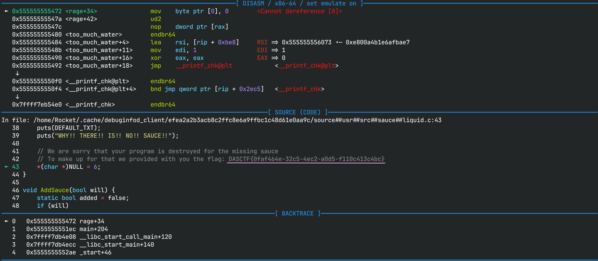

# WhereIsMySauce 出题博客

## 前言

**debuginfod** 是二进制调试当中非常好用的工具，可以从网上自动拉取调试符号和源码，
无需预先下载好，具体请看[我早前写的博客](../blog/debuginfod.md)

## 出题思路

题目名叫做`WhereIsMySauce`，小小玩了一个谐音梗，`Sauce`谐音`source`，
实际上是在暗指flag就放在源码里。由于`debuginfod`是可以分发源码的，
而源码是最便于显示flag的方式，因此这道题的终极目标就是找到藏有flag的源码

pwner一般都知道，pwndbg是可以在有调试符号的情况下显示源码的，并且在程序崩溃时会停在崩溃的地方，
因此这也是我设计的切入点。直接把flag放在顶层文件里有点简单了，于是我设计了让程序崩溃的机制：
只要不加酱油就崩溃，因此正确做法就是打开debuginfod，并设置服务器为靶机，然后打开gdb，
直接让程序崩溃即可打印flag（没有pwndbg插件就手动`l`一下）

我对这道题的预期难度是中等甚至简单，最后却只有一位师傅做出来了，也不知道大家卡在哪里了

wp中也提到了可能存在的坑点是debuginfod的缓存机制，如果先前已经设置过服务器，
那么debuginfod会在服务器中查找相关符号，未找到则会创建空文件，导致后续就算服务器设置正确，
debuginfod也不会自动拉取符号，这时候就需要将这题的缓存先清空一下再运行

```sh
rm -rf ~/.cache/debuginfod_client/$(readelf -n cook | grep Build | awk '{print $3}')
echo 'set debuginfod enabled on' >> ~/.gdbinit
DEBUGINFOD_URLS=$REMOTE gdb cook -q
r
6
```



## 参考

[摆脱调试符号的困扰：使用debuginfod拉取libc的调试符号](../blog/debuginfod.md)

