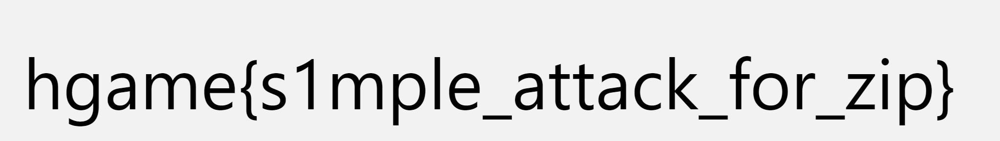

# Week 1 WriteUp

By: RocketDev  
15 challenges solved

## web

### ezHTTP

*HTTP Protocol Basics*

考察http的3种头


然后cyberchef解码高亮的base64文本，找到json标签里的"f14g"字段

> not xff? 所有标准头都试了一遍，不行  
> 结果是X-Real-IP??  
> ~~打pwn打多了导致基础欠缺~~

### Bypass it

*This page requires javascript to be enabled : )*

在注册的时候发现本来可以注册的，但html里有js阻拦，此时禁用js就可以注册了


注册完用刚才的账号登录，点击`~~click here~~`拿到flag

> ~~主打的就是一个叛逆~~

## reverse

### ezASM

*To learn a little ASM*

关键代码，看出check中是将`[c + esi] ^ 0x22`与输入作比较

```as
check_flag:
    mov al, byte [flag + esi]
    xor al, 0x22
    cmp al, byte [c + esi]
```

取数据`c`放入ipython中作异或解密为原来的flag

```ipython
In [18]: d = [74, 69, 67, 79, 71, 89, 99, 113, 111, 125, 107, 81, 125, 107,
    ...:  79, 82, 18, 80, 86, 22, 76, 86, 125, 22, 125, 112, 71, 84, 17, 80, 81, 17, 95, 34]

In [19]: bytes(map(lambda x: x ^ 0x22, d))
Out[19]: b'hgame{ASM_Is_Imp0rt4nt_4_Rev3rs3}\x00'
```

### ezPYC

*ez python Reverse*

先使用pyinstxtractor把exe中的文件提取出来，然后在解密pyc文件得到部分源码

```py
flag = [ 87, 75, 71, 69, 83, 121, 83, 125, 117, 106, 108, 106, 94, 80, 48, 114,
    100, 112, 112, 55, 94, 51, 112, 91, 48, 108, 119, 97, 115, 49, 112, 112, 48,
    108, 100, 37, 124, 2]
c = [ 1, 2, 3, 4]
input = input('plz input flag:')
# WARNING: Decompyle incomplete
```

推测1234是密钥，尝试循环异或解密

```ipython
In [3]: d = b''

In [4]: for i, e in enumerate(flag):
   ...:     d += bytes([e ^ (i % 4 + 1)])
   ...: 

In [5]: d
Out[5]: b'VIDAR{Python_R3vers3_1s_1nter3st1ng!}\x00'
```

### ezUPX

*UPX is a packer*

`upx -d ezUPX.exe` 拿到压缩前exe，分析main函数

```c
  local_38 = ZEXT816(0);
  local_18 = 0;
  local_28 = ZEXT816(0);
  FUN_140001020("plz input your flag:\n",param_2,param_3,param_4);
  FUN_140001080(&DAT_140002258,local_38,param_3,param_4);
  uVar1 = 0;
  uVar3 = uVar1;
  do {
    if ((local_38[uVar1] ^ 0x32) != (&DAT_1400022a0)[uVar1]) {
      FUN_140001020("Sry,try again plz...",uVar3,&DAT_1400022a0,param_4);
      return 0;
    }
    uVar2 = (int)uVar3 + 1;
    uVar3 = (ulonglong)uVar2;
    uVar1 += 1;
  } while (uVar2 < 0x25);
  FUN_140001020("Cooool!You really know a little of UPX!",uVar3,&DAT_1400022a0,param_4);
  return 0;
```

推测把数据每个异或0x32即可

```ipython
In [1]: flag = [0x64, 0x7B, 0x76, 0x73, 0x60, 0x49, 0x65, 0x5D, 0x45, 0x13, 0x6B,  0x2,
...:     0x47, 0x6D, 0x59, 0x5C, 0x2, 0x45, 0x6D,  0x6, 0x6D, 0x5E,  0x3, 0x46,
...:     0x46, 0x5E,  0x1, 0x6D, 0x2, 0x54, 0x6D, 0x67, 0x62, 0x6A, 0x13, 0x4F]
...: 

In [2]: bytes(map(lambda x: x ^ 0x32, flag))
Out[2]: b'VIDAR{Wow!Y0u_kn0w_4_l1ttl3_0f_UPX!}'
```

### ezIDA

*Do you know how to use IDA?*

逆向即送


> 没有ida可以用ghidra替代

## crypto

### ezRSA

*一个简单的RSA*

根据费马小定理， $p ^ { q - 1 } = 1 (mod\ q)$  
所以 $p ^ q = p (mod\ pq)$  
题目里给出的leak1和leak2，实际上就是p和q

由p, q, e, c解密rsa

```python
import gmpy2
from Crypto.Util.number import *
p = 149127170073611271968182576751290331559018441805725310426095412837589227670757540743929865853650399839102838431507200744724939659463200158012469676979987696419050900842798225665861812331113632892438742724202916416060266581590169063867688299288985734104127632232175657352697898383441323477450658179727728908669
q = 116122992714670915381309916967490436489020001172880644167179915467021794892927977272080596641785569119134259037522388335198043152206150259103485574558816424740204736215551933482583941959994625356581201054534529395781744338631021423703171146456663432955843598548122593308782245220792018716508538497402576709461
c = 10529481867532520034258056773864074017027019578041866245400647840230251661652999709715919620810933437191661180003295923273655675729588558899592524235622728816065501918076120812236580344991140980991532347991252705288633014913479970610056845543523591324177567061948922552275235486615514913932125436543991642607028689762693617305246716492783116813070355512606971626645594961850567586340389705821314842096465631886812281289843132258131809773797777049358789182212570606252509790830994263132020094153646296793522975632191912463919898988349282284972919932761952603379733234575351624039162440021940592552768579639977713099971

phi = (p - 1) * (q - 1)
n = p * q
e = 0x10001
d = gmpy2.invert(e, phi)
decrypted = pow(c,d,n)

print(long_to_bytes(decrypted))
```

## misc

### SignIn

*换个方式签个到  
flag格式：'hgame\{[A-Z_]+\}'*

缩放也可以看到哦


### simple_attack

*怎么解开这个压缩包呢？*

压缩包组成like:

```
+ src.zip
\-- 103223779_p0.jpg
 -+ attachment.zip
  \-- 103223779_p0.jpg
   -- photo.txt
```
两张图片CRC校验一致，使用azpr明文攻击得到flag


浏览器中打开获得flag



> 一开始忘了怎么用的，挂了一晚上等它找回密钥，
> 一停止才想起来早就解密完成了

### 签到

公众号关注发送消息即得

## pwn

### EzSignIn

*Have fun in pwn games of hgame2024~*

nc 连接即得

