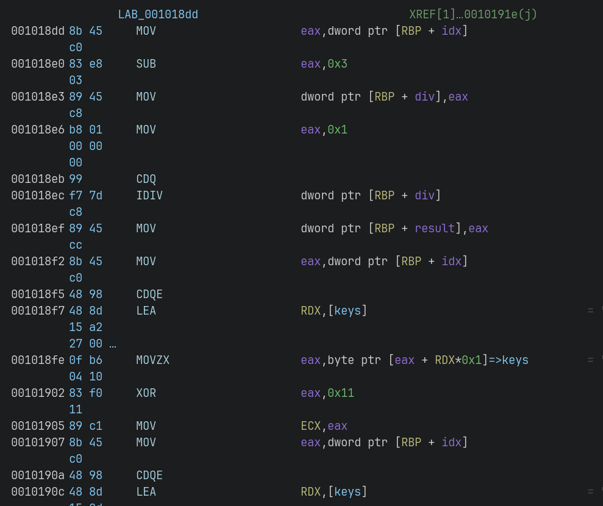
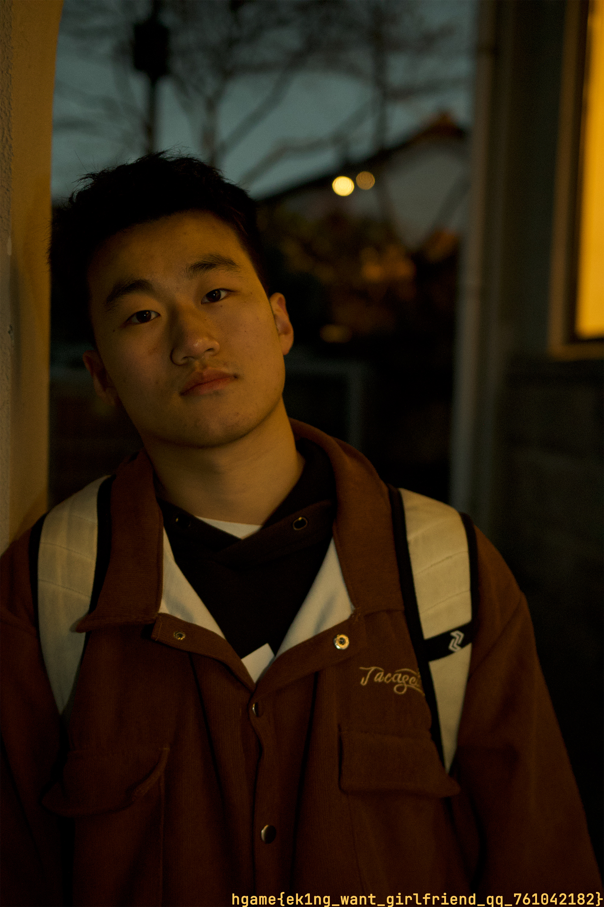
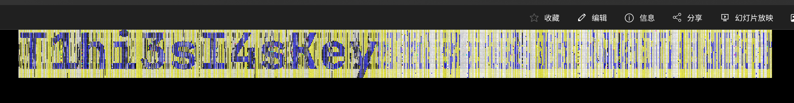

# Week 2 WriteUp

By: RocketDev  
12 challenges solved

## web

### What the cowsay?

*the cow want to tell you something*

`cowsay`命令，填入字符串，尝试后发现为命令绕过  
经尝试，cat、flag、|等会被拦下来，那么换行可不可以呢？  
当然，做出来了就是可以了；在用""包围字符串绕过字符检测，尝试使用
`%0a"ca"t "fl"ag`来获取flag，错误！

ls一下根目录，发现有一个`flag_is_here`，尝试cat一下，还是失败，ls -hls，发现是路径  
终于在里面找到了flag

```sh
$ curl http://106.14.57.14:31942/post -d 'user_input=%0a"ca""t" /"fl"ag_is_here/"fl"ag_c0w54y'
```

## reverse

### babyre

一道多线程题，坑还挺多的

基本思路是四个线程一次执行，那么只要全部反向执行一次就可以解出，从检查函数里找到目标数组，开逆！

直接莽是不行的，比如main函数里还注册了`SIGFPE`的处理函数，看反编译结果半天没看出哪里会发生除0异常，
最后发现会引发异常的代码没在反编译中出现，它会打断异或处理（即只执行了前3项），
随即进入处理函数，给`flag[32] += 1`



逆完还是不对，最后在`_INIT_1`函数里发现作者把"123456"的`key`字符串替换成了"feifei"，这么折腾完，终于拿到flag了

> 动调终于发现了key有问题

```python
#! python
import array
target = [0x2F14, 0x4E, 0x4FF3, 0x6D,
0x32D8, 0x6D, 0x6B4B,0xFFFFFF92-(1<<32),
0x264F, 0x5B, 0x52FB,0xFFFFFF9C-(1<<32),
0x2B71, 0x14, 0x2A6F,0xFFFFFF95-(1<<32),
0x28FA, 0x1D, 0x2989,0xFFFFFF9B-(1<<32),
0x28B4, 0x4E, 0x4506,0xFFFFFFDA-(1<<32),
0x177B,0xFFFFFFFC-(1<<32), 0x40CE, 0x7D,
0x29E3, 0xF, 0x1F11, 0xFF] # patch int val to fit in i32

user = array.array('i', target) # meet overflow/underflow behavior
user.append(0xfa)
keys = [0x77, 0x74, 0x78, 0x66, 0x65, 0x69]

for i in range(31, -1, -4):
    idx = i
    user[idx] = user[idx] ^ user[idx + 1] - keys[(idx + 1) % 6]
    idx -= 1
    user[idx] //= user[idx + 1] + keys[(idx + 1) % 6]
    idx -= 1
    user[idx] += user[idx + 1] ^ keys[(idx + 1) % 6]
    idx -= 1
    user[idx] -= user[idx + 1] * keys[(idx + 1) % 6]

print(bytes(user.tolist()))
```

### ezcpp

*cppppppppppppppp*

找到main函数中发现有一个对输入的字符串进行处理的函数，拿之后要比对的数据将所有操作全部逆推，
就可以推知flag

```c
// ezcpp.c
#include <stdio.h>
void reverse(char*);

void reverse(char *buf) {
    int deadbeef = 0;
    for (int i = 0; i < 0x20; i++) 
        deadbeef += 0xdeadbeef;

    int _3_7 = *(int *)(buf + 3);
    int _7_11 = *(int *)(buf + 7);
    for (int i = 0, roller = deadbeef; i < 0x20; i++, roller -= 0xdeadbeef) {
        _7_11 -= _3_7 * 0x10 + 3412 ^ _3_7 * 0x20 + 4123 ^ roller + _3_7;
        _3_7 -= _7_11 * 0x10 + 1234 ^ _7_11 * 0x20 + 2341 ^ roller + _7_11;
    }
    *(int *)(buf + 3) = _3_7;
    *(int *)(buf + 7) = _7_11;
    
    int _2_6 = *(int *)(buf + 2);
    int _6_10 = *(int *)(buf + 6);
    for (int i = 0, roller = deadbeef; i < 0x20; i++, roller -= 0xdeadbeef) {
        _6_10 -= _2_6 * 0x10 + 3412 ^ _2_6 * 0x20 + 4123 ^ roller + _2_6;
        _2_6 -= _6_10 * 0x10 + 1234 ^ _6_10 * 0x20 + 2341 ^ roller + _6_10;
    }
    *(int *)(buf + 2) = _2_6;
    *(int *)(buf + 6) = _6_10;

    int _1_5 = *(int *)(buf + 1);
    int _5_9 = *(int *)(buf + 5);
    for (int i = 0, roller = deadbeef; i < 0x20; i++, roller -= 0xdeadbeef) {
        _5_9 -= _1_5 * 0x10 + 3412 ^ _1_5 * 0x20 + 4123 ^ roller + _1_5;
        _1_5 -= _5_9 * 0x10 + 1234 ^ _5_9 * 0x20 + 2341 ^ roller + _5_9;
    }
    *(int *)(buf + 1) = _1_5;
    *(int *)(buf + 5) = _5_9;

    int _0_4 = *(int *)(buf + 0);
    int _4_8 = *(int *)(buf + 4);
    for (int i = 0, roller = deadbeef; i < 0x20; i++, roller -= 0xdeadbeef) {
        _4_8 -= _0_4 * 0x20 + 4123 ^ _0_4 * 0x10 + 3412 ^ roller + _0_4;
        _0_4 -= _4_8 * 0x20 + 2341 ^ _4_8 * 0x10 + 1234 ^ roller + _4_8;
    }
    *(int *)(buf + 0) = _0_4;
    *(int *)(buf + 4) = _4_8;
}

int main(void) {
    char buf[13] = {0x88, 0x6a, 0xb0, 0xc9, 0xad, 0xf1, 0x33, 0x33, 0x94, 0x74, 0xb5, 0x69};
    reverse(buf);
    printf("%ss_0bJ3cT_0r1enTeD?!}\n", buf);
    return 0;
}
```

> 一开始把循环轮次写错了，0x20变成20了，后来发现的时候汗流浃背了（笑）  
> ~~还有，有个cout就算面向对象了是吧~~

### babyAndroid

jadx一通分析，程序先检查用户，再检查密码，那就逐个击破：
先逆推正确用户，然后解决密码

使用Ghidra FindCrypt发现so里有aes加密，密钥是用户，提取其中的密文，再用正确用户解密，
拿到flag

```python
from Crypto.Cipher import AES

def swap(arr, i, j):
    arr[i], arr[j] = arr[j], arr[i]

class Check1:
    def __init__(self):
        self.store = [i for i in range(256)]
        i2 = 0
        for idx in range(256):
            i2 = (i2 + self.store[idx] + b'3e1fel'[idx % 6]) & 0xff
            swap(self.store, i2, idx)
        self.i = 0
        self.j = 0

    def __repr__(self):
        return str(bytes(self.store))

    def genkey(self) -> list:
        ret = []
        for i in range(16):
            self.i = (self.i + 1) & 0xff
            self.j = (self.j + self.store[self.i]) & 0xff
            swap(self.store, self.i, self.j)
            ret.append(self.store[(self.store[self.i] + self.store[self.j]) & 0xff])
        return ret

class Cipher:
    def __init__(self):
        self.cipher = []

    def append(self, e:int):
        if e < 0:
            self.cipher.append(0x100 + e)
        else:
            self.cipher.append(e)

    def appendAll(self, es:list):
        for e in es:
            self.append(e)

    def decrypt(self, key:list) -> bytes:
        return bytes(map(lambda x: x[0] ^ x[1], zip(self.cipher, key)))

class Flag:
    def __init__(self, key:bytes, cipher:bytes):
        self.c = cipher
        self.aes = AES.new(key, AES.MODE_ECB)

    def __str__(self):
        return str(self.aes.decrypt(self.c))

    def __repr__(self):
        return str(self)

c = bytes([0x64,0xa2,0x80,0xfd,0x1b,0x20,0xd2,0x8e,0xfc,0x52,0x9e,0x13,
           0xee,0xa1,0xfd,0x1e,0x66,0x0b,0x7a,0x72,0xa3,0x1b,0xd8,0x36,
           0x6f,0xdc,0x3d,0xee,0x3c,0x01,0x57,0x63])
encrypted = [-75, 80, 80, 48, -88, 75, 103, 45, -91, 89, -60, 91, -54, 5, 6, -72]

keylist = Check1().genkey()
ci = Cipher()
ci.appendAll(encrypted)
key = ci.decrypt(keylist)
print(key)
flag = Flag(key, c)
print(flag)
```

> flag拿到了，但是在app里校验的时候显示密码错误！
> 你这app写得有问题啊

## crypto

### midRSA

*兔兔梦到自己变成了帕鲁被crumbling抓去打黑工，醒来后连夜偷走了部分flag*

padding补在flag后面，并且随后右移了26个字节，意味着先丢失的是padding（大端序表达？），
推测还会有flag剩余，结果一解析...好家伙，padding都没移完

```ipython
In [2]: long_to_bytes(13292147408567087351580732082961640130543313742210409432471625281702327748963274496942276607)
Out[2]: b'hgame{0ther_cas3s_0f_c0ppr3smith}\xff\xff\xff\xff\xff'
```

> 非预期，爽！

### backpack

*crumbling的游戏已经玩到了中期，打算带着帕鲁搬家到新据点，你来帮他研究一下背包管理*

由于`p`是32位的，即4字节的，那么只有4个字节受到影响，前面的字节不受影响，因此可以尝试解析

```ipython
In [3]: long_to_bytes(871114172567853490297478570113449366988793760172844644007566824913350088148162949968812541218339)
Out[3]: b'hgame{M@ster_0f ba3kpack_m4nag3ment!}\x00\x0e#'
```

## misc

### ek1ng_want_girlfriend

*An introducation to Wireshark and also ek1ng.*

用Wireshark打开`capture.pcapng`，发现请求了资源`/ek1ng.jpg`，跟踪tcp流截取raw数据保存，
然后使用ImHex编辑之，去掉头部的http请求头即可拿到图片



> ~~还可以这么找女朋友的吗~~

### ezWord

*通过破译图片的水印来解开文档里的秘密吧！*

直接使用压缩软件打开word文档，其中的media文件夹中包含了jpg和png两张很相似的图片，
结合提示，推测是盲水印。找到BlindWaterMark项目然后clone下来运行

```sh
$ python bwmforpy3.py decode ../downloads/media/100191209_p0.jpg ../downloads/media/image1.png decoded.png
```

解码出盲水印：



根据提示将其作为密码提取`secret.zip`中的`secret.txt`文件，看到满屏的文本，
推测为电子邮件加密。在[spammimic - decode](https://www.spammimic.com/decode.shtml)中解密邮件，
得到字符串：`籱籰籪籶籮粄簹籴籨粂籸籾籨籼簹籵籿籮籨籪籵簺籨籽籱簼籨籼籮籬类簼籽粆`，
解码查看字节：

```ipython
In [4]: code.encode('utf-8')
Out[4]: b'\xe7\xb1\xb1\xe7\xb1\xb0\xe7\xb1\xaa\xe7\xb1\xb6\xe7\xb1\xae\xe7\xb2\x84\xe7\xb0\xb9\xe7\xb1\xb4\xe7\xb1\xa8\xe7\xb2\x82\xe7\xb1\xb8\xe7\xb1\xbe\xe7\xb1\xa8\xe7\xb1\xbc\xe7\xb0\xb9\xe7\xb1\xb5\xe7\xb1\xbf\xe7\xb1\xae\xe7\xb1\xa8\xe7\xb1\xaa\xe7\xb1\xb5\xe7\xb0\xba\xe7\xb1\xa8\xe7\xb1\xbd\xe7\xb1\xb1\xe7\xb0\xbc\xe7\xb1\xa8\xe7\xb1\xbc\xe7\xb1\xae\xe7\xb1\xac\xe7\xb1\xbb\xe7\xb0\xbc\xe7\xb1\xbd\xe7\xb2\x86'
```

根据utf-8编码规则，三字节一编码，而且flag是hgame开头的，恰好前2个utf-8字符也符合h和g的差值，
那么将所有的字符减去差值就可以找到原始字符串

```ipython
In [8]: offset = ord(code[0]) - ord('h')

In [9]: offset
Out[9]: 31753

In [10]: decoded = []

In [11]: for s in code:
    ...:     decoded.append(chr(ord(s) - offset))
    ...:

In [12]: ''.join(decoded)
Out[12]: 'hgame{0k_you_s0lve_al1_th3_secr3t}'
```

## pwn

