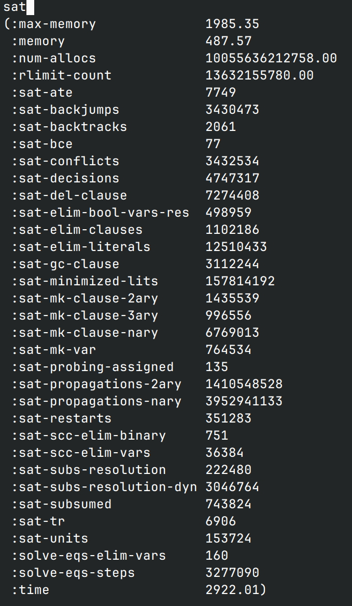
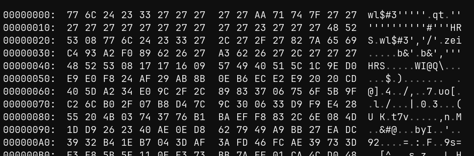
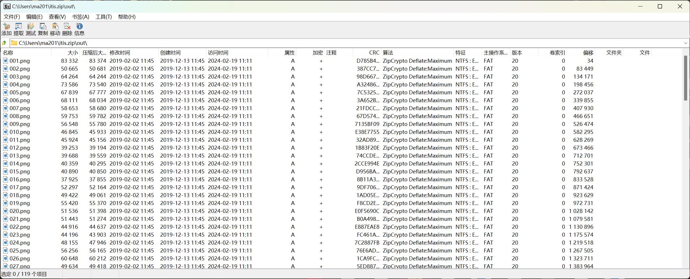
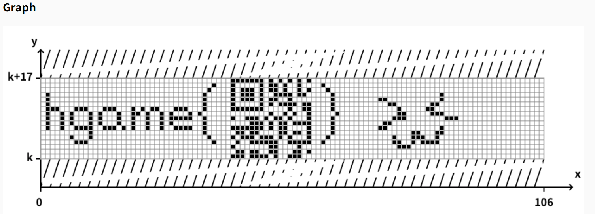

# Week 4 WriteUp

By: RocketDev  
6 challenges solved

## reverse

### again!

*为啥无法运行也无法反编译！*

看图标是打包了一个python环境，先用pyinstxtractor提取里面的资源

里面有个bin1.pyc，pycdc反编译显示3.11的版本，并且存在无法反编译的代码，
换用pycdas进行反汇编，发现从for开始都没有反编译成功，遂尝试自己反编译

```python
# Source Generated with Decompyle++
# File: bin1.pyc (Python 3.11)

import hashlib
print('you should use this execute file to decrypt "bin2"')
print('hint:md5')
s = bytearray()
f = bytearray(open('bin1.pyc', 'rb').read())
t = 'jkasnwojasd'

# decompyle by hand
for i in range(0, 15):
    f[i] = (f[i] + f[i % 6] ^ ord(t[i % 6]) + ord(t[i % len(t)])) % 256
    s.append(f[i])
print(s)
md5_hash = hashlib.md5(bytes(s)).hexdigest()
print(md5_hash) # added later
```

拿到md5hash，再看bin2，发现里面的字节貌似都以32个字节为一个块，恰好与hash字符串长度对应，
于是猜测是异或解密

```python
hasher = md5_hash.encode() # md5_hash from above var
binary = b''
with open('bin2', 'rb') as bin2:
    while True:
        bgroup = bin2.read(32)
        if bgroup:
            binary += bytes(map(lambda x: x[0] ^ x[1], zip(bgroup, hasher)))
        else:
            break
with open('bin2.exe', 'wb') as exe:
    exe.write(binary)
```

解密完了是一个exe，一个btea，反解

```c
#include <stdio.h>
int buf[8] = {
    0x506FB5C3,     0xB9358F45,     0xC91AE8C7,     0x3820E280,
    0xD13ABA83,     0x975CF554,     0x4352036B,     0x1CD20447
};


void decrypt(int *);
void decrypt(int *list) {
    int itred;
    int itr = 0;

    for (int i = 0; i < 12; i++)
        itr += 0x7937b99e;

    for (int i = 0; i < 12; i++, itr -= 0x7937b99e) {
        itred = itr >> 2 & 3;
        buf[7] -= ((buf[0] * 4 ^ (unsigned int)buf[6] >> 5) + ((unsigned int)buf[0] >> 3 ^ buf[6] * 0x10) ^
                (buf[0] ^ itr) + (list[itred ^ 3] ^ buf[6]));
        buf[6] -= ((buf[7] * 4 ^ (unsigned int)buf[5] >> 5) + ((unsigned int)buf[7] >> 3 ^ buf[5] * 0x10) ^
                (buf[7] ^ itr) + (list[itred ^ 2] ^ buf[5]));
        buf[5] -= ((buf[6] * 4 ^ (unsigned int)buf[4] >> 5) + ((unsigned int)buf[6] >> 3 ^ buf[4] * 0x10) ^
                (list[itred ^ 1] ^ buf[4]) + (buf[6] ^ itr));
        buf[4] -= ((buf[5] * 4 ^ (unsigned int)buf[3] >> 5) + ((unsigned int)buf[5] >> 3 ^ buf[3] * 0x10) ^
                (list[itred] ^ buf[3]) + (buf[5] ^ itr));
        buf[3] -= ((buf[4] * 4 ^ (unsigned int)buf[2] >> 5) + ((unsigned int)buf[4] >> 3 ^ buf[2] * 0x10) ^
                (list[itred ^ 3] ^ buf[2]) + (buf[4] ^ itr));
        buf[2] -= ((buf[3] * 4 ^ (unsigned int)buf[1] >> 5) + ((unsigned int)buf[3] >> 3 ^ buf[1] * 0x10) ^
                (list[itred ^ 2] ^ buf[1]) + (buf[3] ^ itr));
        buf[1] -= ((buf[2] * 4 ^ (unsigned int)buf[0] >> 5) + ((unsigned int)buf[2] >> 3 ^ buf[0] * 0x10) ^
                (list[itred ^ 1] ^ buf[0]) + (buf[2] ^ itr));
        buf[0] -= ((buf[1] * 4 ^ (unsigned int)buf[7] >> 5) + ((unsigned int)buf[1] >> 3 ^ buf[7] << 4) ^
                (list[itred] ^ buf[7]) + (buf[1] ^ itr));
    }

    return;
}


int main(void) {
    int nums[4] = {0x1234, 0x2341, 0x3412, 0x4123};
    decrypt(nums);
    printf("flag: %s\n", (char *)buf);
    return 0;
}
```

> 原先以为算法是加解密一体的，然后就把输入设置成要比对的编码过的flag了，
> 结果不对，于是就反解，并且把看着不顺眼的强制类型转换全去了，发现还是不对  
> 然后测试发现，unsigned的处理是不一样的，有符号右移是`SAR`，无符号右移是`SHR`，
> 加上强制转型就对了

### change

*丑死了*

代码里用了2个钩子，一个异或，一个异或+10，逆向即可

```python
cipher = [0x13, 0xA, 0x5D, 0x1C, 0xE, 0x8, 0x23, 0x6, 0xB, 0x4B, 0x38, 0x22,
    0xD, 0x1C, 0x48, 0xC, 0x66, 0x15, 0x48, 0x1B, 0xD, 0xE, 0x10, 0x4F]
key = b'am2qasl'
flag = b''
for i, e in enumerate(cipher):
    if i % 2 == 0:
        flag += bytes([(e - 10) ^ key[i % 7]])
    else:
        flag += bytes([e ^ key[i % 7]])
print(flag)
```

### crackme2

*新一代 flag checker*

> 处理函数喂给gpt，发现是base64，赛博厨子一把梭，好家伙，假flag

程序中存在明显的非法内存读取，将跳过的代码反编译发现是将处理函数做了异或，推测是seh，
但是x64dbg没调出来，程序直接结束了  
不管了，patch了再说

```python
old = open('procOld', 'rb')     # 处理函数raw bytes
patch = open('procPatch', 'rb') # 要进行异或的raw bytes
proc = open('proc', 'wb')
binary = b''
for _ in range(0x246a):
    binary += bytes([old.read(1)[0] ^ patch.read(1)[0]])
proc.write(binary)
# 然后再用ImHex将修补完的字节写回exe中
```

打开再看处理函数，变成了大量的等式，z3一把梭

```python
#! python
import z3
solver = z3.Solver()

v = [None]
v.extend([z3.BitVec(f'v{i}', 32) for i in range(1, 43)])

for e in v:
    if e is not None:
        solver.add(e >= 0)
        # solver.add(e <= 0x7e)

solver.add(v[5] == ord('h'))
solver.add(v[28] == ord('g'))
solver.add(v[11] == ord('a'))
solver.add(v[10] == ord('m'))
solver.add(v[24] == ord('e'))
solver.add(v[41] == ord('{'))

solver.add(v[37] == 2 * v[26])

solver.add(v[18] + 201 * v[24] + 194 * v[10] + 142 * v[20] + 114 * v[39] + 103 * v[11] + 52 * (v[17] + v[31])
    + ((v[9] + v[23]) << 6) + 14 * (v[21] + 4 * v[25] + v[25]) + 9 * (v[40] + 23 * v[27] + v[2] + 3 * v[1] + 4 * v[2] + 4 * v[6])
    + 5 * (v[16] + 23 * v[30] + 2 * (v[3] + 2 * v[19]) + 5 * v[5] + 39 * v[15] + 51 * v[4]) + 24 * (v[8] + 10 * v[28] + 4 * (v[42] + v[7] + 2 * v[26]))
    + 62 * v[22] + 211 * v[41] + 212 * v[29] == 296473)

solver.add(v[38] == 2 * v[16])

solver.add(207 * v[41] + 195 * v[22] + 151 * v[40] + 57 * v[5] + 118 * v[6] + 222 * v[42] + 103 * v[7] + 181 * v[8] + 229 * v[9]
    + 142 * v[31] + 51 * v[29] + 122 * (v[26] + v[20]) + 91 * (v[2] + 2 * v[16]) + 107 * (v[27] + v[25]) + 81 * (v[17] + 2 * v[18] + v[18])
    + 45 * (v[19] + 2 * (v[11] + v[24]) + v[11] + v[24]) + 4 * (3 * (v[23] + v[14] + 2 * v[23] + 5 * v[4]) + v[39] + 29 * (v[10] + v[1]) + 25 * v[15])
    + 26 * v[28] + 101 * v[30] + 154 * v[3] == 354358)

solver.add(177 * v[40] + 129 * v[26] + 117 * v[42] + 143 * v[28] + 65 * v[8] + 137 * v[25] + 215 * v[21] + 93 * v[31] + 235 * v[39] + 203 * v[11]
    + 15 * (v[7] + 17 * v[30]) + 2 * (v[24] + 91 * v[9] + 95 * v[29] + 51 * v[41] + 81 * v[20] + 92 * v[18] + 112 * (v[10] + v[6])
    + 32 * (v[22] + 2 * (v[1] + v[23])) + 6 * (v[2] + 14 * v[16] + 19 * v[15]) + 83 * v[5] + 53 * v[4] + 123 * v[19]) + v[17] + 175 * v[27]
    + 183 * v[3] == 448573)

solver.add(113 * v[19] + 74 * v[3] + 238 * v[6] + 140 * v[2] + 214 * v[26] + 242 * v[8] + 160 * v[21] + 136 * v[23] + 209 * v[9] + 220 * v[31] + 50 * v[24]
        + 125 * v[10] + 175 * v[20] + 23 * v[39] + 137 * v[22] + 149 * v[18] + 83 * (v[4] + 2 * v[30]) + 21 * (9 * v[29] + v[16])
        + 59 * (4 * v[27] + v[17]) + 41 * (v[1] + v[41])
        + 13 * (v[7] + 11 * (v[40] + v[15]) + 6 * v[42] + 4 * (v[28] + 2 * v[11]) + v[28] + 2 * v[11] + 17 * v[5]) + 36 * v[25] == 384306)

solver.add(229 * v[21] + 78 * v[1] + v[2] + v[9] + 133 * v[27] + 74 * v[6] + 69 * v[26] + 243 * v[7] + 98 * v[28] + 253 * v[8] + 142 * v[25] + 175 * v[31]
        + 105 * v[41] + 221 * v[10] + 121 * v[39] + 218 * (v[19] + v[29]) + 199 * (v[24] + v[30]) + 33 * (v[40] + 7 * v[17])
        + 4 * (27 * v[20] + 50 * v[11] + 45 * v[18] + 19 * (v[3] + v[42]) + v[16] + 16 * v[23] + 52 * v[4]) + 195 * v[22] + 211 * v[5]
        + 153 * v[15] == 424240)

solver.add(181 * v[25] + 61 * v[2] + 65 * v[21] + 58 * v[31] + 170 * v[29] + 143 * v[24] + 185 * v[10] + 86 * v[11] + 97 * v[22] + 235 * (v[23] + v[27])
        + 3 * (53 * v[41] + 74 * (v[8] + v[3]) + 13 * (v[42] + 6 * v[9]) + 11 * (v[39] + 7 * v[20]) + 15 * (v[18] + 4 * v[17]) + v[7]
        + 35 * v[1] + 29 * v[15]) + 4 * (57 * v[6] + 18 * (v[5] + v[37]) + v[28] + 17 * v[16] + 55 * v[30]) + 151 * v[40] + 230 * v[4]
        + 197 * v[19] == 421974)

solver.add(v[33] == 2 * v[41])

solver.add(209 * v[21] + 249 * v[30] + 195 * v[2] + 219 * v[25] + 201 * v[39] + 85 * v[18] + 213 * (v[17] + v[31]) + 119 * (v[11] + 2 * v[41])
        + 29 * (8 * v[24] + v[40] + 4 * v[27] + v[27]) + 2 * (v[8] + 55 * (2 * v[29] + v[19])
        + 3 * (v[10] + 39 * v[9] + 2 * (v[6] + 20 * v[20]) + 35 * v[7]) + 4 * (v[5] + 31 * v[42] + 28 * v[3]) + 26 * v[28]
        + 46 * (v[37] + v[16]) + 98 * v[1]) + 53 * v[23] + 171 * v[15] + 123 * v[4] == 442074)

solver.add(v[32] == 2 * v[18])

solver.add(162 * v[19] + 74 * v[5] + 28 * v[27] + 243 * v[42] + 123 * v[28] + 73 * v[8] + 166 * v[23] + 94 * v[24] + 113 * v[11] + 193 * v[22]
        + 122 * (v[6] + 2 * v[7]) + 211 * (v[10] + v[25]) + 21 * (v[17] + 7 * v[41])
        + 11 * (v[4] + 23 * (v[16] + v[39]) + 2 * (v[40] + 5 * v[30] + 2 * (2 * v[18] + v[29]) + 2 * v[18] + v[29]))
        + 5 * (46 * v[9] + 26 * v[20] + 4 * (v[31] + 2 * v[21]) + v[15] + 27 * v[2] + 10 * v[1])
        + 36 * (v[3] + 5 * v[26]) == 376007)

solver.add(v[35] == v[25] + v[30])

solver.add(63 * v[19] + 143 * v[5] + 250 * v[6] + 136 * v[2] + 214 * v[40] + 62 * v[26] + 221 * v[42] + 226 * v[7] + 171 * v[28] + 178 * v[8]
        + 244 * v[23] + (v[9] << 7) + 150 * v[31] + 109 * v[29] + 70 * v[41] + 127 * v[20] + 204 * v[39] + 121 * v[22] + 173 * v[18]
        + 69 * (v[25] + v[30] + v[27]) + 74 * (v[16] + 2 * v[15] + v[15]) + 22 * (7 * v[24] + v[17] + 10 * v[11])
        + 40 * (v[1] + 4 * v[21] + v[21]) + 81 * v[10] + 94 * v[4] + 84 * v[3] == 411252)

solver.add(229 * v[15] + 121 * v[4] + 28 * v[30] + 206 * v[16] + 145 * v[27] + 41 * v[1] + 247 * v[6] + 118 * v[26] + 241 * v[28]
        + 79 * v[8] + 102 * v[25] + 124 * v[23] + 65 * v[9] + 68 * v[31] + 239 * v[17] + 148 * v[24] + 245 * v[39] + 115 * v[11]
        + 163 * v[22] + 137 * v[18] + 53 * (v[5] + 2 * v[29]) + 126 * (v[40] + 2 * v[10]) + 38 * (v[7] + v[21] + 4 * v[7] + 6 * v[41])
        + 12 * (v[2] + 16 * v[42]) + 109 * v[20] + 232 * v[3] + 47 * v[19] == 435012)

solver.add(209 * v[21] + 233 * v[40] + 93 * v[1] + 241 * v[2] + 137 * v[8] + 249 * v[17] + 188 * v[29] + 86 * v[24] + 246 * v[10]
        + 149 * v[20] + 99 * v[11] + 37 * v[22] + 219 * v[18] + 17 * (v[6] + 10 * v[25]) + 49 * (v[5] + 3 * v[3] + 4 * v[28] + v[28])
        + 5 * (16 * v[39] + 11 * (v[41] + 2 * v[27] + v[27]) + 12 * v[7] + v[31] + 30 * v[16] + 27 * v[19])
        + 18 * (v[23] + 2 * (v[4] + v[26] + 2 * v[4]) + v[4] + v[26] + 2 * v[4]) + 24 * v[9] + 109 * v[42] + 183 * v[30]
        + 154 * v[15] == 392484)

solver.add(v[34] == 2 * v[31])

solver.add(155 * v[15] + 247 * v[40] + 157 * v[28] + 119 * v[23] + 161 * v[17] + 133 * v[20] + 85 * v[22] + 229 * (v[7] + v[24])
        + 123 * (2 * v[31] + v[42]) + 21 * (v[41] + 12 * v[30]) + 55 * (v[9] + v[5] + v[18] + 2 * v[5])
        + 15 * (v[3] + 16 * v[10] + 9 * v[21]) + 2 * (v[2] + 115 * v[29] + 111 * v[16] + 26 * v[6] + 88 * v[8] + 73 * v[39]
                                                      + 71 * v[11] + 28 * (v[26] + 2 * (v[25] + 2 * v[1])) + 51 * v[27] + 99 * v[4] + 125 * v[19]) == 437910)

solver.add(220 * v[3] + 200 * v[4] + 139 * v[15] + 33 * v[5] + 212 * v[30] + 191 * v[16] + 30 * v[27] + 233 * v[1] + 246 * v[6]
        + 89 * v[2] + 252 * v[40] + 223 * v[42] + 19 * v[25] + 141 * v[21] + 163 * v[9] + 185 * v[17] + 136 * v[31]
        + 46 * v[24] + 109 * v[10] + 217 * v[39] + 75 * v[22] + 157 * v[18] + 125 * (v[11] + v[19]) + 104 * (v[33] + v[20])
        + 43 * (v[28] + 2 * v[29] + v[29]) + 32 * (v[8] + v[7] + 2 * v[8] + 2 * (v[23] + v[26])) == 421905)

solver.add(211 * v[24] + 63 * v[15] + 176 * v[5] + 169 * v[16] + 129 * v[27] + 146 * v[40] + 111 * v[26] + 68 * v[42] + 39 * v[25]
        + 188 * v[23] + 130 * v[9] + (v[31] << 6) + 91 * v[41] + 208 * v[20] + 145 * v[39] + 247 * v[18] + 93 * (v[22] + v[17])
        + 71 * (v[6] + 2 * v[11]) + 103 * (v[8] + 2 * v[30])
        + 6 * (v[21] + 10 * v[28] + 28 * v[7] + 9 * v[29] + 19 * v[2] + 24 * v[1] + 22 * v[3]) + 81 * v[10] + 70 * v[4]
        + 23 * v[19] == 356282)

solver.add(v[12] == v[10] + 2 * (v[31] + 4 * (v[29] + v[17])) + v[31] + 4 * (v[29] + v[17]))

solver.add(94 * v[42] + 101 * v[2] + 152 * v[40] + 200 * v[7] + 226 * v[8] + 211 * v[23] + 121 * v[24] + 74 * v[11] + 166 * v[18]
        + ((v[6] + 3 * v[28]) << 6) + 41 * (4 * v[9] + v[21]) + 23 * (v[39] + 11 * v[41])
        + 7 * (v[20] + 10 * v[25] + 2 * v[12] + v[12])
        + 3 * (78 * v[30] + 81 * v[16] + 55 * v[27] + 73 * v[1] + 4 * v[26] + v[15] + 85 * v[3] + 65 * v[19])
        + 62 * v[22] + 88 * v[5] + 110 * v[4] == 423091)

solver.add(133 * v[22] + 175 * v[15] + 181 * v[30] + 199 * v[16] + 123 * v[27] + 242 * v[1] + 75 * v[6] + 69 * v[2] + 153 * v[40]
        + 33 * v[26] + 100 * v[42] + 229 * v[7] + 177 * v[8] + 134 * v[31] + 179 * v[29] + 129 * v[41] + 14 * v[10] + 247 * v[24]
        + 228 * v[20] + 92 * v[11] + 86 * (v[9] + v[32]) + 94 * (v[23] + v[21]) + 37 * (v[17] + 4 * v[3]) + 79 * (v[25] + 2 * v[28])
        + 72 * v[5] + 93 * v[39] + 152 * v[4] + 214 * v[19] == 391869)

solver.add(211 * v[24] + 213 * v[18] + 197 * v[40] + 159 * v[25] + 117 * v[21] + 119 * v[9] + 98 * v[17] + 218 * v[41] + 106 * v[39]
        + 69 * v[11] + 43 * (v[2] + v[29] + 2 * v[2]) + 116 * (v[4] + v[10] + v[37]) + 5 * (v[42] + 9 * v[23] + 35 * v[20] + 37 * v[31])
        + 11 * (v[16] + 13 * v[27] + 5 * v[5] + 8 * v[30]) + 6 * (29 * v[28] + 25 * v[8] + 38 * v[22] + v[15] + 13 * v[1] + 10 * v[3])
        + 136 * v[7] + 142 * v[6] + 141 * v[19] == 376566)

solver.add(173 * v[3] + 109 * v[15] + 61 * v[30] + 187 * v[1] + 79 * v[6] + 53 * v[40] + 184 * v[21] + 43 * v[23] + 41 * v[9] + 166 * v[31]
        + 193 * v[41] + 58 * v[24] + 146 * v[10] + (v[20] << 6) + 89 * v[39] + 121 * v[11] + 5 * (v[17] + 23 * v[8])
        + 7 * (29 * v[18] + v[29] + 4 * v[7]) + 13 * (3 * v[42] + v[16] + 7 * v[26] + 13 * v[2])
        + 3 * (v[4] + 83 * v[5] + 51 * v[27] + 33 * v[22] + 8 * (v[19] + 4 * v[28]) + 18 * v[25]) == 300934)

solver.add(v[36] == 3 * v[21])

solver.add(78 * v[1] + 131 * v[5] + 185 * v[16] + 250 * v[40] + 90 * v[26] + 129 * v[42] + 255 * v[28] + 206 * v[8] + 239 * v[25] + 150 * v[10]
        + 253 * v[39] + 104 * v[22] + 58 * (v[2] + 2 * v[7]) + 96 * (v[15] + v[31]) + 117 * (v[9] + 2 * v[4]) + 27 * (v[17] + 8 * v[18] + v[18])
        + 19 * (v[23] + 3 * v[21] + 4 * v[29] + v[29]) + 7 * (22 * v[41] + 3 * (v[11] + 11 * v[24]) + v[3] + 29 * v[6] + 14 * v[27])
        + 109 * v[20] + 102 * v[30] + 100 * v[19] == 401351)

solver.add(233 * v[19] + 71 * v[5] + 209 * v[27] + 82 * v[6] + 58 * v[26] + 53 * v[25] + 113 * v[23] + 206 * v[31] + 39 * v[41] + 163 * v[20]
        + 222 * v[11] + 191 * v[18] + 123 * (v[7] + v[40]) + 69 * (v[9] + 2 * v[22] + v[22])
        + 9 * (v[3] + 8 * v[24] + 7 * (3 * v[1] + v[28]) + 5 * v[16] + 19 * v[30])
        + 4 * (v[15] + 26 * v[17] + 61 * v[29] + 43 * v[42] + 49 * v[2] + 32 * v[4])
        + 10 * (7 * (v[8] + v[36]) + v[39] + 12 * v[10]) == 368427)

solver.add(139 * v[30] + 53 * v[5] + 158 * v[16] + 225 * v[1] + 119 * v[6] + 67 * v[2] + 213 * v[40] + 188 * v[28] + 152 * v[8] + 187 * v[21] + 129 * v[23]
        + 54 * v[9] + 125 * v[17] + 170 * v[24] + 184 * v[11] + 226 * v[22] + 253 * v[18] + 26 * (v[29] + v[41]) + 97 * (v[4] + 2 * v[25])
        + 39 * (5 * v[26] + v[27]) + 21 * (v[39] + 8 * v[42]) + 12 * (17 * v[10] + v[31] + 15 * v[7] + 12 * v[19]) + 165 * v[20] + 88 * v[15]
        + 157 * v[3] == 403881)

solver.add(114 * v[3] + 61 * v[27] + 134 * v[40] + 62 * v[42] + 89 * v[9] + 211 * v[17] + 163 * v[41] + 66 * v[24] + 201 * (v[7] + v[18])
        + 47 * (5 * v[16] + v[22]) + 74 * (v[4] + v[31]) + 142 * (v[2] + v[28]) + 35 * (v[20] + 6 * v[26]) + 39 * (v[15] + 6 * v[30])
        + 27 * (v[25] + 9 * v[23] + 8 * v[6]) + 4 * (v[21] + 63 * v[19] + 2 * (v[1] + 12 * (v[10] + v[5]) + 8 * v[11] + 26 * v[29]))
        + 10 * (v[8] + 4 * v[39] + v[39]) == 382979)

solver.add(122 * v[25] + 225 * v[21] + 52 * v[23] + 253 * v[9] + 197 * v[17] + 187 * v[31] + 181 * v[29] + 183 * v[41] + 47 * v[20] + 229 * v[39]
        + 88 * v[22] + 127 * (v[10] + v[32]) + 37 * (v[7] + 3 * v[3]) + ((v[11] + 2 * v[30] + v[30]) << 6)
        + 7 * (21 * v[8] + v[27] + 18 * (v[4] + v[1] + v[38])) + 6 * (23 * v[24] + v[26] + 17 * v[2] + 39 * v[6])
        + 10 * (v[5] + 11 * v[28] + 21 * v[42]) + 149 * v[19] + 165 * v[40] + 121 * v[15] == 435695)

solver.add(165 * v[20] + 223 * v[4] + 249 * v[5] + 199 * v[1] + 135 * v[2] + 133 * v[26] + 254 * v[42] + 111 * v[7] + 189 * v[28] + 221 * v[25] + 115 * v[21]
        + 186 * v[9] + 79 * v[41] + 217 * v[24] + 122 * v[11] + 38 * v[18] + 109 * (v[34] + v[29]) + 14 * (v[8] + 17 * v[40] + 8 * (v[6] + v[38]))
        + 4 * (11 * (5 * v[30] + v[39]) + 6 * (v[10] + 2 * v[22]) + v[27] + 52 * v[17] + 50 * v[23])
        + 229 * v[15] + 86 * v[3] + 234 * v[19] == 453748)

solver.add(181 * v[25] + 94 * v[42] + 125 * v[1] + 226 * v[26] + 155 * v[7] + 95 * v[21] + 212 * v[17] + 91 * v[31] + 194 * v[29] + 98 * v[24]
        + 166 * v[11] + 120 * v[22] + 59 * v[18] + 32 * (v[9] + v[8]) + 158 * (v[6] + v[5]) + 101 * (v[41] + v[19]) + 63 * (v[4] + 2 * v[23])
        + 67 * (v[28] + 2 * v[20]) + 11 * (v[39] + 10 * v[16] + 11 * v[10]) + 39 * (v[30] + 4 * (v[2] + v[15])) + 233 * v[40]
        + 56 * v[27] + 225 * v[3] == 358321)

solver.add(229 * v[21] + 135 * v[4] + 197 * v[15] + 118 * v[5] + 143 * v[16] + 134 * v[6] + 204 * v[40] + 173 * v[26] + 81 * v[7] + 60 * v[28]
        + 58 * v[8] + 179 * v[23] + 142 * v[9] + 178 * v[17] + 230 * v[31] + 148 * v[29] + 224 * v[41] + 194 * v[24] + 223 * v[10]
        + 87 * v[20] + 200 * v[39] + 233 * v[11] + 49 * v[22] + 127 * v[35] + 31 * (4 * v[27] + v[18]) + 42 * (v[1] + 6 * v[2])
        + 109 * v[42] + 75 * v[3] + 165 * v[19] == 456073)

solver.add(41 * v[4] + 253 * v[3] + 163 * v[15] + 193 * v[30] + 155 * v[16] + 113 * v[27] + 131 * v[6] + 55 * v[2] + 21 * v[40] + 53 * v[26] + 13 * v[8]
        + 201 * v[25] + 237 * v[9] + 223 * v[31] + 95 * v[24] + 194 * v[20] + 62 * v[39] + 119 * v[11] + 171 * v[22] + 135 * v[18]
        + 69 * (v[10] + 3 * v[28]) + 211 * (v[1] + v[29]) + 4 * (43 * v[7] + v[42] + 40 * v[17])
        + 6 * (v[5] + 33 * v[41] + 20 * (2 * v[19] + v[21]) + 24 * v[23]) == 407135)

solver.add(v[13] == v[6] + v[1] + 8 * v[6] + 4 * (v[8] + 2 * v[27]))

solver.add(111 * v[19] + 190 * v[3] + 149 * v[4] + 173 * v[28] + 118 * v[23] + 146 * v[29] + 179 * v[10] + 51 * v[20] + 49 * v[39] + 61 * v[11]
        + 125 * v[22] + 162 * v[18] + 214 * v[35] + 14 * (v[34] + v[24]) + 178 * (v[41] + v[16]) + 11 * (4 * v[9] + v[21] + 17 * v[42])
        + 65 * (v[26] + v[17] + 2 * v[26] + 2 * v[5]) + 4 * (v[7] + 38 * v[15] + 4 * v[13] + v[13] + 8 * v[40] + 43 * v[2]) == 369835)

solver.add(27 * v[27] + 223 * v[6] + 147 * v[26] + 13 * v[21] + 35 * (v[17] + 7 * v[4]) + 57 * (v[19] + v[32] + 3 * v[11])
        + 11 * (v[1] + 17 * (v[9] + v[5]) + 10 * v[16] + 3 * v[31]) + 2 * (53 * v[23] + v[25] + 38 * v[15] + 43 * v[42] + 115 * v[29]
        + 61 * v[22] + 111 * (v[10] + v[40]) + 14 * (v[20] + v[7] + 2 * v[7] + 8 * v[28]) + 109 * v[2] + 100 * v[41] + 63 * v[8])
        + 93 * v[39] + 251 * v[30] + 131 * v[3] == 393303)

solver.add(116 * v[9] + 152 * v[29] + 235 * v[20] + 202 * v[18] + 85 * (v[8] + 3 * v[11]) + 221 * (v[16] + v[40]) + 125 * (v[33] + v[24])
        + 7 * (19 * v[4] + 9 * (v[10] + 2 * v[25]) + v[2] + 33 * v[3] + 32 * v[19])
        + 3 * (71 * v[39] + 43 * v[22] + 32 * (v[17] + v[26]) + 15 * (v[5] + v[6] + 2 * v[23]) + v[28] + 74 * v[31] + 48 * v[42])
        + 10 * (v[21] + 11 * v[30] + 16 * v[15]) + 136 * v[7] + 106 * v[1] + 41 * v[27] == 403661)

solver.add(127 * v[4] + 106 * v[15] + 182 * v[30] + 142 * v[5] + 159 * v[16] + 17 * v[1] + 211 * v[6] + 134 * v[2] + 199 * v[7] + 103 * v[28]
        + 247 * v[23] + 122 * v[9] + 95 * v[41] + 62 * v[10] + 203 * v[39] + 16 * v[11] + 41 * (6 * v[42] + v[25])
        + 9 * (22 * v[24] + v[20] + 27 * v[31] + 28 * v[40])
        + 10 * (v[8] + v[22] + v[36] + 8 * v[17] + 2 * (v[22] + v[36] + 8 * v[17]) + 13 * v[29])
        + 6 * (23 * v[27] + v[26]) + 213 * v[18] + 179 * v[3] + 43 * v[19] == 418596)

solver.add(149 * v[19] + v[1] + 133 * v[22] + 207 * v[41] + 182 * v[26] + 234 * v[7] + 199 * v[8] + 168 * v[21] + 58 * v[10] + 108 * v[20]
        + 142 * v[18] + 156 * (v[9] + v[25]) + 16 * (v[29] + 6 * v[31]) + 126 * (v[17] + 2 * v[39]) + 127 * (v[4] + 2 * v[27] + v[40])
        + 49 * (v[30] + 4 * v[16]) + 11 * (v[5] + 22 * v[11]) + 5 * (v[15] + v[42] + 45 * v[24] + 50 * v[28]) + 109 * v[2] + 124 * v[6]
        + 123 * v[3] == 418697)

print(solver.check())
print(solver.statistics())
open('solution', 'w').write(str(solver.model()))
```

> 一开始以为每个未知量都是在ascii范围的，然后一直是unsat，于是就把这个限制去掉了，然后发现，
> 有的数超过了范围，这才想起来这些数字只是中间量，不是flag字符之一，所以去掉限制就sat了
>
> 等的时间也是超久，本来都不抱希望了，吃个晚饭一看，sat！整整2922秒！  
> 

由于v?并不与flag一一对应，因此提取出解集后还要再处理一次（主要是不知道解集怎么access）

```python
# solution里的[]已经预先去除了

mapping = {1:25, 2:21, 3:31, 4:29, 5:0, 6:23, 7:8, 8:28, 9:12, 10:3, 11:2, 19:30, 15:18,
           16:24, 27:11, 17:26, 30:14, 40:7, 26:20, 42:22, 28:1, 25:27, 21:19, 23:16,
           31:13, 29:10, 41:5, 24:4, 20:15, 39:17, 22:6, 18:9}
solve = [0] * 43
solution = open('solution', 'r')
cont = solution.read()
solution.close()
pairs = cont.split(',')
for pair in pairs:
    key, val = pair.split('=')
    v = key.find('v')
    solve[int(key[v + 1:])] = int(val)

flag = [''] * 43
for i, e in enumerate(solve):
    if i in mapping:
        flag[mapping[i]] = chr(e)
print(''.join(flag))
```

## misc

### Maybezip

下载附件，根据题目推测是zip压缩包，但是无法直接打开，ImHex看一下



开头有很多27，推测所有字节和0x27做了异或，那么异或回来

```python
binary = b''
with open('maybezip', 'rb') as mzip:
    while True:
        chars = mzip.read(1024)
        if chars:
            binary += bytes(map(lambda x: x ^ 0x27, chars))
        else:
            break
with open('itis.zip', 'wb') as rzip:
    rzip.write(binary)
```

7-zip打开，发现里面有很多png图片，还有一个文档，并且加了密，加密方式是ZipCrypto?

> bkcrack一把梭，如果取png头前16字节，那就找不到密钥，如果取前12字节，
> 找到的密钥又是错的

回过头看里面的文件，好像修改时间有点怪异



创建时间都是114514 ~~好臭的时间~~ ，但是修改时间略有不同，有的是11，有的是10（秒）  
在ipython里看看各个的修改时间：

```ipython
In [8]: from zipfile import ZipFile

In [9]: zip_ = ZipFile('itis.zip')

In [10]: zip_.printdir()
File Name                                             Modified             Size
out/                                           2024-02-19 10:52:26            0
out/001.png                                    2019-02-02 11:45:10        83332
out/002.png                                    2019-02-02 11:45:12        50665
out/003.png                                    2019-02-02 11:45:12        64264
out/004.png                                    2019-02-02 11:45:12        73586
out/005.png                                    2019-02-02 11:45:10        67839
out/006.png                                    2019-02-02 11:45:12        68111
out/007.png                                    2019-02-02 11:45:12        58653
out/008.png                                    2019-02-02 11:45:12        59753
out/009.png                                    2019-02-02 11:45:10        56548
out/010.png                                    2019-02-02 11:45:12        46845
# ... and more
```

这里读取到的修改时间略有偏差，所有12应为11，不难想到，01不正是一位吗，将其连起来得到：

```ipython
In [1]: bstr = '0111011101101000011000010111010001011111011010010111001101011111011101000111010101110000011100000110010101110010000000'

In [2]: len(bstr)
Out[2]: 118

In [3]: 118 / 8
Out[3]: 14.75

In [4]: val = hex(int(bstr[:-6], 2))

In [5]: val
Out[5]: '0x776861745f69735f747570706572'

In [6]: bytes.fromhex(val[2:])
Out[6]: b'what_is_tupper'
```

因为一个字节是8位，所以bstr要截断，截断以后得到`what_is_tupper`，推测为zip密钥，
用其解压`my_secret.txt`得到一个很大的数字

> 其他的文件是幸运星化学书，但是高糊，只见人不见字

```txt
72787329722350998523574511481025741695816964635558384442202692939343248310376327030571721790484320025639585496019827224602471287007761473980149004940777747516726397947570387847197684612123397221275637895906801626770725781059540346505583447207934842610736780599158011743292266079872879933007002989543949378274627880371860121401625757157150102247415160667449047918620926981653540058785455789486477133491800072173111744740084775454371941475267611983872
```

结合前面的密钥名字，推测为[塔泊自指公式](https://tuppers-formula.ovh/)，输入数字后得到图像：




一开始以为要补角补成二维码，想想不对，缺的太多了点，搜了一下发现是MicroQR，
然后就尝试解密，使用本家的[Applications](https://sourceforge.net/projects/boofcv/files/apps/BoofApplications.zip/download)，
再搭配上patch好的图片，拿到正确的扫描结果，拼接得到flag

> ~~思路和cbctf撞了~~  
> 本来先用pyboof，但是java版本等问题纷至沓来，最后不得不放弃pyboof，
> 然后网站上画的图还扫不出来，我又拿ps完善了一下原来的图，终于能扫出来了  
> 

## IOT

### ez7621

*flag in kernel mode.*

一个openwrt固件，先尝试解压一下

```zsh
> binwalk -e openwrt.bin
> cd _openwrt.bin.extracted
> find . -name "*flag*"
./squashfs-root/etc/modules-boot.d/30-flag
./squashfs-root/etc/modules.d/30-flag
./squashfs-root/usr/lib/opkg/info/kmod-flag.list
./squashfs-root/usr/lib/opkg/info/kmod-flag.prerm
./squashfs-root/usr/lib/opkg/info/kmod-flag.control
./squashfs-root/lib/modules/5.15.137/mt7621-flag.ko
```

看了一下`30-flag`也是在引用flag模块，直接扔进Ghidra分析  
内核代码不太清楚，但是有一个`^ 0x56`，试着异或了一下`$LC0`，就直接是flag了

```ipython
In [1]: bytes(map(lambda x: x ^ 0x56, b'>17;3-ee44`3`a{`boe{b2fb{4`d4{bdg5aoog4d44+'))
Out[1]: b'hgame{33bb6e67-6493-4d04-b62b-421c7991b2bb}'
```

## pwn

