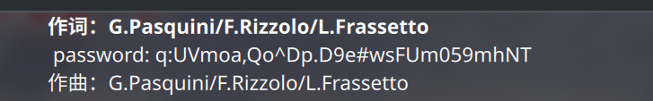

# Hgame 2024 final

id: RocketDev  
解出题数：4

## reverse

### restore

*字母王国的奇妙漂流,flag格式'VIDAR'*

先根据混淆脚本反混淆代码，然后反解xtea求flag

混淆出现多层就很痛苦...要从k到a一步一步替换

vim中去混淆
```vim
%s/WHBEVAKe/i/g
%s/SYmNpZiy/f/g
%s/BoxSSLvI/g/g
%s/WQWnJaXb/e/g
%s/cyzuemcN/h/g
%s/NLhdYwvq/a/g
%s/FSIAXppb/b/g
%s/\v\((0x.{8})U 0ption conconcon\)/\=system('python -c "t='.submatch(1).';t^=0xffffffff;print(hex(t),end=str())"')/g
%s/EUgGZBMl/d/g
%s/boxSSLvI/g/g
%s/eUgGZBMl/d/g
%s/gmHaFGNC/c/g
%s/fSIAXppb/b/g
%s/\V= AWMPmwkG +/+=/g
%s/0ption/^/g
%s/opti0n/>>/g
%s/0pt1on/<</g
%s/kyUanRcj/k/g
wq
```

然后编写脚本反解

```c
#include <stdint.h>
#include <stdio.h>

void decrypt(uint32_t *c, uint32_t *d) {
    uint32_t a = c[0], b = c[1];
    uint32_t e2 = 0x98765432, e1 = 0x83927332;
    uint32_t f = 0;
    for (int i = 0; i < 16; i++)
        f += e1;
    for (int i = 0; i < 16; i++)
        f += e2;
    for (int i = 0; i < 16; i++) {
        b -= (a + f) ^ (d[2] + (a << 3)) ^ (d[3] + (a >> 4));
        a -= (b + f) ^ (d[0] + (b << 1)) ^ (d[1] + (b >> 2));
        f -= e2;
    }
    for (int i = 0; i < 16; i++) {
        b -= (a + f) ^ (d[2] + (a << 4)) ^ (d[3] + (a >> 5));
        a -= (b + f) ^ (d[0] + (b << 4)) ^ (d[1] + (b >> 5));
        f -= e1;
    }   
    c[0] = a;
    c[1] = b;
}

char g[] = { 0xd2, 0x0a3, 0x0ff, 0x5c, 0x6, 0x99, 0x4a, 0xdb, 0x0ac, 0x093, 0x0c7, 0x19, 0xb2, 0x6e, 0x030, 0x61, 0x50, 0x030, 0x1b, 0x0ef, 0x0aa, 0xb1, 0x0c1, 0x0fd, 0x52, 0x79, 0x07e, 0x0a6, 0x0e5, 0x0ca, 0x65, 0x88 };

int main()
{
	uint32_t h[] = { 0x1234567, 0x89abcdef, 0xfedcba98, 0x76543210 };
	for (int i = 3; i >= 0; i--)
		decrypt((uint32_t*)g + i * 0x2, h); 
    puts(g);
}
```

## misc

### 看不见的字

*'hello',可以试一试npm install zero-width-lib*

根据“zero-width-lib”搜索，发现有现成[网站](https://yuanfux.github.io/zero-width-web/)可用


### 逮虾户

*dejavu,I have been here before. 你找到flag*

下载下来是dmg，先7z解压，发现一张png和一个有密码的7z  
通过Google Lens搜索图片发现是piet图片，解析结果是

```sh
> npiet out.png
password is: fin4lly_f1n4l_c0me
```

将其作为密码解压7z得到一个逮虾户的mp3，使用elisa播放器打开，歌词中有不寻常之处：


binwalk这个mp3发现还藏了一个zip，使用这个密钥解压出一个.djvu文档  
网上随便找了一个转pdf的网站生成pdf


